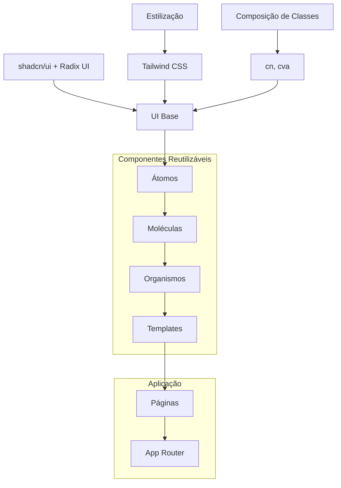
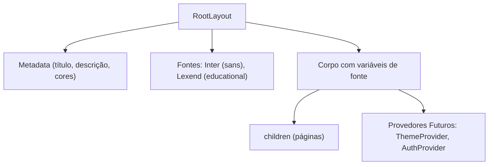
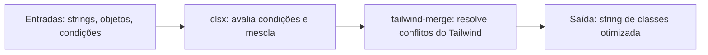
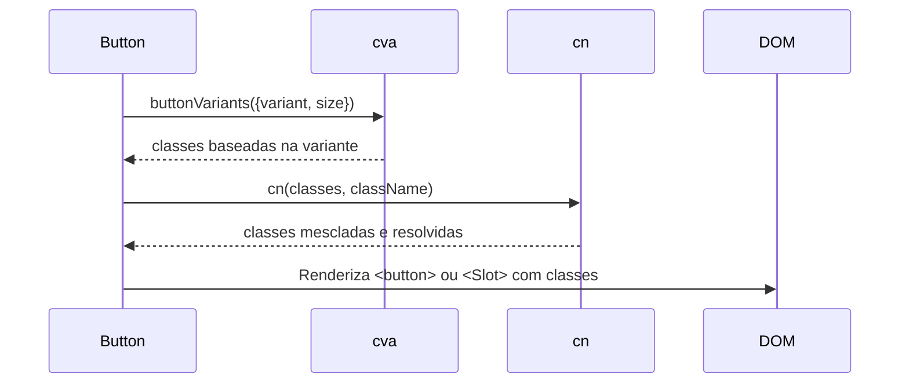
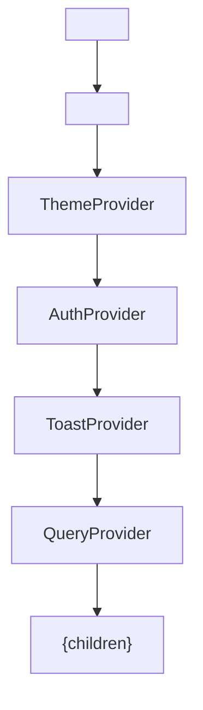

# Arquitetura de Componentes

<cite>
**Arquivos Referenciados neste Documento**  
- [layout.tsx](file://src/app/layout.tsx)
- [page.tsx](file://src/app/page.tsx)
- [button.tsx](file://src/components/ui/button.tsx)
- [utils.ts](file://src/lib/utils.ts)
- [components.json](file://components.json)
- [tailwind.config.ts](file://tailwind.config.ts)
- [globals.css](file://src/styles/globals.css)
</cite>

## Sumário

1. [Introdução](#introdução)
2. [Estrutura do Projeto e Padrão Atomic Design](#estrutura-do-projeto-e-padrão-atomic-design)
3. [Hierarquia de Componentes](#hierarquia-de-componentes)
4. [Componentes Headless e shadcn/ui](#componentes-headless-e-shadcnui)
5. [Composição de Classes com class-variance-authority, clsx e tailwind-merge](#composição-de-classes-com-class-variance-authority-clsx-e-tailwind-merge)
6. [Padrão de Variantes, Tamanhos e Estilização Condicional](#padrão-de-variantes-tamanhos-e-estilização-condicional)
7. [Exemplo Prático: Componente Button](#exemplo-prático-componente-button)
8. [Boas Práticas de Composição, Acessibilidade e Responsividade](#boas-práticas-de-composição-acessibilidade-e-responsividade)
9. [Integração com Provider Pattern e Estado Global](#integração-com-provider-pattern-e-estado-global)
10. [Conclusão](#conclusão)

## Introdução

O VirtuQuest é uma plataforma de planejamento pedagógico integrado que combina
BNCC, Taxonomia de Bloom e Virtudes Intelectuais, utilizando uma arquitetura
moderna baseada em React, Next.js e Tailwind CSS. Este documento detalha a
arquitetura de componentes do sistema, com foco no padrão Atomic Design, uso de
componentes headless do Radix UI via shadcn/ui, e estratégias avançadas de
composição de classes. A estrutura é projetada para escalabilidade,
acessibilidade e manutenibilidade, preparando o terreno para integração com
provedores de estado global como ThemeProvider e AuthProvider.

## Estrutura do Projeto e Padrão Atomic Design

A estrutura do projeto segue o padrão Atomic Design, organizando componentes em
átomos, moléculas, organismos, templates e páginas. Essa abordagem promove
reutilização, consistência e facilidade de manutenção.



**Fontes do Diagrama**

- [components.json](file://components.json)
- [src/components/ui/button.tsx](file://src/components/ui/button.tsx)
- [src/app/layout.tsx](file://src/app/layout.tsx)

**Fontes da Seção**

- [README.md](file://README.md#L115-L159)
- [src/app/layout.tsx](file://src/app/layout.tsx)

## Hierarquia de Componentes

A hierarquia de componentes começa com o `RootLayout`, que envolve toda a
aplicação e fornece fontes, metadados e futuros provedores de estado. As páginas
são construídas sobre esse layout, utilizando componentes UI reutilizáveis.

### RootLayout

O componente `RootLayout` é o ponto de entrada da aplicação, definido em
`layout.tsx`. Ele configura fontes personalizadas (Inter e Lexend), aplica
variáveis de fonte ao corpo e prepara o terreno para provedores de estado
global.



**Fontes do Diagrama**

- [layout.tsx](file://src/app/layout.tsx#L53-L71)

**Fontes da Seção**

- [layout.tsx](file://src/app/layout.tsx#L1-L71)

### Páginas

A página inicial (`page.tsx`) é um exemplo de como as páginas utilizam o layout
raiz. Ela apresenta uma interface com gradiente, grid responsivo, botões de ação
e conteúdo estruturado, tudo estilizado com Tailwind CSS.

**Fontes da Seção**

- [page.tsx](file://src/app/page.tsx#L1-L85)

## Componentes Headless e shadcn/ui

O projeto utiliza o shadcn/ui, que fornece componentes baseados no Radix UI
(headless) combinados com Tailwind CSS. Essa abordagem oferece controle total
sobre a estilização enquanto mantém acessibilidade e funcionalidade.

### Configuração do shadcn/ui

O arquivo `components.json` define a configuração do shadcn/ui, especificando o
uso de CSS variables, aliases de importação e localização dos arquivos de
configuração.

```json
{
  "style": "default",
  "rsc": true,
  "tsx": true,
  "tailwind": {
    "config": "tailwind.config.ts",
    "css": "src/styles/globals.css",
    "cssVariables": true
  },
  "aliases": {
    "components": "@/components",
    "utils": "@/lib/utils",
    "ui": "@/components/ui"
  }
}
```

**Fontes da Seção**

- [components.json](file://components.json#L1-L18)

## Composição de Classes com class-variance-authority, clsx e tailwind-merge

A composição de classes é gerenciada pela função `cn` definida em `utils.ts`,
que combina `clsx` e `tailwind-merge` para resolver conflitos de classes do
Tailwind CSS.

### Função cn

A função `cn` permite mesclar classes com resolução de conflitos, onde classes
posteriores substituem as anteriores. Isso é essencial para a composição de
variantes e sobreposição de estilos.



**Fontes do Diagrama**

- [utils.ts](file://src/lib/utils.ts#L8-L10)

**Fontes da Seção**

- [utils.ts](file://src/lib/utils.ts#L1-L70)

## Padrão de Variantes, Tamanhos e Estilização Condicional

O sistema de variantes é implementado com `class-variance-authority` (cva),
permitindo definição clara de variantes (default, destructive, outline, etc.) e
tamanhos (sm, default, lg, icon).

### Estrutura de Variantes

```typescript
const buttonVariants = cva('classes base', {
  variants: {
    variant: {
      /* definições */
    },
    size: {
      /* definições */
    },
  },
  defaultVariants: {
    variant: 'default',
    size: 'default',
  },
});
```

**Fontes da Seção**

- [button.tsx](file://src/components/ui/button.tsx#L6-L36)

## Exemplo Prático: Componente Button

O componente `Button` exemplifica a arquitetura de componentes do VirtuQuest,
combinando acessibilidade, flexibilidade e integração com formulários.

### Interface e Props

```typescript
export interface ButtonProps
  extends React.ButtonHTMLAttributes<HTMLButtonElement>,
    VariantProps<typeof buttonVariants> {
  asChild?: boolean;
}
```

### Implementação

O componente utiliza `React.forwardRef` para encaminhar referências e `Slot` do
Radix UI quando `asChild` é verdadeiro, permitindo composição com outros
componentes.



**Fontes do Diagrama**

- [button.tsx](file://src/components/ui/button.tsx#L41-L52)

**Fontes da Seção**

- [button.tsx](file://src/components/ui/button.tsx#L1-L55)

## Boas Práticas de Composição, Acessibilidade e Responsividade

### Composição

- Utilize `asChild` para compor com outros componentes (ex: `Link` do Next.js)
- Combine variantes com classes adicionais via `className`
- Use `cn` para mesclar classes com segurança

### Acessibilidade

- Todos os componentes base do Radix UI são acessíveis por padrão
- Foco visível com `focus-visible:outline-none focus-visible:ring-2`
- Contraste adequado entre modo claro e escuro

### Responsividade

- Grids flexíveis com `grid-cols-1 md:grid-cols-2`
- Tipografia responsiva com `text-6xl` e `text-xl`
- Espaçamento adaptável com `p-8` e `gap-6`

**Fontes da Seção**

- [page.tsx](file://src/app/page.tsx#L1-L85)
- [globals.css](file://src/styles/globals.css#L84-L103)

## Integração com Provider Pattern e Estado Global

O `RootLayout` já está preparado para integrar provedores de estado global, como
`ThemeProvider` e `AuthProvider`, que serão adicionados na Fase 1.

### Estrutura Futura



### Comunicação com Estado Global

Os componentes UI acessarão o estado global através de hooks contextuais,
mantendo-se independentes mas integrados ao sistema.

**Fontes da Seção**

- [layout.tsx](file://src/app/layout.tsx#L65-L70)

## Conclusão

A arquitetura de componentes do VirtuQuest combina as melhores práticas modernas
de desenvolvimento frontend: Atomic Design para organização, shadcn/ui e Radix
UI para componentes acessíveis e headless, e uma sofisticada camada de
composição de classes com `cva`, `clsx` e `tailwind-merge`. O padrão de
variantes permite consistência visual, enquanto a preparação para Provider
Pattern garante escalabilidade para gerenciamento de estado global. Essa
estrutura robusta e flexível suporta os objetivos pedagógicos complexos da
plataforma, integrando BNCC, Bloom e Virtudes com tecnologia de ponta.
