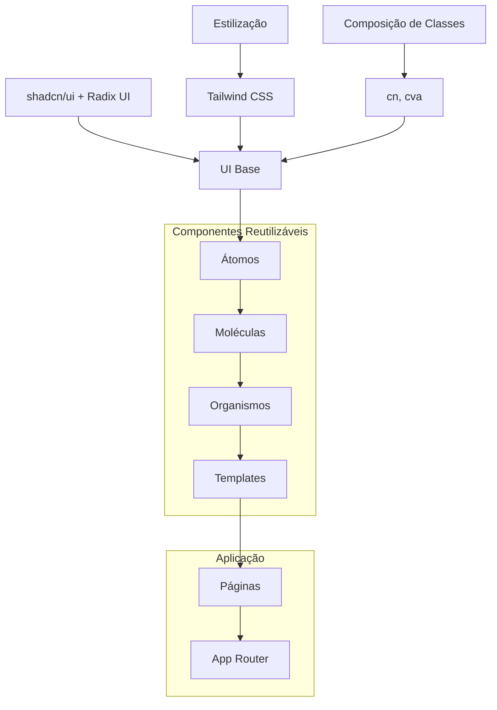
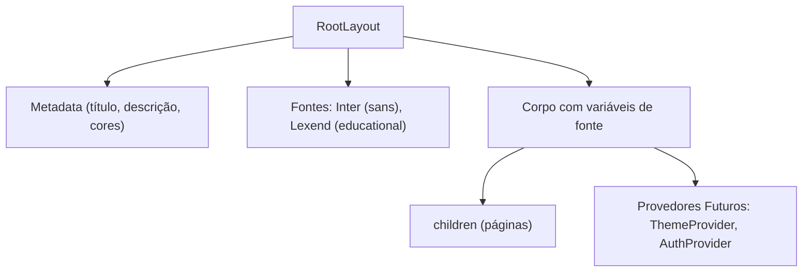
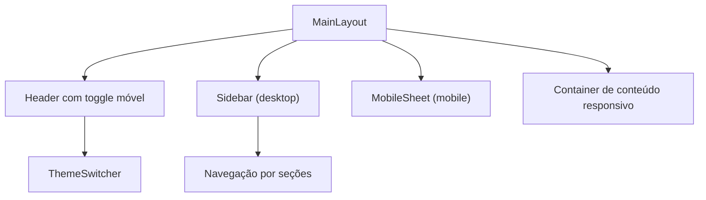
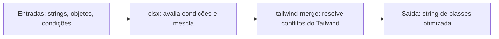
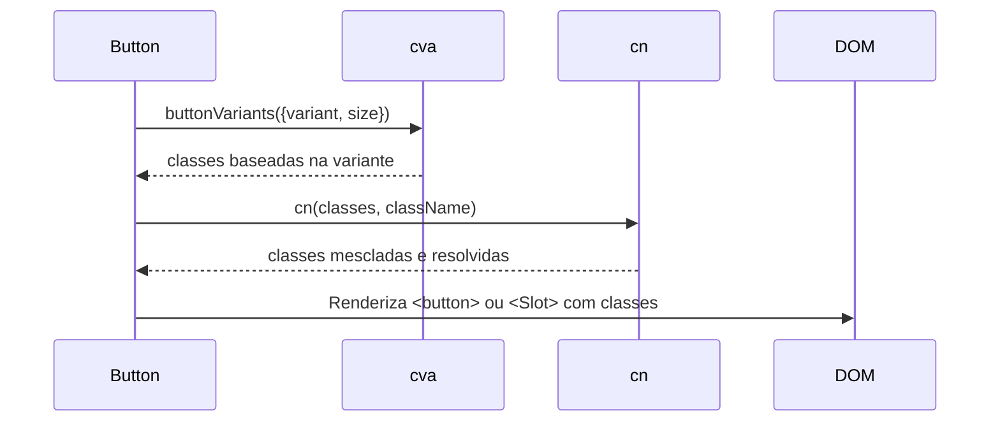
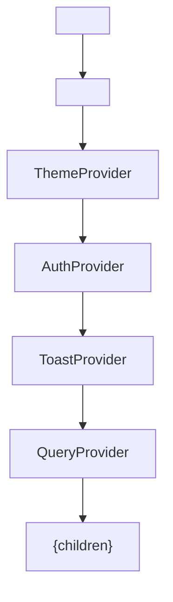

# Arquitetura de Componentes

<cite>
**Arquivos Referenciados neste Documento**  
- [layout.tsx](file://src/app/layout.tsx)
- [page.tsx](file://src/app/page.tsx)
- [button.tsx](file://src/components/ui/button.tsx)
- [utils.ts](file://src/lib/utils.ts)
- [components.json](file://components.json)
- [tailwind.config.ts](file://tailwind.config.ts)
- [globals.css](file://src/styles/globals.css)
- [header.tsx](file://src/components/layouts/header.tsx) - *Atualizado no commit 8a4a3a2*
- [main-layout.tsx](file://src/components/layouts/main-layout.tsx) - *Atualizado no commit 8a4a3a2*
- [theme-provider.tsx](file://src/providers/theme-provider.tsx) - *Atualizado no commit 6ec4d95*
- [theme-switcher/index.tsx](file://src/components/ui/shadcn-io/theme-switcher/index.tsx)
- [sidebar.tsx](file://src/components/layouts/sidebar.tsx)
- [theme.ts](file://src/types/theme.ts)
- [like-button.tsx](file://src/components/ui/like-button.tsx) - *Adicionado no commit d28f3e7*
- [like-button.test.tsx](file://src/components/ui/like-button.test.tsx) - *Adicionado no commit d28f3e7*
- [design-system-showcase.tsx](file://src/components/demo/design-system-showcase.tsx) - *Atualizado no commit d28f3e7*
- [bncc-badge.tsx](file://src/components/educational/bncc-badge.tsx) - *Atualizado no commit e43cae2*
- [demo/page.tsx](file://src/app/demo/page.tsx) - *Atualizado no commit e43cae2*
- [tsconfig.json](file://tsconfig.json) - *Atualizado no commit 25569a2*
- [bncc-selector.tsx](file://src/components/planner/bncc-selector.tsx) - *Implementado no commit dce3601e*
- [bloom-mapper.tsx](file://src/components/planner/bloom-mapper.tsx) - *Implementado no commit dce3601e*
- [virtues-tracker.tsx](file://src/components/planner/virtues-tracker.tsx) - *Implementado no commit dce3601e*
- [situations-timeline.tsx](file://src/components/planner/situations-timeline.tsx) - *Implementado no commit dce3601e*
- [moments-manager.tsx](file://src/components/planner/moments-manager.tsx) - *Implementado no commit dce3601e*
- [bncc-tab.tsx](file://src/components/planner/bncc-tab.tsx) - *Integrado com React Hook Form no commit 4926e7c6*
- [bloom-tab.tsx](file://src/components/planner/bloom-tab.tsx) - *Integrado com React Hook Form no commit 4926e7c6*
- [virtues-tab.tsx](file://src/components/planner/virtues-tab.tsx) - *Integrado com React Hook Form no commit 4926e7c6*
- [situations-tab.tsx](file://src/components/planner/situations-tab.tsx) - *Integrado com React Hook Form no commit 4926e7c6*
- [content-tab.tsx](file://src/components/planner/content-tab.tsx) - *Integrado com React Hook Form no commit 4926e7c6*
</cite>

## Atualização de Documentação

**Alterações Realizadas**

- Atualização da seção de Componentes Educacionais com base nas alterações nas
  props do BNCCBadge
- Correção das props do componente BNCCBadge para refletir as mudanças de `code`
  para `habilidade`/`competencia`
- Atualização dos exemplos de uso do BNCCBadge em páginas de demonstração
- Adição de detalhes sobre a variante compacta do BNCCBadge
- Atualização das fontes do documento para incluir os arquivos modificados
- **Atualização da seção "Componentes Educacionais" para refletir a estrutura
  correta das props do BNCCBadge**
- Atualização da seção de configuração do TypeScript com base na remoção do
  `baseUrl` em `tsconfig.json`
- **Adição da seção "Componentes do Editor de Planejamento" para documentar a
  nova suíte de componentes implementada**
- **Atualização da seção "Integração com Provider Pattern e Estado Global" para
  incluir a integração com React Hook Form**
- **Atualização da seção "Hierarquia de Componentes" para incluir os novos
  componentes do plano de aula**
- **Atualização da seção "Componentes Educacionais" para incluir os novos
  componentes pedagógicos**

## Sumário

1. [Introdução](#introdução)
2. [Estrutura do Projeto e Padrão Atomic Design](#estrutura-do-projeto-e-padrão-atomic-design)
3. [Hierarquia de Componentes](#hierarquia-de-componentes)
4. [Componentes Headless e shadcn/ui](#componentes-headless-e-shadcnui)
5. [Composição de Classes com class-variance-authority, clsx e tailwind-merge](#composição-de-classes-com-class-variance-authority-clsx-e-tailwind-merge)
6. [Padrão de Variantes, Tamanhos e Estilização Condicional](#padrão-de-variantes-tamanhos-e-estilização-condicional)
7. [Exemplo Prático: Componente Button](#exemplo-prático-componente-button)
8. [Boas Práticas de Composição, Acessibilidade e Responsividade](#boas-práticas-de-composição-acessibilidade-e-responsividade)
9. [Integração com Provider Pattern e Estado Global](#integração-com-provider-pattern-e-estado-global)
10. [Novo Componente LikeButton](#novo-componente-likebutton)
11. [Componentes Educacionais](#componentes-educacionais)
12. [Componentes do Editor de Planejamento](#componentes-do-editor-de-planejamento)
13. [Conclusão](#conclusão)

## Introdução

O VirtuQuest é uma plataforma de planejamento pedagógico integrado que combina
BNCC, Taxonomia de Bloom e Virtudes Intelectuais, utilizando uma arquitetura
moderna baseada em React, Next.js e Tailwind CSS. Este documento detalha a
arquitetura de componentes do sistema, com foco no padrão Atomic Design, uso de
componentes headless do Radix UI via shadcn/ui, e estratégias avançadas de
composição de classes. A estrutura é projetada para escalabilidade,
acessibilidade e manutenibilidade, preparando o terreno para integração com
provedores de estado global como ThemeProvider e AuthProvider.

## Estrutura do Projeto e Padrão Atomic Design

A estrutura do projeto segue o padrão Atomic Design, organizando componentes em
átomos, moléculas, organismos, templates e páginas. Essa abordagem promove
reutilização, consistência e facilidade de manutenção.



**Fontes do Diagrama**

- [components.json](file://components.json)
- [src/components/ui/button.tsx](file://src/components/ui/button.tsx)
- [src/app/layout.tsx](file://src/app/layout.tsx)

**Fontes da Seção**

- [README.md](file://README.md#L115-L159)
- [src/app/layout.tsx](file://src/app/layout.tsx)

## Hierarquia de Componentes

A hierarquia de componentes começa com o `RootLayout`, que envolve toda a
aplicação e fornece fontes, metadados e futuros provedores de estado. As páginas
são construídas sobre esse layout, utilizando componentes UI reutilizáveis.

### RootLayout

O componente `RootLayout` é o ponto de entrada da aplicação, definido em
`layout.tsx`. Ele configura fontes personalizadas (Inter e Lexend), aplica
variáveis de fonte ao corpo e prepara o terreno para provedores de estado
global.



**Fontes do Diagrama**

- [layout.tsx](file://src/app/layout.tsx#L53-L71)

**Fontes da Seção**

- [layout.tsx](file://src/app/layout.tsx#L1-L71)

### MainLayout

O componente `MainLayout` integra header e sidebar com comportamento responsivo,
gerenciando o estado do menu móvel e envolvendo os filhos em um container de
conteúdo responsivo conforme especificado em Specs.md seção 11.



**Fontes do Diagrama**

- [main-layout.tsx](file://src/components/layouts/main-layout.tsx#L20-L59)
- [header.tsx](file://src/components/layouts/header.tsx#L20-L83)
- [sidebar.tsx](file://src/components/layouts/sidebar.tsx#L88-L152)

**Fontes da Seção**

- [main-layout.tsx](file://src/components/layouts/main-layout.tsx)
- [header.tsx](file://src/components/layouts/header.tsx)
- [sidebar.tsx](file://src/components/layouts/sidebar.tsx)

### Header

O componente `Header` implementa a navegação superior com alternador de tema e
trigger de menu móvel, utilizando `useTheme` para garantir a disponibilidade do
ThemeProvider. O header é sticky e utiliza backdrop-filter para efeito de
transparência.

```typescript
export function Header({ onMobileMenuToggle, isMobileMenuOpen = false, className }: HeaderProps) {
  useTheme(); // Garante que ThemeProvider está disponível

  return (
    <header className={`bg-background/95 supports-[backdrop-filter]:bg-background/60 sticky top-0 z-50 w-full border-b backdrop-blur ${className || ''}`}>
      {/* Conteúdo do header */}
    </header>
  );
}
```

**Fontes da Seção**

- [header.tsx](file://src/components/layouts/header.tsx#L20-L83)

### Páginas

A página inicial (`page.tsx`) é um exemplo de como as páginas utilizam o layout
raiz. Ela apresenta uma interface com gradiente, grid responsivo, botões de ação
e conteúdo estruturado, tudo estilizado com Tailwind CSS.

**Fontes da Seção**

- [page.tsx](file://src/app/page.tsx#L1-L85)

## Componentes Headless e shadcn/ui

O projeto utiliza o shadcn/ui, que fornece componentes baseados no Radix UI
(headless) combinados com Tailwind CSS. Essa abordagem oferece controle total
sobre a estilização enquanto mantém acessibilidade e funcionalidade.

### Configuração do shadcn/ui

O arquivo `components.json` define a configuração do shadcn/ui, especificando o
uso de CSS variables, aliases de importação e localização dos arquivos de
configuração.

```json
{
  "style": "default",
  "rsc": true,
  "tsx": true,
  "tailwind": {
    "config": "tailwind.config.ts",
    "css": "src/styles/globals.css",
    "cssVariables": true
  },
  "aliases": {
    "components": "@/components",
    "utils": "@/lib/utils",
    "ui": "@/components/ui"
  }
}
```

**Fontes da Seção**

- [components.json](file://components.json#L1-L18)

## Composição de Classes com class-variance-authority, clsx e tailwind-merge

A composição de classes é gerenciada pela função `cn` definida em `utils.ts`,
que combina `clsx` e `tailwind-merge` para resolver conflitos de classes do
Tailwind CSS.

### Função cn

A função `cn` permite mesclar classes com resolução de conflitos, onde classes
posteriores substituem as anteriores. Isso é essencial para a composição de
variantes e sobreposição de estilos.



**Fontes do Diagrama**

- [utils.ts](file://src/lib/utils.ts#L8-L10)

**Fontes da Seção**

- [utils.ts](file://src/lib/utils.ts#L1-L70)

## Padrão de Variantes, Tamanhos e Estilização Condicional

O sistema de variantes é implementado com `class-variance-authority` (cva),
permitindo definição clara de variantes (default, destructive, outline, etc.) e
tamanhos (sm, default, lg, icon).

### Estrutura de Variantes

```typescript
const buttonVariants = cva('classes base', {
  variants: {
    variant: {
      /* definições */
    },
    size: {
      /* definições */
    },
  },
  defaultVariants: {
    variant: 'default',
    size: 'default',
  },
});
```

**Fontes da Seção**

- [button.tsx](file://src/components/ui/button.tsx#L6-L36)

## Exemplo Prático: Componente Button

O componente `Button` exemplifica a arquitetura de componentes do VirtuQuest,
combinando acessibilidade, flexibilidade e integração com formulários.

### Interface e Props

```typescript
export interface ButtonProps
  extends React.ButtonHTMLAttributes<HTMLButtonElement>,
    VariantProps<typeof buttonVariants> {
  asChild?: boolean;
}
```

### Implementação

O componente utiliza `React.forwardRef` para encaminhar referências e `Slot` do
Radix UI quando `asChild` é verdadeiro, permitindo composição com outros
componentes.



**Fontes do Diagrama**

- [button.tsx](file://src/components/ui/button.tsx#L41-L52)

**Fontes da Seção**

- [button.tsx](file://src/components/ui/button.tsx#L1-L55)

## Boas Práticas de Composição, Acessibilidade e Responsividade

### Composição

- Utilize `asChild` para compor com outros componentes (ex: `Link` do Next.js)
- Combine variantes com classes adicionais via `className`
- Use `cn` para mesclar classes com segurança

### Acessibilidade

- Todos os componentes base do Radix UI são acessíveis por padrão
- Foco visível com `focus-visible:outline-none focus-visible:ring-2`
- Contraste adequado entre modo claro e escuro

### Responsividade

- Grids flexíveis com `grid-cols-1 md:grid-cols-2`
- Tipografia responsiva com `text-6xl` e `text-xl`
- Espaçamento adaptável com `p-8` e `gap-6`

**Fontes da Seção**

- [page.tsx](file://src/app/page.tsx#L1-L85)
- [globals.css](file://src/styles/globals.css#L84-L103)

## Integração com Provider Pattern e Estado Global

O `RootLayout` já está preparado para integrar provedores de estado global, como
`ThemeProvider` e `AuthProvider`, que foram implementados conforme especificado
em Specs.md seção 11.8.1.

### ThemeProvider

O `ThemeProvider` gerencia o estado do tema, esquema de cores e tamanho da fonte
com persistência no localStorage. Ele utiliza createContext e useContext para
fornecer estado global aos componentes.

```typescript
export function ThemeProvider({ children, config = {} }: ThemeProviderProps) {
  const [theme, setThemeState] = useState<Theme>(config.theme ?? DEFAULT_CONFIG.theme);
  const [colorScheme, setColorSchemeState] = useState<ColorScheme>(
    config.colorScheme ?? DEFAULT_CONFIG.colorScheme
  );
  const [fontSize, setFontSizeState] = useState<FontSize>(
    config.fontSize ?? DEFAULT_CONFIG.fontSize
  );
  const [resolvedTheme, setResolvedTheme] = useState<'light' | 'dark'>('light');
  const [mounted, setMounted] = useState(false);

  // Carregar configurações do localStorage na inicialização
  useEffect(() => {
    // Implementação de carregamento
  }, []);

  // Resolver tema system para light/dark
  useEffect(() => {
    // Implementação de resolução
  }, [theme, mounted]);

  // Aplicar tema ao DOM
  useEffect(() => {
    // Implementação de aplicação
  }, [resolvedTheme, colorScheme, fontSize, mounted]);

  return <ThemeProviderContext.Provider value={value}>{children}</ThemeProviderContext.Provider>;
}
```

### useTheme Hook

O hook `useTheme` permite que qualquer componente consuma o estado do tema
global, garantindo que esteja dentro do ThemeProvider.

```typescript
export function useTheme() {
  const context = useContext(ThemeProviderContext);

  if (!context) {
    throw new Error('useTheme deve ser usado dentro de um ThemeProvider');
  }

  return context;
}
```

### Comunicação com Estado Global

Os componentes UI acessam o estado global através de hooks contextuais,
mantendo-se independentes mas integrados ao sistema. Por exemplo, o
ThemeSwitcher utiliza o estado do tema para renderizar o botão ativo.



**Fontes do Diagrama**

- [theme-provider.tsx](file://src/providers/theme-provider.tsx#L33-L176)
- [theme-switcher/index.tsx](file://src/components/ui/shadcn-io/theme-switcher/index.tsx#L33-L98)

**Fontes da Seção**

- [theme-provider.tsx](file://src/providers/theme-provider.tsx)
- [theme-switcher/index.tsx](file://src/components/ui/shadcn-io/theme-switcher/index.tsx)
- [types/theme.ts](file://src/types/theme.ts)

## Novo Componente LikeButton

O componente `LikeButton` foi recentemente adicionado ao sistema como parte da
evolução do design system, proporcionando uma interação de "curtir" com feedback
visual e suporte a diferentes estados.

### Interface e Props

O componente `LikeButton` define uma interface clara com props específicas para
controlar seu comportamento:

```typescript
export interface LikeButtonProps
  extends React.ButtonHTMLAttributes<HTMLButtonElement>,
    VariantProps<typeof likeButtonVariants> {
  isLiked?: boolean;
  onLikeChange?: (isLiked: boolean) => void;
  readonly?: boolean;
}
```

As props principais incluem:

- `isLiked`: estado inicial do botão (curtido ou não)
- `onLikeChange`: callback chamado quando o estado de curtida muda
- `readonly`: se o botão deve ser interativo ou apenas exibir estado
- `variant` e `size`: herdados do sistema de variantes para consistência visual

### Implementação e Funcionalidade

O componente utiliza `React.forwardRef` para encaminhar referências e gerencia
seu estado interno com `useState`. A lógica principal envolve alternar o estado
de curtida quando clicado (se não for readonly) e notificar o componente pai
através do callback `onLikeChange`.

```typescript
const LikeButton = React.forwardRef<HTMLButtonElement, LikeButtonProps>(
  ({ className, variant, size, isLiked = false, onLikeChange, readonly = false, ...props }, ref) => {
    const [liked, setLiked] = React.useState(isLiked);

    const handleClick = () => {
      if (!readonly) {
        const newLikedState = !liked;
        setLiked(newLikedState);
        if (onLikeChange) {
          onLikeChange(newLikedState);
        }
      }
    };

    return (
      <button
        className={cn(likeButtonVariants({ variant, size, className }))}
        onClick={handleClick}
        disabled={readonly}
        ref={ref}
        {...props}
      >
        <Heart
          className={cn(
            'transition-colors',
            liked ? 'text-red-500 fill-red-500' : 'text-gray-400'
          )}
        />
        <span className="sr-only">Like</span>
      </button>
    );
  }
);
```

### Sistema de Variantes

Assim como outros componentes do sistema, o `LikeButton` utiliza
`class-variance-authority` para definir suas variantes:

```typescript
const likeButtonVariants = cva(
  'inline-flex items-center justify-center whitespace-nowrap rounded-md text-sm font-medium ring-offset-background transition-colors focus-visible:outline-none focus-visible:ring-2 focus-visible:ring-ring focus-visible:ring-offset-2 disabled:pointer-events-none disabled:opacity-50',
  {
    variants: {
      variant: {
        default: 'bg-transparent',
        outline: 'border border-input bg-transparent',
      },
      size: {
        default: 'h-10 w-10',
        sm: 'h-9 w-9',
        lg: 'h-11 w-11',
      },
    },
    defaultVariants: {
      variant: 'default',
      size: 'default',
    },
  }
);
```

O sistema suporta variantes `default` e `outline`, e tamanhos `sm`, `default` e
`lg`, mantendo consistência com o design system existente.

### Estilização e Feedback Visual

O componente utiliza o ícone `Heart` do pacote `lucide-react` para representar
visualmente a ação de curtir. A cor do ícone muda dinamicamente com base no
estado de curtida, utilizando classes do Tailwind CSS:

- Quando curtido: `text-red-500 fill-red-500` (vermelho preenchido)
- Quando não curtido: `text-gray-400` (cinza sem preenchimento)

A transição suave entre estados é garantida pela classe `transition-colors`.

### Integração com o Design System

O `LikeButton` foi integrado ao componente de demonstração do design system em
`design-system-showcase.tsx`, permitindo visualização e teste em diferentes
contextos:

```typescript
<div className="space-y-2">
  <p className="text-sm">Like Button:</p>
  <LikeButton isLiked={isLiked} onLikeChange={setIsLiked} />
</div>
```

**Fontes da Seção**

- [like-button.tsx](file://src/components/ui/like-button.tsx)
- [like-button.test.tsx](file://src/components/ui/like-button.test.tsx)
- [design-system-showcase.tsx](file://src/components/demo/design-system-showcase.tsx#L138-L141)

## Componentes Educacionais

Os componentes educacionais são especializados para representar conceitos
pedagógicos específicos do sistema VirtuQuest, como competências e habilidades
da BNCC, níveis da Taxonomia de Bloom e status de planos de aula.

### BNCCBadge

O componente `BNCCBadge` foi atualizado para corrigir as props e melhorar a
clareza da API. Agora utiliza props específicas para cada tipo de elemento BNCC.

**Interface Atualizada**

```typescript
interface BNCCBadgeProps {
  competencia?: string;
  habilidade?: string;
  objetoConhecimento?: string;
  variant?: 'default' | 'outline';
  showIcon?: boolean;
  className?: string;
}
```

**Mudanças Implementadas**

- Remoção da prop `code` em favor de props específicas (`competencia`,
  `habilidade`, `objetoConhecimento`)
- Melhoria na clareza semântica das props
- Manutenção da compatibilidade com variantes e personalização de classes

**Exemplos de Uso Atualizados**

```tsx
// Badge com habilidade
<BNCCBadge habilidade="EF01MA01" />

// Badge com competência em modo outline
<BNCCBadge competencia="COMP01" variant="outline" />

// Badge com múltiplos elementos
<BNCCBadge
  competencia="COMP05"
  habilidade="EF67LP28"
/>
```

**Variante Compacta**

O componente também oferece uma variante compacta para uso em listas e tabelas:

```typescript
export function BNCCBadgeCompact({
  codigo,
  tipo = 'habilidade',
  className,
}: BNCCBadgeCompactProps);
```

Esta variante utiliza estilo monoespaçado e tamanho de texto reduzido para
economia de espaço.

**Fontes da Seção**

- [bncc-badge.tsx](file://src/components/educational/bncc-badge.tsx#L1-L143)
- [demo/page.tsx](file://src/app/demo/page.tsx#L97-L100)
- [design-system-showcase.tsx](file://src/components/demo/design-system-showcase.tsx#L212-L215)

## Componentes do Editor de Planejamento

A suíte de componentes do editor de planejamento foi implementada para fornecer
uma interface completa para criação de planos de aula integrados com BNCC, Bloom
e Virtudes.

### BNCCSelector

O componente `BNCCSelector` permite busca, filtro e seleção múltipla de
habilidades da BNCC com validação pedagógica.

**Interface**

```typescript
export interface BNCCSelectorProps {
  value: string[];
  onChange: (value: string[]) => void;
  maxSelections?: number;
  filterByComponente?: string;
  filterByAno?: number;
  showCompetencias?: boolean;
  className?: string;
}
```

**Funcionalidades**

- Busca por código ou descrição
- Filtros por componente curricular e ano
- Limitação de seleções
- Visualização de habilidades selecionadas com opção de remoção
- Contador de seleções com alerta de limite atingido

**Fontes da Seção**

- [bncc-selector.tsx](file://src/components/planner/bncc-selector.tsx#L43-L258)

### BloomMapper

O componente `BloomMapper` fornece uma matriz visual 6×4 interativa para
mapeamento de objetivos de aprendizagem segundo a taxonomia revisada de Bloom.

**Interface**

```typescript
export interface BloomMapperProps {
  value: {
    principal: string;
    secundarias: string[];
    progressao: ProcessoCognitivo[];
  };
  onChange: (value: any) => void;
  habilidadesBNCC?: string[];
  showSuggestions?: boolean;
  className?: string;
}
```

**Modos de Visualização**

- **Matriz**: Visualização completa da matriz 6×4 com células clicáveis
- **Lista**: Lista de todas as células com informações detalhadas
- **Progressão**: Visualização da progressão cognitiva com validação

**Fontes da Seção**

- [bloom-mapper.tsx](file://src/components/planner/bloom-mapper.tsx#L48-L385)

### VirtuesTracker

O componente `VirtuesTracker` gerencia a seleção de virtudes intelectuais e
definição de estratégias pedagógicas para seu desenvolvimento.

**Interface**

```typescript
export interface VirtuesTrackerProps {
  value: {
    virtudesFoco: string[];
    estrategias: EstrategiaVirtude[];
  };
  onChange: (value: any) => void;
  processosBloom?: ProcessoCognitivo[];
  competenciasBNCC?: number[];
  showSuggestions?: boolean;
  className?: string;
}
```

**Funcionalidades**

- Seleção de virtudes com compatibilidade com processos Bloom
- Definição de estratégias pedagógicas por virtude
- Sugestões baseadas em habilidades BNCC e processos Bloom
- Visualização em grade ou lista

**Fontes da Seção**

- [virtues-tracker.tsx](file://src/components/planner/virtues-tracker.tsx#L45-L305)

### SituationsTimeline

O componente `SituationsTimeline` fornece uma timeline com drag-and-drop para
ordenação de situações-problema pelos 4 momentos didáticos de Perrenoud.

**Interface**

```typescript
export interface SituationsTimelineProps {
  value: string[];
  onChange: (value: string[]) => void;
  momentos: MomentoDidatico[];
  habilidadesBNCC?: string[];
  processosBloom?: ProcessoCognitivo[];
  allowCustom?: boolean;
  className?: string;
}
```

**Funcionalidades**

- Arrastar e soltar para reordenar situações
- Agrupamento por momentos didáticos
- Visualização em lista simples ou agrupada
- Diálogo para adicionar novas situações

**Fontes da Seção**

- [situations-timeline.tsx](file://src/components/planner/situations-timeline.tsx#L117-L326)

### MomentsManager

O componente `MomentsManager` gerencia momentos didáticos com drag-and-drop,
atividades e recursos.

**Interface**

```typescript
export interface MomentsManagerProps {
  value: MomentoDidaticoPlano[];
  onChange: (value: MomentoDidaticoPlano[]) => void;
  duracaoTotal: number;
  situacoesDisponiveis?: any[];
  className?: string;
}
```

**Funcionalidades**

- Reordenação com drag-and-drop
- Expansão para visualizar detalhes
- Validação de duração total
- Resumo com distribuição por tipo de momento

**Fontes da Seção**

- [moments-manager.tsx](file://src/components/planner/moments-manager.tsx#L203-L391)

### Tabs do Editor

Os componentes de aba integram os componentes principais com o estado do
formulário via React Hook Form.

#### BNCCTab

Integra o `BNCCSelector` com análise de alinhamento e validação.

**Fontes da Seção**

- [bncc-tab.tsx](file://src/components/planner/bncc-tab.tsx#L26-L135)

#### BloomTab

Integra o `BloomMapper` com classificação automática de habilidades BNCC.

**Fontes da Seção**

- [bloom-tab.tsx](file://src/components/planner/bloom-tab.tsx#L31-L204)

#### VirtuesTab

Integra o `VirtuesTracker` com o estado do formulário.

**Fontes da Seção**

- [virtues-tab.tsx](file://src/components/planner/virtues-tab.tsx#L16-L43)

#### SituationsTab

Integra o `SituationsTimeline` com o estado do formulário.

**Fontes da Seção**

- [situations-tab.tsx](file://src/components/planner/situations-tab.tsx#L17-L40)

#### ContentTab

Fornece campos básicos e editor rico para informações gerais do plano.

**Fontes da Seção**

- [content-tab.tsx](file://src/components/planner/content-tab.tsx#L49-L345)

## Conclusão

A arquitetura de componentes do VirtuQuest combina as melhores práticas modernas
de desenvolvimento frontend: Atomic Design para organização, shadcn/ui e Radix
UI para componentes acessíveis e headless, e uma sofisticada camada de
composição de classes com `cva`, `clsx` e `tailwind-merge`. O padrão de
variantes permite consistência visual, enquanto a implementação do Provider
Pattern garante escalabilidade para gerenciamento de estado global. Essa
estrutura robusta e flexível suporta os objetivos pedagógicos complexos da
plataforma, integrando BNCC, Bloom e Virtudes com tecnologia de ponta. Os
componentes MainLayout, Header e Sidebar demonstram a aplicação prática desses
princípios em uma interface educacional completa e responsiva. A adição do
componente `LikeButton` exemplifica a evolução contínua do design system,
mantendo consistência com os padrões existentes enquanto adiciona nova
funcionalidade interativa. As atualizações no componente `BNCCBadge` refletem o
compromisso com APIs claras e semânticamente corretas, melhorando a experiência
do desenvolvedor e a manutenibilidade do código. A implementação da suíte de
componentes do editor de planejamento demonstra a capacidade do sistema de
suportar fluxos de trabalho complexos com integração completa entre diferentes
domínios pedagógicos, validação em tempo real e persistência de estado através
do React Hook Form.
