# Exemplos de Uso

<cite>
**Arquivos Referenciados neste Documento**   
- [button.tsx](file://src/components/ui/button.tsx) - *Atualizado no commit recente*
- [main-layout.tsx](file://src/components/layouts/main-layout.tsx) - *Adicionado conforme Specs.md seção 11*
- [header.tsx](file://src/components/layouts/header.tsx) - *Implementado com navegação responsiva*
- [sidebar.tsx](file://src/components/layouts/sidebar.tsx) - *Adicionado menu lateral com ícones educacionais*
- [educational-grid.tsx](file://src/components/layouts/educational-grid.tsx) - *Novos componentes de grid responsivo*
- [educational.tsx](file://src/components/icons/educational.tsx) - *Mapeamento semântico de ícones*
- [page.tsx](file://src/app/page.tsx) - *Página inicial com estrutura atualizada*
- [theme-switcher/index.tsx](file://src/components/ui/shadcn-io/theme-switcher/index.tsx) - *Integração de tema*
</cite>

## Resumo das Atualizações
**Alterações Realizadas**   
- Atualização da seção de composição de componentes para incluir novos layouts responsivos
- Adição de exemplos práticos do MainLayout com navegação móvel via Sheet
- Inclusão de padrões de grid educacional com componentes EducationalGrid e GridWithHeader
- Atualização dos exemplos de acessibilidade com novos padrões de navegação
- Adição de novos diagramas de arquitetura para componentes de layout

## Sumário
1. [Introdução](#introdução)
2. [Componente Button: Variantes e Tamanhos](#componente-button-variantes-e-tamanhos)
3. [Cenários Pedagógicos com Botões](#cenários-pedagógicos-com-botões)
4. [Uso com Ícones Lucide](#uso-com-ícones-lucide)
5. [Integração com Next.js Link (asChild)](#integração-com-nextjs-link-aschild)
6. [Composição de Componentes na Página Inicial](#composição-de-componentes-na-página-inicial)
7. [Recomendações de Acessibilidade](#recomendações-de-acessibilidade)
8. [Padrões Replicáveis em Novas Páginas](#padrões-replicáveis-em-novas-páginas)

## Introdução
Este documento apresenta exemplos práticos e reais de uso dos componentes da aplicação VirtuQuest, com foco no componente `Button` e sua integração em cenários pedagógicos. São demonstradas todas as variantes e tamanhos disponíveis, uso com ícones Lucide, integração com Next.js Link via prop `asChild`, e padrões de composição de componentes na interface. O objetivo é fornecer orientações claras para replicar esses padrões em novas páginas do sistema, incluindo os novos componentes de layout responsivo implementados conforme as especificações.

## Componente Button: Variantes e Tamanhos

O componente `Button` é implementado utilizando `class-variance-authority` (cva) para gerenciar variantes de estilo e tamanho. As variantes definidas incluem: `default`, `destructive`, `outline`, `secondary`, `ghost` e `link`. Os tamanhos disponíveis são: `default`, `sm`, `lg` e `icon`.

As classes de cada variante são mapeadas para o sistema de design baseado em variáveis CSS, garantindo consistência com o tema da aplicação. O componente também suporta a propriedade `asChild`, que permite substituir a tag `button` por qualquer outro componente, útil para integração com componentes de roteamento como o `Link` do Next.js.

**Fontes da seção**
- [button.tsx](file://src/components/ui/button.tsx#L10-L26)
- [button.tsx](file://src/components/ui/button.tsx#L21-L26)

## Cenários Pedagógicos com Botões

### Criar Plano
Botão para iniciar o processo de criação de um novo plano de aula, utilizando a variante padrão com ícone.

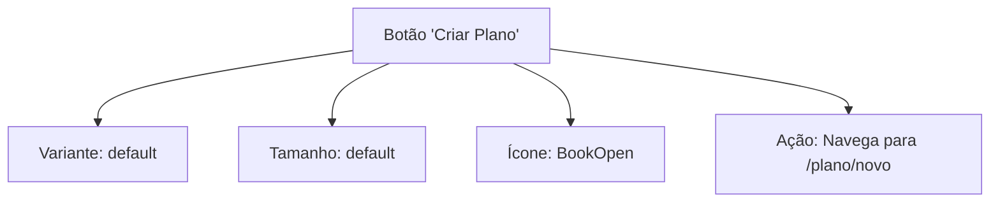

**Fontes do diagrama**
- [button.tsx](file://src/components/ui/button.tsx#L10-L10)
- [educational.tsx](file://src/components/icons/educational.tsx#L15-L15)

### Excluir Avaliação
Botão para exclusão de uma avaliação, utilizando a variante destrutiva para indicar ação crítica.

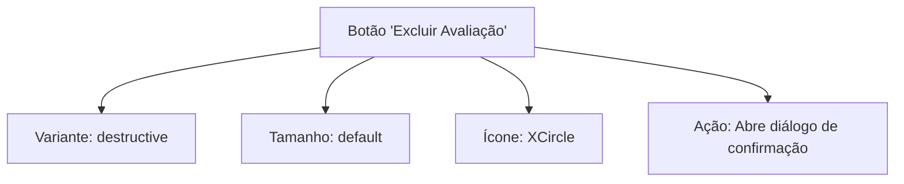

**Fontes do diagrama**
- [button.tsx](file://src/components/ui/button.tsx#L11-L11)
- [educational.tsx](file://src/components/icons/educational.tsx#L28-L28)

### Visualizar Insights
Botão para visualização de insights pedagógicos, utilizando a variante secundária para ação secundária.

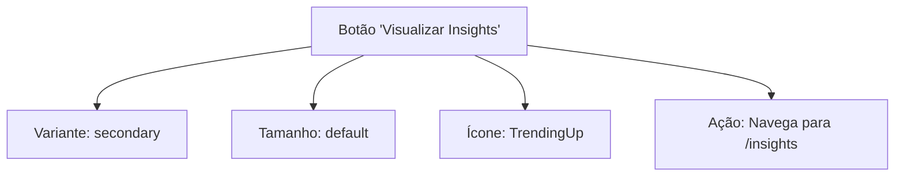

**Fontes do diagrama**
- [button.tsx](file://src/components/ui/button.tsx#L13-L13)
- [educational.tsx](file://src/components/icons/educational.tsx#L34-L34)

## Uso com Ícones Lucide

O sistema utiliza a biblioteca `lucide-react` para ícones, com mapeamento semântico para o contexto educacional em `educational.tsx`. Os ícones são integrados ao componente `Button` usando composição.

### Mapeamento de Ícones Educacionais
Os ícones são organizados em categorias temáticas:

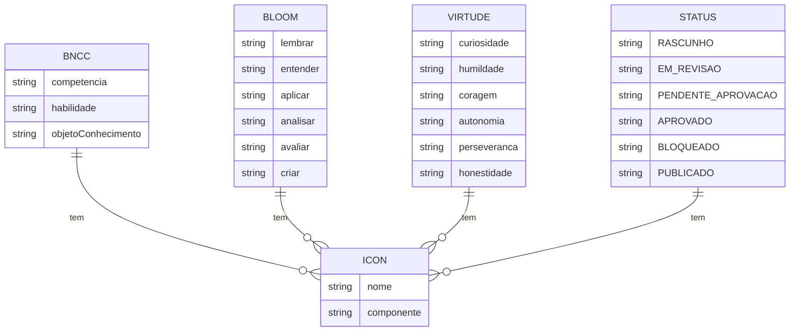

**Fontes do diagrama**
- [educational.tsx](file://src/components/icons/educational.tsx#L15-L180)

## Integração com Next.js Link (asChild)

A propriedade `asChild` permite que o componente `Button` renderize qualquer componente filho, mantendo o estilo do botão. Isso é especialmente útil para integração com o componente `Link` do Next.js, permitindo navegação sem recarregar a página.

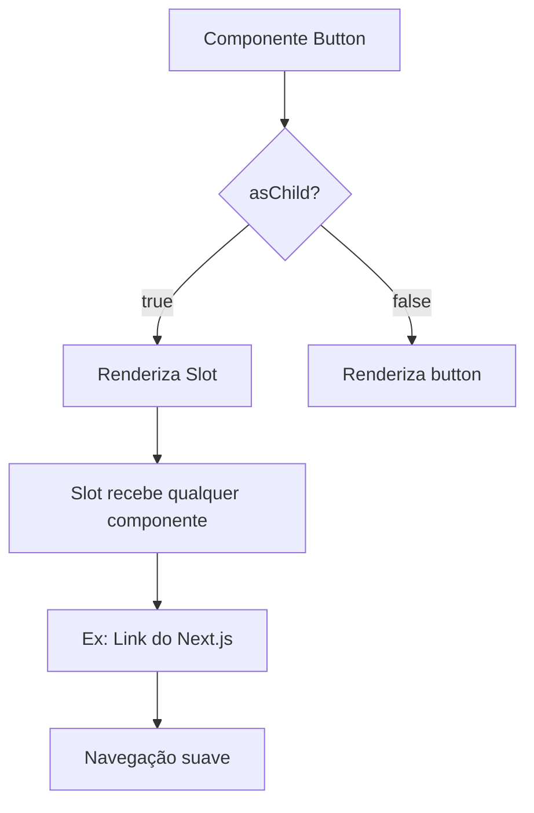

**Fontes do diagrama**
- [button.tsx](file://src/components/ui/button.tsx#L41-L52)
- [button.tsx](file://src/components/ui/button.tsx#L38-L38)

## Composição de Componentes na Página Inicial

A página inicial demonstra o uso de grids responsivos, classes de espaçamento e cores temáticas para criar uma interface coesa, agora integrada com o novo MainLayout que inclui header responsivo e sidebar com navegação móvel.

### Estrutura de Grid Responsivo
O layout utiliza o sistema de grid do Tailwind CSS com breakpoints responsivos e componentes especializados para conteúdo educacional.

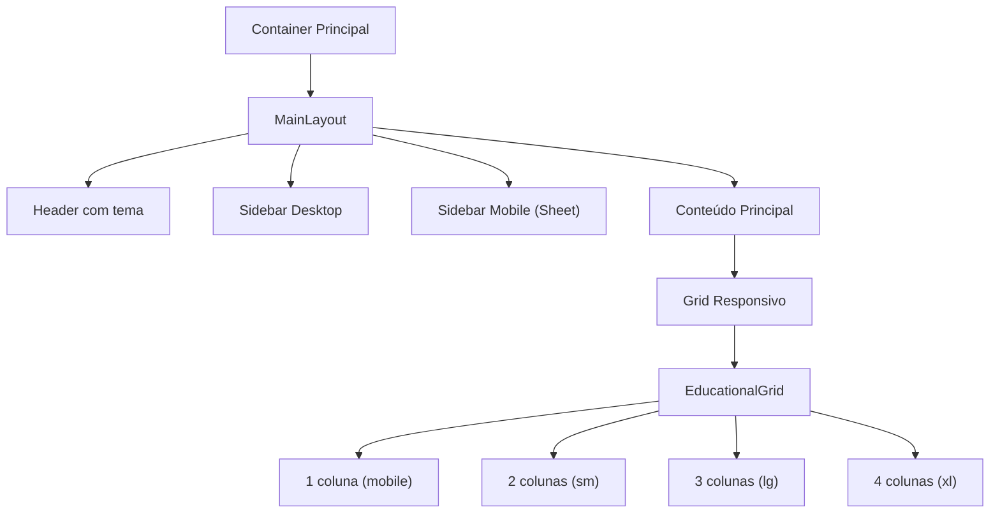

**Fontes do diagrama**
- [main-layout.tsx](file://src/components/layouts/main-layout.tsx#L20-L59)
- [educational-grid.tsx](file://src/components/layouts/educational-grid.tsx#L15-L25)
- [page.tsx](file://src/app/page.tsx#L20-L21)

### Componentes de Grid Educacional
Os novos componentes de grid fornecem estruturas prontas para conteúdos pedagógicos com cabeçalho e ações.

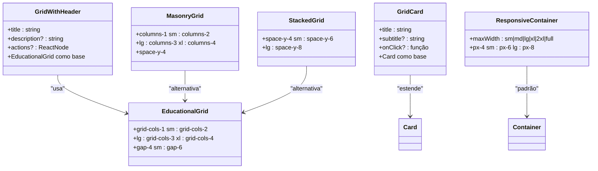

**Fontes do diagrama**
- [educational-grid.tsx](file://src/components/layouts/educational-grid.tsx#L30-L140)
- [main-layout.tsx](file://src/components/layouts/main-layout.tsx#L45-L55)

### Layout Principal com Navegação Responsiva
O MainLayout integra todos os componentes de navegação com comportamento adaptável entre desktop e mobile.

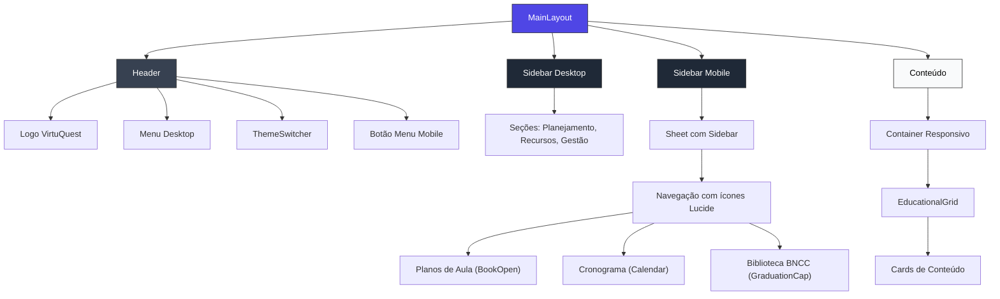

**Fontes do diagrama**
- [main-layout.tsx](file://src/components/layouts/main-layout.tsx#L20-L59)
- [header.tsx](file://src/components/layouts/header.tsx#L20-L83)
- [sidebar.tsx](file://src/components/layouts/sidebar.tsx#L88-L152)

## Recomendações de Acessibilidade

### Atributos ARIA
Sempre inclua atributos ARIA apropriados para botões com ícones:

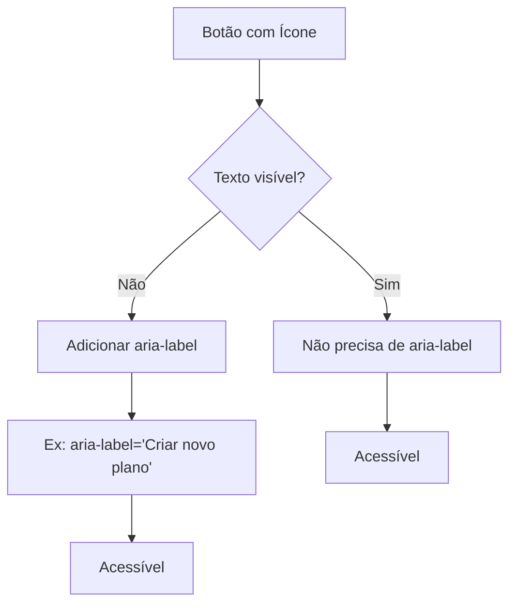

**Fontes do diagrama**
- [button.tsx](file://src/components/ui/button.tsx#L35-L39)

### Contraste de Cores
As variantes de botão seguem as diretrizes de contraste WCAG:

- **Texto primário**: contraste mínimo 4.5:1 com fundo
- **Estado hover**: feedback visual claro sem depender apenas de cor
- **Estado disabled**: opacidade reduzida para indicar inatividade

O sistema de cores utiliza variáveis CSS definidas em `tailwind.config.ts`, garantindo consistência entre temas claro e escuro.

**Fontes da seção**
- [tailwind.config.ts](file://tailwind.config.ts#L15-L68)

### Acessibilidade na Navegação
Os novos componentes de layout incluem recursos de acessibilidade:

- **Header**: `aria-label` nos botões de menu móvel
- **Sidebar**: estrutura semântica com `nav` e `aria-label`
- **Sheet**: suporte completo a navegação por teclado
- **ThemeSwitcher**: rótulos acessíveis e suporte a estados

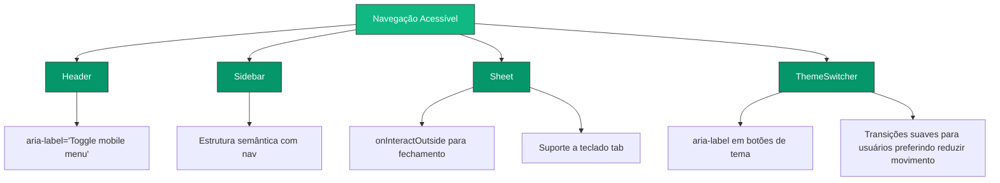

**Fontes do diagrama**
- [header.tsx](file://src/components/layouts/header.tsx#L50-L55)
- [sidebar.tsx](file://src/components/layouts/sidebar.tsx#L88-L152)
- [main-layout.tsx](file://src/components/layouts/main-layout.tsx#L35-L40)
- [theme-switcher/index.tsx](file://src/components/ui/shadcn-io/theme-switcher/index.tsx#L33-L98)

## Padrões Replicáveis em Novas Páginas

### Estrutura de Página Recomendada
Padrão para criar novas páginas no sistema com os novos componentes de layout:

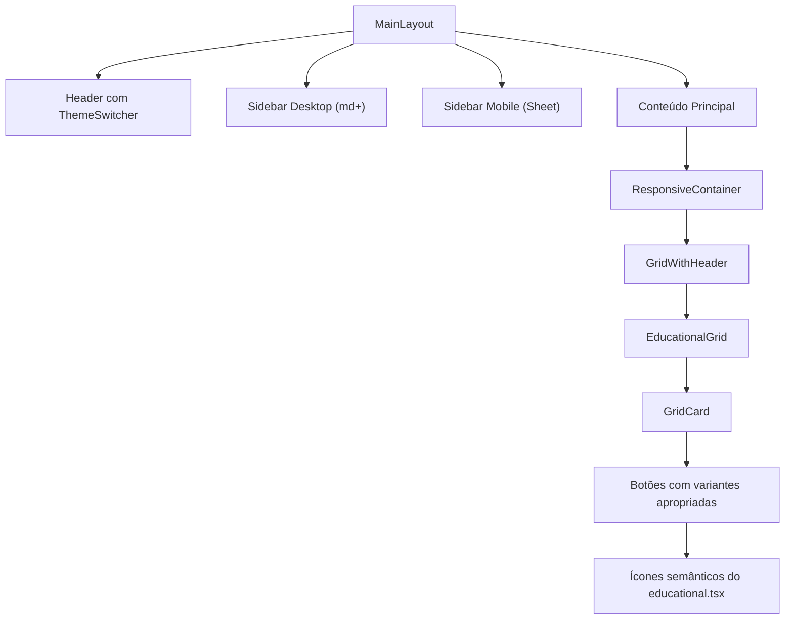

**Fontes do diagrama**
- [main-layout.tsx](file://src/components/layouts/main-layout.tsx#L20-L59)
- [educational-grid.tsx](file://src/components/layouts/educational-grid.tsx#L30-L140)
- [page.tsx](file://src/app/page.tsx#L10-L84)

### Boas Práticas de Implementação
1. **Use variantes de botão apropriadas para o contexto**
2. **Sempre inclua feedback visual para estados de interação**
3. **Utilize o sistema de espaçamento temático em vez de valores fixos**
4. **Prefira ícones semânticos de `educational.tsx` ao invés de ícones genéricos**
5. **Garanta acessibilidade com atributos ARIA e bom contraste**
6. **Utilize MainLayout para consistência de navegação**
7. **Implemente grids responsivos com EducationalGrid para conteúdos pedagógicos**
8. **Use GridWithHeader para seções com título e ações**

**Fontes da seção**
- [button.tsx](file://src/components/ui/button.tsx)
- [educational.tsx](file://src/components/icons/educational.tsx)
- [main-layout.tsx](file://src/components/layouts/main-layout.tsx)
- [educational-grid.tsx](file://src/components/layouts/educational-grid.tsx)
- [page.tsx](file://src/app/page.tsx)