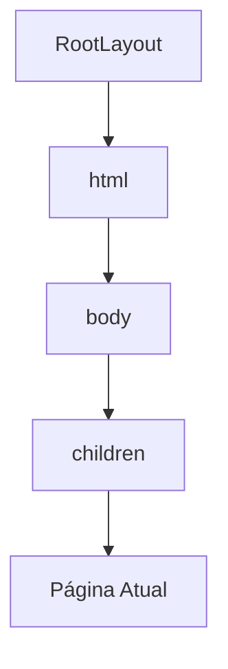
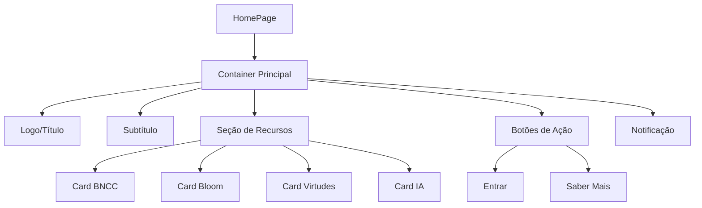
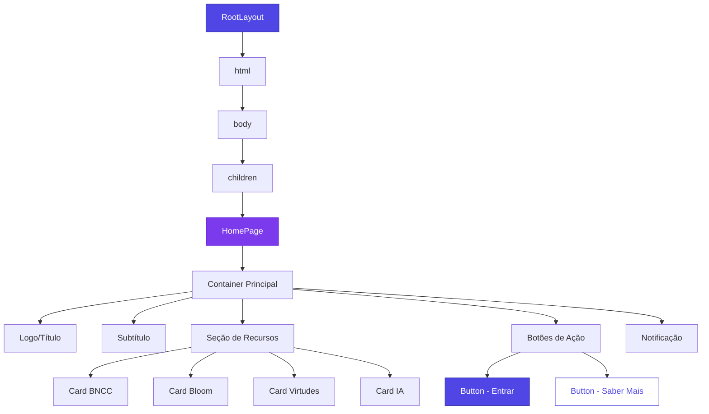

# Hierarquia de Componentes

<cite>
**Arquivos Referenciados neste Documento**  
- [layout.tsx](file://src/app/layout.tsx)
- [page.tsx](file://src/app/page.tsx)
- [button.tsx](file://src/components/ui/button.tsx)
- [theme-provider.tsx](file://src/providers/theme-provider.tsx)
- [next.config.ts](file://next.config.ts)
- [tailwind.config.ts](file://tailwind.config.ts)
</cite>

## Sumário

1. [Introdução](#introdução)
2. [Estrutura do Projeto](#estrutura-do-projeto)
3. [Componente RootLayout](#componente-rootlayout)
4. [Página Inicial (page.tsx)](#página-inicial-pagetxsx)
5. [Componente Button](#componente-button)
6. [Diagrama de Árvore de Componentes](#diagrama-de-árvore-de-componentes)
7. [Padrões de Composição](#padrões-de-composição)
8. [Boas Práticas](#boas-práticas)

## Introdução

Este documento detalha a hierarquia de componentes do sistema VirtuQuest, uma
plataforma de planejamento pedagógico integrado. A arquitetura é baseada no App
Router do Next.js e utiliza padrões modernos de desenvolvimento React com
TypeScript, Tailwind CSS e shadcn/ui. A estrutura é projetada para ser
escalável, acessível e facilmente mantida, com foco em desacoplamento e
reutilização de componentes.

## Estrutura do Projeto

A estrutura do projeto segue uma organização baseada em funcionalidades e
camadas, com ênfase na separação de preocupações:

```
virtuquest/
├── src/
│   ├── app/              # Páginas Next.js App Router
│   ├── components/       # Componentes React
│   │   ├── ui/          # Componentes base shadcn/ui
│   │   ├── educational/ # Componentes educacionais
│   │   └── layouts/     # Componentes de layout
│   ├── providers/       # Provedores de contexto global
│   ├── lib/             # Utilitários e helpers
│   ├── styles/          # Estilos globais e tokens
│   └── assets/          # Assets estáticos
```

**Section sources**

- [README.md](file://README.md#L115-L159)

## Componente RootLayout

O componente `RootLayout` é o componente raiz da aplicação, definido em
`src/app/layout.tsx`. Ele envolve todas as páginas do aplicativo e é responsável
por definir a estrutura base do documento HTML, metadados globais, fontes e
espaço para provedores globais.

### Funções Principais

1. **Definição de Metadados Globais**: O componente exporta um objeto `metadata`
   que define informações como título, descrição, palavras-chave, ícones e
   configurações de viewport que são aplicadas a todas as páginas.

2. **Configuração de Fontes**: Utiliza o sistema de fontes do Next.js para
   carregar e configurar duas fontes:
   - `Inter` como fonte principal (`--font-sans`)
   - `Lexend` como fonte educacional (`--font-educational`)

3. **Estrutura HTML Base**: Define a estrutura básica do documento HTML com o
   atributo `lang="pt-BR"` e classes que aplicam as variáveis de fonte.

4. **Espaço para Provedores Globais**: O componente inclui comentários que
   indicam onde futuros provedores globais serão adicionados, como
   `ThemeProvider`, `AuthProvider`, `ToastProvider` e `QueryProvider`.

### Integração com App Router

O `RootLayout` integra-se com o App Router do Next.js como o layout raiz da
aplicação. Ele recebe a propriedade `children` que representa o conteúdo da
página atual sendo renderizada. A propagação do `children` permite que cada
página tenha seu conteúdo específico enquanto compartilha a estrutura base
definida no layout.



**Diagram sources**

- [layout.tsx](file://src/app/layout.tsx#L54-L80)

**Section sources**

- [layout.tsx](file://src/app/layout.tsx#L0-L80)

## Página Inicial (page.tsx)

A página inicial, definida em `src/app/page.tsx`, é um componente filho do
`RootLayout` que renderiza o conteúdo principal da aplicação. Ela utiliza um
layout responsivo com grid e classes do Tailwind CSS.

### Estrutura e Estilização

A página utiliza um layout flexível com as seguintes características:

- **Container Principal**: Utiliza `min-h-screen` para ocupar toda a altura da
  tela e `flex flex-col` para organizar o conteúdo verticalmente.
- **Gradiente de Fundo**: Aplica um gradiente suave com
  `bg-gradient-to-br from-blue-50 to-indigo-100`.
- **Grid Responsivo**: Utiliza `grid grid-cols-1 md:grid-cols-2` para criar uma
  grade que se adapta a diferentes tamanhos de tela.
- **Espaçamento**: Usa classes como `p-8`, `mb-4`, `mb-8` para controle preciso
  de espaçamento.

### Conteúdo e Funcionalidade

A página inclui:

1. **Logo e Título**: Elementos principais com tipografia destacada.
2. **Seção de Recursos**: Quatro cards que destacam os principais recursos do
   sistema (Alinhamento BNCC, Taxonomia de Bloom, Virtudes Intelectuais,
   Integração com IA).
3. **Botões de Ação**: Dois botões principais ("Entrar" e "Saber Mais") que
   direcionam para outras partes do sistema.
4. **Notificação de Desenvolvimento**: Um aviso destacado indicando que esta é
   uma página temporária que será substituída na Fase 1.



**Diagram sources**

- [page.tsx](file://src/app/page.tsx#L3-L70)

**Section sources**

- [page.tsx](file://src/app/page.tsx#L0-L84)

## Componente Button

O componente `Button`, localizado em `src/components/ui/button.tsx`, é um
exemplo de componente UI reutilizável que segue os princípios de design system.
Ele é implementado com base no shadcn/ui e Radix UI.

### Arquitetura e Implementação

O componente utiliza várias técnicas avançadas:

1. **Class Variance Authority (CVA)**: Usa a função `cva` para definir variantes
   de estilo (default, destructive, outline, secondary, ghost, link) e tamanhos
   (default, sm, lg, icon).

2. **Composição com Slot**: Utiliza o componente `Slot` do Radix UI para
   permitir que o botão seja renderizado como outro elemento HTML quando a
   propriedade `asChild` é verdadeira.

3. **Tipagem Avançada**: Define uma interface `ButtonProps` que estende as
   propriedades padrão de um botão HTML e inclui variantes específicas.

4. **Encaminhamento de Ref**: Usa `React.forwardRef` para encaminhar a
   referência do DOM para o elemento subjacente, permitindo acesso direto ao nó
   DOM quando necessário.

### Variantes e Uso

O componente oferece múltiplas variantes para diferentes contextos de uso:

- **default**: Botão primário com fundo colorido
- **destructive**: Para ações destrutivas (ex: deletar)
- **outline**: Contorno sem preenchimento
- **secondary**: Estilo secundário
- **ghost**: Apenas hover com fundo
- **link**: Estilo de link com sublinhado

```mermaid
classDiagram
class Button {
+className : string
+variant : "default"|"destructive"|"outline"|"secondary"|"ghost"|"link"
+size : "default"|"sm"|"lg"|"icon"
+asChild : boolean
+...props : any
}
class buttonVariants {
+variants : object
+defaultVariants : object
}
Button --> buttonVariants : "usa"
Button --> Slot : "usa quando asChild"
Button --> "button" : "usa quando não asChild"
```

**Diagram sources**

- [button.tsx](file://src/components/ui/button.tsx#L41-L52)

**Section sources**

- [button.tsx](file://src/components/ui/button.tsx#L0-L56)

## Diagrama de Árvore de Componentes

O diagrama abaixo representa a hierarquia completa de componentes descrita neste
documento:



**Diagram sources**

- [layout.tsx](file://src/app/layout.tsx#L54-L80)
- [page.tsx](file://src/app/page.tsx#L3-L70)
- [button.tsx](file://src/components/ui/button.tsx#L41-L52)

## Padrões de Composição

A hierarquia de componentes no VirtuQuest segue vários padrões de composição
importantes:

### Propagação de Children

O padrão de `children` é fundamental na arquitetura. O `RootLayout` recebe
`children` como propriedade e os renderiza dentro da estrutura HTML base. Este
padrão permite que cada página tenha seu conteúdo específico enquanto
compartilha a estrutura comum.

```tsx
export default async function RootLayout({
  children,
}: {
  children: React.ReactNode;
}) {
  return (
    <html lang="pt-BR">
      <body>{children}</body>
    </html>
  );
}
```

### Composição de Provedores

Embora os provedores ainda não estejam implementados, o código inclui
comentários que indicam onde eles serão adicionados. Este padrão de "provedores
futuros" permite planejar a arquitetura de estado global antecipadamente.

### Composição de Estilos

A aplicação utiliza uma combinação de técnicas de estilização:

1. **Variáveis CSS**: As fontes são definidas como variáveis CSS (`--font-sans`,
   `--font-educational`) que são aplicadas via classes no body.
2. **Tailwind CSS**: Classes utilitárias para layout, espaçamento, cores e
   tipografia.
3. **Theme UI**: O sistema de temas utiliza atributos de dados
   (`data-color-scheme`, `data-font-size`) para controlar o estilo com base nas
   preferências do usuário.

**Section sources**

- [layout.tsx](file://src/app/layout.tsx#L54-L80)
- [theme-provider.tsx](file://src/providers/theme-provider.tsx#L150-L180)

## Boas Práticas

A implementação segue várias boas práticas de desenvolvimento moderno:

### Organização

- **Separação de Concerns**: Cada componente tem uma responsabilidade clara.
- **Estrutura de Diretórios**: Organização lógica por funcionalidade e tipo de
  componente.
- **Nomenclatura Consistente**: Nomes de arquivos e componentes seguem
  convenções claras.

### Acessibilidade

- **Idioma Definido**: O atributo `lang="pt-BR"` no elemento html.
- **Contraste Adequado**: Cores com bom contraste para leitura.
- **Elementos Semânticos**: Uso de elementos HTML semânticos quando apropriado.
- **Controle de Foco**: Classes como `focus-visible` para indicadores de foco.

### Desacoplamento

- **Componentes Reutilizáveis**: O componente Button pode ser usado em qualquer
  parte da aplicação.
- **Prop Drilling Minimizado**: Uso planejado de Context API para estado global.
- **Dependências Explícitas**: Importações claras e explícitas de dependências.

### Documentação e Manutenção

- **Comentários Descritivos**: Comentários explicam a intenção e funcionalidade
  do código.
- **TODOs Estratégicos**: Comentários TODO indicam claramente o que precisa ser
  implementado.
- **Metadados Centralizados**: Informações como título e descrição são definidas
  no layout raiz.

**Section sources**

- [layout.tsx](file://src/app/layout.tsx#L0-L80)
- [page.tsx](file://src/app/page.tsx#L0-L84)
- [button.tsx](file://src/components/ui/button.tsx#L0-L56)
- [theme-provider.tsx](file://src/providers/theme-provider.tsx#L0-L230)
