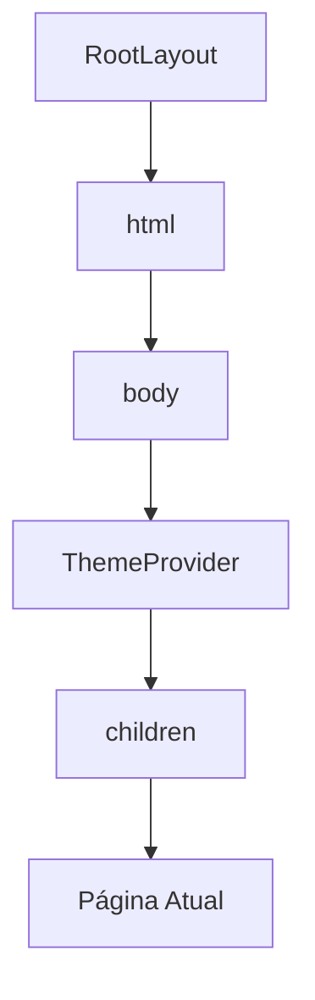
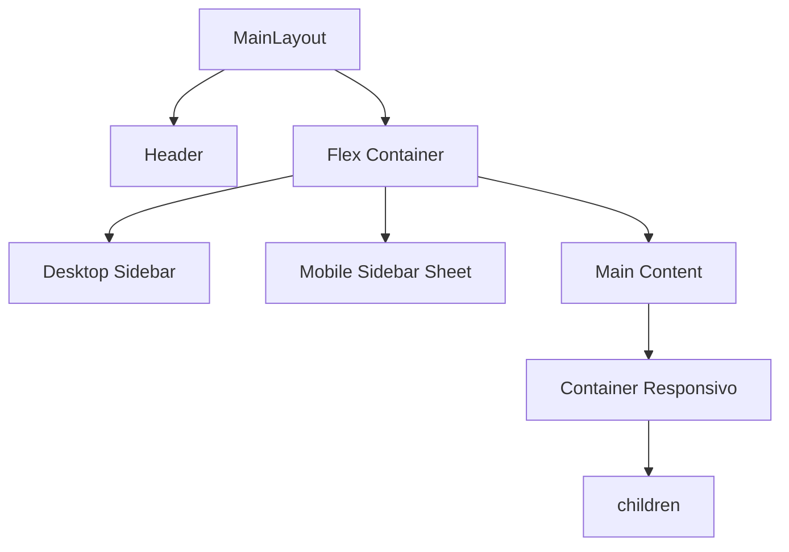
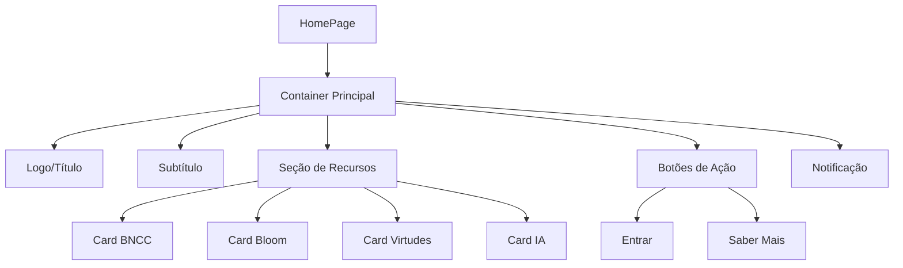
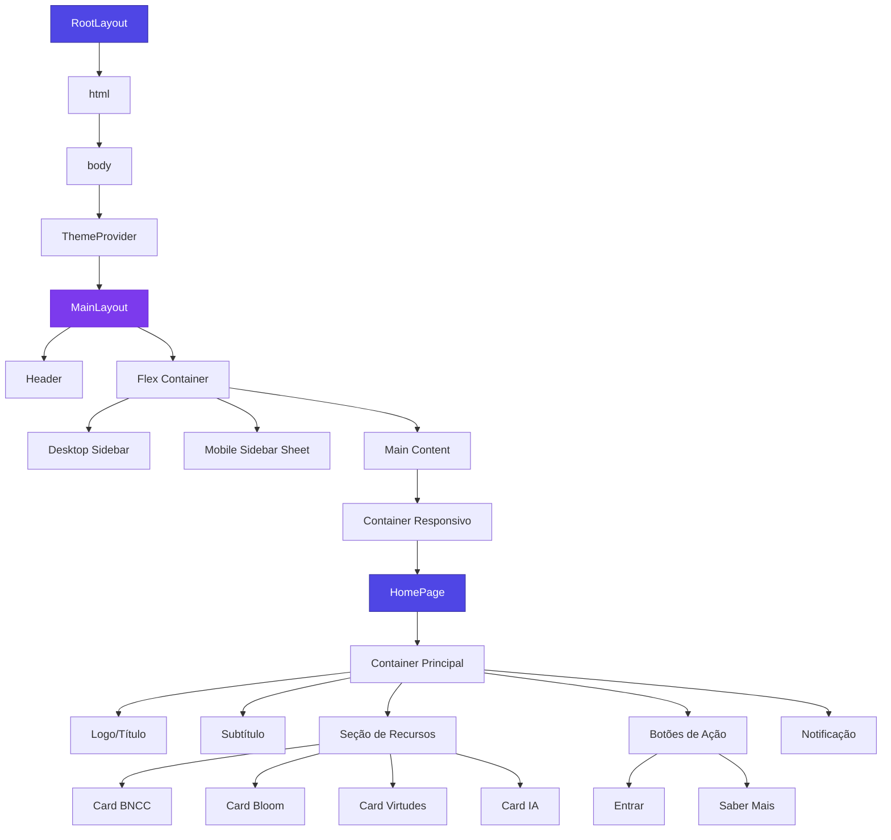

# Hierarquia de Componentes

<cite>
**Arquivos Referenciados neste Documento**  
- [layout.tsx](file://src/app/layout.tsx)
- [page.tsx](file://src/app/page.tsx)
- [main-layout.tsx](file://src/components/layouts/main-layout.tsx)
- [header.tsx](file://src/components/layouts/header.tsx)
- [sidebar.tsx](file://src/components/layouts/sidebar.tsx)
- [theme-provider.tsx](file://src/providers/theme-provider.tsx)
- [theme-switcher/index.tsx](file://src/components/ui/shadcn-io/theme-switcher/index.tsx)
</cite>

## Sumário
1. [Introdução](#introdução)
2. [Estrutura do Projeto](#estrutura-do-projeto)
3. [Componente RootLayout](#componente-rootlayout)
4. [Componente MainLayout](#componente-mainlayout)
5. [Componentes Header e Sidebar](#componentes-header-e-sidebar)
6. [Página Inicial (page.tsx)](#página-inicial-pagetxsx)
7. [Diagrama de Árvore de Componentes](#diagrama-de-árvore-de-componentes)
8. [Padrões de Composição](#padrões-de-composição)
9. [Boas Práticas](#boas-práticas)

## Introdução

Este documento detalha a hierarquia de componentes do sistema VirtuQuest, uma plataforma de planejamento pedagógico integrado. A arquitetura é baseada no App Router do Next.js e utiliza padrões modernos de desenvolvimento React com TypeScript, Tailwind CSS e shadcn/ui. A estrutura foi recentemente atualizada para implementar um sistema de layout completo conforme especificado nas diretrizes do projeto, com componentes de navegação integrados e suporte a dispositivos móveis.

## Estrutura do Projeto

A estrutura do projeto segue uma organização baseada em funcionalidades e camadas, com ênfase na separação de preocupações:

```
virtuquest/
├── src/
│   ├── app/              # Páginas Next.js App Router
│   ├── components/       # Componentes React
│   │   ├── ui/          # Componentes base shadcn/ui
│   │   ├── educational/ # Componentes educacionais
│   │   └── layouts/     # Componentes de layout
│   ├── providers/       # Provedores de contexto global
│   ├── lib/             # Utilitários e helpers
│   ├── styles/          # Estilos globais e tokens
│   └── assets/          # Assets estáticos
```

**Section sources**
- [README.md](file://README.md#L115-L159)

## Componente RootLayout

O componente `RootLayout` é o componente raiz da aplicação, definido em `src/app/layout.tsx`. Ele envolve todas as páginas do aplicativo e é responsável por definir a estrutura base do documento HTML, metadados globais, fontes e espaço para provedores globais.

### Funções Principais

1. **Definição de Metadados Globais**: O componente exporta um objeto `metadata` que define informações como título, descrição, palavras-chave, ícones e configurações de viewport que são aplicadas a todas as páginas.

2. **Configuração de Fontes**: Utiliza o sistema de fontes do Next.js para carregar e configurar duas fontes:
   - `Inter` como fonte principal (`--font-sans`)
   - `Lexend` como fonte educacional (`--font-educational`)

3. **Estrutura HTML Base**: Define a estrutura básica do documento HTML com o atributo `lang="pt-BR"` e classes que aplicam as variáveis de fonte.

4. **Provedor de Tema Global**: O componente envolve os `children` com o `ThemeProvider`, que gerencia o tema da aplicação (claro, escuro ou sistema) e persiste as preferências do usuário no localStorage.

### Integração com App Router

O `RootLayout` integra-se com o App Router do Next.js como o layout raiz da aplicação. Ele recebe a propriedade `children` que representa o conteúdo da página atual sendo renderizada. A propagação do `children` permite que cada página tenha seu conteúdo específico enquanto compartilha a estrutura base definida no layout.



**Diagram sources**
- [layout.tsx](file://src/app/layout.tsx#L54-L62)

**Section sources**
- [layout.tsx](file://src/app/layout.tsx#L0-L80)

## Componente MainLayout

O componente `MainLayout`, definido em `src/components/layouts/main-layout.tsx`, é um novo componente introduzido para implementar um sistema de layout completo com navegação integrada. Ele substitui a estrutura anterior de layout simples, adicionando cabeçalho, barra lateral e suporte a dispositivos móveis.

### Arquitetura e Funcionalidade

O `MainLayout` é um componente cliente que gerencia o estado de navegação e integra vários componentes de layout:

1. **Gerenciamento de Estado**: Utiliza o hook `useState` para controlar o estado do menu móvel (`isMobileMenuOpen`).

2. **Integração de Componentes**: Combina três componentes principais:
   - `Header`: Cabeçalho com navegação e controle de tema
   - `Sidebar`: Barra lateral com menu de navegação
   - `Sheet`: Componente modal para menu móvel

3. **Comportamento Responsivo**: Implementa uma abordagem responsiva onde:
   - Em dispositivos móveis: A barra lateral é exibida como um `Sheet` (drawer) que pode ser aberto/fechado
   - Em dispositivos maiores: A barra lateral é exibida permanentemente no lado esquerdo

4. **Propagação de Children**: O conteúdo principal da página é renderizado dentro do `main` com um container responsivo que ajusta o padding com base no tamanho da tela.

### Estrutura de Layout

A estrutura do `MainLayout` é organizada em três colunas principais:

- **Header**: Fixo no topo da página com z-index elevado
- **Sidebar**: Fixa no lado esquerdo em telas maiores, transformada em drawer em telas menores
- **Main Content**: Área flexível que ocupa o espaço restante e contém o conteúdo da página



**Diagram sources**
- [main-layout.tsx](file://src/components/layouts/main-layout.tsx#L20-L59)

**Section sources**
- [main-layout.tsx](file://src/components/layouts/main-layout.tsx#L0-L60)

## Componentes Header e Sidebar

Os componentes `Header` e `Sidebar` são componentes de layout reutilizáveis que implementam a navegação da aplicação.

### Componente Header

O `Header`, localizado em `src/components/layouts/header.tsx`, é um componente de cabeçalho com as seguintes características:

1. **Navegação Responsiva**: Inclui um botão de menu móvel que aparece apenas em telas menores, permitindo alternar a visibilidade da barra lateral.

2. **Controle de Tema**: Integra o `ThemeSwitcher` que permite ao usuário alternar entre temas claro, escuro e automático (sistema).

3. **Informações do Usuário**: Exibe o nome do usuário logado (ex: "Prof. Maria") em telas maiores.

4. **Estilização Avançada**: Utiliza backdrop blur para criar um efeito de sobreposição transparente que mantém a legibilidade enquanto permite ver o conteúdo abaixo.

### Componente Sidebar

O `Sidebar`, definido em `src/components/layouts/sidebar.tsx`, é um componente de navegação com organização hierárquica:

1. **Organização por Seções**: Os itens de navegação são agrupados em seções lógicas:
   - Planejamento (Planos de Aula, Cronograma)
   - Recursos (Biblioteca BNCC, Taxonomia Bloom, Virtudes)
   - Gestão (Relatórios, Turmas)

2. **Itens de Navegação Enriquecidos**: Cada item inclui:
   - Ícone visual
   - Título destacado
   - Descrição secundária

3. **Suporte a Mobile**: Recebe uma função `onItemClick` que é chamada quando um item é selecionado, permitindo fechar o menu em dispositivos móveis.

4. **Acessibilidade**: Utiliza elementos semânticos e atributos ARIA para melhorar a acessibilidade.

**Section sources**
- [header.tsx](file://src/components/layouts/header.tsx#L0-L84)
- [sidebar.tsx](file://src/components/layouts/sidebar.tsx#L0-L153)

## Página Inicial (page.tsx)

A página inicial, definida em `src/app/page.tsx`, é um componente filho do `RootLayout` que renderiza o conteúdo principal da aplicação. Ela utiliza um layout responsivo com grid e classes do Tailwind CSS.

### Estrutura e Estilização

A página utiliza um layout flexível com as seguintes características:

- **Container Principal**: Utiliza `min-h-screen` para ocupar toda a altura da tela e `flex flex-col` para organizar o conteúdo verticalmente.
- **Gradiente de Fundo**: Aplica um gradiente suave com `bg-gradient-to-br from-blue-50 to-indigo-100`.
- **Grid Responsivo**: Utiliza `grid grid-cols-1 md:grid-cols-2` para criar uma grade que se adapta a diferentes tamanhos de tela.
- **Espaçamento**: Usa classes como `p-8`, `mb-4`, `mb-8` para controle preciso de espaçamento.

### Conteúdo e Funcionalidade

A página inclui:

1. **Logo e Título**: Elementos principais com tipografia destacada.
2. **Seção de Recursos**: Quatro cards que destacam os principais recursos do sistema (Alinhamento BNCC, Taxonomia de Bloom, Virtudes Intelectuais, Integração com IA).
3. **Botões de Ação**: Dois botões principais ("Entrar" e "Saber Mais") que direcionam para outras partes do sistema.
4. **Notificação de Desenvolvimento**: Um aviso destacado indicando que esta é uma página temporária que será substituída na Fase 1.



**Diagram sources**
- [page.tsx](file://src/app/page.tsx#L3-L70)

**Section sources**
- [page.tsx](file://src/app/page.tsx#L0-L84)

## Diagrama de Árvore de Componentes

O diagrama abaixo representa a hierarquia completa de componentes descrita neste documento:



**Diagram sources**
- [layout.tsx](file://src/app/layout.tsx#L54-L62)
- [main-layout.tsx](file://src/components/layouts/main-layout.tsx#L20-L59)
- [page.tsx](file://src/app/page.tsx#L3-L70)

## Padrões de Composição

A hierarquia de componentes no VirtuQuest segue vários padrões de composição importantes:

### Propagação de Children

O padrão de `children` é fundamental na arquitetura. O `RootLayout` recebe `children` como propriedade e os renderiza dentro da estrutura HTML base. O `MainLayout` então recebe esses `children` e os posiciona na área de conteúdo principal. Este padrão permite que cada página tenha seu conteúdo específico enquanto compartilha a estrutura comum.

```tsx
export default function RootLayout({ children }: { children: React.ReactNode }) {
  return (
    <html lang="pt-BR">
      <body>
        <ThemeProvider>{children}</ThemeProvider>
      </body>
    </html>
  );
}
```

### Composição de Layout

O novo padrão de composição envolve múltiplos níveis de layout:
1. `RootLayout`: Estrutura HTML base e provedores globais
2. `MainLayout`: Estrutura de navegação com header, sidebar e conteúdo
3. Páginas específicas: Conteúdo específico para cada rota

### Composição de Estilos

A aplicação utiliza uma combinação de técnicas de estilização:

1. **Variáveis CSS**: As fontes são definidas como variáveis CSS (`--font-sans`, `--font-educational`) que são aplicadas via classes no body.
2. **Tailwind CSS**: Classes utilitárias para layout, espaçamento, cores e tipografia.
3. **Theme UI**: O sistema de temas utiliza atributos de dados (`data-color-scheme`, `data-font-size`) para controlar o estilo com base nas preferências do usuário.

**Section sources**
- [layout.tsx](file://src/app/layout.tsx#L54-L62)
- [main-layout.tsx](file://src/components/layouts/main-layout.tsx#L20-L59)
- [theme-provider.tsx](file://src/providers/theme-provider.tsx#L33-L176)

## Boas Práticas

A implementação segue várias boas práticas de desenvolvimento moderno:

### Organização

- **Separação de Concerns**: Cada componente tem uma responsabilidade clara.
- **Estrutura de Diretórios**: Organização lógica por funcionalidade e tipo de componente.
- **Nomenclatura Consistente**: Nomes de arquivos e componentes seguem convenções claras.

### Acessibilidade

- **Idioma Definido**: O atributo `lang="pt-BR"` no elemento html.
- **Contraste Adequado**: Cores com bom contraste para leitura.
- **Elementos Semânticos**: Uso de elementos HTML semânticos quando apropriado.
- **Controle de Foco**: Classes como `focus-visible` para indicadores de foco.
- **Atributos ARIA**: Uso de `aria-label` e outros atributos ARIA para melhorar a acessibilidade.

### Desacoplamento

- **Componentes Reutilizáveis**: Os componentes Header, Sidebar e MainLayout podem ser usados em qualquer parte da aplicação.
- **Prop Drilling Minimizado**: Uso de Context API para estado global (tema).
- **Dependências Explícitas**: Importações claras e explícitas de dependências.

### Documentação e Manutenção

- **Comentários Descritivos**: Comentários explicam a intenção e funcionalidade do código.
- **TODOs Estratégicos**: Comentários TODO indicam claramente o que precisa ser implementado.
- **Metadados Centralizados**: Informações como título e descrição são definidas no layout raiz.

**Section sources**
- [layout.tsx](file://src/app/layout.tsx#L0-L80)
- [main-layout.tsx](file://src/components/layouts/main-layout.tsx#L0-L60)
- [header.tsx](file://src/components/layouts/header.tsx#L0-L84)
- [sidebar.tsx](file://src/components/layouts/sidebar.tsx#L0-L153)
- [theme-provider.tsx](file://src/providers/theme-provider.tsx#L0-L230)