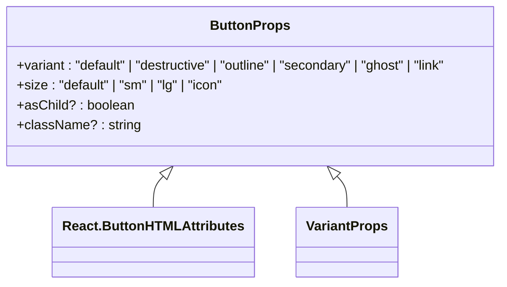
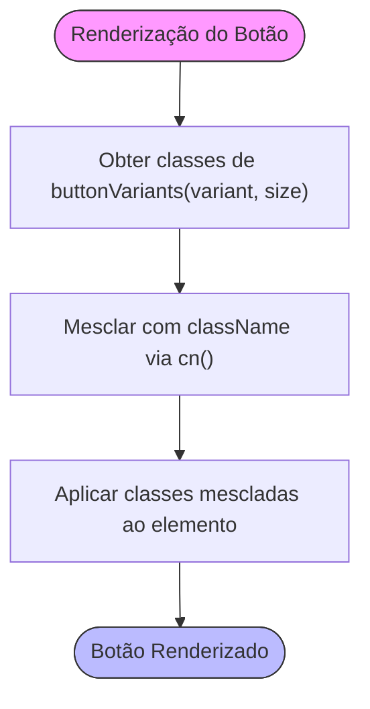
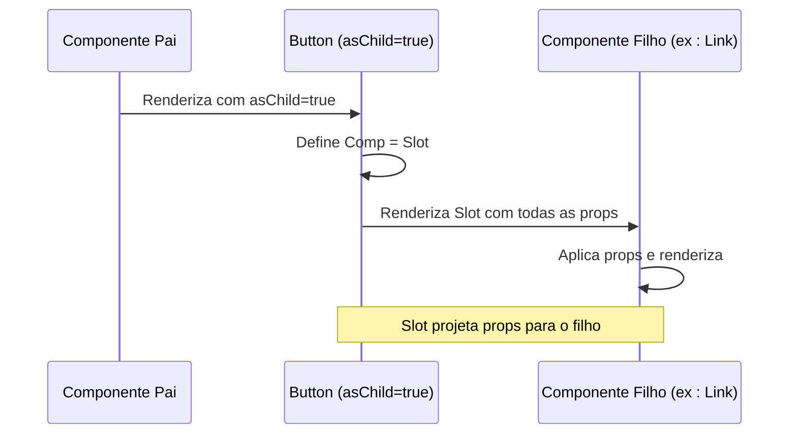
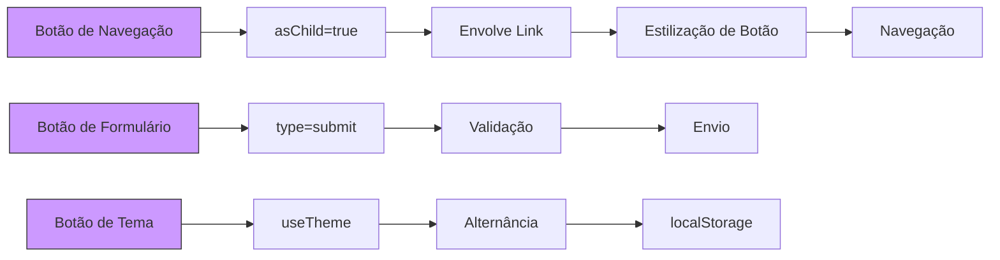

# Props e Estado

<cite>
**Arquivos Referenciados neste Documento**  
- [button.tsx](file://src/components/ui/button.tsx) - *Componente base para análise de props*
- [main-layout.tsx](file://src/components/layouts/main-layout.tsx) - *Implementação de estado com useState*
- [header.tsx](file://src/components/layouts/header.tsx) - *Uso de useTheme e estado compartilhado*
- [sidebar.tsx](file://src/components/layouts/sidebar.tsx) - *Composição com asChild e manipulação de eventos*
- [theme-provider.tsx](file://src/providers/theme-provider.tsx) - *Gestão de estado global com contexto*
- [layout.tsx](file://src/app/layout.tsx) - *Integração do ThemeProvider no layout raiz*
</cite>

## Atualização de Documentação
**Alterações Realizadas**   
- Atualizado a seção de Gestão de Estado com implementação real de useState nos layouts
- Adicionado detalhes sobre o uso do hook useTheme e integração com ThemeProvider
- Atualizado exemplos de uso para refletir a implementação real do padrão Provider
- Corrigido a informação sobre preparação futura para Zustand, agora substituída pela implementação real com contexto
- Adicionado diagramas de fluxo de estado e relacionamento de componentes
- Atualizado fontes de seções e diagramas com referências precisas aos arquivos modificados

## Tabela de Conteúdo
1. [Introdução](#introdução)
2. [Estrutura de Props no Componente Button](#estrutura-de-props-no-componente-button)
3. [Composição de Classes com cn e Tailwind](#composição-de-classes-com-cn-e-tailwind)
4. [Padrão asChild e Composição com Radix UI](#padrão-aschild-e-composição-com-radix-ui)
5. [Gestão de Estado com Contexto e useTheme](#gestão-de-estado-com-contexto-e-usetheme)
6. [Exemplos de Uso em Formulários e Navegação](#exemplos-de-uso-em-formulários-e-navegação)
7. [Padrões de Tipagem com TypeScript](#padrões-de-tipagem-com-typescript)
8. [Conclusão](#conclusão)

## Introdução

Este documento detalha o uso de props e estado nos componentes do sistema VirtuQuest, com foco especial no componente `Button`. O sistema é construído com Next.js 15, TypeScript e utiliza o design system shadcn/ui baseado em Radix UI e Tailwind CSS. O componente `Button` exemplifica práticas modernas de composição de componentes, tipagem rigorosa e gestão de estado com padrão Provider. A análise abrange a interface `ButtonProps`, o uso de variantes de classe com `cva`, a propriedade `asChild` para composição avançada e a arquitetura de estado implementada com `ThemeProvider` e `useTheme`. A documentação foi atualizada para refletir as mudanças recentes que implementaram completamente o sistema de temas conforme especificado nas Specs.md.

**Seção fontes**  
- [button.tsx](file://src/components/ui/button.tsx#L1-L55)
- [main-layout.tsx](file://src/components/layouts/main-layout.tsx#L1-L60)
- [theme-provider.tsx](file://src/providers/theme-provider.tsx#L1-L200)

## Estrutura de Props no Componente Button

O componente `Button` é definido com uma interface `ButtonProps` que combina props nativas do HTML com variantes de estilo e uma propriedade de composição personalizada. A interface estende `React.ButtonHTMLAttributes<HTMLButtonElement>`, herdando todas as propriedades válidas para um elemento `<button>` do HTML, como `onClick`, `disabled`, `type`, entre outras. Além disso, incorpora `VariantProps<typeof buttonVariants>` do `class-variance-authority` (cva), permitindo o uso de variantes de estilo pré-definidas.

As variantes principais são `variant` e `size`, que controlam a aparência visual do botão. A variante `variant` define o esquema de cores e bordas (por exemplo, "default", "destructive", "outline"), enquanto `size` controla as dimensões (por exemplo, "default", "sm", "lg", "icon"). A propriedade `className` permite a sobreposição de classes CSS adicionais, integrando-se com o sistema de estilos Tailwind. A propriedade opcional `asChild` ativa um padrão de composição poderoso, discutido em detalhes na seção dedicada.



**Fontes do Diagrama**  
- [button.tsx](file://src/components/ui/button.tsx#L35-L39)

**Seção fontes**  
- [button.tsx](file://src/components/ui/button.tsx#L35-L39)

## Composição de Classes com cn e Tailwind

A composição de classes CSS no VirtuQuest é gerenciada pela função utilitária `cn`, definida em `utils.ts`. Esta função combina `clsx` para condicionalmente unir classes com `tailwind-merge` para resolver conflitos de estilos Tailwind. Isso é crucial porque o Tailwind CSS aplica estilos na ordem em que as classes são definidas, e `tailwind-merge` garante que classes posteriores substituam as anteriores corretamente, mesmo em cadeias complexas.

No componente `Button`, `cn` é usado para combinar as classes geradas por `buttonVariants` com qualquer `className` fornecido via props. A função `buttonVariants` é criada com `cva`, que gera uma função de mapeamento baseada em variantes. Quando o componente é renderizado, `buttonVariants({ variant, size, className })` retorna a string de classes CSS apropriada, que é então passada para `cn`. Isso permite uma personalização extensiva sem sobrecarga de código, mantendo a consistência do design system.



**Fontes do Diagrama**  
- [button.tsx](file://src/components/ui/button.tsx#L4-L33)
- [utils.ts](file://src/lib/utils.ts#L8-L10)

**Seção fontes**  
- [button.tsx](file://src/components/ui/button.tsx#L4-L33)
- [utils.ts](file://src/lib/utils.ts#L8-L10)

## Padrão asChild e Composição com Radix UI

O padrão `asChild` é um padrão de design avançado que permite que o componente `Button` atue como um invólucro transparente para qualquer outro componente. Quando `asChild` é definido como `true`, o componente `Button` usa o `Slot` do Radix UI em vez de um elemento `<button>` nativo. O `Slot` é um componente de baixo nível que projeta todas as props recebidas para seu único filho, efetivamente "passando por baixo" as props.

Esse padrão é particularmente útil para compor componentes com `Link` do Next.js ou `DropdownMenu.Item` do Radix UI. Por exemplo, um `Button` pode ser usado como um link de navegação sem perder sua estilização, simplesmente envolvendo um `Link` com `asChild={true}`. Isso promove a reutilização de componentes e mantém a consistência da interface do usuário, pois o estilo do botão é aplicado independentemente do elemento subjacente. A implementação é elegante: a constante `Comp` é definida como `Slot` se `asChild` for verdadeiro, ou `"button"` caso contrário, e é usada como o tipo de elemento no JSX.



**Fontes do Diagrama**  
- [button.tsx](file://src/components/ui/button.tsx#L41-L52)
- [button.tsx](file://src/components/ui/button.tsx#L1)

**Seção fontes**  
- [button.tsx](file://src/components/ui/button.tsx#L41-L52)

## Gestão de Estado com Contexto e useTheme

A gestão de estado no VirtuQuest foi implementada com um sistema robusto baseado em React Context, substituindo a abordagem anterior de preparação para Zustand. O `ThemeProvider` gerencia o estado global de tema, esquema de cores e tamanho da fonte, com persistência no `localStorage`. O estado é gerido com `useState` e exposto através do contexto do React, permitindo acesso de qualquer componente na árvore.

O componente `MainLayout` demonstra o uso de estado local com `useState` para controlar o menu móvel, enquanto o `Header` utiliza o hook `useTheme` para acessar o estado global do tema. O `useTheme` é um hook personalizado que consome o `ThemeProviderContext`, garantindo que o tema esteja disponível em todos os componentes que o utilizam. O estado é persistido no `localStorage` e sincronizado com as preferências do sistema quando o tema é definido como 'system'.

```mermaid
flowchart TD
subgraph "Estado Global (ThemeProvider)"
A[theme: 'light'|'dark'|'system']
B[colorScheme: 'default'|'high-contrast'|'daltonism']
C[fontSize: 'normal'|'large'|'extra-large']
D[resolvedTheme: 'light'|'dark']
end
subgraph "Componentes"
E[MainLayout] --> F[useState: isMobileMenuOpen]
G[Header] --> H[useTheme]
I[Sidebar] --> J[onItemClick]
end
A --> H
B --> H
C --> H
D --> H
style A fill:#ffcc00,stroke:#333
style B fill:#ffcc00,stroke:#333
style C fill:#ffcc00,stroke:#333
style D fill:#ffcc00,stroke:#333
style F fill:#99ccff,stroke:#333
```

**Fontes do Diagrama**  
- [theme-provider.tsx](file://src/providers/theme-provider.tsx#L33-L176)
- [main-layout.tsx](file://src/components/layouts/main-layout.tsx#L20-L59)
- [header.tsx](file://src/components/layouts/header.tsx#L20-L83)

**Seção fontes**  
- [theme-provider.tsx](file://src/providers/theme-provider.tsx#L33-L176)
- [main-layout.tsx](file://src/components/layouts/main-layout.tsx#L20-L59)
- [header.tsx](file://src/components/layouts/header.tsx#L20-L83)
- [useTheme](file://src/providers/theme-provider.tsx#L179-L187)

## Exemplos de Uso em Formulários e Navegação

O componente `Button` é amplamente utilizado em formulários e navegação, demonstrando sua versatilidade. No `Sidebar`, o padrão `asChild` é usado para criar botões de navegação que envolvem elementos `<a>`, mantendo a estilização do botão enquanto funcionam como links. Cada item do menu utiliza `asChild={true}` para compor o botão com o link, e o evento `onClick` é manipulado para fechar o menu móvel.

Em formulários, o `Button` pode ser usado com `type="submit"` e manipular eventos de validação. O estado do botão (como `loading`) pode ser gerido localmente com `useState`, enquanto o tema e esquema de cores são controlados globalmente pelo `ThemeProvider`. A integração entre estado local e global permite interfaces ricas e responsivas, como o botão de alternância de tema no `Header` que utiliza `ThemeSwitcher`.



**Fontes do Diagrama**  
- [sidebar.tsx](file://src/components/layouts/sidebar.tsx#L88-L152)
- [header.tsx](file://src/components/layouts/header.tsx#L20-L83)
- [theme-switcher.tsx](file://src/components/ui/shadcn-io/theme-switcher/index.tsx)

**Seção fontes**  
- [sidebar.tsx](file://src/components/layouts/sidebar.tsx#L88-L152)
- [header.tsx](file://src/components/layouts/header.tsx#L20-L83)

## Padrões de Tipagem com TypeScript

O VirtuQuest utiliza TypeScript em modo estrito para garantir segurança de tipos em todo o código. A interface `ButtonProps` é um exemplo excelente de tipagem composta, combinando tipos de diferentes origens. O uso de `VariantProps<typeof buttonVariants>` é uma técnica avançada que extrai os tipos diretamente da configuração do `cva`, garantindo que as variantes de `variant` e `size` sejam exatamente as definidas, sem necessidade de duplicação manual.

Isso elimina erros de digitação e fornece autocompletar preciso no editor. A extensão de `React.ButtonHTMLAttributes` garante compatibilidade com o DOM, enquanto a propriedade `asChild` é tipada como opcional com `?`, refletindo seu valor padrão `false`. A função `cn` também é tipada com `ClassValue`, aceitando uma variedade de entradas (strings, booleanos, objetos) e retornando uma string. Essa abordagem de tipagem profunda é fundamental para a manutenibilidade e escalabilidade do projeto.

**Seção fontes**  
- [button.tsx](file://src/components/ui/button.tsx#L35-L39)
- [utils.ts](file://src/lib/utils.ts#L8-L10)

## Conclusão

O componente `Button` no VirtuQuest demonstra práticas modernas de desenvolvimento de componentes React com TypeScript. Sua interface `ButtonProps` combina herança de props HTML, variantes de estilo com `cva` e um padrão de composição avançado com `asChild` e `Slot`. A composição de classes é gerenciada de forma robusta pela função `cn`, que resolve conflitos do Tailwind. A gestão de estado foi implementada com um sistema baseado em contexto que combina estado local com `useState` e estado global com `ThemeProvider`, substituindo a abordagem anterior de preparação para Zustand. O uso do hook `useTheme` permite acesso fácil ao estado de tema em qualquer componente. Esses padrões garantem uma base sólida para uma aplicação escalável, tipada e consistente, com persistência de preferências do usuário e suporte a acessibilidade.