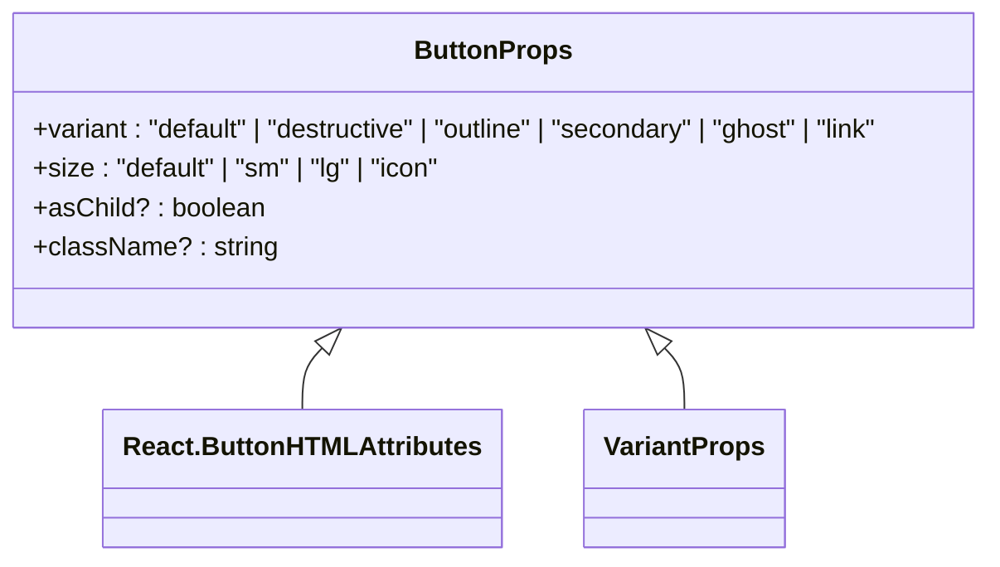
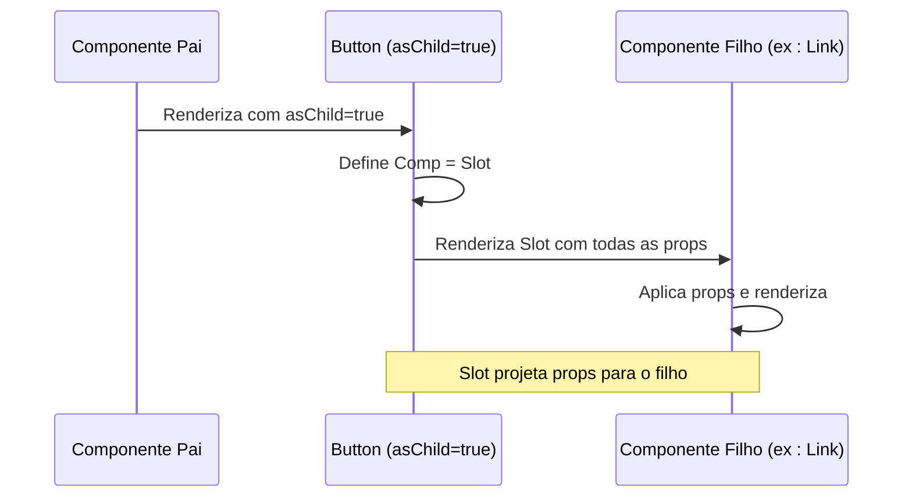
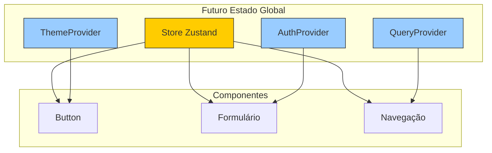

# Props e Estado

<cite>
**Arquivos Referenciados neste Documento**  
- [button.tsx](file://src/components/ui/button.tsx)
- [layout.tsx](file://src/app/layout.tsx)
- [utils.ts](file://src/lib/utils.ts)
- [page.tsx](file://src/app/page.tsx)
</cite>

## Tabela de Conteúdo

1. [Introdução](#introdução)
2. [Estrutura de Props no Componente Button](#estrutura-de-props-no-componente-button)
3. [Composição de Classes com cn e Tailwind](#composição-de-classes-com-cn-e-tailwind)
4. [Padrão asChild e Composição com Radix UI](#padrão-aschild-e-composição-com-radix-ui)
5. [Gestão de Estado Atual e Preparação para Zustand](#gestão-de-estado-atual-e-preparação-para-zustand)
6. [Exemplos de Uso em Formulários e Navegação](#exemplos-de-uso-em-formulários-e-navegação)
7. [Padrões de Tipagem com TypeScript](#padrões-de-tipagem-com-typescript)
8. [Conclusão](#conclusão)

## Introdução

Este documento detalha o uso de props e estado nos componentes do sistema
VirtuQuest, com foco especial no componente `Button`. O sistema é construído com
Next.js 15, TypeScript e utiliza o design system shadcn/ui baseado em Radix UI e
Tailwind CSS. O componente `Button` exemplifica práticas modernas de composição
de componentes, tipagem rigorosa e preparação para gestão de estado global com
Zustand. A análise abrange a interface `ButtonProps`, o uso de variantes de
classe com `cva`, a propriedade `asChild` para composição avançada e a
arquitetura de estado que prepara o sistema para escalabilidade.

**Seção fontes**

- [button.tsx](file://src/components/ui/button.tsx#L1-L55)
- [layout.tsx](file://src/app/layout.tsx#L1-L71)

## Estrutura de Props no Componente Button

O componente `Button` é definido com uma interface `ButtonProps` que combina
props nativas do HTML com variantes de estilo e uma propriedade de composição
personalizada. A interface estende
`React.ButtonHTMLAttributes<HTMLButtonElement>`, herdando todas as propriedades
válidas para um elemento `<button>` do HTML, como `onClick`, `disabled`, `type`,
entre outras. Além disso, incorpora `VariantProps<typeof buttonVariants>` do
`class-variance-authority` (cva), permitindo o uso de variantes de estilo
pré-definidas.

As variantes principais são `variant` e `size`, que controlam a aparência visual
do botão. A variante `variant` define o esquema de cores e bordas (por exemplo,
"default", "destructive", "outline"), enquanto `size` controla as dimensões (por
exemplo, "default", "sm", "lg", "icon"). A propriedade `className` permite a
sobreposição de classes CSS adicionais, integrando-se com o sistema de estilos
Tailwind. A propriedade opcional `asChild` ativa um padrão de composição
poderoso, discutido em detalhes na seção dedicada.

**Fontes do Diagrama**

- [button.tsx](file://src/components/ui/button.tsx#L35-L39)

**Seção fontes**

- [button.tsx](file://src/components/ui/button.tsx#L35-L39)

## Composição de Classes com cn e Tailwind

A composição de classes CSS no VirtuQuest é gerenciada pela função utilitária
`cn`, definida em `utils.ts`. Esta função combina `clsx` para condicionalmente
unir classes com `tailwind-merge` para resolver conflitos de estilos Tailwind.
Isso é crucial porque o Tailwind CSS aplica estilos na ordem em que as classes
são definidas, e `tailwind-merge` garante que classes posteriores substituam as
anteriores corretamente, mesmo em cadeias complexas.

No componente `Button`, `cn` é usado para combinar as classes geradas por
`buttonVariants` com qualquer `className` fornecido via props. A função
`buttonVariants` é criada com `cva`, que gera uma função de mapeamento baseada
em variantes. Quando o componente é renderizado,
`buttonVariants({ variant, size, className })` retorna a string de classes CSS
apropriada, que é então passada para `cn`. Isso permite uma personalização
extensiva sem sobrecarga de código, mantendo a consistência do design system.

**Fontes do Diagrama**

- [button.tsx](file://src/components/ui/button.tsx#L4-L33)
- [utils.ts](file://src/lib/utils.ts#L8-L10)

**Seção fontes**

- [button.tsx](file://src/components/ui/button.tsx#L4-L33)
- [utils.ts](file://src/lib/utils.ts#L8-L10)

## Padrão asChild e Composição com Radix UI

O padrão `asChild` é um padrão de design avançado que permite que o componente
`Button` atue como um invólucro transparente para qualquer outro componente.
Quando `asChild` é definido como `true`, o componente `Button` usa o `Slot` do
Radix UI em vez de um elemento `<button>` nativo. O `Slot` é um componente de
baixo nível que projeta todas as props recebidas para seu único filho,
efetivamente "passando por baixo" as props.

Esse padrão é particularmente útil para compor componentes com `Link` do Next.js
ou `DropdownMenu.Item` do Radix UI. Por exemplo, um `Button` pode ser usado como
um link de navegação sem perder sua estilização, simplesmente envolvendo um
`Link` com `asChild={true}`. Isso promove a reutilização de componentes e mantém
a consistência da interface do usuário, pois o estilo do botão é aplicado
independentemente do elemento subjacente. A implementação é elegante: a
constante `Comp` é definida como `Slot` se `asChild` for verdadeiro, ou
`"button"` caso contrário, e é usada como o tipo de elemento no JSX.

**Fontes do Diagrama**

- [button.tsx](file://src/components/ui/button.tsx#L41-L52)
- [button.tsx](file://src/components/ui/button.tsx#L1)

**Seção fontes**

- [button.tsx](file://src/components/ui/button.tsx#L41-L52)

## Gestão de Estado Atual e Preparação para Zustand

Atualmente, o estado no VirtuQuest é gerido principalmente por meio de props e
estado local em componentes específicos, conforme evidenciado pela ausência de
chamadas a `zustand` ou `useStore` no código analisado. No entanto, a
arquitetura está explicitamente preparada para a adoção do Zustand como solução
de estado global. O arquivo `layout.tsx` contém um comentário que indica a
futura adição de provedores como `ThemeProvider`, `AuthProvider` e
`QueryProvider` no nível raiz da aplicação.

Essa abordagem segue o padrão Provider, onde o estado global é disponibilizado
para toda a árvore de componentes através do contexto do React. O Zustand será
integrado como um desses provedores, permitindo o acesso ao estado de qualquer
componente sem a necessidade de passar props manualmente. O `package.json`
confirma a dependência do `zustand@5.0.8`, indicando que a implementação está
planejada para fases futuras. Essa separação clara entre estado local (para UI)
e estado global (para dados da aplicação) promove uma arquitetura limpa e
escalável.

**Fontes do Diagrama**

- [layout.tsx](file://src/app/layout.tsx#L65-L71)
- [package.json](file://package.json#L32)

**Seção fontes**

- [layout.tsx](file://src/app/layout.tsx#L65-L71)
- [package.json](file://package.json#L32)

## Exemplos de Uso em Formulários e Navegação

Embora o código atual mostre um `Button` estático na página inicial, seu design
permite uso dinâmico em formulários e navegação. Em um formulário, um `Button`
pode ser usado com `type="submit"` e manipular o evento `onClick` para validar
entradas, demonstrando a passagem de props de manipulação de eventos. Para
navegação, o padrão `asChild` permite que o `Button` envolva um `Link` do
Next.js, criando um botão de navegação com estilização consistente.

Por exemplo, um botão de login em um formulário pode ser definido com
`variant="default"` e `size="lg"`, enquanto um botão de cancelamento pode usar
`variant="outline"`. O estado do botão (como `loading`) pode ser gerido
localmente com `useState` até que o estado global com Zustand seja implementado.
A tipagem rigorosa garante que apenas variantes válidas sejam usadas, prevenindo
erros de digitação. Esses padrões são demonstrados no arquivo
`design-system-showcase.tsx`, que exibe uma coleção de componentes, incluindo
botões em diferentes estados e variantes.

**Seção fontes**

- [page.tsx](file://src/app/page.tsx#L55-L68)
- [design-system-showcase.tsx](file://src/components/demo/design-system-showcase.tsx#L63-L95)

## Padrões de Tipagem com TypeScript

O VirtuQuest utiliza TypeScript em modo estrito para garantir segurança de tipos
em todo o código. A interface `ButtonProps` é um exemplo excelente de tipagem
composta, combinando tipos de diferentes origens. O uso de
`VariantProps<typeof buttonVariants>` é uma técnica avançada que extrai os tipos
diretamente da configuração do `cva`, garantindo que as variantes de `variant` e
`size` sejam exatamente as definidas, sem necessidade de duplicação manual.

Isso elimina erros de digitação e fornece autocompletar preciso no editor. A
extensão de `React.ButtonHTMLAttributes` garante compatibilidade com o DOM,
enquanto a propriedade `asChild` é tipada como opcional com `?`, refletindo seu
valor padrão `false`. A função `cn` também é tipada com `ClassValue`, aceitando
uma variedade de entradas (strings, booleanos, objetos) e retornando uma string.
Essa abordagem de tipagem profunda é fundamental para a manutenibilidade e
escalabilidade do projeto.

**Seção fontes**

- [button.tsx](file://src/components/ui/button.tsx#L35-L39)
- [utils.ts](file://src/lib/utils.ts#L8-L10)

## Conclusão

O componente `Button` no VirtuQuest demonstra práticas modernas de
desenvolvimento de componentes React com TypeScript. Sua interface `ButtonProps`
combina herança de props HTML, variantes de estilo com `cva` e um padrão de
composição avançado com `asChild` e `Slot`. A composição de classes é gerenciada
de forma robusta pela função `cn`, que resolve conflitos do Tailwind. Embora o
estado ainda não esteja implementado com Zustand, a arquitetura do `layout.tsx`
está claramente preparada para o padrão Provider, indicando uma transição
planejada para gestão de estado global. Esses padrões garantem uma base sólida
para uma aplicação escalável, tipada e consistente.
