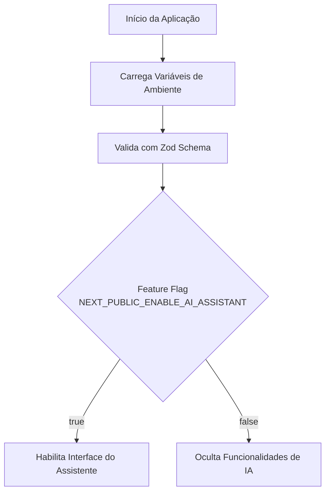
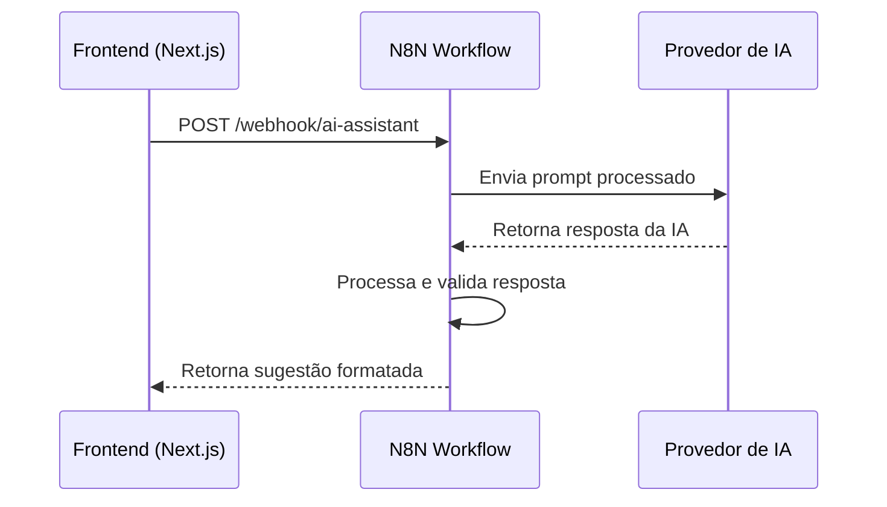
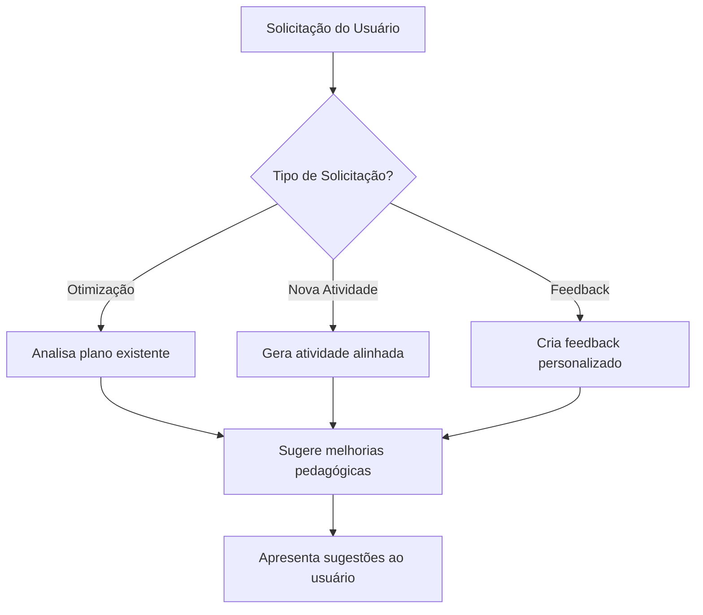
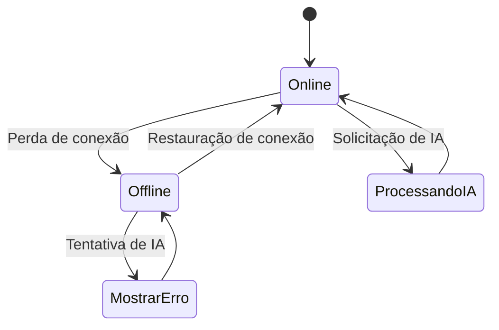

# Assistente de IA

<cite>
**Arquivos Referenciados neste Documento**   
- [env.ts](file://src/lib/env.ts)
- [README.md](file://README.md)
</cite>

## Sumário

1. [Introdução](#introdução)
2. [Habilitação via Feature Flag](#habilitação-via-feature-flag)
3. [Integração com Fluxos N8N](#integração-com-fluxos-n8n)
4. [Casos de Uso Pedagógicos](#casos-de-uso-pedagógicos)
5. [Arquitetura Offline-First](#arquitetura-offline-first)
6. [Processamento de Prompts e Respostas](#processamento-de-prompts-e-respostas)
7. [Conclusão](#conclusão)

## Introdução

O Assistente de IA do VirtuQuest é um componente central da plataforma,
projetado para fornecer sugestões pedagógicas inteligentes que auxiliam
educadores no planejamento de aulas e na geração de avaliações. Integrado
diretamente aos fundamentos pedagógicos da BNCC, Taxonomia de Bloom e Virtudes
Intelectuais, o assistente utiliza inteligência artificial para otimizar o
processo de ensino-aprendizagem. Este documento detalha o funcionamento técnico
e pedagógico do assistente, incluindo sua habilitação, integração com sistemas
externos, casos de uso e arquitetura.

**Section sources**

- [README.md](file://README.md#L0-L44)

## Habilitação via Feature Flag

O Assistente de IA é controlado pela feature flag
`NEXT_PUBLIC_ENABLE_AI_ASSISTANT`, definida nas variáveis de ambiente do
cliente. Essa flag permite ativar ou desativar o assistente de forma dinâmica
sem necessidade de reimplantação. O valor padrão é `true`, o que significa que o
assistente está habilitado por padrão em todos os ambientes. A validação da flag
é feita de forma segura com Zod, garantindo tipagem correta e transformação de
string para booleano.

A flag é acessada de forma segura através do módulo `env` no diretório
`src/lib/env.ts`, que centraliza todas as variáveis de ambiente com validação
robusta. Isso permite que o estado do assistente seja verificado em qualquer
parte da aplicação com segurança de tipo.

**Diagram sources**

- [env.ts](file://src/lib/env.ts#L0-L87)

**Section sources**

- [env.ts](file://src/lib/env.ts#L0-L87)
- [README.md](file://README.md#L168-L216)

## Integração com Fluxos N8N

O processamento das solicitações de IA é gerenciado através de integração com a
plataforma N8N, uma ferramenta de automação de fluxos de trabalho. A URL da
instância N8N é configurada pela variável de ambiente `N8N_BASE_URL`, que é
validada como URL obrigatória no schema do servidor. Os fluxos N8N são
responsáveis por orquestrar chamadas a modelos de IA, processar respostas e
aplicar lógica de negócios adicional.

A comunicação entre o frontend e os fluxos N8N ocorre através de webhooks
seguros, autenticados com `N8N_WEBHOOK_SECRET`. Essa arquitetura permite
escalabilidade e isolamento de responsabilidades, mantendo a lógica de IA
separada da aplicação principal. O uso de N8N também facilita a integração com
múltiplos provedores de IA e a implementação de fallbacks.

**Diagram sources**

- [env.ts](file://src/lib/env.ts#L0-L87)
- [README.md](file://README.md#L168-L216)

**Section sources**

- [env.ts](file://src/lib/env.ts#L0-L87)
- [README.md](file://README.md#L168-L216)

## Casos de Uso Pedagógicos

O Assistente de IA suporta diversos casos de uso pedagógicos fundamentais para o
planejamento de ensino:

### Otimização de Planos de Aula

O assistente analisa planos de aula existentes e sugere melhorias com base em
alinhamento curricular, progressão cognitiva e desenvolvimento de virtudes. Ele
verifica a cobertura de competências da BNCC e recomenda ajustes para garantir
um equilíbrio adequado entre os níveis da Taxonomia de Bloom.

### Sugestão de Atividades Alinhadas

Com base em objetivos pedagógicos especificados, o assistente gera atividades
que estão alinhadas simultaneamente à BNCC, aos níveis cognitivos da Taxonomia
de Bloom e às Virtudes Intelectuais. Por exemplo, para um objetivo de "analisar"
(Bloom), ele pode sugerir uma atividade de debate que desenvolva a virtude da
justiça intelectual.

### Geração de Feedback

O assistente pode gerar feedback formativo personalizado para estudantes, com
base em critérios pedagógicos e níveis de desempenho. O feedback é estruturado
para ser construtivo, específico e alinhado aos objetivos de aprendizagem.

**Diagram sources**

- [README.md](file://README.md#L0-L44)

**Section sources**

- [README.md](file://README.md#L0-L44)

## Arquitetura Offline-First

A aplicação implementa uma arquitetura offline-first, controlada pela feature
flag `NEXT_PUBLIC_ENABLE_OFFLINE_MODE`. Quando em modo offline, os usuários
podem continuar acessando e editando planos de aula, mas as funcionalidades que
requerem IA estão limitadas. As chamadas ao assistente de IA requerem conexão de
rede ativa para comunicação com os fluxos N8N e provedores de IA.

Quando o dispositivo está offline, a interface informa ao usuário que as
funcionalidades de IA não estão disponíveis e armazena localmente qualquer
tentativa de solicitação para processamento posterior quando a conexão for
restaurada. Isso garante uma experiência de usuário contínua mesmo em ambientes
com conectividade instável.

**Diagram sources**

- [env.ts](file://src/lib/env.ts#L0-L87)

**Section sources**

- [env.ts](file://src/lib/env.ts#L0-L87)

## Processamento de Prompts e Respostas

O assistente utiliza prompts estruturados que incorporam os três pilares
pedagógicos da plataforma: BNCC, Bloom e Virtudes. Um exemplo de prompt seria:
"Sugira uma atividade para ensinar [habilidade BNCC] no nível [nível Bloom] que
desenvolva a virtude de [virtude intelectual]". Esses prompts são enviados aos
fluxos N8N, que os enriquecem com contexto adicional antes de enviá-los ao
modelo de IA.

As respostas da IA são processadas para garantir conformidade com os padrões
pedagógicos da plataforma, formatadas em Markdown para apresentação clara e
validadas antes de serem exibidas ao usuário. O sistema também implementa
mecanismos de cache para respostas frequentes, utilizando os TTLs configuráveis
`CACHE_TTL_BNCC`, `CACHE_TTL_BLOOM` e `CACHE_TTL_VIRTUDES`.

**Section sources**

- [env.ts](file://src/lib/env.ts#L0-L87)
- [README.md](file://README.md#L0-L44)

## Conclusão

O Assistente de IA do VirtuQuest representa uma integração sofisticada entre
tecnologia e pedagogia, fornecendo ferramentas inteligentes que apoiam
educadores no planejamento de ensino de alta qualidade. Sua arquitetura modular,
baseada em feature flags e integração com N8N, permite flexibilidade e
escalabilidade. A combinação com a arquitetura offline-first garante
acessibilidade mesmo em contextos com conectividade limitada, enquanto o foco
nos pilares pedagógicos assegura que todas as sugestões sejam educacionalmente
sólidas e alinhadas aos objetivos de aprendizagem.
