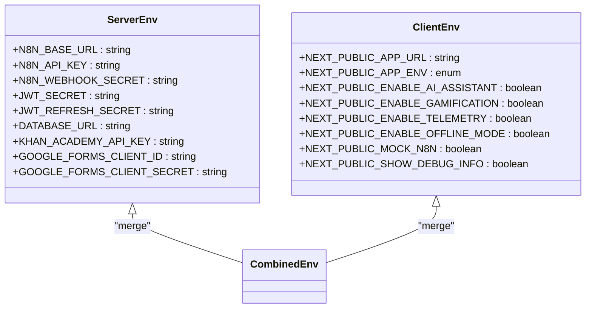
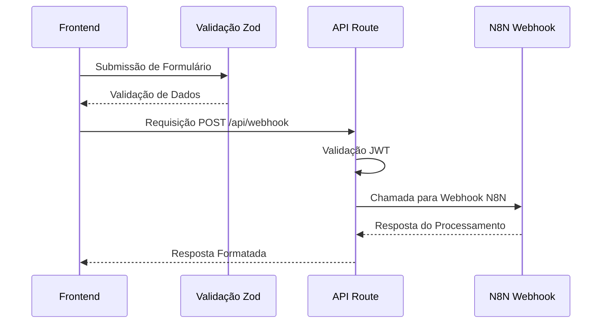
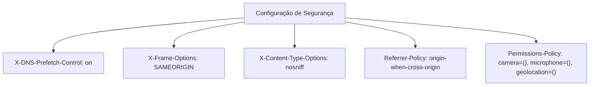
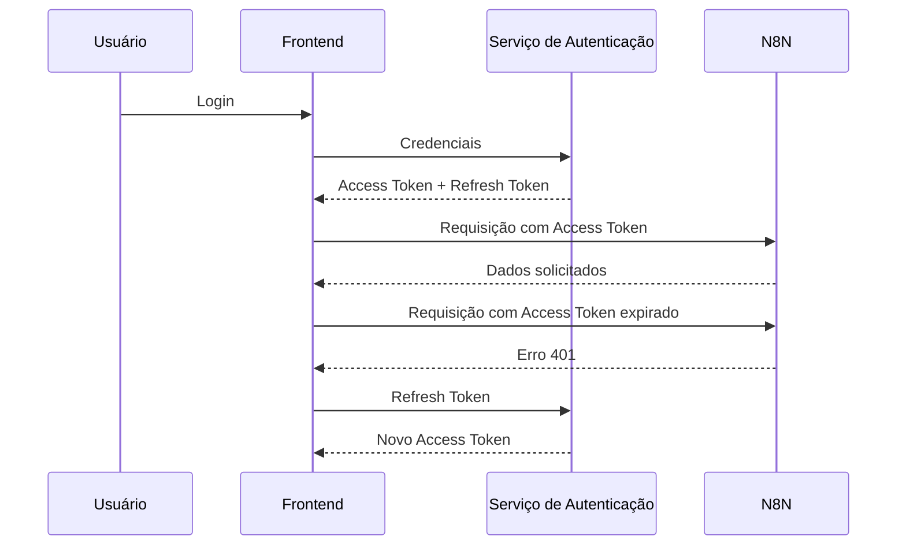

# Camada de Integração com API

<cite>
**Arquivos Referenciados neste Documento**  
- [env.ts](file://src/lib/env.ts)
- [next.config.ts](file://next.config.ts)
- [.env.example](file://.env.example)
- [README.md](file://README.md)
</cite>

## Sumário

1. [Introdução](#introdução)
2. [Estrutura do Projeto](#estrutura-do-projeto)
3. [Validação e Tipagem de Variáveis de Ambiente](#validação-e-tipagem-de-variáveis-de-ambiente)
4. [Arquitetura Backend-less com Webhooks N8N](#arquitetura-backend-less-com-webhooks-n8n)
5. [Fluxo de Dados: Frontend para N8N](#fluxo-de-dados-frontend-para-n8n)
6. [Padrões de Segurança](#padrões-de-segurança)
7. [Autenticação JWT](#autenticação-jwt)
8. [Tratamento de Erros](#tratamento-de-erros)
9. [Exemplos de Webhooks](#exemplos-de-webhooks)
10. [Feature Flags e Integrações Externas](#feature-flags-e-integrações-externas)
11. [Conclusão](#conclusão)

## Introdução

A camada de integração com API do VirtuQuest é projetada para fornecer uma
arquitetura backend-less eficiente, utilizando webhooks N8N para automatizar
fluxos de trabalho pedagógicos. Este documento detalha a arquitetura, segurança,
autenticação e integrações que permitem a criação de planos de aula, geração de
avaliações e sincronização offline, tudo integrado com plataformas externas como
Khan Academy e Google Forms.

**Section sources**

- [README.md](file://README.md#L1-L277)

## Estrutura do Projeto

A estrutura do projeto é organizada para facilitar a manutenção e
escalabilidade. Os principais diretórios incluem:

- `src/app/`: Páginas Next.js com App Router
- `src/components/`: Componentes React, incluindo UI base (shadcn/ui) e
  componentes educacionais
- `src/core/`: Lógica de domínio e infraestrutura de integração com N8N
- `src/lib/`: Utilitários e helpers, incluindo validação de ambiente
- `src/stores/`: Gerenciamento de estado com Zustand
- `docs/`: Documentação técnica e pedagógica

A configuração do Next.js é centralizada em `next.config.ts`, enquanto as
variáveis de ambiente são gerenciadas em `src/lib/env.ts`.

**Section sources**

- [README.md](file://README.md#L150-L180)

## Validação e Tipagem de Variáveis de Ambiente

O arquivo `env.ts` implementa um sistema robusto de validação e tipagem de
variáveis de ambiente utilizando Zod, garantindo segurança e consistência na
configuração da aplicação.

### Separação de Configurações de Servidor e Cliente

A validação é dividida em dois esquemas distintos:

- **Variáveis do Servidor (Privadas)**: Acessíveis apenas no lado do servidor,
  incluindo segredos sensíveis
- **Variáveis do Cliente (Públicas)**: Prefixadas com `NEXT_PUBLIC_`,
  disponíveis no navegador



**Diagram sources**

- [env.ts](file://src/lib/env.ts#L1-L88)

### Validação com Zod

O Zod é utilizado para validar e transformar as variáveis de ambiente:

- **Tipagem Forte**: Todas as variáveis são tipadas com TypeScript
- **Transformação Automática**: Valores booleanos são convertidos de strings
- **Valores Padrão**: Configurações com valores padrão para desenvolvimento
- **Validação de URL**: Garante que URLs sejam válidas
- **Comprimento Mínimo**: Segredos devem ter pelo menos 32 caracteres

**Section sources**

- [env.ts](file://src/lib/env.ts#L1-L88)
- [.env.example](file://.env.example#L1-L106)

## Arquitetura Backend-less com Webhooks N8N

A arquitetura backend-less do VirtuQuest utiliza N8N como orquestrador de fluxos
de trabalho, eliminando a necessidade de um backend tradicional.

### Benefícios da Arquitetura

- **Redução de Custo**: Sem servidores backend para manter
- **Escalabilidade Automática**: N8N escala com a carga
- **Facilidade de Manutenção**: Fluxos de trabalho visuais no N8N
- **Integrações Rápidas**: Conectores prontos para diversas plataformas

### Configuração no Next.js

O `next.config.ts` configura reescritas para rotear requisições API para a
instância N8N:

```typescript
async rewrites() {
  return [
    {
      source: '/api/n8n/:path*',
      destination: `${process.env.N8N_BASE_URL}/api/:path*`,
    },
  ];
}
```

**Section sources**

- [next.config.ts](file://next.config.ts#L1-L112)
- [README.md](file://README.md#L1-L277)

## Fluxo de Dados: Frontend para N8N

O fluxo de dados segue um padrão consistente desde o frontend até a execução no
N8N.

### Sequência de Processamento



**Diagram sources**

- [env.ts](file://src/lib/env.ts#L1-L88)
- [next.config.ts](file://next.config.ts#L1-L112)

### Validação com Zod no Frontend

Os formulários no frontend utilizam Zod para validação em tempo real:

- **Validação de Tipo**: Garante que os dados estejam no formato correto
- **Validação de Negócio**: Regras específicas do domínio educacional
- **Feedback Imediato**: Mensagens de erro para o usuário

## Padrões de Segurança

A segurança é implementada em múltiplas camadas para proteger dados sensíveis e
garantir integridade.

### Headers de Segurança

O `next.config.ts` define headers de segurança padrão:



**Diagram sources**

- [next.config.ts](file://next.config.ts#L44-L65)

### Rate Limiting

Implementado para prevenir abuso:

- **Limite de 100 requisições por minuto**
- **Timeout de 10 segundos para requisições API**
- **Logs detalhados para monitoramento**

**Section sources**

- [.env.example](file://.env.example#L70-L75)

## Autenticação JWT

O sistema utiliza JWT (JSON Web Tokens) para autenticação segura entre frontend
e N8N.

### Estrutura de Tokens

- **Access Token**: Válido por 15 minutos
- **Refresh Token**: Válido por 7 dias
- **Segredos Fortes**: Mínimo de 32 caracteres

### Fluxo de Autenticação



**Section sources**

- [env.ts](file://src/lib/env.ts#L1-L88)

## Tratamento de Erros

O tratamento de erros é centralizado e padronizado em toda a aplicação.

### Estratégias de Tratamento

- **Validação de Ambiente**: Falha na inicialização se variáveis estiverem
  ausentes
- **Logging Estruturado**: Níveis de log configuráveis (debug, info, warn,
  error)
- **Mensagens de Erro Claras**: Feedback útil para desenvolvedores
- **Segurança de Informações**: Erros detalhados apenas em desenvolvimento

### Exemplo de Tratamento

```typescript
function validateEnv(): z.infer<typeof envSchema> {
  try {
    return envSchema.parse(process.env);
  } catch (error) {
    if (error instanceof z.ZodError) {
      const missingVars = error.errors
        .map((err) => `${err.path.join('.')}: ${err.message}`)
        .join('\n');
      console.error('❌ Invalid environment variables:\n', missingVars);
      throw new Error('Environment validation failed');
    }
    throw error;
  }
}
```

**Section sources**

- [env.ts](file://src/lib/env.ts#L70-L85)

## Exemplos de Webhooks

Os webhooks N8N são utilizados para automatizar diversos fluxos pedagógicos.

### Criação de Planos de Aula

- **Gatilho**: Submissão de formulário no frontend
- **Processamento**: Validação BNCC-Bloom-Virtudes
- **Ações**: Geração de conteúdo com IA, notificação por email

### Geração de Avaliações

- **Gatilho**: Solicitação do professor
- **Processamento**: Seleção de questões baseadas em Bloom
- **Ações**: Criação de Google Form, envio para alunos

### Sincronização Offline

- **Gatilho**: Conexão restaurada
- **Processamento**: Envio de dados locais
- **Ações**: Atualização de banco de dados, resolução de conflitos

**Section sources**

- [README.md](file://README.md#L1-L277)

## Feature Flags e Integrações Externas

O sistema utiliza feature flags para controle granular de funcionalidades.

### Feature Flags Implementadas

| Flag                              | Descrição              | Valor Padrão |
| --------------------------------- | ---------------------- | ------------ |
| `NEXT_PUBLIC_ENABLE_AI_ASSISTANT` | Habilita assistente IA | true         |
| `NEXT_PUBLIC_ENABLE_GAMIFICATION` | Habilita gamificação   | false        |
| `NEXT_PUBLIC_ENABLE_TELEMETRY`    | Habilita telemetria    | true         |
| `NEXT_PUBLIC_ENABLE_OFFLINE_MODE` | Habilita modo offline  | true         |
| `NEXT_PUBLIC_MOCK_N8N`            | Usa mock para N8N      | false        |

### Integrações Externas

- **Khan Academy**: Integração via API Key para conteúdo educacional
- **Google Forms**: Criação e gerenciamento de avaliações
- **SEduc**: Sincronização com sistemas estaduais de educação

**Section sources**

- [env.ts](file://src/lib/env.ts#L1-L88)
- [.env.example](file://.env.example#L1-L106)

## Conclusão

A camada de integração com API do VirtuQuest demonstra uma arquitetura moderna e
eficiente, combinando as vantagens do backend-less com a flexibilidade dos
webhooks N8N. A rigorosa validação de ambiente com Zod, a segurança implementada
em múltiplas camadas e a integração com plataformas educacionais externas criam
um sistema robusto para planejamento pedagógico. Esta abordagem permite que
educadores se concentrem no ensino, enquanto a tecnologia cuida da automação e
integração necessárias.
