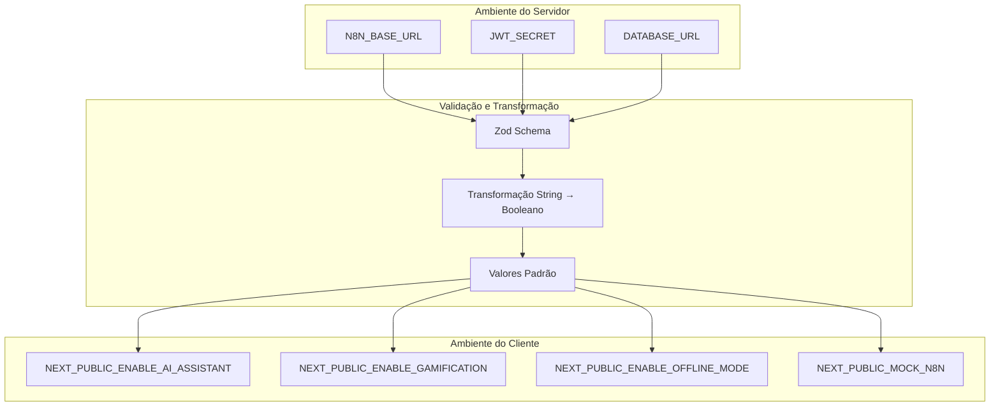
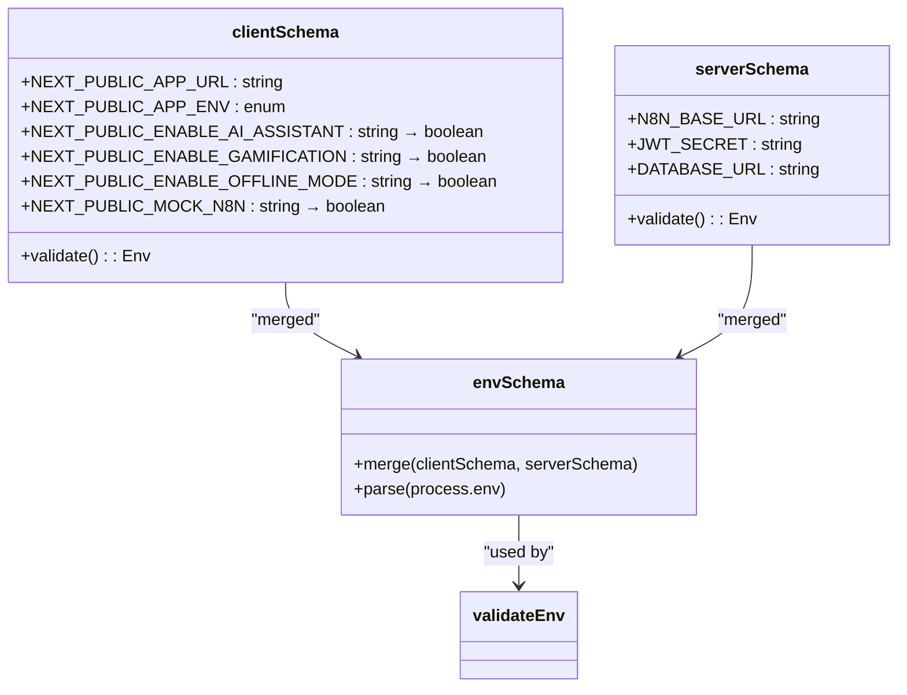
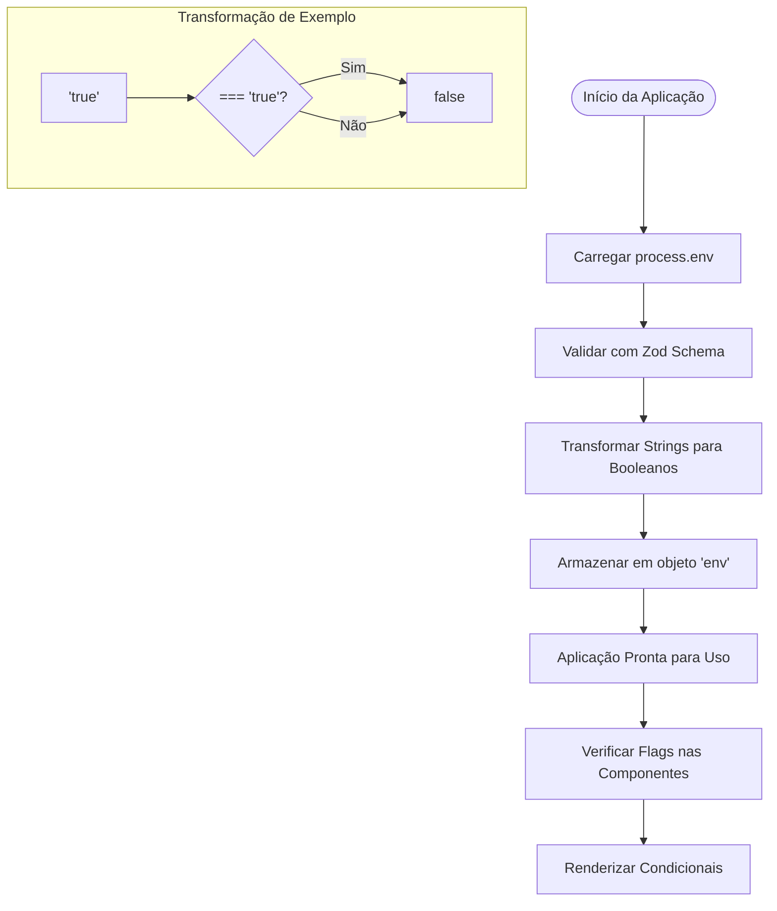
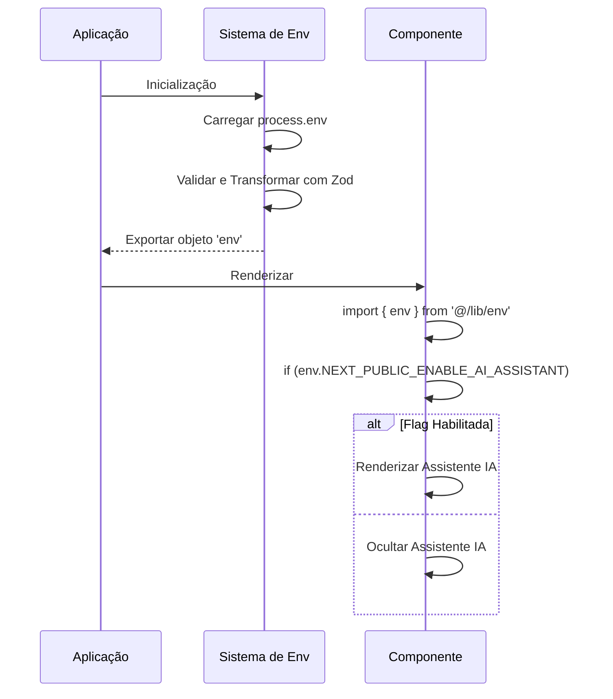

# Gerenciamento com Feature Flags

<cite>
**Arquivos Referenciados neste Documento**  
- [src/lib/env.ts](file://src/lib/env.ts)
- [next.config.ts](file://next.config.ts)
</cite>

## Sumário
1. [Introdução](#introdução)
2. [Estrutura do Sistema de Feature Flags](#estrutura-do-sistema-de-feature-flags)
3. [Definição e Validação de Flags](#definição-e-validação-de-flags)
4. [Transformação de Tipos e Acesso no Runtime](#transformação-de-tipos-e-acesso-no-runtime)
5. [Ambientes de Execução e Variáveis de Ambiente](#ambientes-de-execução-e-variáveis-de-ambiente)
6. [Padrões de Uso nas Aplicações](#padrões-de-uso-nas-aplicações)
7. [Boas Práticas e Segurança](#boas-práticas-e-segurança)
8. [Testes e Estratégias de Fallback](#testes-e-estratégias-de-fallback)
9. [Conclusão](#conclusão)

## Introdução

O sistema de feature flags no Virtuquest é uma implementação robusta baseada em variáveis de ambiente que permite habilitar ou desabilitar funcionalidades dinamicamente sem a necessidade de redeploys. Este mecanismo é essencial para o gerenciamento contínuo de funcionalidades, permitindo testes A/B, lançamentos graduais (canary releases), e desativação rápida de recursos problemáticos. As flags são definidas como variáveis de ambiente com prefixo `NEXT_PUBLIC_` para torná-las acessíveis no cliente, sendo validadas e transformadas tipologicamente através do Zod no arquivo `src/lib/env.ts`.

**Seção fontes**
- [src/lib/env.ts](file://src/lib/env.ts#L1-L87)

## Estrutura do Sistema de Feature Flags

O sistema de feature flags no Virtuquest é organizado em dois esquemas distintos: um para variáveis de ambiente do lado do servidor (privadas) e outro para variáveis do lado do cliente (públicas). Esta separação garante que informações sensíveis não sejam expostas no frontend. As flags públicas são definidas no objeto `clientSchema` e incluem funcionalidades como assistente de IA, gamificação, modo offline e mock de integrações. Cada flag é prefixada com `NEXT_PUBLIC_` para ser automaticamente exposta pelo Next.js no ambiente do cliente.

**Fontes do Diagrama**
- [src/lib/env.ts](file://src/lib/env.ts#L29-L87)

**Seção fontes**
- [src/lib/env.ts](file://src/lib/env.ts#L29-L87)

## Definição e Validação de Flags

As feature flags são definidas utilizando o Zod, uma biblioteca de validação de esquemas em tempo de execução que garante segurança de tipos. No arquivo `src/lib/env.ts`, o objeto `clientSchema` define todas as variáveis de ambiente públicas com suas respectivas validações. Cada flag booleana é representada como uma string que passa por uma transformação para booleano usando o método `.transform((v) => v === 'true')`. Este padrão permite que as flags sejam configuradas como strings nos arquivos `.env` enquanto são consumidas como booleanos no código da aplicação. O sistema também define valores padrão para cada flag, garantindo comportamento previsível mesmo quando uma variável não está definida.

**Fontes do Diagrama**
- [src/lib/env.ts](file://src/lib/env.ts#L1-L87)

**Seção fontes**
- [src/lib/env.ts](file://src/lib/env.ts#L1-L87)

## Transformação de Tipos e Acesso no Runtime

O processo de transformação de tipos é fundamental para o funcionamento das feature flags no Virtuquest. Como as variáveis de ambiente são sempre strings, o sistema utiliza a função `.transform()` do Zod para converter valores como `"true"` e `"false"` em seus equivalentes booleanos nativos. Esta transformação ocorre durante a validação inicial no momento da inicialização da aplicação, garantindo que todas as flags estejam disponíveis como booleanos no runtime. O acesso às flags é feito de forma tipada através do objeto `env` exportado por `src/lib/env.ts`, permitindo autocompletar e verificação de tipos em toda a base de código.

**Fontes do Diagrama**
- [src/lib/env.ts](file://src/lib/env.ts#L29-L45)

**Seção fontes**
- [src/lib/env.ts](file://src/lib/env.ts#L29-L87)

## Ambientes de Execução e Variáveis de Ambiente

O Virtuquest utiliza a variável `NEXT_PUBLIC_APP_ENV` para determinar o ambiente de execução atual, com valores permitidos sendo `development`, `staging` e `production`. Esta configuração é definida no esquema Zod com um valor padrão de `development`, garantindo que o ambiente seja sempre definido mesmo quando não especificado explicitamente. Embora o `next.config.ts` não contenha lógica adicional de configuração de ambientes, ele valida a presença de variáveis essenciais como `N8N_BASE_URL`. A combinação de `NEXT_PUBLIC_APP_ENV` com as feature flags permite configurações específicas por ambiente, como habilitar o mock de N8N apenas em desenvolvimento ou desativar a telemetria em produção.

**Seção fontes**
- [src/lib/env.ts](file://src/lib/env.ts#L30-L31)
- [next.config.ts](file://next.config.ts#L100-L103)

## Padrões de Uso nas Aplicações

As feature flags são consumidas diretamente no código da aplicação através do objeto `env` importado de `@/lib/env`. O padrão de uso envolve condicionais simples que verificam o valor booleano da flag para determinar se uma funcionalidade deve ser renderizada ou executada. Por exemplo, a flag `NEXT_PUBLIC_ENABLE_AI_ASSISTANT` pode ser usada para mostrar ou ocultar componentes relacionados ao assistente de IA. Este padrão permite que diferentes combinações de funcionalidades sejam testadas localmente alterando apenas as variáveis de ambiente, sem necessidade de alterações no código. A tipagem rigorosa garante que nomes de flags incorretos sejam detectados em tempo de desenvolvimento.

**Fontes do Diagrama**
- [src/lib/env.ts](file://src/lib/env.ts#L80-L87)
- [src/app/page.tsx](file://src/app/page.tsx#L1-L85)

**Seção fontes**
- [src/lib/env.ts](file://src/lib/env.ts#L80-L87)

## Boas Práticas e Segurança

O sistema de feature flags no Virtuquest segue várias boas práticas de segurança e manutenibilidade. Primeiramente, a separação clara entre variáveis públicas e privadas evita a exposição acidental de segredos. O uso do prefixo `NEXT_PUBLIC_` é consistente e segue as convenções do Next.js, enquanto o naming das flags é descritivo e padronizado (`ENABLE_`, `MOCK_`). A validação centralizada com Zod garante que todas as variáveis sejam verificadas na inicialização, emitindo erros detalhados em caso de configuração inválida. Além disso, todos os valores têm padrões definidos, prevenindo falhas por variáveis ausentes. O sistema também evita a criação de flags privadas com prefixo público, mantendo a integridade da segurança.

**Seção fontes**
- [src/lib/env.ts](file://src/lib/env.ts#L1-L87)

## Testes e Estratégias de Fallback

Para testar diferentes combinações de feature flags localmente, os desenvolvedores podem modificar os arquivos `.env.local` com diferentes valores para as variáveis `NEXT_PUBLIC_*`. O sistema de fallback é implementado através dos valores padrão definidos no esquema Zod, garantindo que a aplicação sempre tenha um comportamento definido mesmo quando uma variável não está presente. Por exemplo, `NEXT_PUBLIC_ENABLE_GAMIFICATION` tem valor padrão `false`, desativando a gamificação por padrão. Esta abordagem permite testes abrangentes de cenários sem alterar o código-fonte, apenas ajustando a configuração de ambiente. A validação rigorosa também atua como mecanismo de proteção, impedindo a execução com configurações inválidas.

**Seção fontes**
- [src/lib/env.ts](file://src/lib/env.ts#L34-L45)

## Conclusão

O sistema de feature flags no Virtuquest representa uma implementação madura e segura para gerenciamento dinâmico de funcionalidades. Ao combinar a simplicidade das variáveis de ambiente com a robustez da validação de esquemas do Zod, a arquitetura permite flexibilidade operacional sem comprometer a segurança ou a manutenibilidade. A transformação tipada de strings para booleanos, o uso de valores padrão e a separação clara entre ambientes público e privado demonstram um entendimento profundo das melhores práticas em gerenciamento de configurações. Este sistema não apenas facilita lançamentos controlados e testes de funcionalidades, mas também serve como base para práticas de DevOps avançadas como feature toggling e canary deployments.