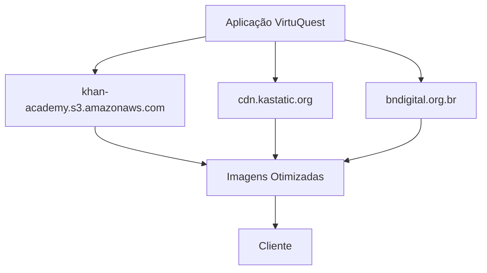

# Integrações com Serviços Externos

<cite>
**Arquivos Referenciados neste Documento**  
- [src/lib/env.ts](file://src/lib/env.ts)
- [next.config.ts](file://next.config.ts)
</cite>

## Sumário
1. [Introdução](#introdução)
2. [Validação e Tipagem de Variáveis de Ambiente](#validação-e-tipagem-de-variáveis-de-ambiente)
3. [Integração com Khan Academy](#integração-com-khan-academy)
4. [Autenticação OAuth com Google Forms](#autenticação-oauth-com-google-forms)
5. [Integração com SEDUC API](#integração-com-seduc-api)
6. [Otimização de Imagens e Domínios Confiáveis](#otimização-de-imagens-e-domínios-confiáveis)
7. [Tratamento de Erros, Timeouts e Fallbacks](#tratamento-de-erros-timeouts-e-fallbacks)
8. [Telemetria e Feature Flags](#telemetria-e-feature-flags)
9. [Orientações de Segurança](#orientações-de-segurança)
10. [Conclusão](#conclusão)

## Introdução
Este documento detalha as integrações externas da aplicação VirtuQuest com Khan Academy, Google Forms e a API da SEDUC. Aborda a validação de credenciais, fluxos de autenticação, configurações de segurança, tratamento de falhas e práticas recomendadas para manter a integridade e segurança do sistema. As integrações são configuradas de forma segura, utilizando validação de tipos com Zod e separação clara entre variáveis de ambiente públicas e privadas.

## Validação e Tipagem de Variáveis de Ambiente
As variáveis de ambiente são validadas e tipadas usando Zod no arquivo `src/lib/env.ts`. A configuração separa claramente as variáveis do servidor (sensíveis) das flags públicas do cliente.

### Esquema do Servidor
As variáveis do servidor incluem credenciais sensíveis como `KHAN_ACADEMY_API_KEY`, `GOOGLE_FORMS_CLIENT_ID` e `SEduc_API_URL`. Elas são definidas como opcionais, permitindo flexibilidade em ambientes de desenvolvimento, mas devem ser fornecidas em produção.

### Esquema do Cliente
As variáveis públicas são prefixadas com `NEXT_PUBLIC_` e incluem flags de funcionalidades como `NEXT_PUBLIC_ENABLE_AI_ASSISTANT` e `NEXT_PUBLIC_ENABLE_TELEMETRY`. Essas flags permitem habilitar ou desabilitar recursos dinamicamente sem recompilar a aplicação.

### Validação
A função `validateEnv()` realiza a validação em tempo de execução, lançando erros detalhados caso alguma variável esteja ausente ou com formato incorreto. Isso garante que a aplicação falhe de forma segura antes de entrar em operação com configurações inválidas.

**Section sources**
- [src/lib/env.ts](file://src/lib/env.ts#L1-L87)

## Integração com Khan Academy
A integração com Khan Academy utiliza uma chave de API (`KHAN_ACADEMY_API_KEY`) para autenticação. A chave é armazenada como variável de ambiente no servidor e validada com Zod.

### Uso da Chave de API
A chave é incluída nos cabeçalhos das requisições HTTP para autenticar a aplicação junto à API do Khan Academy. O padrão de requisição segue o modelo REST com autenticação baseada em tokens.

### Exemplo de Uso
```ts
const response = await fetch('https://api.khanacademy.org/v1/exercises', {
  headers: {
    'Authorization': `Bearer ${env.KHAN_ACADEMY_API_KEY}`
  }
});
```

### Tratamento de Erros
Erros de rede ou autenticação são tratados com retries exponenciais e fallbacks para conteúdo em cache quando disponível.

**Section sources**
- [src/lib/env.ts](file://src/lib/env.ts#L20-L24)

## Autenticação OAuth com Google Forms
O fluxo de autenticação com Google Forms utiliza o protocolo OAuth 2.0, com `GOOGLE_FORMS_CLIENT_ID` e `GOOGLE_FORMS_CLIENT_SECRET` para identificação da aplicação.

### Fluxo de Autenticação
1. O usuário é redirecionado para a página de consentimento do Google.
2. Após consentimento, o Google redireciona de volta com um código de autorização.
3. A aplicação troca o código por um token de acesso no backend.
4. O token é armazenado com segurança e usado para acessar os dados do Google Forms.

### Segurança
O segredo do cliente (`GOOGLE_FORMS_CLIENT_SECRET`) nunca é exposto no frontend, sendo acessível apenas no servidor. O redirecionamento é restrito a origens permitidas conforme configurado no Next.js.

**Section sources**
- [src/lib/env.ts](file://src/lib/env.ts#L21-L22)

## Integração com SEDUC API
A integração com a API da SEDUC é configurada através da variável `SEduc_API_URL` e autenticada com `SEduc_API_KEY`.

### Padrão de Requisições
Todas as requisições seguem o padrão REST, com a chave de API incluída no cabeçalho `X-API-Key`. A URL da API é validada como URL válida durante a inicialização da aplicação.

### Exemplo de Requisição
```ts
const response = await fetch(`${env.SEDUC_API_URL}/escolas`, {
  headers: {
    'X-API-Key': env.SEDUC_API_KEY
  }
});
```

**Section sources**
- [src/lib/env.ts](file://src/lib/env.ts#L23-L24)

## Otimização de Imagens e Domínios Confiáveis
O arquivo `next.config.ts` configura os padrões de imagens remotas para permitir otimização de imagens de domínios confiáveis.

### Domínios Permitidos
Os domínios configurados incluem:
- `khan-academy.s3.amazonaws.com` - Conteúdo educacional do Khan Academy
- `cdn.kastatic.org` - Recursos estáticos do Khan Academy
- `bndigital.org.br` - Conteúdo digital brasileiro

Esses domínios são pré-autorizados para carregamento de imagens, garantindo que apenas fontes confiáveis possam fornecer conteúdo visual.



**Diagram sources**
- [next.config.ts](file://next.config.ts#L15-L35)

**Section sources**
- [next.config.ts](file://next.config.ts#L15-L35)

## Tratamento de Erros, Timeouts e Fallbacks
O sistema implementa estratégias robustas para lidar com falhas em integrações externas.

### Timeouts
Todas as requisições externas possuem timeouts configurados para evitar bloqueios prolongados. Em caso de timeout, a aplicação retorna um estado de erro controlado.

### Fallbacks
Quando possível, a aplicação utiliza dados em cache como fallback. Por exemplo, se a API da SEDUC não responder, dados previamente armazenados podem ser usados para manter a funcionalidade mínima.

### Retries
Para erros transitórios, são implementadas políticas de retry com backoff exponencial, evitando sobrecarga nos serviços externos.

## Telemetria e Feature Flags
O sistema utiliza telemetria para monitorar o desempenho das integrações e feature flags para controle dinâmico de funcionalidades.

### Telemetria
As integrações enviam dados de uso para um endpoint configurável (`TELEMETRY_ENDPOINT`). Isso permite monitorar latência, taxas de erro e padrões de uso.

### Feature Flags
Flags como `NEXT_PUBLIC_ENABLE_AI_ASSISTANT` permitem habilitar ou desabilitar integrações dinamicamente, facilitando testes A/B e lançamentos graduais.

**Section sources**
- [src/lib/env.ts](file://src/lib/env.ts#L12-L14)

## Orientações de Segurança
### Armazenamento Seguro de Credenciais
Todas as credenciais sensíveis devem ser armazenadas em variáveis de ambiente, nunca no código fonte. Em produção, utilize gerenciadores de segredos como AWS Secrets Manager ou Hashicorp Vault.

### Rotação de Chaves
Implemente políticas de rotação regular de chaves de API. As chaves do Google Forms e Khan Academy devem ser rotacionadas a cada 90 dias ou imediatamente após qualquer suspeita de comprometimento.

### Auditoria
Mantenha logs de acesso às APIs externas para auditoria. Monitore padrões de uso incomuns que possam indicar comprometimento de credenciais.

## Conclusão
As integrações externas no VirtuQuest são projetadas com foco em segurança, confiabilidade e manutenibilidade. A validação rigorosa de variáveis de ambiente com Zod, a separação clara entre configurações sensíveis e públicas, e as práticas de segurança robustas garantem que a aplicação opere de forma segura em ambientes de produção. A configuração de otimização de imagens e o tratamento adequado de erros completam um sistema resiliente e eficiente.