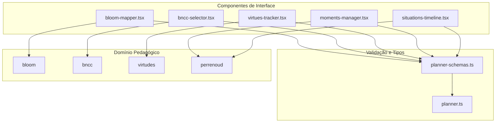
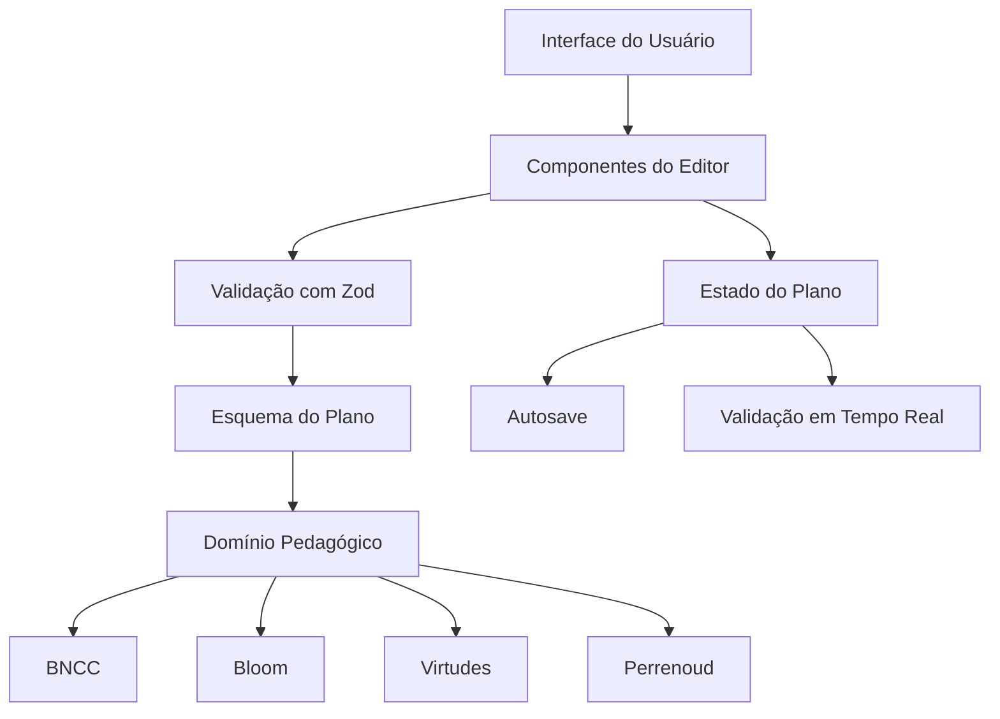
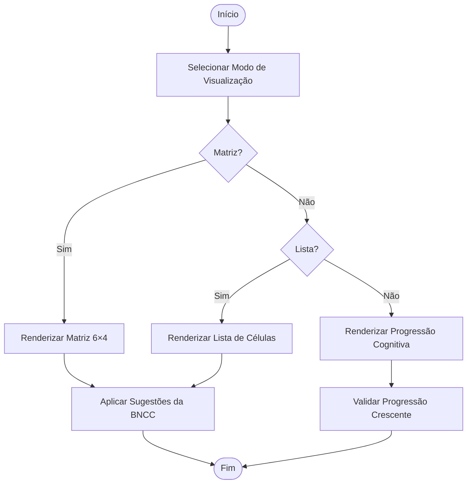
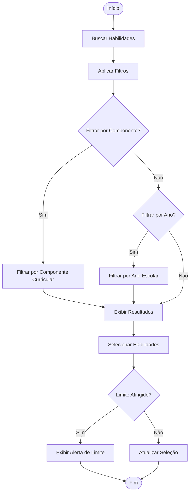
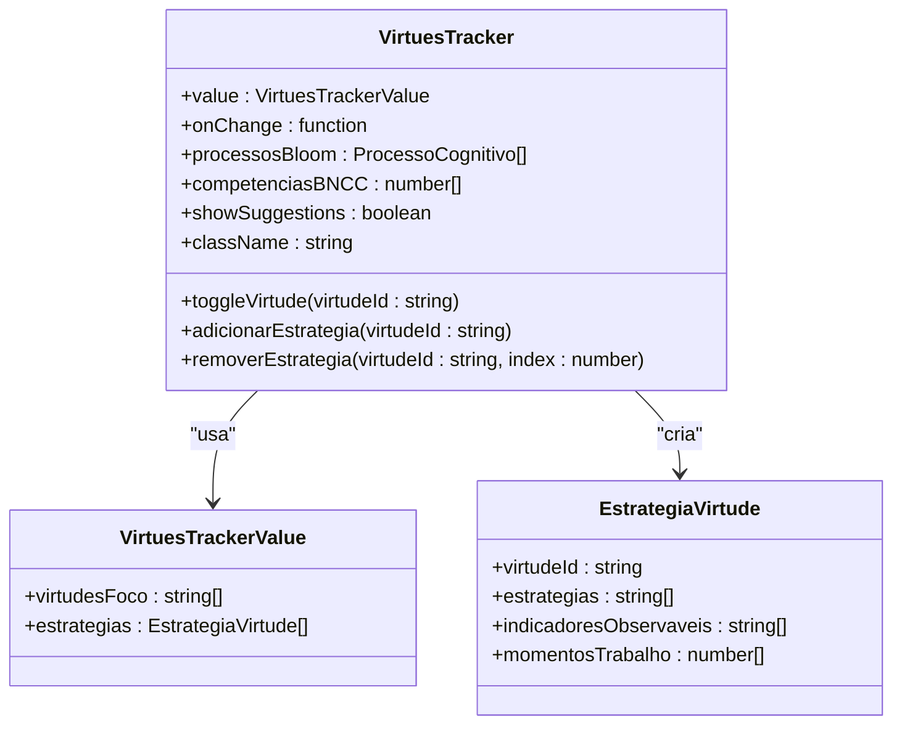
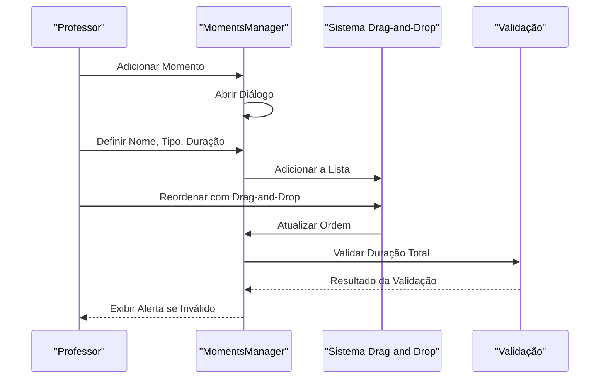
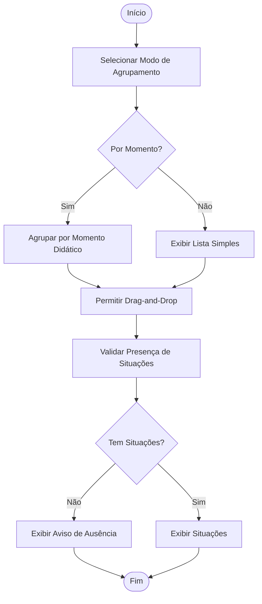

# Componentes do Editor de Planejamento

<cite>
**Arquivos Referenciados neste Documento**  
- [bloom-mapper.tsx](file://src/components/planner/bloom-mapper.tsx)
- [bncc-selector.tsx](file://src/components/planner/bncc-selector.tsx)
- [virtues-tracker.tsx](file://src/components/planner/virtues-tracker.tsx)
- [moments-manager.tsx](file://src/components/planner/moments-manager.tsx)
- [situations-timeline.tsx](file://src/components/planner/situations-timeline.tsx)
- [planner-schemas.ts](file://src/lib/schemas/planner-schemas.ts)
- [planner.ts](file://src/types/planner.ts)
</cite>

## Sumário

1. [Introdução](#introdução)
2. [Estrutura do Projeto](#estrutura-do-projeto)
3. [Componentes Principais](#componentes-principais)
4. [Visão Geral da Arquitetura](#visão-geral-da-arquitetura)
5. [Análise Detalhada dos Componentes](#análise-detalhada-dos-componentes)
6. [Análise de Dependências](#análise-de-dependências)
7. [Considerações de Desempenho](#considerações-de-desempenho)
8. [Guia de Solução de Problemas](#guia-de-solução-de-problemas)
9. [Conclusão](#conclusão)

## Introdução

Este documento fornece uma documentação abrangente dos componentes do Editor de
Planejamento, um sistema pedagógico integrado que combina referências da BNCC,
taxonomia de Bloom, virtudes intelectuais e momentos didáticos de Perrenoud. Os
componentes analisados são fundamentais para a criação de planos de aula
alinhados com fundamentos educacionais robustos, permitindo aos professores
mapear objetivos de aprendizagem, selecionar competências e organizar a
sequência didática de forma estruturada.

## Estrutura do Projeto

O Editor de Planejamento está organizado em uma estrutura modular que separa
claramente os componentes de interface, domínio pedagógico, validação e tipos.
Os componentes principais estão localizados em `src/components/planner/`,
enquanto os tipos e esquemas de validação estão em `src/types/planner.ts` e
`src/lib/schemas/planner-schemas.ts`, respectivamente.



**Fontes do Diagrama**

- [bloom-mapper.tsx](file://src/components/planner/bloom-mapper.tsx)
- [bncc-selector.tsx](file://src/components/planner/bncc-selector.tsx)
- [virtues-tracker.tsx](file://src/components/planner/virtues-tracker.tsx)
- [moments-manager.tsx](file://src/components/planner/moments-manager.tsx)
- [situations-timeline.tsx](file://src/components/planner/situations-timeline.tsx)
- [planner-schemas.ts](file://src/lib/schemas/planner-schemas.ts)
- [planner.ts](file://src/types/planner.ts)

**Fontes da Seção**

- [bloom-mapper.tsx](file://src/components/planner/bloom-mapper.tsx)
- [bncc-selector.tsx](file://src/components/planner/bncc-selector.tsx)
- [planner-schemas.ts](file://src/lib/schemas/planner-schemas.ts)
- [planner.ts](file://src/types/planner.ts)

## Componentes Principais

Os componentes do Editor de Planejamento são projetados para fornecer uma
experiência de planejamento pedagógico integrada, permitindo aos professores
alinhar seus planos com múltiplas dimensões educacionais. Cada componente é
especializado em uma área específica do planejamento: seleção de habilidades
BNCC, mapeamento na taxonomia de Bloom, rastreamento de virtudes intelectuais,
gerenciamento de momentos didáticos e organização de situações-problema.

**Fontes da Seção**

- [bloom-mapper.tsx](file://src/components/planner/bloom-mapper.tsx)
- [bncc-selector.tsx](file://src/components/planner/bncc-selector.tsx)
- [virtues-tracker.tsx](file://src/components/planner/virtues-tracker.tsx)
- [moments-manager.tsx](file://src/components/planner/moments-manager.tsx)
- [situations-timeline.tsx](file://src/components/planner/situations-timeline.tsx)

## Visão Geral da Arquitetura

A arquitetura do Editor de Planejamento segue um padrão de componentes modulares
que se comunicam através de props e callbacks, mantendo um estado coerente com
base em um esquema de validação rigoroso. Os componentes de interface são
controlados e validados por esquemas Zod, garantindo que os dados do plano de
aula estejam sempre em conformidade com os requisitos pedagógicos.



**Fontes do Diagrama**

- [planner-schemas.ts](file://src/lib/schemas/planner-schemas.ts)
- [planner.ts](file://src/types/planner.ts)
- [bloom-mapper.tsx](file://src/components/planner/bloom-mapper.tsx)
- [bncc-selector.tsx](file://src/components/planner/bncc-selector.tsx)

## Análise Detalhada dos Componentes

### Análise do BloomMapper

O componente `BloomMapper` permite o mapeamento visual de objetivos de
aprendizagem na matriz taxonômica de Bloom (6×4), facilitando a seleção de
processos cognitivos e tipos de conhecimento. Ele oferece três modos de
visualização: matriz, lista e progressão, além de sugestões baseadas em
habilidades BNCC selecionadas.



**Fontes do Diagrama**

- [bloom-mapper.tsx](file://src/components/planner/bloom-mapper.tsx#L48-L387)

**Fontes da Seção**

- [bloom-mapper.tsx](file://src/components/planner/bloom-mapper.tsx#L1-L388)
- [planner.ts](file://src/types/planner.ts#L503-L515)

### Análise do BNCCSelector

O componente `BNCCSelector` permite a busca, filtro e seleção múltipla de
habilidades da BNCC, com validação pedagógica e sugestões inteligentes. Ele
suporta filtros por componente curricular e ano escolar, além de fornecer uma
interface de busca eficiente.



**Fontes do Diagrama**

- [bncc-selector.tsx](file://src/components/planner/bncc-selector.tsx#L43-L258)

**Fontes da Seção**

- [bncc-selector.tsx](file://src/components/planner/bncc-selector.tsx#L1-L259)
- [planner.ts](file://src/types/planner.ts#L486-L501)

### Análise do VirtuesTracker

O componente `VirtuesTracker` gerencia a seleção de virtudes intelectuais e a
definição de estratégias pedagógicas para seu desenvolvimento. Ele oferece
sugestões baseadas em processos Bloom e permite a definição de estratégias
detalhadas para cada virtude selecionada.



**Fontes do Diagrama**

- [virtues-tracker.tsx](file://src/components/planner/virtues-tracker.tsx#L45-L424)
- [planner.ts](file://src/types/planner.ts#L517-L528)

**Fontes da Seção**

- [virtues-tracker.tsx](file://src/components/planner/virtues-tracker.tsx#L1-L425)
- [planner.ts](file://src/types/planner.ts#L517-L540)

### Análise do MomentsManager

O componente `MomentsManager` permite criar e organizar momentos didáticos com
drag-and-drop, atividades e recursos. Ele valida a duração total dos momentos em
relação à duração do plano e fornece um resumo visual da distribuição por tipo
de momento.



**Fontes do Diagrama**

- [moments-manager.tsx](file://src/components/planner/moments-manager.tsx#L203-L391)
- [planner-schemas.ts](file://src/lib/schemas/planner-schemas.ts#L138-L170)

**Fontes da Seção**

- [moments-manager.tsx](file://src/components/planner/moments-manager.tsx#L1-L392)
- [planner-schemas.ts](file://src/lib/schemas/planner-schemas.ts#L138-L170)

### Análise do SituationsTimeline

O componente `SituationsTimeline` gerencia situações-problema com drag-and-drop,
organizando-as pelos 4 momentos didáticos de Perrenoud. Ele permite agrupar
situações por momento ou exibi-las em uma lista simples, com validação para
garantir que pelo menos uma situação seja definida.



**Fontes do Diagrama**

- [situations-timeline.tsx](file://src/components/planner/situations-timeline.tsx#L117-L326)
- [planner.ts](file://src/types/planner.ts#L542-L553)

**Fontes da Seção**

- [situations-timeline.tsx](file://src/components/planner/situations-timeline.tsx#L1-L327)
- [planner.ts](file://src/types/planner.ts#L542-L553)

## Análise de Dependências

Os componentes do Editor de Planejamento dependem fortemente dos domínios
pedagógicos (BNCC, Bloom, virtudes, Perrenoud) e dos esquemas de validação. A
integração entre componentes é feita através de um estado compartilhado que
representa o plano de aula completo, validado por esquemas Zod.

```mermaid
graph TD
A[BloomMapper] --> B[catalogoBloom]
A --> C[mapeadorBNCCBloom]
D[BNCCSelector] --> E[catalogoBNCC]
D --> F[decomposeCodigoHabilidade]
G[VirtuesTracker] --> H[catalogoVirtudes]
G --> I[mapeadorBloomVirtudes]
J[MomentsManager] --> K[@dnd-kit/core]
L[SituationsTimeline] --> M[@dnd-kit/core]
A --> N[planner-schemas]
D --> N
G --> N
J --> N
L --> N
```

**Fontes do Diagrama**

- [bloom-mapper.tsx](file://src/components/planner/bloom-mapper.tsx)
- [bncc-selector.tsx](file://src/components/planner/bncc-selector.tsx)
- [virtues-tracker.tsx](file://src/components/planner/virtues-tracker.tsx)
- [moments-manager.tsx](file://src/components/planner/moments-manager.tsx)
- [situations-timeline.tsx](file://src/components/planner/situations-timeline.tsx)
- [planner-schemas.ts](file://src/lib/schemas/planner-schemas.ts)

**Fontes da Seção**

- [bloom-mapper.tsx](file://src/components/planner/bloom-mapper.tsx)
- [bncc-selector.tsx](file://src/components/planner/bncc-selector.tsx)
- [planner-schemas.ts](file://src/lib/schemas/planner-schemas.ts)

## Considerações de Desempenho

Os componentes do Editor de Planejamento são otimizados para desempenho com o
uso de `useMemo` para cálculos pesados, como filtragem de habilidades e geração
de sugestões. O uso de drag-and-drop é implementado com `@dnd-kit/core`, uma
biblioteca leve e eficiente. A validação é realizada em tempo real, mas com
tolerância para evitar recalculações excessivas.

**Fontes da Seção**

- [bncc-selector.tsx](file://src/components/planner/bncc-selector.tsx#L65-L100)
- [bloom-mapper.tsx](file://src/components/planner/bloom-mapper.tsx#L60-L85)
- [moments-manager.tsx](file://src/components/planner/moments-manager.tsx#L100-L120)

## Guia de Solução de Problemas

Este guia fornece orientações para resolver problemas comuns ao usar os
componentes do Editor de Planejamento.

### Problemas Comuns e Soluções

- **Sugestões não aparecem no BloomMapper**: Verifique se há habilidades BNCC
  selecionadas, pois as sugestões são baseadas nelas.
- **Limite de seleção atingido no BNCCSelector**: O limite padrão é 10
  habilidades; ajuste a prop `maxSelections` se necessário.
- **Validação de duração falha no MomentsManager**: A soma das durações dos
  momentos deve corresponder à duração total do plano, com tolerância de 5
  minutos.
- **Sugestões não aparecem no VirtuesTracker**: As sugestões são baseadas nos
  processos Bloom selecionados; verifique se há processos definidos.
- **SituationsTimeline exibe aviso de ausência**: Recomenda-se incluir pelo
  menos uma situação-problema para contextualizar a aprendizagem.

**Fontes da Seção**

- [bloom-mapper.tsx](file://src/components/planner/bloom-mapper.tsx#L150-L160)
- [bncc-selector.tsx](file://src/components/planner/bncc-selector.tsx#L180-L190)
- [moments-manager.tsx](file://src/components/planner/moments-manager.tsx#L150-L170)
- [situations-timeline.tsx](file://src/components/planner/situations-timeline.tsx#L300-L320)
- [virtues-tracker.tsx](file://src/components/planner/virtues-tracker.tsx#L400-L420)

## Conclusão

Os componentes do Editor de Planejamento fornecem uma solução integrada e
pedagogicamente sólida para a criação de planos de aula. A combinação de seleção
BNCC, mapeamento Bloom, rastreamento de virtudes e organização de momentos
didáticos permite aos professores criar experiências de aprendizagem alinhadas
com múltiplas dimensões educacionais. A arquitetura modular e a validação
rigorosa garantem que os planos sejam coerentes e de alta qualidade pedagógica.
