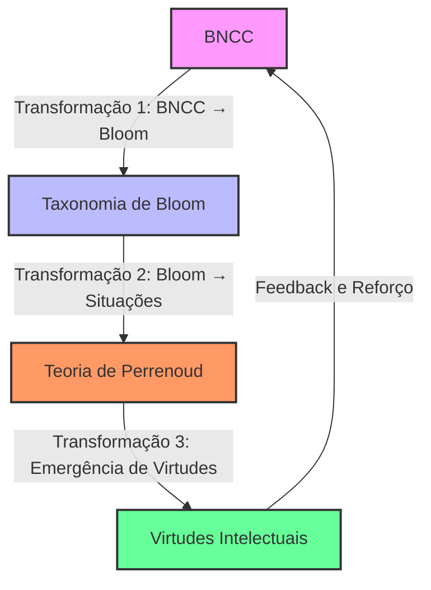
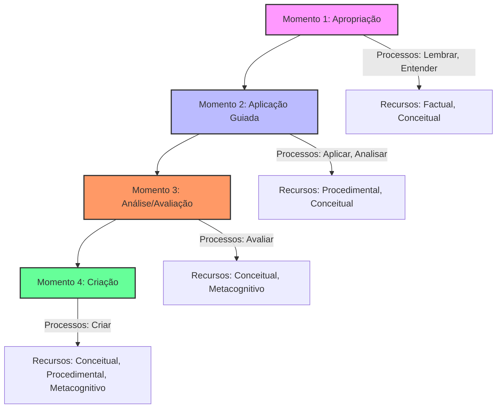
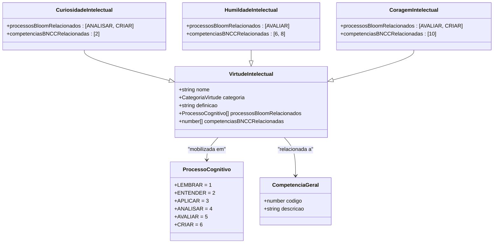
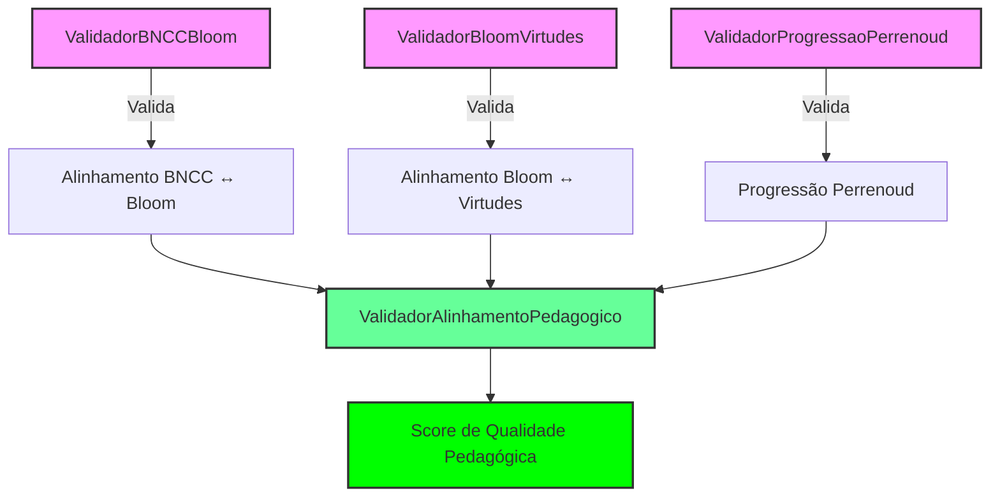

# Continuum Pedagógico

<cite>
**Arquivos Referenciados neste Documento**   
- [README.md](file://README.md)
- [CONTINUUM_PEDAGOGICO.md](file://docs/fundamentos/CONTINUUM_PEDAGOGICO.md)
- [COMPETENCIA_BNCC.md](file://docs/fundamentos/COMPETENCIA_BNCC.md)
- [TAXONOMIA_BLOOM_BNCC.md](file://docs/fundamentos/TAXONOMIA_BLOOM_BNCC.md)
- [COMPETENCIAS_BLOOM_TAXONOMIA.md](file://docs/fundamentos/COMPETENCIAS_BLOOM_TAXONOMIA.md)
- [VIRTUDES_INTELECTUAIS.md](file://docs/fundamentos/VIRTUDES_INTELECTUAIS.md)
- [types.ts](file://src/core/domain/bloom/types.ts)
- [types.ts](file://src/core/domain/bncc/types.ts)
- [types.ts](file://src/core/domain/perrenoud/types.ts)
- [types.ts](file://src/core/domain/virtudes/types.ts)
- [types.ts](file://src/core/domain/shared/types.ts)
- [validators.ts](file://src/core/domain/shared/validators.ts) - *Atualizado no commit 25569a24*
- [mappers.ts](file://src/core/domain/shared/mappers.ts) - *Atualizado no commit 25569a24*
- [repository.ts](file://src/core/domain/perrenoud/repository.ts) - *Implementado no commit 25569a24*
</cite>

## Atualização de Documentação

**Alterações Realizadas**

- Atualização da seção de Regras de Transformação com base nos validadores e
  mapeadores implementados
- Adição de detalhes sobre validação de progressão pedagógica e coerência entre
  modelos
- Atualização da seção de Aplicação Prática com exemplos baseados na
  implementação real
- Inclusão de novos diagramas que refletem a arquitetura de validação e
  mapeamento
- Atualização das fontes de seção e diagrama para refletir os arquivos
  modificados

## Sumário

1. [Introdução](#introdução)
2. [Arquitetura Teórica do Continuum](#arquitetura-teórica-do-continuum)
3. [Regras de Transformação entre Modelos](#regras-de-transformação-entre-modelos)
4. [Progressão em Quatro Momentos Didáticos](#progressão-em-quatro-momentos-didáticos)
5. [Emergência das Virtudes Intelectuais](#emergência-das-virtudes-intelectuais)
6. [Aplicação Prática e Exemplos](#aplicação-prática-e-exemplos)
7. [Diagramas do Sistema](#diagramas-do-sistema)
8. [Conclusão](#conclusão)

## Introdução

O Continuum Pedagógico é um framework integrado que articula três pilares
fundamentais da educação contemporânea: a Base Nacional Comum Curricular (BNCC),
a Taxonomia de Bloom Revisada e a Teoria das Competências de Philippe Perrenoud.
Este sistema não representa uma mera justaposição de teorias, mas uma
arquitetura teórica coerente que transforma fundamentos normativos, analíticos e
pragmáticos em um sistema pedagógico operacionalizável. O continuum emerge da
necessidade de superar a fragmentação entre políticas curriculares, análises
cognitivas e práticas situadas, criando uma ponte funcional entre o "o quê" deve
ser ensinado (BNCC), o "como" cognitivamente (Bloom) e o "onde" e "quando"
aplicar conhecimentos (Perrenoud).

A hipótese central do continuum é que existe uma relação estrutural e
complementar entre esses três frameworks. A BNCC fornece a legitimidade
normativa e a direção curricular, definindo as competências e habilidades que
constituem os direitos de aprendizagem. A Taxonomia de Bloom Revisada oferece
uma linguagem precisa para decompor processos cognitivos e tipos de
conhecimento, permitindo uma análise detalhada dos objetivos educacionais. A
teoria de Perrenoud, por sua vez, fornece o framework para a mobilização
contextualizada de recursos cognitivos em situações-problema autênticas. A
integração dessas teorias é possível porque cada uma preenche lacunas deixadas
pelas outras, criando um sistema dinâmico de transformações inter-relacionadas.

**Fontes da seção**

- [CONTINUUM_PEDAGOGICO.md](file://docs/fundamentos/CONTINUUM_PEDAGOGICO.md#L0-L201)
- [COMPETENCIA_BNCC.md](file://docs/fundamentos/COMPETENCIA_BNCC.md#L0-L320)
- [TAXONOMIA_BLOOM_BNCC.md](file://docs/fundamentos/TAXONOMIA_BLOOM_BNCC.md#L0-L787)

## Arquitetura Teórica do Continuum

### O Problema da Fragmentação Pedagógica

A educação brasileira enfrenta um paradoxo: possui documentos normativos
sofisticados, como a BNCC, fundamentados em teorias pedagógicas avançadas, mas
carece de instrumentos que operacionalizem essa sofisticação no cotidiano
escolar. A Taxonomia de Bloom Revisada oferece uma estrutura analítica precisa
para objetivos educacionais, mas não dialoga explicitamente com o contexto
normativo brasileiro. A teoria de Perrenoud enfatiza a mobilização situada de
recursos, mas não especifica a progressão cognitiva sistemática. O continuum
proposto resolve esse paradoxo através de uma arquitetura teórica que articula
três níveis de operação pedagógica: normativo, analítico e pragmático.

No nível normativo, a BNCC define o "o quê" deve ser desenvolvido, estabelecendo
as competências e habilidades que constituem os direitos de aprendizagem. No
nível analítico, a Taxonomia de Bloom Revisada oferece uma linguagem precisa
para decompor processos cognitivos e tipos de conhecimento, respondendo ao
"como" cognitivamente. No nível pragmático, a teoria de Perrenoud fornece o
framework para a mobilização situada de recursos, explicando o "onde" e "quando"
aplicar conhecimentos em situações autênticas. Essa articulação cria um sistema
dinâmico onde cada transformação preserva informação das anteriores enquanto
adiciona novas dimensões de complexidade.

### A Hipótese Central do Continuum

A hipótese fundamental do continuum é que existe uma relação estrutural, não
apenas conceitual, entre a BNCC, a Taxonomia de Bloom Revisada e a teoria de
Perrenoud. Essa relação é de complementaridade funcional, onde cada teoria
preenche lacunas deixadas pelas outras. A BNCC fornece legitimidade normativa e
direção curricular, mas é vaga quanto aos processos cognitivos específicos.
Bloom oferece precisão analítica sobre processos cognitivos, mas desconsidera o
contexto situacional. Perrenoud enfatiza a mobilização contextualizada, mas não
especifica a progressão cognitiva sistemática.

A validade teórica do continuum repousa em três argumentos epistemológicos
fundamentais. Primeiro, há coerência ontológica: as três teorias compartilham
uma visão construtivista da aprendizagem onde o sujeito constrói ativamente
conhecimento através da ação sobre o mundo. Segundo, existe complementaridade
funcional: cada teoria aborda uma dimensão essencial do fenômeno educativo
(normativa, analítica, pragmática) que as outras não cobrem adequadamente.
Terceiro, verifica-se compatibilidade processual: os mecanismos de
desenvolvimento propostos por cada teoria (apropriação de competências,
progressão cognitiva, mobilização de recursos) são mutuamente reforçadores, não
contraditórios.

**Fontes da seção**

- [CONTINUUM_PEDAGOGICO.md](file://docs/fundamentos/CONTINUUM_PEDAGOGICO.md#L0-L201)
- [COMPETENCIAS_BLOOM_TAXONOMIA.md](file://docs/fundamentos/COMPETENCIAS_BLOOM_TAXONOMIA.md#L0-L888)

## Regras de Transformação entre Modelos

### Primeira Transformação: BNCC → Bloom

A decomposição de habilidades da BNCC em células taxonômicas de Bloom baseia-se
no princípio linguístico-cognitivo fundamental de que verbos de ação em
contextos educacionais carregam informação sobre processos mentais subjacentes.
Quando a BNCC estabelece que o aluno deve "analisar os elementos constitutivos
das artes visuais", o verbo "analisar" indica uma expectativa cognitiva
específica que corresponde à categoria 4 da taxonomia revisada. A regra de
transformação envolve a identificação do processo cognitivo focal, aquele que
representa o resultado de aprendizagem esperado, não necessariamente todos os
processos intermediários mobilizados.

A regra de priorização por complexidade (RD-003) deriva do princípio de que o
desenvolvimento cognitivo tende à complexificação progressiva. Se uma habilidade
menciona tanto "identificar" quanto "avaliar", o processo mais complexo
(avaliar) geralmente representa a capacidade-alvo, enquanto o menos complexo
(identificar) funciona como pré-requisito ou componente. Por exemplo, a
habilidade EF67LP08 ("Identificar os efeitos de sentido...") é classificada na
célula principal B2 (Conhecimento Conceitual × Compreender), pois o produto
cognitivo esperado é a compreensão de relações causais, não a mera recordação de
terminologias.

A implementação do `MapeadorBNCCBloom` valida esta transformação, utilizando o
verbo nuclear da descrição da habilidade para identificar o processo cognitivo e
inferindo o tipo de conhecimento com base em palavras-chave. O mapeamento inclui
confiança (0.85 para mapeamentos diretos, 0.5 para fallbacks) e identifica
células secundárias quando múltiplos verbos estão presentes.

**Fontes da seção**

- [TAXONOMIA_BLOOM_BNCC.md](file://docs/fundamentos/TAXONOMIA_BLOOM_BNCC.md#L41-L522)
- [types.ts](file://src/core/domain/bloom/types.ts#L0-L257)
- [types.ts](file://src/core/domain/bncc/types.ts#L0-L224)
- [mappers.ts](file://src/core/domain/shared/mappers.ts#L53-L192) -
  _Implementação do MapeadorBNCCBloom_
- [validators.ts](file://src/core/domain/shared/validators.ts#L99-L198) -
  _Validação BNCC ↔ Bloom_

### Segunda Transformação: Bloom → Situações (Perrenoud)

A passagem da análise cognitiva para o design de situações-problema
fundamenta-se na insight crucial de que processos cognitivos não existem no
vácuo, mas sempre operam sobre conteúdos específicos em contextos determinados.
A correspondência entre níveis de processo cognitivo e complexidade situacional
não é arbitrária, mas deriva da natureza dos próprios processos. Processos de
nível inferior (Lembrar, Entender) operam eficientemente em situações
estruturadas porque envolvem principalmente recuperação e interpretação de
informações conhecidas. Processos intermediários (Aplicar, Analisar) requerem
situações semi-estruturadas que demandam adaptação de conhecimentos a contextos
parcialmente novos. Processos superiores (Avaliar, Criar) necessitam de
situações abertas e complexas porque envolvem julgamento crítico e síntese
original.

A progressão em quatro momentos que propõe sintetiza a teoria de situações de
Perrenoud com a hierarquia cognitiva de Bloom. O Momento 1 (Apropriação)
corresponde à construção de recursos, onde conhecimentos e procedimentos básicos
são internalizados. O Momento 2 (Aplicação Guiada) representa a mobilização
assistida, onde o aprendiz começa a orquestrar recursos com suporte. O Momento 3
(Análise/Avaliação) materializa a competência propriamente dita, a capacidade de
mobilizar recursos autonomamente. O Momento 4 (Criação) transcende a competência
inicial, desenvolvendo metacompetências, a capacidade de adaptar esquemas de
ação a famílias de situações inéditas.

O `ValidadorProgressaoPerrenoud` implementa esta transformação, validando a
sequência esperada dos momentos didáticos e a progressão crescente de
complexidade cognitiva. O `catalogoPerrenoud` fornece estruturas de competência,
situações-problema e esquemas de mobilização que mapeiam diretamente para os
momentos didáticos.

**Fontes da seção**

- [CONTINUUM_PEDAGOGICO.md](file://docs/fundamentos/CONTINUUM_PEDAGOGICO.md#L0-L201)
- [types.ts](file://src/core/domain/perrenoud/types.ts#L0-L232)
- [validators.ts](file://src/core/domain/shared/validators.ts#L281-L404) -
  _Validação de Progressão Perrenoud_
- [repository.ts](file://src/core/domain/perrenoud/repository.ts) - _Catálogo
  Perrenoud_

### Terceira Transformação: A Emergência das Virtudes Intelectuais

A inclusão das virtudes intelectuais no continuum representa uma extensão
teórica que, embora não presente nos documentos originais, emerge logicamente da
análise dos processos cognitivos superiores e da natureza das competências
complexas. A hipótese é que processos como Avaliar e Criar não são puramente
cognitivos, mas demandam disposições intelectuais específicas. Quando Anderson e
Krathwohl descrevem "Avaliar" como fazer julgamentos baseados em critérios,
estão implicitamente assumindo que o sujeito possui humildade intelectual para
reconhecer limitações em seus julgamentos e coragem intelectual para sustentar
posições fundamentadas. Similarmente, "Criar" pressupõe curiosidade intelectual
para explorar possibilidades e autonomia intelectual para gerar soluções
originais.

A matriz de ativação de virtudes mapeia essas relações implícitas. Não é
coincidência que processos analíticos ativem virtudes como rigor e
imparcialidade, enquanto processos criativos mobilizem curiosidade e coragem. Há
uma afinidade estrutural entre tipos de operações cognitivas e disposições
intelectuais necessárias para executá-las com excelência. Por exemplo, o
processo de Criar está associado às virtudes de Curiosidade Intelectual, Coragem
Intelectual e Autonomia Intelectual, enquanto o processo de Avaliar está ligado
à Humildade Intelectual e ao Rigor Intelectual.

O `MapeadorBloomVirtudes` implementa esta transformação, sugerindo virtudes
intelectuais com base nos processos cognitivos envolvidos. O
`ValidadorBloomVirtudes` valida o alinhamento entre processos cognitivos e
virtudes, garantindo que todos os processos estejam cobertos por virtudes
apropriadas.

**Fontes da seção**

- [CONTINUUM_PEDAGOGICO.md](file://docs/fundamentos/CONTINUUM_PEDAGOGICO.md#L0-L201)
- [VIRTUDES_INTELECTUAIS.md](file://docs/fundamentos/VIRTUDES_INTELECTUAIS.md#L0-L232)
- [types.ts](file://src/core/domain/virtudes/types.ts#L0-L178)
- [mappers.ts](file://src/core/domain/shared/mappers.ts#L199-L263) -
  _Implementação do MapeadorBloomVirtudes_
- [validators.ts](file://src/core/domain/shared/validators.ts#L203-L276) -
  _Validação Bloom ↔ Virtudes_

## Progressão em Quatro Momentos Didáticos

A progressão pedagógica no continuum é estruturada em quatro momentos didáticos,
inspirados na teoria de Perrenoud e alinhados com a hierarquia cognitiva de
Bloom. Essa progressão não é linear e rígida, mas um framework flexível que pode
ser adaptado às especificidades de diferentes domínios e contextos formativos.
Cada momento corresponde a um nível de complexidade situacional e cognitiva
crescente, permitindo uma mobilização progressiva de recursos cognitivos.

### Momento 1: Apropriação

O primeiro momento é caracterizado por situações relativamente estruturadas que
demandam predominantemente processos de Lembrar e Entender diferentes tipos de
conhecimento. O foco está na apropriação de recursos elementares, como
terminologias, fatos e princípios básicos. As atividades são projetadas para
familiarizar o aluno com os conceitos fundamentais e construir uma base sólida
de conhecimento factual e conceitual. Por exemplo, em uma aula de Geografia, o
aluno pode estudar mapas e dados demográficos para entender a distribuição da
população.

### Momento 2: Aplicação Guiada

Neste momento, as situações tornam-se semi-estruturadas, exigindo que o aluno
aplique e analise conhecimentos em contextos progressivamente diversificados. O
professor atua como mediador, fornecendo suporte e orientação enquanto o aluno
pratica procedimentos conhecidos em novos contextos. O foco está na aplicação de
conhecimento procedimental e na análise de relações entre conceitos. Por
exemplo, o aluno pode aplicar fórmulas matemáticas para resolver problemas com
múltiplas variáveis.

### Momento 3: Análise/Avaliação

As situações neste momento são abertas e complexas, exigindo que o aluno analise
e avalie conhecimentos conceituais e procedimentais em contextos ambíguos. O
aluno deve mobilizar recursos cognitivos de forma autônoma, fazendo julgamentos
baseados em critérios e padrões. O foco está na avaliação crítica e na análise
profunda de problemas multifacetados. Por exemplo, o aluno pode avaliar o
impacto de novas tecnologias na sociedade, considerando aspectos econômicos,
culturais e sociais.

### Momento 4: Criação

O quarto momento envolve situações complexas e inéditas que demandam a criação
de soluções singulares. O aluno deve reunir elementos para formar um todo
coerente ou funcional, reorganizando elementos em novo padrão ou estrutura. O
foco está na produção original e na transferência criativa de conhecimentos. Por
exemplo, o aluno pode desenvolver uma campanha de conscientização ambiental,
integrando conhecimentos de Ciências, Geografia e Artes.

O `ValidadorProgressaoPerrenoud` valida a sequência dos momentos didáticos,
garantindo que sigam a ordem esperada: Apropriação → Aplicação Guiada →
Análise/Avaliação → Criação. O validador também verifica se há progressão
crescente de complexidade cognitiva e se a complexidade média é adequada.

**Fontes da seção**

- [types.ts](file://src/core/domain/perrenoud/types.ts#L0-L232)
- [types.ts](file://src/core/domain/bloom/types.ts#L0-L257)
- [validators.ts](file://src/core/domain/shared/validators.ts#L281-L404) -
  _Validação de Progressão Perrenoud_

## Emergência das Virtudes Intelectuais

As virtudes intelectuais emergem do sistema como disposições de caráter que
facilitam o pensamento crítico, a busca de conhecimento e o uso responsável da
razão. Elas não são adicionadas ao continuum de forma arbitrária, mas surgem
logicamente da análise dos processos cognitivos superiores e da natureza das
competências complexas. O sistema identifica seis virtudes core: Curiosidade
Intelectual, Humildade Intelectual, Coragem Intelectual, Autonomia Intelectual,
Perseverança e Rigor Intelectual.

### Ativação por Processo Cognitivo

Cada processo da taxonomia de Bloom ativa preferencialmente certas virtudes. Por
exemplo, quando um aluno está no processo de Analisar, naturalmente mobiliza
curiosidade intelectual (para explorar relações) e rigor intelectual (para ser
sistemático). Isso não é arbitrário; há uma afinidade estrutural entre o tipo de
operação mental e as disposições necessárias para executá-la bem. O processo de
Criar, por sua vez, ativa coragem intelectual para aventurar-se em territórios
desconhecidos e autonomia intelectual para gerar soluções originais.

### Intensificação por Complexidade Situacional

As virtudes não são apenas ativadas, mas intensificadas conforme a complexidade
da situação aumenta. Em uma situação fechada e simples, a curiosidade pode
manifestar-se minimamente. Em uma situação aberta e complexa, ela precisa ser
robusta para sustentar a exploração prolongada de possibilidades. A
intensificação ocorre porque situações mais desafiadoras exigem um
comprometimento mais profundo com as disposições intelectuais. Por exemplo, a
humildade intelectual é mais necessária em situações onde o aluno enfrenta
evidências que contradizem suas crenças.

### Desenvolvimento Espiral

As virtudes desenvolvem-se em espiral através dos ciclos de aprendizagem. Cada
vez que um aluno enfrenta situações que demandam coragem intelectual, por
exemplo, ele tem a oportunidade de fortalecer essa virtude. O sistema rastreia
essas oportunidades e o desenvolvimento ao longo do tempo, promovendo um
crescimento contínuo. O desenvolvimento é modelado em quatro estágios:
sensibilização, emulação guiada, prática autônoma e habituação virtuosa, onde a
virtude se torna uma disposição natural.

O `MapeadorBloomVirtudes` implementa a ativação por processo cognitivo,
sugerindo virtudes com base nos processos envolvidos. O `ValidadorBloomVirtudes`
valida a cobertura de processos, garantindo que todos os processos cognitivos
estejam associados a virtudes intelectuais apropriadas.

**Fontes da seção**

- [VIRTUDES_INTELECTUAIS.md](file://docs/fundamentos/VIRTUDES_INTELECTUAIS.md#L0-L232)
- [types.ts](file://src/core/domain/virtudes/types.ts#L0-L178)
- [mappers.ts](file://src/core/domain/shared/mappers.ts#L199-L263) -
  _Implementação do MapeadorBloomVirtudes_
- [validators.ts](file://src/core/domain/shared/validators.ts#L203-L276) -
  _Validação Bloom ↔ Virtudes_

## Aplicação Prática e Exemplos

### Exemplo 1: Habilidade de Língua Portuguesa (EF67LP08)

A habilidade EF67LP08 ("Identificar os efeitos de sentido...") é um exemplo
prático da aplicação do continuum. Na transformação BNCC → Bloom, o verbo
"identificar" é analisado para determinar o processo cognitivo principal.
Aplicando o Critério II (identificação do produto cognitivo esperado),
verifica-se que o objetivo é a compreensão de relações causais entre escolhas
técnicas e efeitos semânticos, correspondendo ao processo 2.7 Explicar
(Explaining). O tipo de conhecimento principal é conceitual (categoria B), pois
envolve princípios semióticos. A classificação taxonômica é B2 (Conhecimento
Conceitual × Compreender).

Na transformação para situações (Perrenoud), esta habilidade é traduzida em uma
situação-problema de nível 2 (Aplicação Guiada), onde o aluno analisa textos
multimodais em contextos semi-estruturados. A situação exige a mobilização de
recursos cognitivos como conhecimento de terminologia visual e princípios de
produção de sentido. As virtudes intelectuais mobilizadas incluem curiosidade
intelectual para explorar diferentes gêneros textuais e rigor intelectual para
ser sistemático na análise.

O `MapeadorBNCCBloom` realiza automaticamente esta transformação, identificando
o verbo "identificar" e mapeando para o processo de Entender (nível 2). O
`ValidadorBNCCBloom` valida que o nível máximo de complexidade cognitiva está
alinhado com a habilidade.

### Exemplo 2: Habilidade de Matemática (EF07MA17)

A habilidade EF07MA17 ("Resolver e elaborar problemas que envolvam variação de
proporcionalidade...") ilustra a progressão cognitiva e a emergência de
virtudes. Na transformação BNCC → Bloom, o verbo "elaborar" é priorizado sobre
"resolver" pela regra de complexidade cognitiva, correspondendo ao processo 6.2
Planejar (Planning). O tipo de conhecimento principal é conceitual (categoria
B), pois envolve princípios de proporcionalidade. A classificação taxonômica é
B6 (Conhecimento Conceitual × Criar).

Na transformação para situações, esta habilidade é traduzida em uma
situação-problema de nível 4 (Criação), onde o aluno deve criar problemas
matemáticos originais. A situação é aberta e complexa, exigindo a mobilização de
recursos cognitivos como conhecimento de algoritmos e princípios de
proporcionalidade. As virtudes intelectuais mobilizadas incluem coragem
intelectual para aventurar-se em territórios desconhecidos, autonomia
intelectual para gerar soluções originais e perseverança para superar
dificuldades cognitivas.

O `ConstrutorAlinhamento` integra todas as transformações, sugerindo virtudes
intelectuais com base nos processos cognitivos envolvidos. Para esta habilidade,
o construtor sugeriria Coragem Intelectual, Autonomia Intelectual e Perseverança
como virtudes principais.

**Fontes da seção**

- [TAXONOMIA_BLOOM_BNCC.md](file://docs/fundamentos/TAXONOMIA_BLOOM_BNCC.md#L41-L522)
- [types.ts](file://src/core/domain/bloom/types.ts#L0-L257)
- [types.ts](file://src/core/domain/perrenoud/types.ts#L0-L232)
- [types.ts](file://src/core/domain/virtudes/types.ts#L0-L178)
- [mappers.ts](file://src/core/domain/shared/mappers.ts#L417-L471) - _Geração de
  recomendações_
- [validators.ts](file://src/core/domain/shared/validators.ts#L383-L431) -
  _Validação de complexidade_

## Diagramas do Sistema

**Fontes do diagrama**

- [CONTINUUM_PEDAGOGICO.md](file://docs/fundamentos/CONTINUUM_PEDAGOGICO.md#L0-L201)

**Fontes do diagrama**

- [types.ts](file://src/core/domain/perrenoud/types.ts#L0-L232)
- [types.ts](file://src/core/domain/bloom/types.ts#L0-L257)
- [validators.ts](file://src/core/domain/shared/validators.ts#L281-L404) -
  _Validação de Progressão_

**Fontes do diagrama**

- [types.ts](file://src/core/domain/virtudes/types.ts#L0-L178)
- [types.ts](file://src/core/domain/bloom/types.ts#L0-L257)
- [types.ts](file://src/core/domain/bncc/types.ts#L0-L224)
- [mappers.ts](file://src/core/domain/shared/mappers.ts#L199-L263) - _Mapeamento
  Bloom → Virtudes_

**Fontes do diagrama**

- [validators.ts](file://src/core/domain/shared/validators.ts#L99-L431) -
  _Implementação dos validadores_
- [types.ts](file://src/core/domain/shared/types.ts#L52-L108) - _Tipos de
  validação_

## Conclusão

O Continuum Pedagógico proposto deve ser compreendido como uma hipótese de
trabalho teoricamente fundamentada, não como verdade pedagógica definitiva. Ele
representa uma tentativa de criar uma "fenomenotécnica" — uma construção
teórico-prática que permite intervir produtivamente na realidade educacional. A
força deste continuum reside em sua capacidade de tornar operacionalizável a
complexidade teórica sem traí-la. Ele oferece aos educadores um caminho
estruturado para navegar entre exigências normativas (BNCC), precisão analítica
(Bloom) e autenticidade situacional (Perrenoud), mantendo como horizonte o
desenvolvimento integral do sujeito, incluindo suas virtudes intelectuais.

A validação definitiva do continuum, contudo, não pode ser apenas teórica. Ela
demandará confrontação sistemática com a prática educativa, ajustes baseados em
evidências empíricas e refinamento contínuo através do diálogo entre teoria e
prática. O continuum é, portanto, um convite ao trabalho pedagógico rigoroso e
criativo, não sua conclusão. Ele reconhece que a educação é um campo de tensões
produtivas, onde a integração de teorias não elimina as diferenças, mas as
transforma em complementaridades funcionais que enriquecem as possibilidades de
compreensão e intervenção pedagógica.
