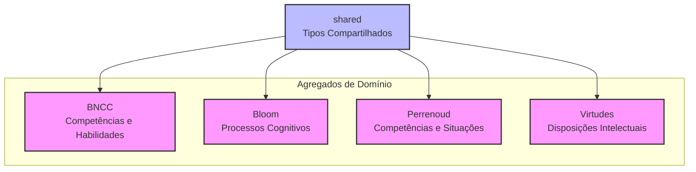
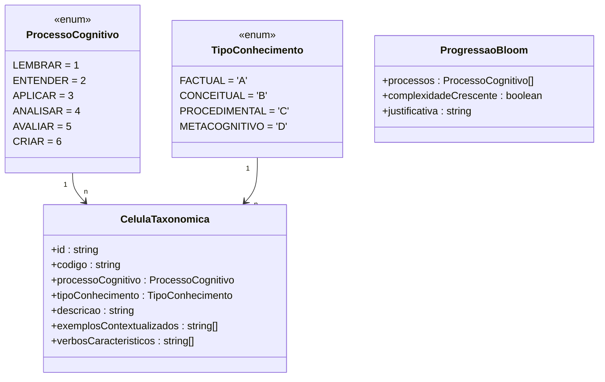
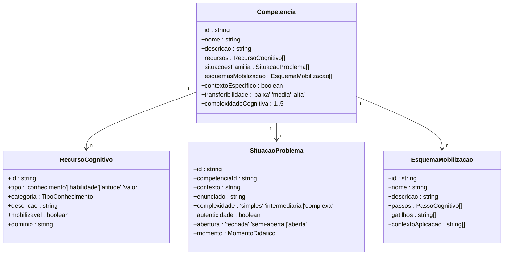
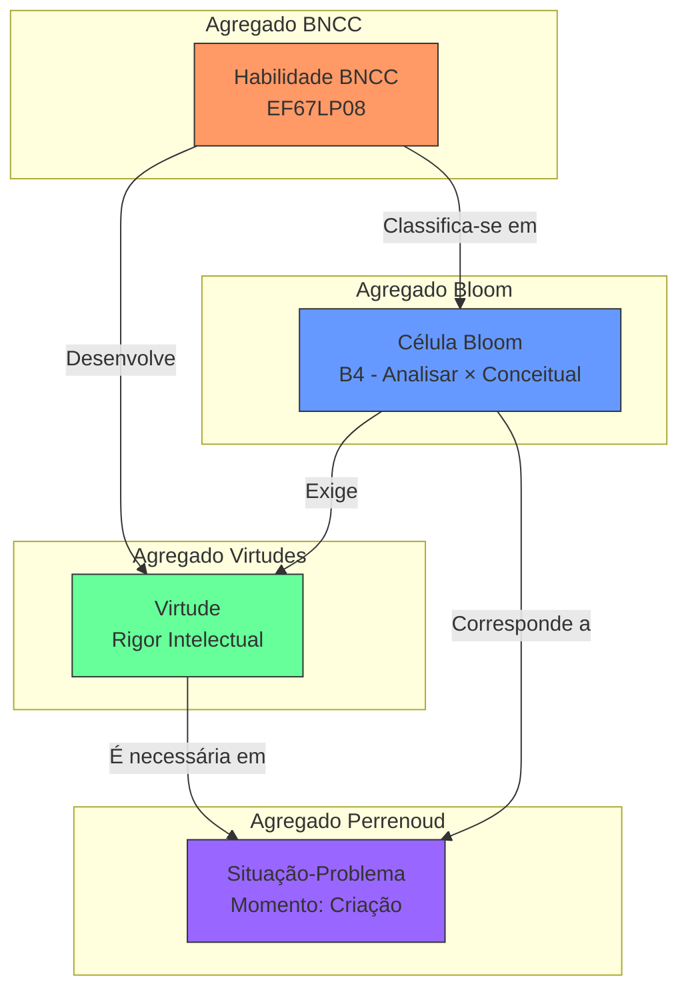
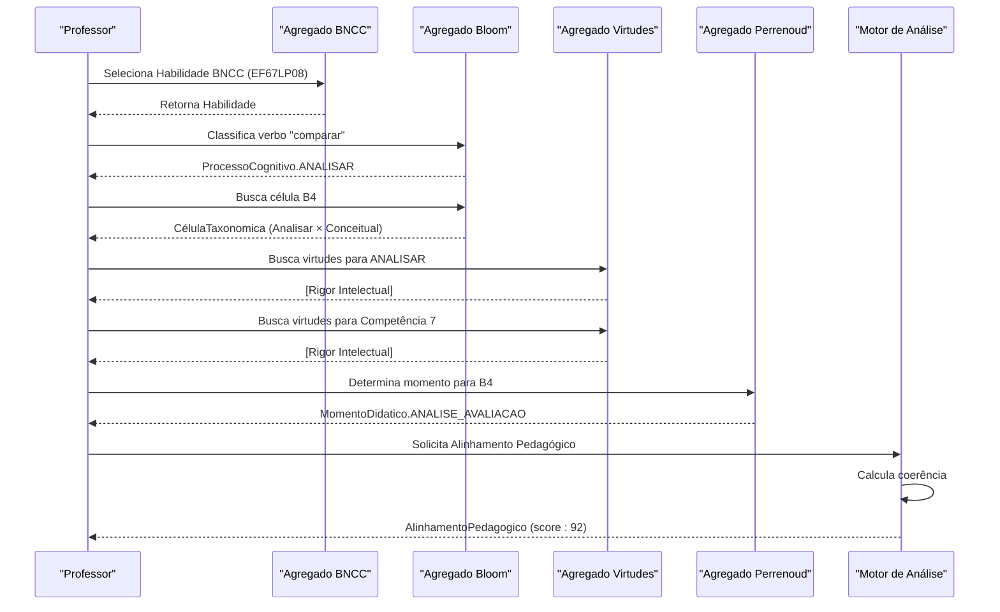

# Domínio Pedagógico

<cite>
**Arquivos Referenciados neste Documento**  
- [src/core/domain/README.md](file://src/core/domain/README.md)
- [src/core/domain/bncc/types.ts](file://src/core/domain/bncc/types.ts)
- [src/core/domain/bncc/repository.ts](file://src/core/domain/bncc/repository.ts)
- [src/core/domain/bloom/types.ts](file://src/core/domain/bloom/types.ts)
- [src/core/domain/bloom/repository.ts](file://src/core/domain/bloom/repository.ts)
- [src/core/domain/perrenoud/types.ts](file://src/core/domain/perrenoud/types.ts)
- [src/core/domain/perrenoud/repository.ts](file://src/core/domain/perrenoud/repository.ts)
- [src/core/domain/virtudes/types.ts](file://src/core/domain/virtudes/types.ts)
- [src/core/domain/virtudes/repository.ts](file://src/core/domain/virtudes/repository.ts)
- [src/core/domain/shared/types.ts](file://src/core/domain/shared/types.ts)
- [docs/fundamentos/COMPETENCIA_BNCC.md](file://docs/fundamentos/COMPETENCIA_BNCC.md)
- [docs/development/SPECS.md](file://docs/development/SPECS.md)
</cite>

## Sumário

1. [Introdução](#introdução)
2. [Arquitetura Baseada em DDD](#arquitetura-baseada-em-ddd)
3. [Agregado BNCC](#agregado-bncc)
4. [Agregado Bloom](#agregado-bloom)
5. [Agregado Perrenoud](#agregado-perrenoud)
6. [Agregado Virtudes](#agregado-virtudes)
7. [Mapeamentos Cruzados](#mapeamentos-cruzados)
8. [Integração dos Agregados](#integração-dos-agregados)
9. [Princípios de Design](#princípios-de-design)
10. [Consumo por Outras Camadas](#consumo-por-outras-camadas)

## Introdução

A camada de Domínio Pedagógico do VirtuQuest implementa os modelos teóricos
fundamentais que sustentam o sistema, seguindo rigorosamente os princípios do
**Design Orientado ao Domínio (DDD)**. Esta camada é o núcleo conceitual da
aplicação, responsável por representar com precisão as teorias pedagógicas que
orientam o planejamento e a avaliação educacional.

O domínio é organizado em quatro agregados principais, cada um representando um
framework teórico distinto:

- **BNCC**: Base Nacional Comum Curricular
- **Bloom**: Taxonomia Revisada de Bloom
- **Perrenoud**: Teoria das Competências
- **Virtudes**: Virtudes Intelectuais

Esses agregados não operam de forma isolada, mas estão interconectados por meio
de mapeamentos cruzados que permitem uma análise holística do alinhamento
pedagógico. A integração entre esses modelos forma a espinha dorsal do sistema,
permitindo que professores e gestores criem planos de aula coerentes,
progressivos e alinhados com as melhores práticas da educação contemporânea.

A implementação prioriza a imutabilidade, a segurança de tipos (Type Safety) e a
separação clara de responsabilidades, garantindo que a lógica de negócio
permaneça pura, previsível e alinhada com os fundamentos teóricos documentados
nos arquivos de especificação.

**Section sources**

- [src/core/domain/README.md](file://src/core/domain/README.md#L1-L435)

## Arquitetura Baseada em DDD

A arquitetura da camada de domínio segue os princípios do Design Orientado ao
Domínio (DDD), com uma estrutura clara e modular que reflete a complexidade do
domínio pedagógico. Cada agregado representa uma unidade coesa de modelagem,
encapsulando entidades, valor objetos, repositórios e lógica de negócio
específica.

A estrutura do diretório `src/core/domain` é organizada por agregados, com cada
um contendo seus próprios tipos, repositórios e utilitários:

```
src/core/domain/
├── bncc/                    # Agregado BNCC
├── bloom/                   # Agregado Bloom
├── perrenoud/               # Agregado Perrenoud
├── virtudes/                # Agregado Virtudes
├── shared/                  # Tipos Compartilhados
├── index.ts                 # Exportações centralizadas
└── README.md                # Documentação da camada
```

Cada agregado é responsável por uma dimensão específica do domínio:

- **BNCC**: Define os objetivos de aprendizagem e as competências curriculares
  oficiais.
- **Bloom**: Modela a complexidade cognitiva dos processos de aprendizagem.
- **Perrenoud**: Estrutura a progressão pedagógica através de
  situações-problema.
- **Virtudes**: Representa as disposições intelectuais que sustentam o
  pensamento crítico.

O módulo `shared` contém tipos e interfaces que são utilizados por múltiplos
agregados, como o `AlinhamentoPedagogico` e a `ValidacaoCoerencia`, promovendo a
consistência e evitando duplicação. O arquivo `index.ts` exporta todos os
agregados de forma centralizada, facilitando o consumo por outras camadas da
aplicação.

Esta arquitetura garante que a lógica de negócio permaneça isolada das camadas
de infraestrutura e apresentação, permitindo que o domínio evolua
independentemente das mudanças tecnológicas.



**Diagram sources**

- [src/core/domain/README.md](file://src/core/domain/README.md#L4-L435)

**Section sources**

- [src/core/domain/README.md](file://src/core/domain/README.md#L4-L435)

## Agregado BNCC

O agregado BNCC implementa a estrutura hierárquica da Base Nacional Comum
Curricular, fornecendo um modelo rico para representar competências e
habilidades curriculares. Este agregado é fundamental para garantir que o
planejamento pedagógico esteja alinhado com os diretrizes oficiais do Ministério
da Educação (MEC).

### Estrutura e Tipos

O modelo é organizado em uma hierarquia de quatro níveis:

1. **Competência Geral**: As 10 grandes competências que definem os direitos de
   aprendizagem.
2. **Competência Específica**: Desdobramentos das competências gerais por área
   de conhecimento.
3. **Habilidade**: Objetivos de aprendizagem expressos por verbos de ação.
4. **Objeto de Conhecimento**: Conteúdos curriculares associados às habilidades.

Os tipos principais são definidos no arquivo `types.ts`:

- `CompetenciaGeral`: Representa uma das 10 competências, com sua descrição e
  dimensões (conhecimentos, habilidades, atitudes, valores).
- `Habilidade`: Representa uma habilidade BNCC, identificada por um código único
  (ex: EF67LP08) e vinculada a uma competência específica.
- `HabilidadeDecomposta`: Resultado da decomposição automática de um código
  BNCC, extraindo etapa, anos, componente e sequência.

### Repositório e Funcionalidades

O repositório `repository.ts` fornece acesso imutável a um catálogo de dados
seed, incluindo as 10 competências gerais e habilidades exemplares. Ele oferece
métodos para consulta e validação:

- `getCompetenciaGeral(codigo)`: Busca uma competência geral pelo seu código
  numérico.
- `getHabilidade(codigo)`: Busca uma habilidade pelo seu código BNCC.
- `buscarHabilidades(query)`: Filtra habilidades por etapa, anos, componente ou
  texto.
- `validarCodigoBNCC(codigo)`: Valida se um código segue o padrão BNCC.

Um utilitário importante é o `decomposer.ts`, que permite decompor códigos BNCC
em seus componentes estruturais. Por exemplo, o código `EF67LP08` é decomposto
em:

- Etapa: Ensino Fundamental (EF)
- Anos: 6º e 7º ano
- Componente: Língua Portuguesa (LP)
- Sequência: 8ª habilidade

```mermaid
classDiagram
class CompetenciaGeral {
+id : string
+codigo : 1..10
+descricao : string
+dimensoes : {conhecimentos, habilidades, atitudes, valores}
}
class CompetenciaEspecifica {
+id : string
+competenciaGeralId : string
+areaConhecimento : AreaConhecimento
+descricao : string
}
class Habilidade {
+id : string
+codigo : string
+competenciaEspecificaId : string
+descricao : string
+objetosConhecimento : ObjetoConhecimento[]
+etapa : Etapa
+ano : string
+componente : string
+sequencia : number
}
class ObjetoConhecimento {
+id : string
+nome : string
+descricao : string
}
CompetenciaGeral "1" --> "n" CompetenciaEspecifica
CompetenciaEspecifica "1" --> "n" Habilidade
Habilidade "n" --> "n" ObjetoConhecimento
```

**Diagram sources**

- [src/core/domain/bncc/types.ts](file://src/core/domain/bncc/types.ts#L1-L223)
- [src/core/domain/bncc/repository.ts](file://src/core/domain/bncc/repository.ts#L1-L410)

**Section sources**

- [src/core/domain/bncc/types.ts](file://src/core/domain/bncc/types.ts#L1-L223)
- [src/core/domain/bncc/repository.ts](file://src/core/domain/bncc/repository.ts#L1-L410)
- [src/core/domain/bncc/decomposer.ts](file://src/core/domain/bncc/decomposer.ts#L1-L209)

### Exemplo de Uso

```typescript
import { catalogoBNCC, decomposeCodigoHabilidade } from '@/core/domain/bncc';

// Buscar competência geral
const comp = catalogoBNCC.getCompetenciaGeral(2);
console.log(comp?.descricao); // "Exercitar a curiosidade intelectual..."

// Decompor código de habilidade
const decomp = decomposeCodigoHabilidade('EF67LP08');
console.log(decomp.anos); // [6, 7]

// Buscar habilidades por filtros
const habilidades = catalogoBNCC.buscarHabilidades({
  etapa: Etapa.EF,
  anos: [6, 7],
  componente: 'LP',
});
```

## Agregado Bloom

O agregado Bloom implementa a Taxonomia de Bloom Revisada (Anderson & Krathwohl,
2001), um modelo bidimensional que combina processos cognitivos e tipos de
conhecimento. Este agregado é essencial para classificar a complexidade
cognitiva das atividades de aprendizagem.

### Estrutura Bidimensional

A taxonomia é organizada em uma matriz de 6×4, resultando em 24 células
taxonômicas distintas:

- **6 Processos Cognitivos** (hierarquia crescente de complexidade):
  1. **Lembrar**: Recuperar conhecimento da memória.
  2. **Entender**: Construir significado a partir de mensagens.
  3. **Aplicar**: Executar ou usar um procedimento.
  4. **Analisar**: Decompor material e determinar relações.
  5. **Avaliar**: Fazer julgamentos baseados em critérios.
  6. **Criar**: Reunir elementos para formar um todo coerente.
- **4 Tipos de Conhecimento**:
  - **Factual (A)**: Terminologia e fatos específicos.
  - **Conceitual (B)**: Classificações, princípios, teorias.
  - **Procedimental (C)**: Algoritmos, técnicas, métodos.
  - **Metacognitivo (D)**: Conhecimento sobre cognição.

Cada célula da matriz representa a interseção entre um processo cognitivo e um
tipo de conhecimento, como a célula B4 (Analisar × Conceitual), que envolve
comparar teorias ou diferenciar sistemas políticos.

### Repositório e Funcionalidades

O repositório `repository.ts` fornece acesso a uma matriz completa de 24
células, com exemplos contextualizados para a educação brasileira. Ele inclui
funcionalidades avançadas de análise:

- `identificarProcessoPorVerbo(verbo)`: Identifica o processo cognitivo a partir
  de um verbo (ex: "comparar" → Analisar).
- `validarProgressao(processos)`: Valida se uma sequência de processos
  cognitivos é lógica, detectando saltos muito grandes ou regressões.
- `calcularComplexidadeCognitiva(processos)`: Calcula um score de complexidade
  média para uma sequência de processos.

O arquivo `matriz.ts` contém a definição completa da matriz, com descrições,
exemplos e verbos característicos para cada célula. Um índice reverso de verbos
permite a classificação automática de habilidades BNCC em células Bloom.



**Diagram sources**

- [src/core/domain/bloom/types.ts](file://src/core/domain/bloom/types.ts#L1-L256)
- [src/core/domain/bloom/repository.ts](file://src/core/domain/bloom/repository.ts#L1-L175)

**Section sources**

- [src/core/domain/bloom/types.ts](file://src/core/domain/bloom/types.ts#L1-L256)
- [src/core/domain/bloom/repository.ts](file://src/core/domain/bloom/repository.ts#L1-L175)
- [src/core/domain/bloom/matriz.ts](file://src/core/domain/bloom/matriz.ts#L1-L505)

### Exemplo de Uso

```typescript
import {
  catalogoBloom,
  ProcessoCognitivo,
  TipoConhecimento,
} from '@/core/domain/bloom';

// Buscar célula específica
const celula = catalogoBloom.getCelula(
  ProcessoCognitivo.ANALISAR,
  TipoConhecimento.CONCEITUAL
);
console.log(celula?.descricao); // "Analisar relações entre conceitos, princípios e teorias"

// Identificar processo por verbo
const processo = catalogoBloom.identificarProcessoPorVerbo('comparar');
console.log(processo); // ProcessoCognitivo.ANALISAR

// Validar progressão
const { valida, problemas } = catalogoBloom.validarProgressao([
  ProcessoCognitivo.LEMBRAR,
  ProcessoCognitivo.ENTENDER,
  ProcessoCognitivo.CRIAR, // Salto muito grande!
]);
console.log(valida); // false
```

## Agregado Perrenoud

O agregado Perrenoud implementa a teoria das competências de Philippe Perrenoud,
que define competência como a capacidade de mobilizar recursos cognitivos em
situações-problema autênticas. Este agregado estrutura a progressão pedagógica
em torno de situações desafiadoras.

### Conceitos-Chave

A teoria de Perrenoud é baseada em quatro conceitos fundamentais:

- **Competência**: A capacidade de mobilizar recursos (conhecimentos,
  habilidades, atitudes, valores) para resolver uma família de
  situações-problema.
- **Situação-Problema**: Um contexto autêntico que exige a mobilização de
  recursos cognitivos, caracterizado por sua complexidade, abertura e
  autenticidade.
- **Recursos Cognitivos**: Os elementos que são mobilizados, categorizados como
  conhecimentos, habilidades, atitudes ou valores.
- **Esquemas de Mobilização**: Padrões de ação cognitiva que guiam a resolução
  de problemas.

A progressão pedagógica ocorre em quatro momentos didáticos:

1. **Apropriação**: Contato inicial com os recursos.
2. **Aplicação Guiada**: Prática com suporte do professor.
3. **Análise/Avaliação**: Reflexão sobre a própria prática.
4. **Criação**: Transferência e autonomia na resolução de problemas.

### Tipos e Estrutura

Os tipos principais são definidos em `types.ts`:

- `SituacaoProblema`: Representa uma situação-problema, com seu contexto,
  enunciado, complexidade e momento didático.
- `Competencia`: Representa uma competência, com seus recursos, famílias de
  situações e esquemas de mobilização.
- `ProgressaoPerrenoud`: Representa uma sequência de momentos didáticos com
  situações-problema.

O repositório `repository.ts` foi implementado com dados seed completos,
fornecendo acesso a um catálogo de competências, situações-problema, esquemas de
mobilização e recursos cognitivos exemplares. O repositório é um singleton
imutável que permite consultas eficientes.

**Section sources**

- [src/core/domain/perrenoud/types.ts](file://src/core/domain/perrenoud/types.ts#L1-L232)
- [src/core/domain/perrenoud/repository.ts](file://src/core/domain/perrenoud/repository.ts#L28-L571)

### Repositório e Funcionalidades

O repositório `CatalogoPerrenoudRepository` fornece acesso a uma base de dados
rica e estruturada, com métodos para consulta e análise:

- `getCompetencia(id)`: Busca uma competência pelo seu ID.
- `listarCompetencias()`: Retorna todas as competências disponíveis.
- `buscarCompetenciasPorTransferibilidade(transferibilidade)`: Filtra
  competências por nível de transferibilidade.
- `buscarCompetenciasPorComplexidade(min, max)`: Filtra competências por faixa
  de complexidade cognitiva.
- `getSituacaoProblema(id)`: Busca uma situação-problema pelo seu ID.
- `listarSituacoesProblema()`: Retorna todas as situações-problema disponíveis.
- `buscarSituacoesPorCompetencia(competenciaId)`: Encontra todas as
  situações-problema associadas a uma competência.
- `buscarSituacoesPorMomento(momento)`: Filtra situações-problema por momento
  didático.
- `getEsquemaMobilizacao(id)`: Busca um esquema de mobilização pelo seu ID.
- `listarEsquemasMobilizacao()`: Retorna todos os esquemas de mobilização
  disponíveis.
- `getRecursoCognitivo(id)`: Busca um recurso cognitivo pelo seu ID.
- `listarRecursosCognitivos()`: Retorna todos os recursos cognitivos
  disponíveis.
- `getRecursosNecessarios(competenciaId)`: Identifica os recursos cognitivos
  necessários para uma competência.
- `getEsquemasAplicaveis(contexto)`: Encontra esquemas de mobilização aplicáveis
  a um contexto específico.

O catálogo inclui três competências exemplares:

- **Competência de Leitura Crítica**: Mobiliza recursos para compreender,
  analisar criticamente e avaliar textos.
- **Competência de Investigação Científica**: Mobiliza o método científico para
  investigar fenômenos e validar hipóteses.
- **Competência de Colaboração Efetiva**: Mobiliza habilidades sociais e
  cognitivas para trabalhar em equipe na resolução de problemas.

Cada competência está associada a situações-problema exemplares, esquemas de
mobilização e recursos cognitivos específicos, formando um ecossistema rico para
o planejamento pedagógico.



**Diagram sources**

- [src/core/domain/perrenoud/types.ts](file://src/core/domain/perrenoud/types.ts#L1-L232)
- [src/core/domain/perrenoud/repository.ts](file://src/core/domain/perrenoud/repository.ts#L28-L571)

### Exemplo de Uso

```typescript
import { catalogoPerrenoud, MomentoDidatico } from '@/core/domain/perrenoud';

// Buscar competência
const competencia = catalogoPerrenoud.getCompetencia('comp-leitura-critica');
console.log(competencia?.nome); // "Competência de Leitura Crítica"

// Listar todas as situações-problema
const situacoes = catalogoPerrenoud.listarSituacoesProblema();
console.log(situacoes.length); // 5

// Buscar situações por momento didático
const situacoesCriacao = catalogoPerrenoud.buscarSituacoesPorMomento('criacao');
console.log(situacoesCriacao.length); // 3

// Buscar recursos necessários para uma competência
const recursos = catalogoPerrenoud.getRecursosNecessarios(
  'comp-investigacao-cientifica'
);
console.log(recursos.map((r) => r.descricao)); // ['Conceitos fundamentais de matemática', 'Método científico de investigação', ...]

// Buscar esquemas aplicáveis a um contexto
const esquemas = catalogoPerrenoud.getEsquemasAplicaveis('leitura acadêmica');
console.log(esquemas.map((e) => e.nome)); // ['Esquema de Leitura Analítica']
```

## Agregado Virtudes

O agregado Virtudes implementa seis virtudes intelectuais core que são
essenciais para o desenvolvimento do pensamento crítico e do caráter
intelectual. Este agregado complementa os modelos cognitivos com uma dimensão
ética e disposicional.

### As Seis Virtudes Core

As virtudes são categorizadas em três tipos:

- **Epistêmicas** (relacionadas ao conhecimento):
  - **Curiosidade Intelectual**: Disposição para buscar conhecimento e fazer
    perguntas investigativas.
  - **Rigor Intelectual**: Compromisso com precisão, evidências e raciocínio
    lógico.
- **Morais** (relacionadas à ética intelectual):
  - **Humildade Intelectual**: Reconhecimento dos limites do próprio
    conhecimento.
- **Práticas** (relacionadas à ação):
  - **Coragem Intelectual**: Disposição para defender ideias fundamentadas.
  - **Autonomia Intelectual**: Capacidade de pensar e agir independentemente.
  - **Perseverança**: Persistência diante de desafios cognitivos.

Cada virtude é definida por sua **definição teórica**, **indicadores
observáveis** (comportamentos que evidenciam a virtude) e **níveis de
desenvolvimento** (inicial, intermediário, avançado).

### Mapeamento com Outros Modelos

O agregado estabelece mapeamentos explícitos com os outros agregados:

- **Com Bloom**: Define quais processos cognitivos mobilizam cada virtude (ex:
  Criar mobiliza Coragem e Autonomia).
- **Com BNCC**: Vincula cada virtude a uma ou mais competências gerais da BNCC
  (ex: Rigor Intelectual → Competência 7).

O repositório `repository.ts` fornece métodos para consultar virtudes por
categoria, processo Bloom ou competência BNCC, facilitando a integração com o
planejamento pedagógico.

```mermaid
classDiagram
class CategoriaVirtude {
<<enum>>
EPISTEMICA
MORAL
PRATICA
}
class NivelDesenvolvimento {
<<enum>>
INICIAL
INTERMEDIARIO
AVANCADO
}
class VirtudeIntelectual {
+id : string
+nome : string
+categoria : CategoriaVirtude
+definicao : string
+indicadores : IndicadorVirtude[]
+processosBloomRelacionados : ProcessoCognitivo[]
+competenciasBNCCRelacionadas : number[]
+nivelDesenvolvimento : {inicial, intermediario, avancado}
}
class IndicadorVirtude {
+id : string
+virtudeId : string
+descricao : string
+evidencias : string[]
+situacoesExemplo : string[]
+nivelEsperado : NivelDesenvolvimento
}
VirtudeIntelectual "1" --> "n" IndicadorVirtude
VirtudeIntelectual --> CategoriaVirtude
IndicadorVirtude --> NivelDesenvolvimento
```

**Diagram sources**

- [src/core/domain/virtudes/types.ts](file://src/core/domain/virtudes/types.ts#L1-L178)
- [src/core/domain/virtudes/repository.ts](file://src/core/domain/virtudes/repository.ts#L1-L317)

**Section sources**

- [src/core/domain/virtudes/types.ts](file://src/core/domain/virtudes/types.ts#L1-L178)
- [src/core/domain/virtudes/repository.ts](file://src/core/domain/virtudes/repository.ts#L1-L317)

### Exemplo de Uso

```typescript
import { catalogoVirtudes, ProcessoCognitivo } from '@/core/domain/virtudes';

// Listar virtudes por processo Bloom
const virtudes = catalogoVirtudes.listarVirtudesPorProcessoBloom(
  ProcessoCognitivo.CRIAR
);
console.log(virtudes.map((v) => v.nome)); // ['Coragem Intelectual', 'Autonomia Intelectual']

// Listar virtudes por competência BNCC
const virtudesComp = catalogoVirtudes.listarVirtudesPorCompetenciaBNCC(2);
console.log(virtudesComp.map((v) => v.nome)); // ['Curiosidade Intelectual']
```

## Mapeamentos Cruzados

A verdadeira força do domínio pedagógico reside nos mapeamentos cruzados entre
os quatro agregados. Esses mapeamentos permitem uma análise multidimensional do
alinhamento pedagógico, transformando o sistema de um simples repositório de
dados em uma ferramenta de inteligência pedagógica.

### Regra de Progressão Bloom → Perrenoud

A integração mais significativa é a **Regra de Progressão Bloom → Perrenoud**,
que estabelece uma correspondência direta entre a complexidade cognitiva de
Bloom e os momentos didáticos de Perrenoud:

| Processo Cognitivo (Bloom) | Complexidade Situacional        | Momento Didático (Perrenoud) |
| :------------------------- | :------------------------------ | :--------------------------- |
| Lembrar, Entender (1-2)    | Simples, Estruturada            | Apropriação                  |
| Aplicar, Analisar (3-4)    | Intermediária, Semi-estruturada | Aplicação Guiada / Análise   |
| Avaliar, Criar (5-6)       | Complexa, Aberta                | Criação                      |

Esta regra garante que atividades de baixa complexidade cognitiva (como lembrar
fatos) sejam usadas no momento de apropriação, enquanto atividades de alta
complexidade (como criar soluções) sejam reservadas para o momento de criação e
transferência.

### Mapeamento Virtudes ↔ BNCC e Bloom

As virtudes intelectuais atuam como um "tecido" que conecta os modelos
cognitivos (Bloom) e curriculares (BNCC). Cada virtude é explicitamente
vinculada a:

- **Processos Bloom**: Quais operações cognitivas a virtude sustenta (ex:
  Humildade Intelectual é necessária para Avaliar).
- **Competências BNCC**: Qual direito de aprendizagem a virtude desenvolve (ex:
  Coragem Intelectual é essencial para a Competência 10).

Este mapeamento permite que o sistema recomende virtudes a serem desenvolvidas
com base na habilidade BNCC selecionada ou no processo cognitivo alvo.

### Alinhamento Pedagógico

O tipo `AlinhamentoPedagogico` no módulo `shared` é a peça central que sintetiza
todos os mapeamentos. Ele representa a coerência entre as três dimensões:

```typescript
interface AlinhamentoPedagogico {
  habilidadesBNCC: string[]; // Ex: ['EF67LP08']
  celulasBloom: string[]; // Ex: ['B4', 'B5']
  virtudes: string[]; // Ex: ['RIGOR_INTELECTUAL']
  coerenciaVertical: number; // Coerência dentro de cada dimensão
  coerenciaHorizontal: number; // Coerência entre as dimensões
  gaps: string[]; // Lacunas identificadas
  recomendacoes: string[]; // Sugestões de melhoria
}
```

Um plano de aula bem alinhado terá uma alta pontuação de coerência horizontal,
indicando que a habilidade BNCC, o processo cognitivo Bloom e a virtude
intelectual estão harmoniosamente integrados.



**Diagram sources**

- [src/core/domain/shared/types.ts](file://src/core/domain/shared/types.ts#L1-L175)
- [docs/development/SPECS.md](file://docs/development/SPECS.md#L2471-L2534)

**Section sources**

- [src/core/domain/shared/types.ts](file://src/core/domain/shared/types.ts#L1-L175)
- [docs/development/SPECS.md](file://docs/development/SPECS.md#L2471-L2534)
- [docs/fundamentos/CONTINUUM_PEDAGOGICO.md](file://docs/fundamentos/CONTINUUM_PEDAGOGICO.md#L68-L95)

## Integração dos Agregados

Os quatro agregados se integram para formar o núcleo do sistema, criando um
ecossistema pedagógico coerente e progressivo. O fluxo típico de integração
começa com a seleção de uma **Habilidade BNCC**, que serve como âncora para todo
o planejamento.

1. **Classificação em Bloom**: A partir da habilidade BNCC, o sistema identifica
   o verbo nuclear (ex: "comparar") e o classifica em uma célula da matriz Bloom
   (ex: B4 - Analisar × Conceitual).
2. **Determinação do Momento Perrenoud**: Com base na complexidade cognitiva da
   célula Bloom, o sistema determina o momento didático apropriado (ex: Analisar
   → Momento de Análise/Avaliação).
3. **Identificação de Virtudes**: O sistema consulta quais virtudes intelectuais
   são mobilizadas pelo processo cognitivo (ex: Analisar → Rigor Intelectual) e
   pela competência BNCC (ex: Competência 7 → Rigor Intelectual).
4. **Geração de Situações-Problema**: Com base no momento didático e na
   complexidade, o sistema pode sugerir ou gerar situações-problema apropriadas.
5. **Validação de Alinhamento**: O sistema calcula um score de alinhamento
   pedagógico, verificando a coerência entre todos os elementos.

Essa integração permite que o sistema vá além da simples recomendação de
conteúdos, oferecendo um planejamento pedagógico verdadeiramente inteligente,
que considera a complexidade cognitiva, a progressão didática e o
desenvolvimento do caráter intelectual do aluno.



**Diagram sources**

- [src/core/domain/README.md](file://src/core/domain/README.md#L4-L435)
- [src/core/domain/shared/types.ts](file://src/core/domain/shared/types.ts#L1-L175)

**Section sources**

- [src/core/domain/README.md](file://src/core/domain/README.md#L4-L435)
- [src/core/domain/shared/types.ts](file://src/core/domain/shared/types.ts#L1-L175)

## Princípios de Design

A implementação do domínio pedagógico segue cinco princípios de design
fundamentais que garantem sua robustez, manutenibilidade e fidelidade aos
fundamentos teóricos:

1. **Imutabilidade**: Todos os tipos são declarados como `readonly`, e os
   repositórios são instâncias singleton que não modificam seus dados após a
   inicialização. Isso garante que a lógica de negócio seja previsível e livre
   de efeitos colaterais.
2. **Separação de Responsabilidades**: Cada agregado tem uma responsabilidade
   única e bem definida. O módulo `shared` contém apenas tipos que são
   verdadeiramente compartilhados, evitando dependências circulares.
3. **Alinhamento Teórico**: Todos os dados seed e as regras de negócio são
   baseados em fundamentos pedagógicos documentados. As referências teóricas são
   explicitamente citadas nos comentários do código.
4. **Segurança de Tipos (Type Safety)**: O uso rigoroso do TypeScript, com enums
   literais e validações em tempo de execução, minimiza erros de digitação e
   garante que os dados estejam sempre em um estado válido.
5. **Extensibilidade**: A estrutura está preparada para expansão, com hooks para
   validadores completos, mappers automáticos e um catálogo BNCC completo, que
   podem ser implementados em fases futuras.

Esses princípios asseguram que a camada de domínio seja não apenas funcional,
mas também uma representação fiel e evolutiva do conhecimento pedagógico.

**Section sources**

- [src/core/domain/README.md](file://src/core/domain/README.md#L4-L435)

## Consumo por Outras Camadas

A camada de domínio é consumida por várias outras camadas da aplicação,
principalmente pelos componentes de UI e pelos serviços de análise.

### Editor de Planos

O editor de planos utiliza os catálogos para fornecer uma experiência de seleção
rica:

```typescript
import {
  catalogoBNCC,
  catalogoBloom,
  catalogoPerrenoud,
  catalogoVirtudes,
} from '@/core/domain';

// Buscar habilidades para seleção
const habilidades = catalogoBNCC.buscarHabilidades({
  etapa: Etapa.EF,
  anos: [6, 7],
});

// Classificar habilidade em Bloom
const processo = catalogoBloom.identificarProcessoPorVerbo(
  habilidade.descricao
);

// Identificar virtudes mobilizadas
const virtudes = catalogoVirtudes.listarVirtudesPorProcessoBloom(processo);

// Buscar situações-problema para o momento de criação
const situacoes = catalogoPerrenoud.buscarSituacoesPorMomento('criacao');
```

### Motor de Análise

O motor de análise utiliza o tipo `AlinhamentoPedagogico` para validar planos:

```typescript
import type { AlinhamentoPedagogico } from '@/core/domain/shared';

function analisarPlano(plano: Plano): AlinhamentoPedagogico {
  // Usa os catálogos para validar coerência
  return {
    habilidadesBNCC: plano.habilidades.map((h) => h.codigo),
    celulasBloom: plano.atividades.map((a) => a.celulaBloom),
    virtudes: plano.virtudes.map((v) => v.id),
    coerenciaVertical: calcularCoerenciaVertical(plano),
    coerenciaHorizontal: calcularCoerenciaHorizontal(plano),
    gaps: [],
    recomendacoes: [],
  };
}
```

### Store Zustand

A store do Zustand armazena referências aos objetos do domínio:

```typescript
import type {
  Habilidade,
  VirtudeIntelectual,
  SituacaoProblema,
} from '@/core/domain';

interface PlannerState {
  habilidadesSelecionadas: Habilidade[];
  virtudesDesenvolver: VirtudeIntelectual[];
  situacoesProblema: SituacaoProblema[];
  // ...
}
```

**Section sources**

- [src/core/domain/README.md](file://src/core/domain/README.md#L4-L435)
