# Esquemas de Validação do Planejador

<cite>
**Arquivos Referenciados neste Documento**  
- [src/lib/schemas/planner-schemas.ts](file://src/lib/schemas/planner-schemas.ts)
- [src/core/domain/bloom/types.ts](file://src/core/domain/bloom/types.ts)
- [src/core/domain/bncc/types.ts](file://src/core/domain/bncc/types.ts)
- [src/core/domain/shared/types.ts](file://src/core/domain/shared/types.ts)
- [src/core/infrastructure/n8n/types.ts](file://src/core/infrastructure/n8n/types.ts)
- [src/types/planner.ts](file://src/types/planner.ts)
</cite>

## Sumário

1. [Introdução](#introdução)
2. [Estrutura dos Esquemas](#estrutura-dos-esquemas)
3. [Regras Pedagógicas Implementadas](#regras-pedagógicas-implementadas)
4. [Mensagens de Erro e Feedback](#mensagens-de-erro-e-feedback)
5. [Padrões de Uso](#padrões-de-uso)
6. [Exemplos Práticos](#exemplos-práticos)
7. [Solução de Problemas](#solução-de-problemas)
8. [Conclusão](#conclusão)

## Introdução

Os esquemas de validação do planejador são a espinha dorsal do sistema de
planejamento pedagógico, garantindo que todos os planos de aula criados estejam
alinhados com fundamentos educacionais rigorosos. Implementados com a biblioteca
Zod, esses esquemas validam não apenas a integridade técnica dos dados, mas
também a coerência pedagógica dos planos, integrando conceitos da Taxonomia de
Bloom, BNCC, virtudes intelectuais e teoria de Perrenoud.

O principal arquivo de esquemas, localizado em
`src/lib/schemas/planner-schemas.ts`, define uma estrutura hierárquica completa
que abrange todos os aspectos do planejamento pedagógico, desde metadados
básicos até estratégias de avaliação e reflexão metacognitiva.

**Section sources**

- [src/lib/schemas/planner-schemas.ts](file://src/lib/schemas/planner-schemas.ts#L1-L50)

## Estrutura dos Esquemas

A arquitetura dos esquemas de validação é modular e hierárquica, composta por
esquemas menores que são compostos para formar o esquema completo do plano de
aula.

### Esquema Principal

O esquema principal, `planoAulaIntegradoSchema`, é um objeto Zod que combina
todos os componentes do planejamento:

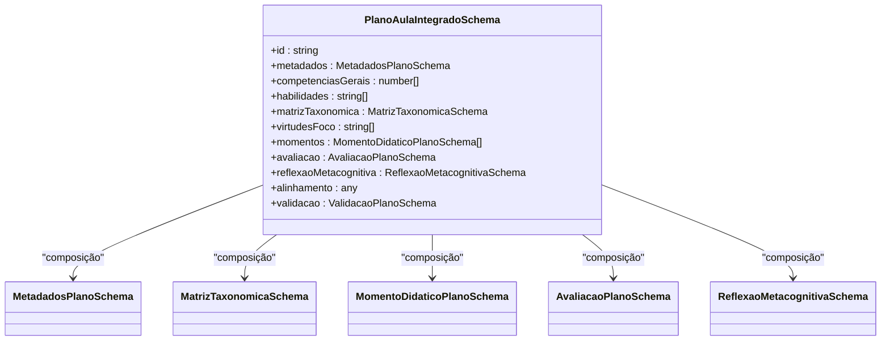

**Diagram sources**

- [src/lib/schemas/planner-schemas.ts](file://src/lib/schemas/planner-schemas.ts#L278-L377)

### Esquemas Complementares

Cada componente do plano tem seu próprio esquema de validação:

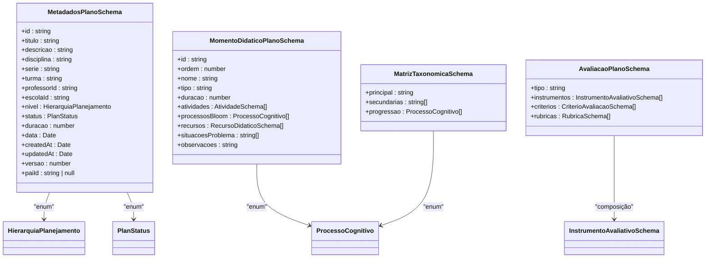

**Diagram sources**

- [src/lib/schemas/planner-schemas.ts](file://src/lib/schemas/planner-schemas.ts#L22-L119)
- [src/lib/schemas/planner-schemas.ts](file://src/lib/schemas/planner-schemas.ts#L186-L205)
- [src/lib/schemas/planner-schemas.ts](file://src/lib/schemas/planner-schemas.ts#L219-L225)
- [src/core/domain/bloom/types.ts](file://src/core/domain/bloom/types.ts#L18-L31)
- [src/core/domain/shared/types.ts](file://src/core/domain/shared/types.ts#L18-L29)
- [src/core/infrastructure/n8n/types.ts](file://src/core/infrastructure/n8n/types.ts#L60-L66)

### Esquemas de Operação

Além do esquema completo, existem esquemas especializados para operações
específicas:

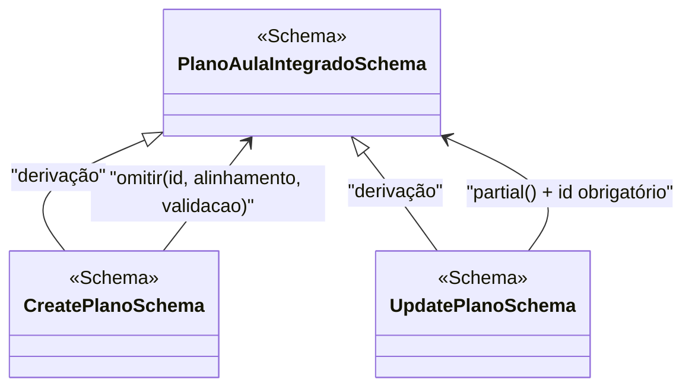

**Diagram sources**

- [src/lib/schemas/planner-schemas.ts](file://src/lib/schemas/planner-schemas.ts#L382-L393)

## Regras Pedagógicas Implementadas

Os esquemas incorporam regras pedagógicas fundamentais que garantem a qualidade
e coerência dos planos de aula.

### Validação de Duração

A duração total do plano deve corresponder à soma das durações dos momentos
didáticos, com uma tolerância de 5 minutos:

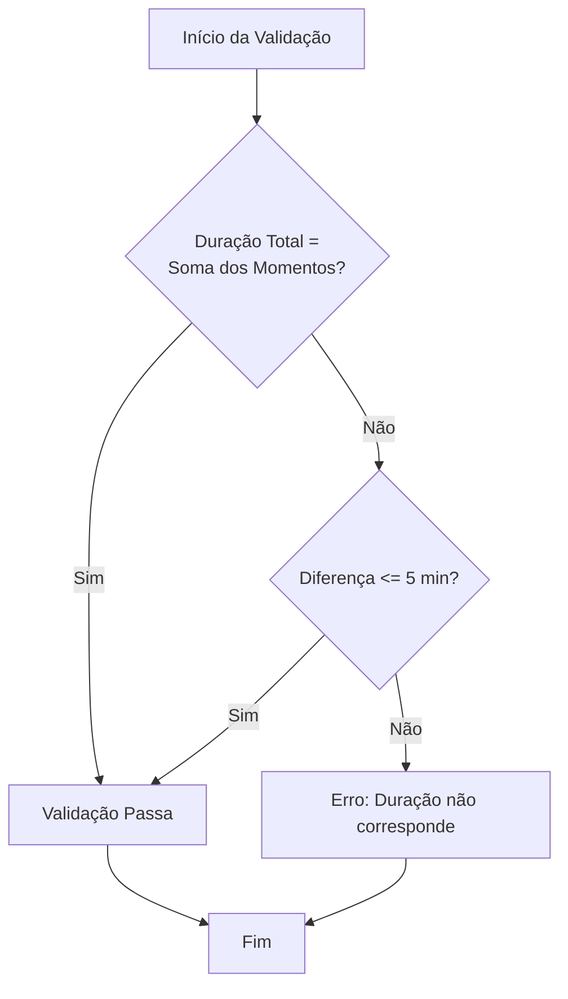

**Diagram sources**

- [src/lib/schemas/planner-schemas.ts](file://src/lib/schemas/planner-schemas.ts#L335-L346)

### Progressão de Bloom

A progressão cognitiva não pode regredir, garantindo que os processos cognitivos
avancem do mais simples (Lembrar) ao mais complexo (Criar):

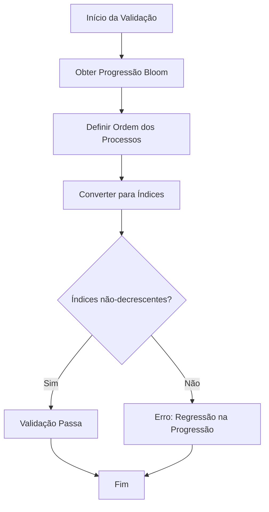

**Diagram sources**

- [src/lib/schemas/planner-schemas.ts](file://src/lib/schemas/planner-schemas.ts#L358-L375)

### Ordenação de Momentos

Os momentos didáticos devem estar em ordem crescente de acordo com sua sequência
na aula:

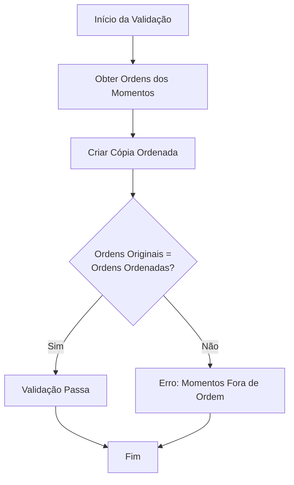

**Diagram sources**

- [src/lib/schemas/planner-schemas.ts](file://src/lib/schemas/planner-schemas.ts#L348-L356)

### Pesos de Instrumentos

A soma dos pesos dos instrumentos avaliativos deve ser exatamente 100%:

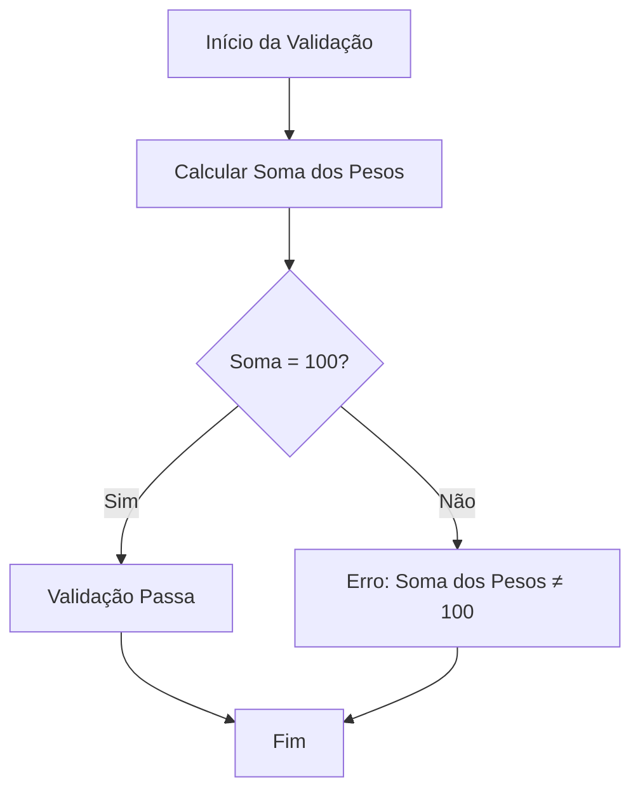

**Diagram sources**

- [src/lib/schemas/planner-schemas.ts](file://src/lib/schemas/planner-schemas.ts#L198-L204)

## Mensagens de Erro e Feedback

As mensagens de erro são projetadas para serem pedagogicamente úteis, fornecendo
orientações claras para correção.

### Estrutura de Mensagens

O objeto `mensagensErro` centraliza todas as mensagens de erro com descrições
pedagógicas:

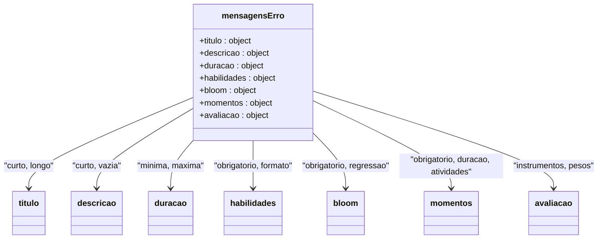

**Diagram sources**

- [src/lib/schemas/planner-schemas.ts](file://src/lib/schemas/planner-schemas.ts#L402-L433)

### Exemplos de Mensagens

As mensagens são formuladas para orientar o professor sobre como melhorar o
plano:

- **Título curto**: "O título deve ser descritivo e ter pelo menos 3
  caracteres."
- **Regressão Bloom**: "A progressão cognitiva está regredindo. Organize do mais
  simples (LEMBRAR) ao mais complexo (CRIAR)."
- **Soma de pesos**: "A soma dos pesos dos instrumentos deve ser 100."

Essas mensagens são integradas diretamente nos esquemas Zod e aparecem nos
formulários quando as validações falham.

**Section sources**

- [src/lib/schemas/planner-schemas.ts](file://src/lib/schemas/planner-schemas.ts#L402-L433)

## Padrões de Uso

Os esquemas de validação são utilizados em diferentes contextos do sistema.

### Criação de Planos

Para criação de novos planos, utiliza-se o esquema `createPlanoSchema`, que
omite campos gerados pelo sistema:

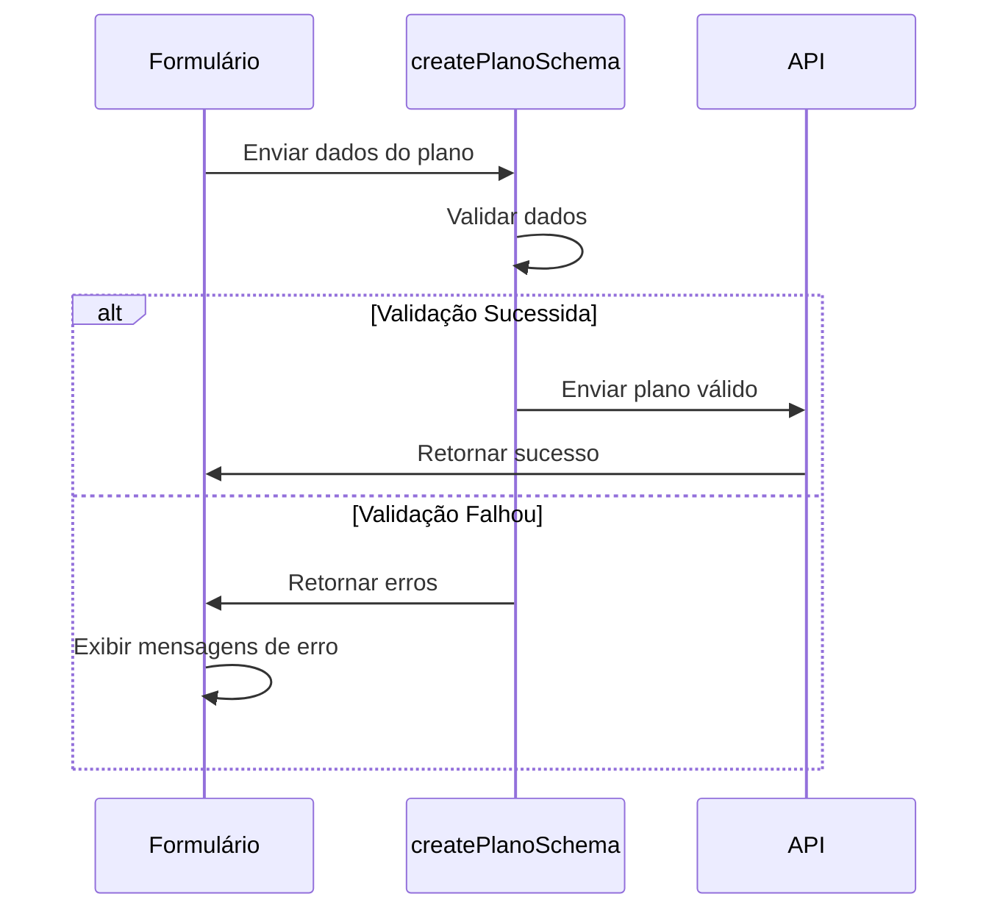

**Diagram sources**

- [src/lib/schemas/planner-schemas.ts](file://src/lib/schemas/planner-schemas.ts#L382-L386)

### Atualização de Planos

Para atualização de planos existentes, utiliza-se o esquema `updatePlanoSchema`,
que permite atualizações parciais:

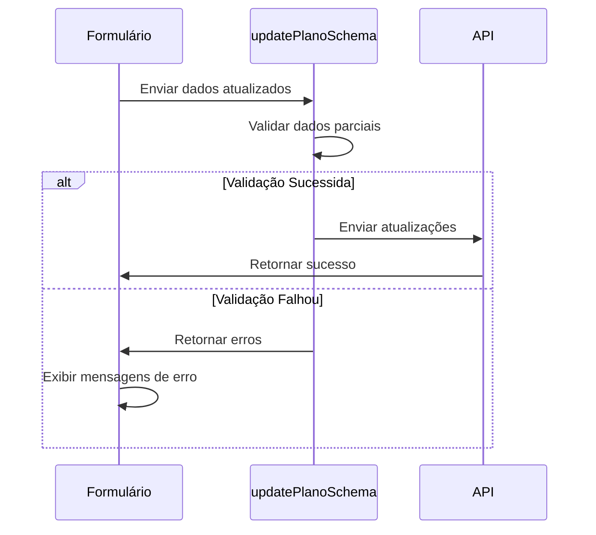

**Diagram sources**

- [src/lib/schemas/planner-schemas.ts](file://src/lib/schemas/planner-schemas.ts#L391-L393)

### Validação Completa

O esquema completo é utilizado para validação final antes da aprovação do plano:

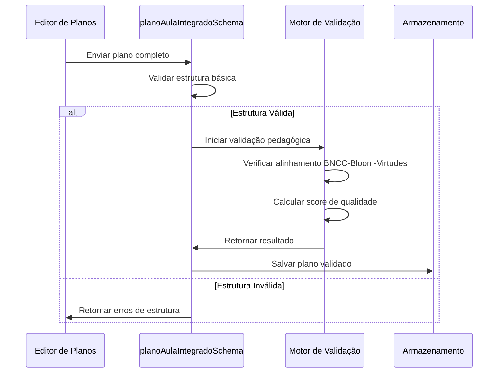

**Section sources**

- [src/lib/schemas/planner-schemas.ts](file://src/lib/schemas/planner-schemas.ts#L278-L377)

## Exemplos Práticos

### Exemplo de Plano Válido

```typescript
const planoValido = {
  id: '123e4567-e89b-12d3-a456-426614174000',
  metadados: {
    titulo: 'Introdução ao Sistema Solar',
    descricao: 'Explorar os planetas do sistema solar e suas características',
    disciplina: 'Ciências',
    serie: '6º ano',
    turma: '6º A',
    professorId: 'prof-001',
    escolaId: 'esc-001',
    nivel: 'aula',
    status: 'rascunho',
    duracao: 90,
    data: '2024-01-15',
    createdAt: '2024-01-10',
    updatedAt: '2024-01-10',
    versao: 1,
    paiId: null,
  },
  competenciasGerais: [1, 2],
  habilidades: ['EF06CI11', 'EF06CI12'],
  matrizTaxonomica: {
    principal: 'B4',
    secundarias: ['B3'],
    progressao: ['ENTENDER', 'APLICAR', 'ANALISAR'],
  },
  virtudesFoco: ['RIGOR_INTELECTUAL', 'CURIOSIDADE_INTELECTUAL'],
  momentos: [
    {
      id: 'm1',
      ordem: 0,
      nome: 'Apropriação',
      tipo: 'apropriacao',
      duracao: 30,
      atividades: [
        {
          id: 'a1',
          nome: 'Apresentação multimídia',
          descricao: 'Vídeo sobre o sistema solar',
          duracao: 30,
          tipo: 'coletiva',
          processosBloom: ['ENTENDER'],
          recursos: [],
          instrucoes: '',
        },
      ],
      processosBloom: ['ENTENDER'],
      recursos: [],
      situacoesProblema: [],
      observacoes: '',
    },
    {
      id: 'm2',
      ordem: 1,
      nome: 'Aplicação Guiada',
      tipo: 'aplicacao_guiada',
      duracao: 30,
      atividades: [
        {
          id: 'a2',
          nome: 'Modelagem do sistema solar',
          descricao: 'Construir modelo em escala',
          duracao: 30,
          tipo: 'grupo',
          processosBloom: ['APLICAR'],
          recursos: [],
          instrucoes: '',
        },
      ],
      processosBloom: ['APLICAR'],
      recursos: [],
      situacoesProblema: [],
      observacoes: '',
    },
    {
      id: 'm3',
      ordem: 2,
      nome: 'Análise e Avaliação',
      tipo: 'analise_avaliacao',
      duracao: 30,
      atividades: [
        {
          id: 'a3',
          nome: 'Comparação de planetas',
          descricao: 'Analisar semelhanças e diferenças',
          duracao: 30,
          tipo: 'grupo',
          processosBloom: ['ANALISAR'],
          recursos: [],
          instrucoes: '',
        },
      ],
      processosBloom: ['ANALISAR'],
      recursos: [],
      situacoesProblema: [],
      observacoes: '',
    },
  ],
  avaliacao: {
    tipo: 'formativa',
    instrumentos: [
      {
        id: 'i1',
        tipo: 'observacao',
        descricao: 'Observação da participação',
        peso: 40,
        criterios: ['Participação', 'Colaboração'],
        processosBloom: ['ANALISAR'],
      },
      {
        id: 'i2',
        tipo: 'trabalho',
        descricao: 'Relatório do modelo',
        peso: 60,
        criterios: ['Precisão', 'Organização'],
        processosBloom: ['APLICAR', 'ANALISAR'],
      },
    ],
    criterios: [],
    rubricas: [],
  },
  reflexaoMetacognitiva: {
    objetivosMetacognitivos: ['Como aprendi sobre os planetas?'],
    estrategiasAutoavaliacao: ['Lista de verificação'],
    momentosReflexao: [2],
  },
  alinhamento: {}, // Preenchido pelo motor
  validacao: {}, // Preenchido pelo motor
};
```

Este plano é válido porque:

- A duração total (90 minutos) corresponde à soma dos momentos (30+30+30)
- Os momentos estão em ordem crescente (0, 1, 2)
- A progressão Bloom avança de ENTENDER → APLICAR → ANALISAR (sem regressão)
- A soma dos pesos dos instrumentos de avaliação é 100% (40+60)

**Section sources**

- [src/lib/schemas/planner-schemas.ts](file://src/lib/schemas/planner-schemas.ts#L278-L377)

### Exemplo de Plano Inválido

```typescript
const planoInvalido = {
  // ... metadados válidos
  duracao: 90,
  momentos: [
    {
      ordem: 1,
      duracao: 40,
      // ... atividades
    },
    {
      ordem: 0, // Erro: ordem incorreta
      duracao: 50,
      // ... atividades
    },
  ],
  matrizTaxonomica: {
    progressao: ['ANALISAR', 'ENTENDER'], // Erro: regressão Bloom
  },
  avaliacao: {
    instrumentos: [
      { peso: 30 },
      { peso: 40 }, // Erro: soma = 70 ≠ 100
    ],
  },
};
```

Este plano geraria os seguintes erros:

- "Momentos didáticos devem estar em ordem crescente"
- "Progressão Bloom não pode regredir (ex: ANALISAR → LEMBRAR)"
- "Soma dos pesos dos instrumentos deve ser 100"

**Section sources**

- [src/lib/schemas/planner-schemas.ts](file://src/lib/schemas/planner-schemas.ts#L348-L375)

## Solução de Problemas

### Problemas Comuns e Soluções

#### Erro: "Duração total do plano deve corresponder à soma dos momentos didáticos"

**Causa**: A duração total do plano não corresponde à soma das durações dos
momentos.

**Solução**:

1. Verifique a duração total especificada no plano
2. Some as durações de todos os momentos didáticos
3. Ajuste um dos valores para que a diferença seja de no máximo 5 minutos

**Section sources**

- [src/lib/schemas/planner-schemas.ts](file://src/lib/schemas/planner-schemas.ts#L335-L346)

#### Erro: "Progressão Bloom não pode regredir"

**Causa**: A sequência de processos cognitivos de Bloom está regredindo (ex: de
ANALISAR para LEMBRAR).

**Solução**:

1. Revise a progressão cognitiva no plano
2. Reorganize os momentos para que os processos avancem do mais simples ao mais
   complexo
3. Consulte a hierarquia: LEMBRAR → ENTENDER → APLICAR → ANALISAR → AVALIAR →
   CRIAR

**Section sources**

- [src/lib/schemas/planner-schemas.ts](file://src/lib/schemas/planner-schemas.ts#L358-L375)

#### Erro: "Soma dos pesos dos instrumentos deve ser 100"

**Causa**: A soma dos pesos dos instrumentos avaliativos não é 100%.

**Solução**:

1. Liste todos os instrumentos de avaliação
2. Some seus pesos
3. Ajuste os pesos para que a soma seja exatamente 100%

**Section sources**

- [src/lib/schemas/planner-schemas.ts](file://src/lib/schemas/planner-schemas.ts#L198-L204)

### Fluxo de Validação

Quando um plano falha na validação, siga este fluxo:

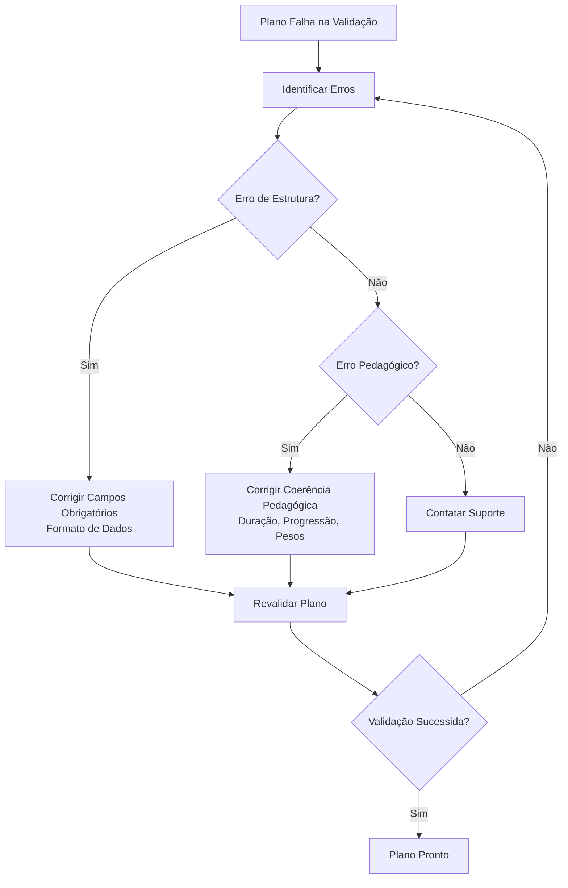

**Section sources**

- [src/lib/schemas/planner-schemas.ts](file://src/lib/schemas/planner-schemas.ts#L278-L377)

## Conclusão

Os esquemas de validação do planejador são uma implementação sofisticada que vai
além da simples validação de dados, incorporando princípios pedagógicos
fundamentais para garantir a qualidade dos planos de aula. Ao integrar conceitos
da Taxonomia de Bloom, BNCC e teoria de Perrenoud, esses esquemas atuam como um
assistente pedagógico que orienta os professores na criação de planos coerentes
e eficazes.

A arquitetura modular permite fácil manutenção e extensão, enquanto as mensagens
de erro pedagogicamente formuladas transformam a validação em uma oportunidade
de aprendizagem. Com esses esquemas, o sistema não apenas valida planos, mas
também educa os professores sobre boas práticas de planejamento pedagógico.
