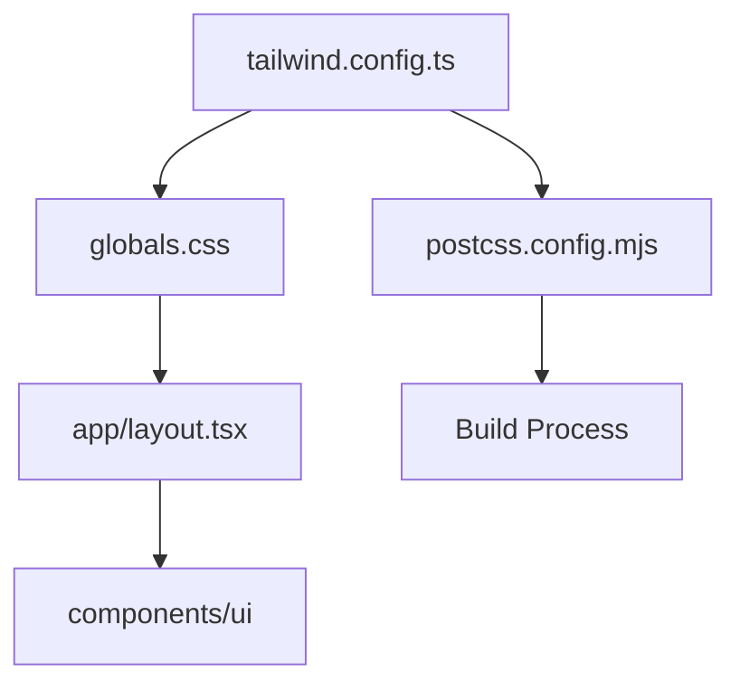
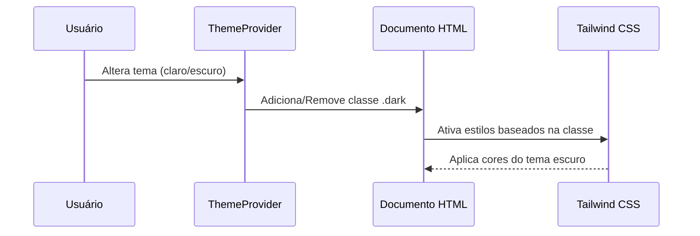
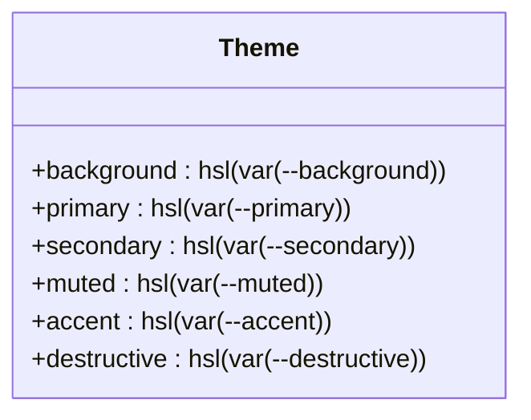
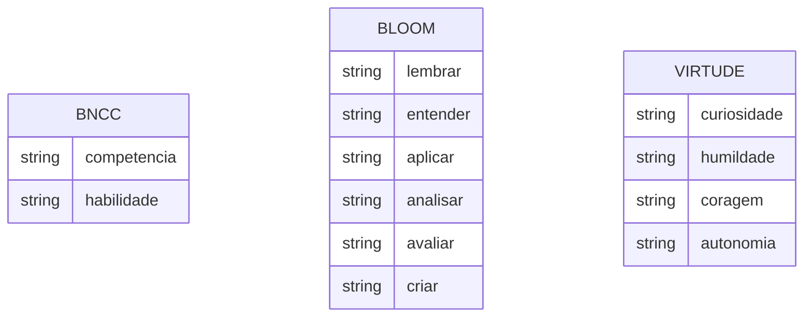
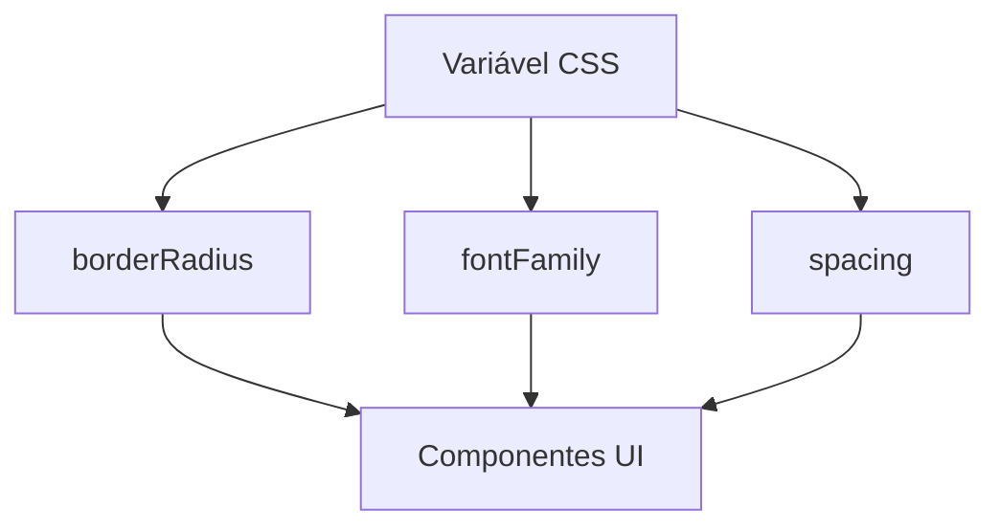
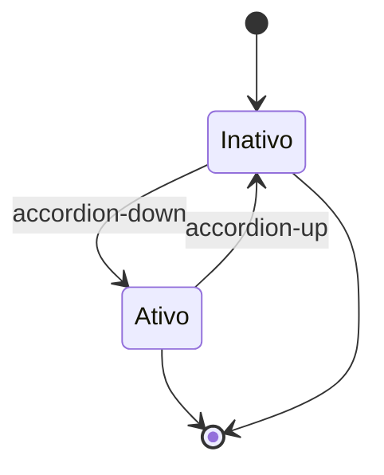

# Configuração do Tailwind CSS

<cite>
**Arquivos Referenciados neste Documento**  
- [tailwind.config.ts](file://tailwind.config.ts)
- [src/styles/globals.css](file://src/styles/globals.css)
- [postcss.config.mjs](file://postcss.config.mjs)
- [src/providers/theme-provider.tsx](file://src/providers/theme-provider.tsx)
</cite>

## Sumário
1. [Introdução](#introdução)
2. [Estrutura do Projeto](#estrutura-do-projeto)
3. [Configuração do Conteúdo e Modo Escuro](#configuração-do-conteúdo-e-modo-escuro)
4. [Extensão do Tema](#extensão-do-tema)
5. [Cores Educacionais e Variáveis CSS](#cores-educacionais-e-variáveis-css)
6. [Configuração de Bordas, Fontes e Espaçamentos](#configuração-de-bordas-fontes-e-espaçamentos)
7. [Animações e Transições](#animações-e-transições)
8. [Boas Práticas e Escalabilidade](#boas-práticas-e-escalabilidade)
9. [Conclusão](#conclusão)

## Introdução
Este documento detalha a configuração do Tailwind CSS no projeto VirtuQuest, com foco no arquivo `tailwind.config.ts`. A configuração é projetada para suportar um sistema de design robusto, acessível e educacional, alinhado com os princípios do shadcn/ui e estendido para atender às necessidades pedagógicas do projeto. A integração com variáveis CSS, modos de tema claro/escuro e classes dinâmicas permite uma personalização profunda e consistente.

## Estrutura do Projeto
O projeto VirtuQuest utiliza uma estrutura baseada em Next.js com componentes organizados em diretórios funcionais. O Tailwind CSS é integrado via PostCSS, com configurações centralizadas em `tailwind.config.ts` e variáveis de estilo definidas em `globals.css`.

**Fontes do Diagrama**
- [tailwind.config.ts](file://tailwind.config.ts#L1-L103)
- [src/styles/globals.css](file://src/styles/globals.css#L1-L103)

**Fontes da Seção**
- [tailwind.config.ts](file://tailwind.config.ts#L1-L103)
- [src/styles/globals.css](file://src/styles/globals.css#L1-L103)

## Configuração do Conteúdo e Modo Escuro
A configuração do Tailwind define quais arquivos devem ser escaneados para classes dinâmicas através da propriedade `content`. Esta varredura abrange todos os componentes, páginas e utilitários do diretório `src`, garantindo que todas as classes utilizadas sejam incluídas no CSS final.

O modo escuro é ativado com `darkMode: 'class'`, o que significa que a alternância entre temas claro e escuro é controlada pela presença da classe `.dark` no elemento raiz (`<html>`). Essa classe é gerida pelo `ThemeProvider`, que persiste as preferências do usuário no `localStorage`.

**Fontes da Seção**
- [tailwind.config.ts](file://tailwind.config.ts#L2-L5)
- [src/providers/theme-provider.tsx](file://src/providers/theme-provider.tsx#L92-L137)

## Extensão do Tema
O tema do Tailwind é estendido para suportar variáveis CSS definidas em `:root`, permitindo uma personalização dinâmica e compatibilidade com o sistema de design shadcn/ui. As cores principais como `primary`, `secondary`, `destructive` e `muted` são mapeadas para variáveis CSS, facilitando a manutenção e a consistência visual.

**Fontes da Seção**
- [tailwind.config.ts](file://tailwind.config.ts#L10-L40)

## Cores Educacionais e Variáveis CSS
O sistema de cores é estendido para incluir categorias educacionais fundamentais:
- **BNCC**: Competência e Habilidade
- **Taxonomia de Bloom**: Lembrar, Entender, Aplicar, Analisar, Avaliar, Criar
- **Virtudes Intelectuais**: Curiosidade, Humildade, Coragem, Autonomia

Essas cores são definidas como variáveis HSL em `globals.css`, com valores distintos para os modos claro e escuro. O uso de HSL permite ajustes finos de luminosidade e saturação, essenciais para acessibilidade e contraste.

**Fontes da Seção**
- [tailwind.config.ts](file://tailwind.config.ts#L40-L60)
- [src/styles/globals.css](file://src/styles/globals.css#L20-L45)

## Configuração de Bordas, Fontes e Espaçamentos
O tema estende propriedades de design com base em variáveis CSS para garantir consistência:
- **Border Radius**: Define `lg`, `md`, `sm` com base na variável `--radius`, permitindo arredondamento uniforme em todos os componentes.
- **Font Family**: Define duas famílias: `sans` (padrão) e `educational` (para contextos pedagógicos), ambas configuradas via variáveis CSS.
- **Spacing**: Define um sistema de espaçamento com valores `xs` a `2xl`, utilizando variáveis com valores padrão, permitindo personalização global.

**Fontes da Seção**
- [tailwind.config.ts](file://tailwind.config.ts#L60-L75)

## Animações e Transições
O Tailwind é configurado com animações personalizadas para componentes como acordeões, utilizando o plugin `tailwindcss-animate`. As animações são definidas em `keyframes` e mapeadas para classes em `animation`, permitindo uso direto em componentes.

**Fontes da Seção**
- [tailwind.config.ts](file://tailwind.config.ts#L75-L103)
- [postcss.config.mjs](file://postcss.config.mjs#L1-L8)

## Boas Práticas e Escalabilidade
Para manter a consistência e escalabilidade:
- **Adicionar novas cores educacionais**: Defina a variável CSS em `globals.css` e adicione a referência em `tailwind.config.ts` dentro de `theme.extend.colors`.
- **Ajustar breakpoints**: Personalize em `theme.screens` se necessário, embora o padrão do Tailwind seja suficiente.
- **Manter variáveis centralizadas**: Todas as variáveis devem estar em `:root` para fácil manutenção.
- **Evitar classes arbitrárias**: Use o sistema de tema estendido em vez de `!important` ou estilos inline.

**Fontes da Seção**
- [tailwind.config.ts](file://tailwind.config.ts#L1-L103)
- [src/styles/globals.css](file://src/styles/globals.css#L1-L103)

## Conclusão
A configuração do Tailwind CSS no VirtuQuest é uma base sólida para um sistema de design acessível, educacional e escalável. A integração com variáveis CSS, modos de tema e classes dinâmicas permite personalização profunda enquanto mantém a consistência visual. A extensão para cores pedagógicas reforça o foco no contexto educacional, alinhando tecnologia e pedagogia.