# Estratégia de Estilização

<cite>
**Arquivos Referenciados neste Documento**  
- [tailwind.config.ts](file://tailwind.config.ts)
- [src/styles/globals.css](file://src\styles\globals.css)
- [src/styles/design-tokens.css](file://src\styles\design-tokens.css)
- [src/providers/theme-provider.tsx](file://src\providers\theme-provider.tsx)
- [src/components/ui/accordion.tsx](file://src\components\ui\accordion.tsx)
- [src/components/ui/alert.tsx](file://src\components\ui\alert.tsx)
- [src/components/ui/checkbox.tsx](file://src\components/ui\checkbox.tsx)
- [src/components/ui/progress.tsx](file://src\components\ui\progress.tsx)
</cite>

## Sumário

1. [Introdução](#introdução)
2. [Configuração do Tailwind CSS](#configuração-do-tailwind-css)
3. [Sistema de Cores Educacional](#sistema-de-cores-educacional)
4. [Modo Escuro e Variáveis CSS](#modo-escuro-e-variáveis-css)
5. [Organização de Classes Utilitárias](#organização-de-classes-utilitárias)
6. [Implementação de Componentes Estilizados](#implementação-de-componentes-estilizados)
7. [Boas Práticas de Estilização](#boas-práticas-de-estilização)
8. [Integração com Componentes UI](#integração-com-componentes-ui)
9. [Conclusão](#conclusão)

## Introdução

A estratégia de estilização do VirtuQuest é baseada no Tailwind CSS 4, com um
sistema de design robusto que integra princípios pedagógicos e acessibilidade. O
sistema utiliza variáveis CSS para gerenciar temas, modos claro/escuro, esquemas
de cores alternativos e tamanhos de fonte, permitindo uma personalização
completa da interface. A arquitetura de estilização foi projetada para suportar
o contexto educacional do sistema, com cores semânticas alinhadas à BNCC,
Taxonomia de Bloom e Virtudes Intelectuais.

## Configuração do Tailwind CSS

A configuração do Tailwind CSS é definida no arquivo `tailwind.config.ts`, que
estabelece as bases do sistema de design do VirtuQuest.

**Section sources**

- [tailwind.config.ts](file://tailwind.config.ts#L1-L109)

### Temas e Cores

O sistema de cores é baseado em variáveis CSS que permitem a troca dinâmica de
temas. As cores são organizadas em categorias semânticas que seguem o padrão
shadcn/ui, com extensões específicas para o contexto educacional.

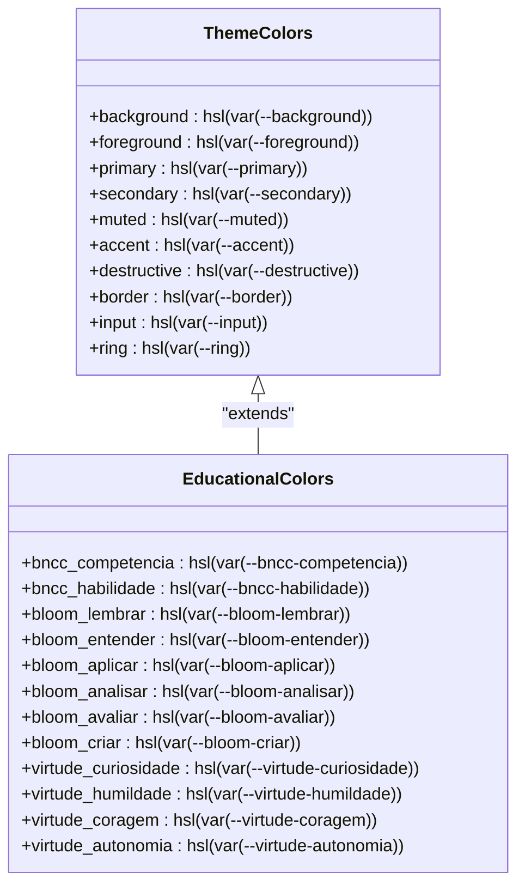

**Diagram sources**

- [tailwind.config.ts](file://tailwind.config.ts#L47-L86)
- [src/styles/design-tokens.css](file://src\styles\design-tokens.css#L36-L84)

### Breakpoints e Responsividade

O sistema de breakpoints é configurado para suportar dispositivos móveis,
tablets e desktops, garantindo uma experiência responsiva em todos os
dispositivos.

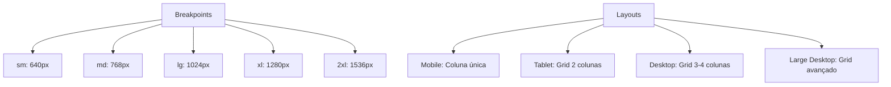

**Diagram sources**

- [tailwind.config.ts](file://tailwind.config.ts#L1-L109)
- [src/types/theme.ts](file://src\types\theme.ts#L93-L144)

### Plugins e Extensões

O sistema utiliza o plugin `tailwindcss-animate` para animações, que fornece
classes utilitárias para transições suaves e animações de componentes.

**Section sources**

- [tailwind.config.ts](file://tailwind.config.ts#L108-L109)

## Sistema de Cores Educacional

O sistema de cores do VirtuQuest é projetado especificamente para o contexto
educacional, com paletas que representam conceitos pedagógicos importantes.

### Cores BNCC

As cores da BNCC são usadas para representar competências e habilidades
curriculares, facilitando a identificação visual de conteúdos alinhados à Base
Nacional Comum Curricular.

**Section sources**

- [tailwind.config.ts](file://tailwind.config.ts#L47-L52)
- [src/styles/design-tokens.css](file://src\styles\design-tokens.css#L36-L40)

### Taxonomia de Bloom

Cada nível da Taxonomia de Bloom possui uma cor específica, criando uma escala
visual que representa a progressão do pensamento cognitivo, desde o simples ato
de lembrar até a criação de novos conhecimentos.

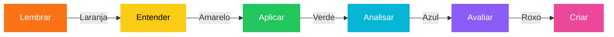

**Diagram sources**

- [tailwind.config.ts](file://tailwind.config.ts#L53-L64)
- [src/styles/design-tokens.css](file://src\styles\design-tokens.css#L41-L46)

### Virtudes Intelectuais

As virtudes intelectuais possuem cores que representam seus valores, ajudando a
reforçar conceitos de caráter e pensamento crítico na interface do usuário.

**Section sources**

- [tailwind.config.ts](file://tailwind.config.ts#L65-L70)
- [src/styles/design-tokens.css](file://src\styles\design-tokens.css#L47-L52)

## Modo Escuro e Variáveis CSS

O sistema de temas do VirtuQuest é baseado em variáveis CSS, permitindo uma
transição suave entre modos claro e escuro, além de suportar esquemas de cores
alternativos.

### Estrutura de Variáveis

As variáveis CSS são definidas no arquivo `design-tokens.css`, que contém todos
os tokens de design do sistema.

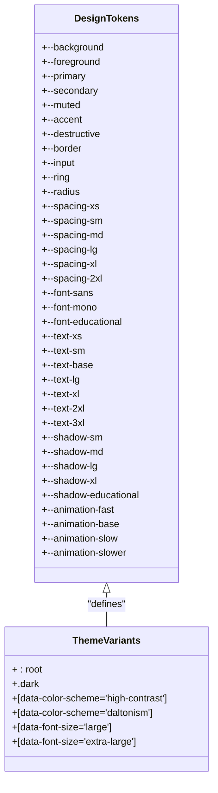

**Diagram sources**

- [src/styles/design-tokens.css](file://src\styles\design-tokens.css#L1-L220)

### Implementação do ThemeProvider

O `ThemeProvider` gerencia o estado do tema, esquema de cores e tamanho da
fonte, persistindo as preferências do usuário no localStorage.

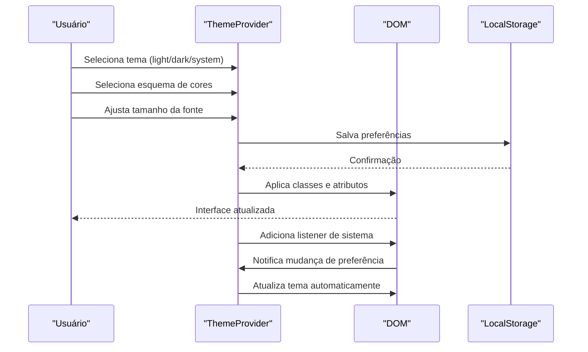

**Diagram sources**

- [src/providers/theme-provider.tsx](file://src\providers\theme-provider.tsx#L34-L176)
- [src/types/theme.ts](file://src\types\theme.ts#L1-L42)

**Section sources**

- [src/providers/theme-provider.tsx](file://src\providers\theme-provider.tsx#L1-L176)
- [src/types/theme.ts](file://src\types\theme.ts#L1-L144)

## Organização de Classes Utilitárias

O sistema utiliza uma organizização clara das camadas do Tailwind CSS para
manter a separação de responsabilidades.

### Camadas do Tailwind

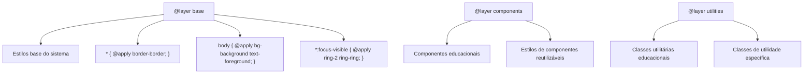

**Diagram sources**

- [src/styles/globals.css](file://src\styles\globals.css#L1-L34)

### Uso de @apply

O `@apply` é utilizado para criar classes reutilizáveis e manter a consistência
visual, especialmente em componentes personalizados.

**Section sources**

- [src/styles/globals.css](file://src\styles\globals.css#L1-L34)
- [src/components/ui/button.tsx](file://src\components\ui\button.tsx#L6-L30)

## Implementação de Componentes Estilizados

A implementação de novos componentes deve seguir padrões consistentes para
garantir a integridade do design system.

### Exemplo de Componente Educacional

Para implementar um novo componente educacional, siga estas etapas:

1. Crie o componente no diretório `src/components/educational/`
2. Utilize as variáveis CSS para cores e espaçamentos
3. Aplique classes do Tailwind respeitando o sistema de design
4. Garanta suporte a todos os temas e esquemas de cores

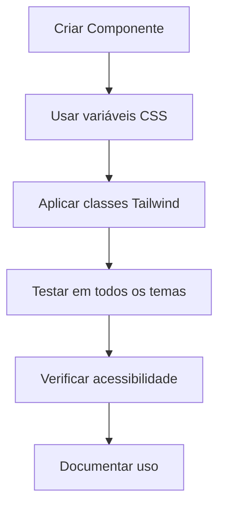

**Section sources**

- [src/components/ui/button.tsx](file://src\components\ui\button.tsx#L38-L45)
- [src/types/theme.ts](file://src\types\theme.ts#L93-L144)

## Boas Práticas de Estilização

### Consistência Visual

Mantenha a consistência visual utilizando os tokens de design definidos no
sistema. Evite cores hard-coded e sempre utilize as variáveis CSS.

### Acessibilidade de Cores

O sistema inclui esquemas de cores alternativos para usuários com deficiências
visuais, como o esquema de alto contraste e o esquema para daltonismo.

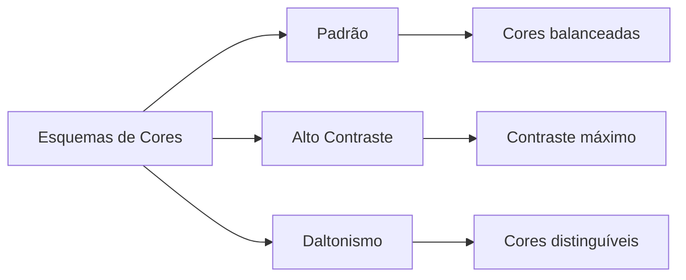

**Diagram sources**

- [src/styles/design-tokens.css](file://src\styles\design-tokens.css#L134-L218)

### Responsividade

Todos os componentes devem ser responsivos, adaptando-se a diferentes tamanhos
de tela e orientações.

**Section sources**

- [tailwind.config.ts](file://tailwind.config.ts#L1-L109)
- [src/types/theme.ts](file://src\types\theme.ts#L93-L144)

## Integração com Componentes UI

Os componentes UI do sistema são construídos com base no shadcn/ui, estendendo
seus estilos para integrar-se ao design system educacional.

### Componentes Adicionais

Com a integração do planejador com o React Hook Form, novos componentes foram
adicionados ao sistema de design para suportar a interface do planejador.

**Section sources**

- [src/components/ui/accordion.tsx](file://src\components\ui\accordion.tsx#L1-L54)
- [src/components/ui/alert.tsx](file://src\components\ui\alert.tsx#L1-L49)
- [src/components/ui/checkbox.tsx](file://src\components\ui\checkbox.tsx#L1-L28)
- [src/components/ui/progress.tsx](file://src\components\ui\progress.tsx#L1-L25)

#### Accordion

O componente Accordion é utilizado para organizar o conteúdo do planejador em
seções colapsáveis, permitindo uma navegação mais eficiente.

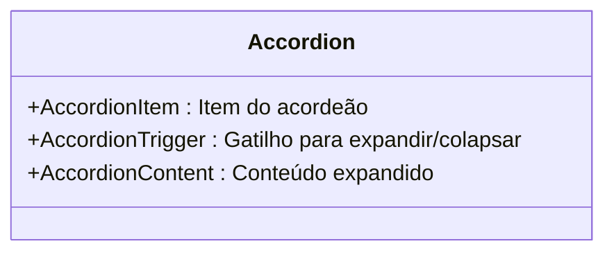

**Diagram sources**

- [src/components/ui/accordion.tsx](file://src\components\ui\accordion.tsx#L8-L54)

#### Alert

O componente Alert é usado para exibir mensagens importantes ao usuário, como
status de salvamento ou erros de validação.

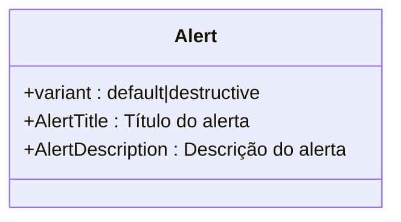

**Diagram sources**

- [src/components/ui/alert.tsx](file://src\components\ui\alert.tsx#L21-L49)

#### Checkbox

O componente Checkbox é utilizado para seleções múltiplas no planejador, como
seleção de habilidades BNCC ou virtudes intelectuais.

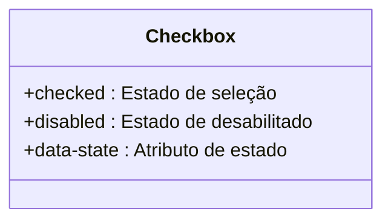

**Diagram sources**

- [src/components/ui/checkbox.tsx](file://src\components\ui\checkbox.tsx#L8-L24)

#### Progress

O componente Progress mostra o andamento do preenchimento do planejador,
fornecendo feedback visual sobre o progresso.

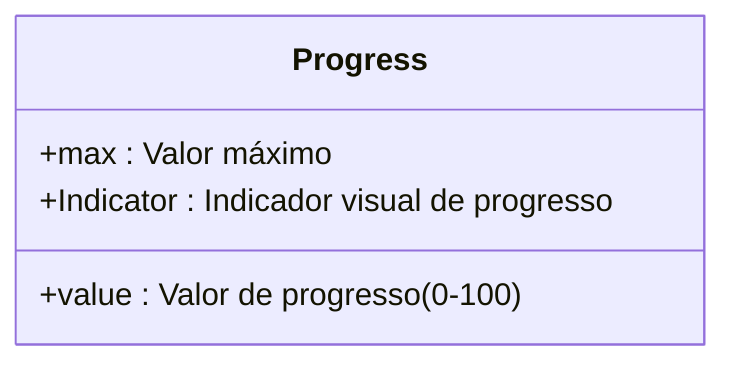

**Diagram sources**

- [src/components/ui/progress.tsx](file://src\components\ui\progress.tsx#L7-L21)

## Conclusão

A estratégia de estilização do VirtuQuest combina a flexibilidade do Tailwind
CSS com um sistema de design educacional robusto, criando uma experiência visual
coesa e pedagogicamente significativa. O uso de variáveis CSS permite uma
personalização completa da interface, enquanto o sistema de cores educacional
reforça conceitos importantes para os usuários do sistema. A integração com o
ThemeProvider garante que as preferências do usuário sejam persistentes e
aplicadas consistentemente em toda a aplicação.
