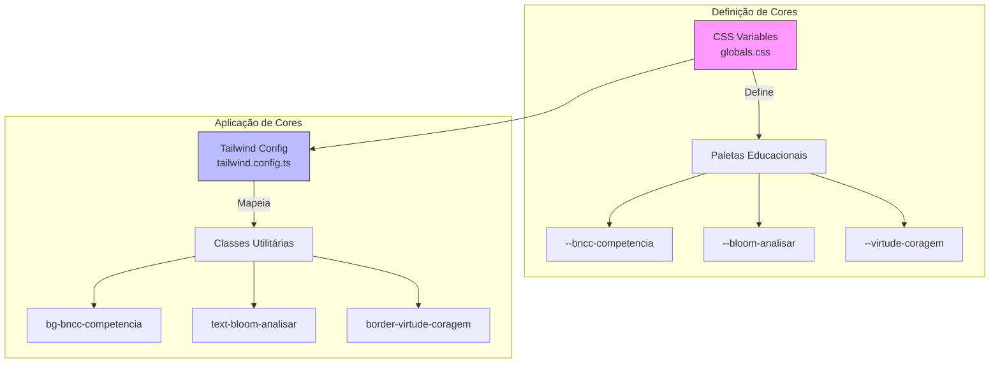
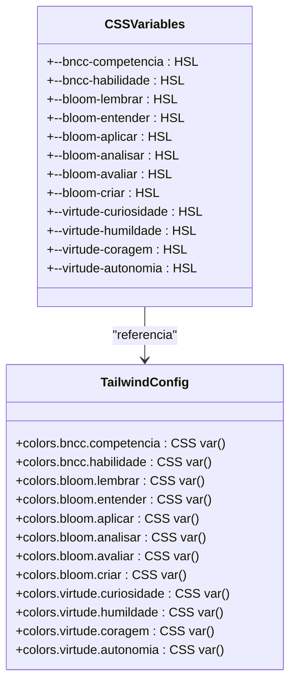

# Sistema de Cores Educacional

<cite>
**Referenced Files in This Document**   
- [tailwind.config.ts](file://tailwind.config.ts)
- [src/styles/globals.css](file://src/styles/globals.css)
</cite>

## Sumário

1. [Introdução](#introdução)
2. [Arquitetura do Sistema de Cores](#arquitetura-do-sistema-de-cores)
3. [Domínios Pedagógicos e Mapeamento de Cores](#domínios-pedagógicos-e-mapeamento-de-cores)
4. [Implementação Técnica](#implementação-técnica)
5. [Diretrizes de Uso e Acessibilidade](#diretrizes-de-uso-e-acessibilidade)
6. [Extensibilidade do Sistema](#extensibilidade-do-sistema)
7. [Conclusão](#conclusão)

## Introdução

O sistema de cores educacional do VirtuQuest é uma solução de design
intencionalmente alinhada com fundamentos pedagógicos para criar uma experiência
de aprendizagem visualmente coerente e cognitivamente significativa. Este
sistema mapeia paletas de cores a três domínios centrais: a Base Nacional Comum
Curricular (BNCC), a Taxonomia de Bloom e as Virtudes Intelectuais. A
implementação combina variáveis CSS definidas em `globals.css` com a
configuração dinâmica do Tailwind CSS em `tailwind.config.ts`, permitindo uma
aplicação consistente e acessível das cores em toda a interface do usuário.

## Arquitetura do Sistema de Cores

O sistema de cores é construído sobre uma arquitetura de duas camadas que separa
a definição de cores da sua aplicação no framework de UI. A camada base utiliza
variáveis CSS definidas no arquivo `globals.css`, enquanto a camada de aplicação
expõe essas cores como utilitários Tailwind através do arquivo de configuração.



**Diagram sources**

- [src/styles/globals.css](file://src/styles/globals.css#L28-L75)
- [tailwind.config.ts](file://tailwind.config.ts#L15-L50)

**Section sources**

- [src/styles/globals.css](file://src/styles/globals.css#L1-L104)
- [tailwind.config.ts](file://tailwind.config.ts#L1-L104)

## Domínios Pedagógicos e Mapeamento de Cores

O sistema de cores é organizado em torno de três pilares pedagógicos, cada um
com sua própria paleta cromática que reflete as características cognitivas e
afetivas dos domínios.

### BNCC (Base Nacional Comum Curricular)

As cores da BNCC utilizam tons de azul e verde para representar a estruturação
do conhecimento:

- **Competência**: Azul profundo (`--bncc-competencia: 210 100% 50%`),
  simbolizando profundidade e abrangência
- **Habilidade**: Verde esmeralda (`--bncc-habilidade: 150 100% 40%`),
  representando aplicação prática e crescimento

### Taxonomia de Bloom

A paleta de Bloom segue uma progressão cromática que reflete a complexidade
cognitiva crescente:

- **Lembrar**: Vermelho vibrante (`--bloom-lembrar: 0 100% 70%`), alto impacto
  para memorização
- **Entender**: Laranja claro (`--bloom-entender: 30 100% 60%`), facilitando a
  compreensão
- **Aplicar**: Amarelo (`--bloom-aplicar: 60 100% 50%`), energia para execução
- **Analisar**: Verde (`--bloom-analisar: 120 100% 40%`), clareza para
  desmontagem de conceitos
- **Avaliar**: Azul (`--bloom-avaliar: 240 100% 60%`), objetividade para
  julgamento
- **Criar**: Roxo (`--bloom-criar: 300 100% 50%`), criatividade e inovação

### Virtudes Intelectuais

As virtudes utilizam cores que evocam qualidades emocionais e éticas:

- **Curiosidade**: Âmbar (`--virtude-curiosidade: 45 100% 55%`), fascínio e
  descoberta
- **Humildade**: Azul-cinza (`--virtude-humildade: 200 100% 45%`), modéstia e
  reflexão
- **Coragem**: Vermelho-alaranjado (`--virtude-coragem: 15 100% 55%`),
  determinação e ação
- **Autonomia**: Violeta (`--virtude-autonomia: 270 100% 50%`), independência e
  autocontrole

**Section sources**

- [src/styles/globals.css](file://src/styles/globals.css#L28-L39)
- [tailwind.config.ts](file://tailwind.config.ts#L25-L48)

## Implementação Técnica

A implementação do sistema de cores segue um padrão de design que maximiza a
consistência, acessibilidade e manutenibilidade através da combinação de
variáveis CSS e configuração do Tailwind.

### Definição de Variáveis CSS

As cores são definidas como variáveis HSL no seletor `:root` do arquivo
`globals.css`, permitindo acesso global e suporte a modo escuro. O uso do
formato HSL (Matiz, Saturação, Luminosidade) facilita a criação de variações
tonais consistentes.



**Diagram sources**

- [src/styles/globals.css](file://src/styles/globals.css#L28-L75)
- [tailwind.config.ts](file://tailwind.config.ts#L15-L50)

### Mapeamento para Tailwind

O arquivo `tailwind.config.ts` estende o tema padrão com as cores educacionais,
mapeando cada variável CSS para uma chave correspondente na hierarquia de cores.
Isso permite o uso de classes utilitárias padrão do Tailwind como
`bg-bncc-competencia`, `text-bloom-analisar` ou `border-virtude-coragem`.

O sistema suporta automaticamente o modo escuro através da redefinição das
variáveis CSS no seletor `.dark`, com tons ajustados para melhor legibilidade em
fundos escuros, mantendo a mesma identidade cromática mas com luminosidade
otimizada.

**Section sources**

- [src/styles/globals.css](file://src/styles/globals.css#L1-L104)
- [tailwind.config.ts](file://tailwind.config.ts#L1-L104)

## Diretrizes de Uso e Acessibilidade

O sistema de cores foi projetado com princípios de acessibilidade em mente,
garantindo contraste adequado e usabilidade em diferentes contextos pedagógicos.

### Contraste e Legibilidade

Todas as combinações de cores foram verificadas para atender aos padrões WCAG de
contraste mínimo:

- Cores de texto sobre fundos claros mantêm razão de contraste ≥ 4.5:1
- Cores em modo escuro utilizam tons mais claros para compensar o fundo escuro
- Bordas e elementos de interface têm contraste suficiente com o fundo

### Contextos Pedagógicos

As diretrizes de uso recomendam:

- **BNCC**: Utilizar `bg-bncc-competencia` para quadros curriculares e
  `text-bncc-habilidade` para objetivos específicos
- **Bloom**: Aplicar a progressão cromática em atividades sequenciais, começando
  com vermelho (lembrar) e progredindo até roxo (criar)
- **Virtudes**: Usar cores de virtudes em feedback formativo, destacando
  comportamentos desejados

### Modo Escuro

O sistema inclui definições explícitas para modo escuro no bloco `.dark` de
`globals.css`, com ajustes de luminosidade para manter a identidade cromática
enquanto melhora a legibilidade:

- Cores claras em modo claro tornam-se moderadamente mais escuras
- Cores escuras em modo claro tornam-se moderadamente mais claras
- A relação cromática relativa entre categorias é preservada

**Section sources**

- [src/styles/globals.css](file://src/styles/globals.css#L50-L75)
- [tailwind.config.ts](file://tailwind.config.ts#L15-L50)

## Extensibilidade do Sistema

O sistema de cores é projetado para ser facilmente estendido com novas
categorias ou ajustes em tons existentes, mantendo a coerência do design system.

### Adicionar Novas Categorias

Para introduzir um novo domínio pedagógico (ex: "Metodologias Ativas"):

1. Definir variáveis CSS em `globals.css`:

```css
--metodologia-projeto: 180 100% 45%;
--metodologia-investigacao: 270 100% 55%;
```

2. Mapear para Tailwind em `tailwind.config.ts`:

```ts
metodologia: {
  projeto: 'hsl(var(--metodologia-projeto))',
  investigacao: 'hsl(var(--metodologia-investigacao))'
}
```

### Ajustar Tons Existentes

Para modificar a paleta de uma categoria existente:

1. Ajustar os valores HSL nas variáveis CSS
2. Manter a mesma relação cromática entre subcategorias
3. Verificar o contraste em ambos os modos (claro e escuro)

### Manter Coerência

Princípios para manter a integridade do sistema:

- Utilizar o formato HSL para facilitar variações tonais
- Preservar a relação de luminosidade entre modos claro e escuro
- Documentar o significado pedagógico de cada cor
- Testar combinações em diferentes dispositivos e condições de iluminação

**Section sources**

- [src/styles/globals.css](file://src/styles/globals.css#L28-L75)
- [tailwind.config.ts](file://tailwind.config.ts#L15-L50)

## Conclusão

O sistema de cores educacional do VirtuQuest representa uma integração
sofisticada entre design visual e fundamentos pedagógicos. Ao alinhar paletas
cromáticas com a BNCC, Taxonomia de Bloom e Virtudes Intelectuais, o sistema não
apenas embeleza a interface, mas também reforça conceitos educacionais através
da linguagem visual. A implementação técnica, baseada em variáveis CSS e
Tailwind, garante consistência, acessibilidade e facilidade de manutenção,
enquanto a arquitetura modular permite extensões futuras sem comprometer a
coerência do design system. Este approach holístico transforma a cor de um mero
elemento estético em uma ferramenta pedagógica ativa no processo de
aprendizagem.
