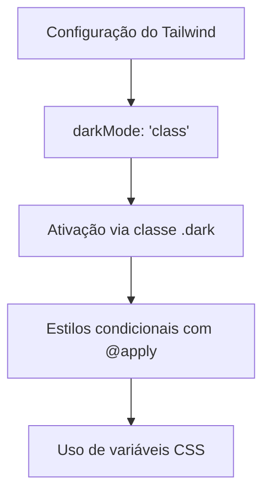
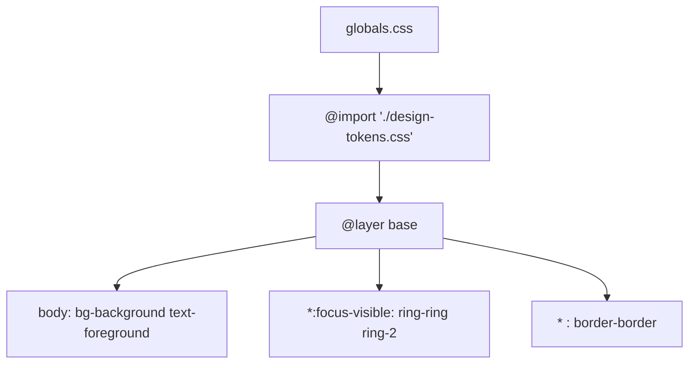
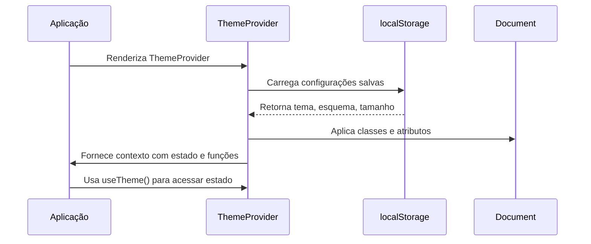
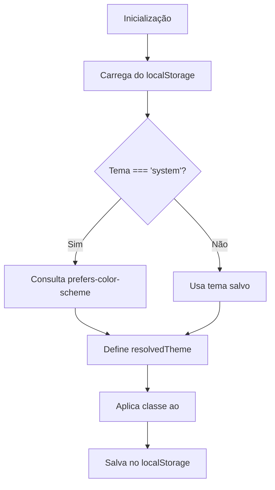

# Suporte a Modo Escuro

<cite>
**Arquivos Referenciados neste Documento**  
- [tailwind.config.ts](file://tailwind.config.ts)
- [src/styles/globals.css](file://src/styles/globals.css)
- [src/styles/design-tokens.css](file://src/styles/design-tokens.css)
- [src/app/layout.tsx](file://src/app/layout.tsx)
- [src/providers/theme-provider.tsx](file://src/providers/theme-provider.tsx)
</cite>

## Sumário
1. [Introdução](#introdução)
2. [Configuração do Tailwind CSS](#configuração-do-tailwind-css)
3. [Tokens de Design e Variáveis CSS](#tokens-de-design-e-variáveis-css)
4. [Aplicação dos Estilos Base](#aplicação-dos-estilos-base)
5. [ThemeProvider e Gerenciamento de Estado](#themeprovider-e-gerenciamento-de-estado)
6. [Ativação do Modo Escuro](#ativação-do-modo-escuro)
7. [Testes e Depuração](#testes-e-depuração)
8. [Boas Práticas de Acessibilidade](#boas-práticas-de-acessibilidade)
9. [Conclusão](#conclusão)

## Introdução

O VirtuQuest implementa um sistema avançado de temas que permite a alternância dinâmica entre modos claro e escuro, utilizando o padrão `darkMode: 'class'` do Tailwind CSS. Este documento detalha a arquitetura do sistema de temas, desde a definição das variáveis CSS até a ativação via contexto React, passando pela aplicação de estilos base e boas práticas de acessibilidade.

O sistema é projetado para ser acessível, permitindo não apenas a troca entre temas claro e escuro, mas também esquemas de cores alternativos (como alto contraste e daltonismo) e tamanhos de fonte adaptáveis, todos com persistência no `localStorage`.

**Section sources**
- [tailwind.config.ts](file://tailwind.config.ts#L1-L104)
- [src/app/layout.tsx](file://src/app/layout.tsx#L1-L64)

## Configuração do Tailwind CSS

A configuração do Tailwind CSS é o ponto de partida para o suporte ao modo escuro. O arquivo `tailwind.config.ts` define o modo de ativação do tema escuro como `'class'`, o que significa que a alternância entre temas é controlada pela presença da classe `.dark` no elemento raiz do documento.



**Diagram sources**
- [tailwind.config.ts](file://tailwind.config.ts#L2-L4)

**Section sources**
- [tailwind.config.ts](file://tailwind.config.ts#L1-L104)

## Tokens de Design e Variáveis CSS

O coração do sistema de temas reside no arquivo `design-tokens.css`, que define todas as variáveis CSS utilizadas no projeto. Essas variáveis são organizadas em diferentes categorias semânticas, como cores base, cores educacionais (BNCC, Bloom, Virtudes), status de planos, níveis de ensino e prioridades.

As variáveis são definidas no seletor `:root` para o tema claro e no seletor `.dark` para o tema escuro. Quando a classe `.dark` é adicionada ao elemento raiz, todas as variáveis são automaticamente substituídas pelos seus valores correspondentes no tema escuro.

```mermaid
classDiagram
: root {
--background : 0 0% 100%
--foreground : 222.2 47.4% 11.2%
--primary : 217 91% 60%
--secondary : 142 76% 36%
}
.dark {
--background : 222.2 47.4% 11.2%
--foreground : 213 31% 91%
--primary : 217 91% 70%
--secondary : 142 76% 46%
}
: root --> .dark : "override"
```

**Diagram sources**
- [src/styles/design-tokens.css](file://src/styles/design-tokens.css#L1-L309)

**Section sources**
- [src/styles/design-tokens.css](file://src/styles/design-tokens.css#L1-L309)

## Aplicação dos Estilos Base

O arquivo `globals.css` importa os tokens de design e aplica os estilos base utilizando a camada `@layer base` do Tailwind. Esses estilos são aplicados de forma global e utilizam as variáveis CSS definidas em `design-tokens.css`.

Os estilos base incluem:
- Definição de cores de fundo e texto para o `body`
- Estilos de borda para todos os elementos
- Estilos de foco acessíveis para elementos interativos



**Diagram sources**
- [src/styles/globals.css](file://src/styles/globals.css#L1-L35)

**Section sources**
- [src/styles/globals.css](file://src/styles/globals.css#L1-L35)

## ThemeProvider e Gerenciamento de Estado

O `ThemeProvider` é um componente React que gerencia o estado do tema, esquema de cores e tamanho da fonte. Ele utiliza o contexto do React para disponibilizar essas informações para toda a aplicação.

O provedor:
- Carrega as configurações salvas no `localStorage` na inicialização
- Resolve o tema `system` com base na preferência do sistema do usuário
- Aplica as classes e atributos necessários ao elemento raiz (`html`)
- Fornece hooks para acessar e modificar o estado do tema



**Diagram sources**
- [src/providers/theme-provider.tsx](file://src/providers/theme-provider.tsx#L1-L205)

**Section sources**
- [src/providers/theme-provider.tsx](file://src/providers/theme-provider.tsx#L1-L205)

## Ativação do Modo Escuro

A ativação do modo escuro é controlada pelo `ThemeProvider`, que adiciona ou remove a classe `.dark` do elemento raiz com base no estado atual do tema. O processo envolve:

1. **Inicialização**: O provedor verifica o `localStorage` para recuperar a preferência do usuário.
2. **Resolução de tema**: Se o tema for `system`, ele consulta `prefers-color-scheme`.
3. **Aplicação no DOM**: O efeito `useEffect` atualiza o DOM com a classe correta.
4. **Persistência**: As mudanças são salvas no `localStorage` para manter a preferência.

Os hooks `useTheme` e `useIsDark` permitem que qualquer componente acesse o estado atual do tema e verifique se está no modo escuro.



**Diagram sources**
- [src/providers/theme-provider.tsx](file://src/providers/theme-provider.tsx#L33-L179)
- [src/providers/theme-provider.tsx](file://src/providers/theme-provider.tsx#L182-L196)

**Section sources**
- [src/providers/theme-provider.tsx](file://src/providers/theme-provider.tsx#L1-L205)

## Testes e Depuração

Para testar e depurar problemas relacionados ao modo escuro, siga estas práticas:

### Verificação de Variáveis CSS
Use as ferramentas de desenvolvedimento do navegador para verificar se as variáveis CSS estão definidas corretamente:
1. Inspecione o elemento `html`
2. Verifique a presença da classe `.dark`
3. Confira os valores das variáveis CSS em `:root` e `.dark`

### Teste de Contraste
Utilize ferramentas como o Lighthouse ou o axe DevTools para verificar o contraste entre texto e fundo:
- Texto principal: razão de contraste ≥ 4.5:1
- Texto grande: razão de contraste ≥ 3:1
- Elementos interativos: foco claramente visível

### Simulação de Temas
Adicione manualmente a classe `.dark` ao elemento `html` para testar rapidamente:
```javascript
document.documentElement.classList.add('dark');
```

### Depuração de Hidratação
O `ThemeProvider` usa um estado `mounted` para evitar problemas de hidratação no Next.js. Se o conteúdo estiver invisível inicialmente, verifique se o `mounted` está sendo definido corretamente após o efeito de inicialização.

**Section sources**
- [src/providers/theme-provider.tsx](file://src/providers/theme-provider.tsx#L33-L179)

## Boas Práticas de Acessibilidade

O sistema de temas do VirtuQuest incorpora várias boas práticas de acessibilidade:

### Esquemas de Cores Alternativos
Além do modo escuro, o sistema suporta:
- **Alto contraste**: para usuários com baixa visão
- **Daltonismo**: esquema adaptado para diferentes tipos de daltonismo

### Tamanhos de Fonte Adaptáveis
Os usuários podem aumentar o tamanho da fonte para melhor legibilidade, com opções de `large` e `extra-large`.

### Transições Suaves
As mudanças de tema são suaves e não causam piscadas ou recarregamentos indesejados, melhorando a experiência do usuário.

### Persistência de Preferências
As preferências do usuário são salvas no `localStorage`, garantindo consistência entre sessões.

### Suporte ao Tema do Sistema
O modo `system` respeita a preferência do sistema operacional, proporcionando uma experiência integrada.

**Section sources**
- [src/styles/design-tokens.css](file://src/styles/design-tokens.css#L1-L309)
- [src/providers/theme-provider.tsx](file://src/providers/theme-provider.tsx#L1-L205)

## Conclusão

O sistema de modo escuro do VirtuQuest é uma implementação robusta e acessível que combina o poder do Tailwind CSS com o gerenciamento de estado do React. Ao utilizar variáveis CSS e o padrão `darkMode: 'class'`, o sistema permite uma alternância dinâmica e eficiente entre temas, com suporte a acessibilidade e persistência de preferências.

A arquitetura modular, com separação clara entre tokens de design, estilos base e gerenciamento de estado, facilita a manutenção e a extensão do sistema. A implementação do `ThemeProvider` garante que o estado do tema seja consistente em toda a aplicação, enquanto os hooks fornecem uma interface simples para acessar e modificar esse estado.

Com este sistema, o VirtuQuest oferece uma experiência visual personalizável e acessível, alinhada com as melhores práticas modernas de desenvolvimento web.