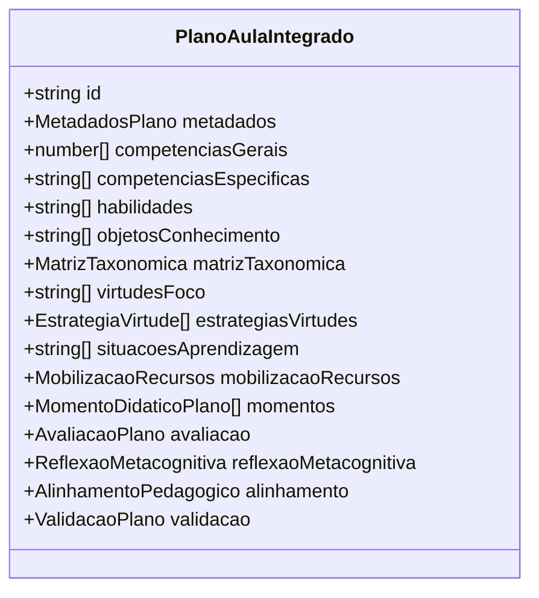

# Estrutura de Dados do Planejador

<cite>
**Arquivos Referenciados neste Documento**   
- [planner.ts](file://src/types/planner.ts)
- [planner-schemas.ts](file://src/lib/schemas/planner-schemas.ts)
- [bncc-tab.tsx](file://src/components/planner/bncc-tab.tsx)
- [bloom-tab.tsx](file://src/components/planner/bloom-tab.tsx)
- [virtues-tab.tsx](file://src/components/planner/virtues-tab.tsx)
- [situations-tab.tsx](file://src/components/planner/situations-tab.tsx)
- [shared/types.ts](file://src/core/domain/shared/types.ts)
- [bloom/types.ts](file://src/core/domain/bloom/types.ts)
- [bncc/types.ts](file://src/core/domain/bncc/types.ts)
- [virtudes/types.ts](file://src/core/domain/virtudes/types.ts)
- [perrenoud/types.ts](file://src/core/domain/perrenoud/types.ts)
</cite>

## Sumário

1. [Introdução](#introdução)
2. [Estrutura da Interface PlanoAulaIntegrado](#estrutura-da-interface-planoaulaintegrado)
3. [Metadados e Identificação](#metadados-e-identificação)
4. [Alinhamento BNCC](#alinhamento-bncc)
5. [Análise Bloom](#análise-bloom)
6. [Desenvolvimento de Virtudes](#desenvolvimento-de-virtudes)
7. [Estrutura Pedagógica (Perrenoud)](#estrutura-pedagógica-perrenoud)
8. [Sequência Didática](#sequência-didática)
9. [Avaliação](#avaliação)
10. [Metacognição](#metacognição)
11. [Validação e Análise](#validação-e-análise)
12. [Exemplos Práticos](#exemplos-práticos)
13. [Orientações de Uso](#orientações-de-uso)

## Introdução

A interface `PlanoAulaIntegrado` representa a estrutura central do planejamento
pedagógico no sistema VirtuQuest, integrando múltiplos modelos educacionais como
BNCC, Taxonomia de Bloom, Virtudes Intelectuais e a teoria de competências de
Perrenoud. Esta documentação detalha cada campo da estrutura, seu propósito,
tipo de dado e relação com os fundamentos pedagógicos, fornecendo uma visão
abrangente para desenvolvedores e educadores.

**Seção fontes**

- [planner.ts](file://src/types/planner.ts#L385-L435)

## Estrutura da Interface PlanoAulaIntegrado

A interface `PlanoAulaIntegrado` é composta por múltiplos campos agrupados em
seções temáticas que refletem dimensões pedagógicas distintas. Cada campo foi
projetado para capturar aspectos específicos do planejamento de aula, permitindo
uma análise integrada da coerência pedagógica.

**Fontes do diagrama**

- [planner.ts](file://src/types/planner.ts#L385-L435)

**Seção fontes**

- [planner.ts](file://src/types/planner.ts#L385-L435)

## Metadados e Identificação

Os campos de identificação e metadados fornecem informações administrativas
essenciais para o gerenciamento do plano de aula.

### id

- **Propósito**: Identificador único do plano, utilizado para referência e
  rastreamento.
- **Tipo**: `string` (UUID)
- **Relação pedagógica**: Permite versionamento e hierarquia de planejamento.

### metadados

- **Propósito**: Contém informações contextuais e administrativas do plano.
- **Tipo**: `MetadadosPlano`
- **Campos incluídos**:
  - `titulo`: Título descritivo da aula
  - `descricao`: Objetivos e conteúdo geral
  - `disciplina`, `serie`, `turma`: Contexto educacional
  - `duracao`: Tempo total em minutos
  - `data`: Data prevista de execução
  - `status`: Estado de aprovação do plano

**Seção fontes**

- [planner.ts](file://src/types/planner.ts#L385-L390)
- [planner.ts](file://src/types/planner.ts#L35-L68)

## Alinhamento BNCC

Esta seção estabelece a conexão com a Base Nacional Comum Curricular, garantindo
que o plano esteja alinhado com os diretrizes educacionais oficiais.

### competenciasGerais

- **Propósito**: Especifica quais das 10 competências gerais da BNCC são
  trabalhadas no plano.
- **Tipo**: `number[]` (valores de 1 a 10)
- **Relação pedagógica**: Conecta o plano às competências transversais definidas
  pela BNCC.

### competenciasEspecificas

- **Propósito**: IDs das competências específicas por área de conhecimento.
- **Tipo**: `string[]` (UUIDs)
- **Relação pedagógica**: Vincula o plano às competências específicas de cada
  componente curricular.

### habilidades

- **Propósito**: Códigos das habilidades BNCC trabalhadas (ex: 'EF67LP08').
- **Tipo**: `string[]`
- **Formato**: Deve seguir o padrão BNCC (ETAPA + ANOS + COMPONENTE + SEQUENCIA)
- **Relação pedagógica**: Define os objetivos de aprendizagem específicos da
  aula.

### objetosConhecimento

- **Propósito**: IDs dos objetos de conhecimento abordados.
- **Tipo**: `string[]` (UUIDs)
- **Relação pedagógica**: Especifica os conteúdos curriculares trabalhados.

**Seção fontes**

- [planner.ts](file://src/types/planner.ts#L392-L399)
- [bncc/types.ts](file://src/core/domain/bncc/types.ts)
- [bncc-tab.tsx](file://src/components/planner/bncc-tab.tsx)

## Análise Bloom

Esta seção implementa a Taxonomia de Bloom Revisada, permitindo o mapeamento dos
objetivos cognitivos da aula.

### matrizTaxonomica

- **Propósito**: Mapeamento bidimensional dos objetivos na matriz taxonômica de
  Bloom.
- **Tipo**: `MatrizTaxonomica`
- **Campos incluídos**:
  - `principal`: Célula principal (ex: 'B4' = Analisar + Conceitual)
  - `secundarias`: Células complementares
  - `progressao`: Sequência de processos cognitivos

**Seção fontes**

- [planner.ts](file://src/types/planner.ts#L401-L404)
- [bloom/types.ts](file://src/core/domain/bloom/types.ts)
- [bloom-tab.tsx](file://src/components/planner/bloom-tab.tsx)

## Desenvolvimento de Virtudes

Esta seção foca no desenvolvimento de virtudes intelectuais, promovendo
competências socioemocionais e éticas.

### virtudesFoco

- **Propósito**: IDs das virtudes intelectuais em foco durante a aula.
- **Tipo**: `string[]` (UUIDs)
- **Relação pedagógica**: Seleciona virtudes como Curiosidade Intelectual, Rigor
  Intelectual, etc.

### estrategiasVirtudes

- **Propósito**: Estratégias pedagógicas para desenvolver cada virtude.
- **Tipo**: `EstrategiaVirtude[]`
- **Campos incluídos**:
  - `virtudeId`: Referência à virtude
  - `estrategias`: Ações pedagógicas
  - `indicadoresObservaveis`: Comportamentos esperados
  - `momentosTrabalho`: Momentos didáticos onde a virtude é trabalhada

**Seção fontes**

- [planner.ts](file://src/types/planner.ts#L406-L409)
- [virtudes/types.ts](file://src/core/domain/virtudes/types.ts)
- [virtues-tab.tsx](file://src/components/planner/virtues-tab.tsx)

## Estrutura Pedagógica (Perrenoud)

Baseada na teoria de competências de Philippe Perrenoud, esta seção organiza o
desenvolvimento de competências.

### situacoesAprendizagem

- **Propósito**: IDs das situações-problema de aprendizagem.
- **Tipo**: `string[]` (UUIDs)
- **Relação pedagógica**: Contextos autênticos que exigem mobilização de
  recursos cognitivos.

### mobilizacaoRecursos

- **Propósito**: Recursos cognitivos mobilizados durante a aula.
- **Tipo**: `MobilizacaoRecursos`
- **Campos incluídos**:
  - `conhecimentosPrevios`: Saberes necessários
  - `novosRecursos`: Conhecimentos a serem adquiridos
  - `esquemasMobilizacao`: Padrões de ação cognitiva

**Seção fontes**

- [planner.ts](file://src/types/planner.ts#L411-L414)
- [perrenoud/types.ts](file://src/core/domain/perrenoud/types.ts)
- [situations-tab.tsx](file://src/components/planner/situations-tab.tsx)

## Sequência Didática

Organiza a aula em momentos didáticos progressivos, seguindo uma estrutura
pedagógica coerente.

### momentos

- **Propósito**: Sequência ordenada de momentos didáticos.
- **Tipo**: `MomentoDidaticoPlano[]`
- **Campos incluídos**:
  - `ordem`: Posição na sequência
  - `tipo`: Categoria (apropriacao, aplicacao_guiada, analise_avaliacao,
    criacao)
  - `atividades`: Atividades pedagógicas
  - `processosBloom`: Processos cognitivos mobilizados
  - `recursos`: Recursos necessários

**Seção fontes**

- [planner.ts](file://src/types/planner.ts#L416-L418)
- [perrenoud/types.ts](file://src/core/domain/perrenoud/types.ts)

## Avaliação

Define as estratégias e instrumentos para avaliação da aprendizagem.

### avaliacao

- **Propósito**: Estratégias e instrumentos de avaliação.
- **Tipo**: `AvaliacaoPlano`
- **Campos incluídos**:
  - `tipo`: Diagnóstica, formativa ou somativa
  - `instrumentos`: Provas, trabalhos, observação, etc.
  - `criterios`: Critérios de avaliação
  - `rubricas`: Matrizes de avaliação

**Seção fontes**

- [planner.ts](file://src/types/planner.ts#L420-L422)
- [planner-schemas.ts](file://src/lib/schemas/planner-schemas.ts)

## Metacognição

Promove a reflexão sobre o próprio processo de aprendizagem.

### reflexaoMetacognitiva

- **Propósito**: Estratégias para desenvolver a metacognição.
- **Tipo**: `ReflexaoMetacognitiva`
- **Campos incluídos**:
  - `objetivosMetacognitivos`: Temas de reflexão
  - `estrategiasAutoavaliacao`: Métodos de autoavaliação
  - `momentosReflexao`: Momentos da aula dedicados à reflexão

**Seção fontes**

- [planner.ts](file://src/types/planner.ts#L424-L426)
- [planner-schemas.ts](file://src/lib/schemas/planner-schemas.ts)

## Validação e Análise

Campos gerados pelo sistema para validar a coerência pedagógica do plano.

### alinhamento

- **Propósito**: Resultado da análise de coerência entre modelos pedagógicos.
- **Tipo**: `AlinhamentoPedagogico`
- **Campos incluídos**:
  - `habilidadesBNCC`, `celulasBloom`, `virtudes`: Elementos alinhados
  - `coerenciaVertical` e `coerenciaHorizontal`: Scores de qualidade
  - `gaps` e `recomendacoes`: Lacunas e sugestões

### validacao

- **Propósito**: Resultado da validação técnica e pedagógica.
- **Tipo**: `ValidacaoPlano`
- **Campos incluídos**:
  - `valido`: Indicador de validade
  - `erros` e `avisos`: Problemas detectados
  - `score`: Qualidade pedagógica (0-100)

**Seção fontes**

- [planner.ts](file://src/types/planner.ts#L428-L435)
- [shared/types.ts](file://src/core/domain/shared/types.ts)

## Exemplos Práticos

A estrutura `PlanoAulaIntegrado` permite criar planejamentos ricos e coerentes.
Por exemplo, um plano sobre "Sistema Solar" poderia:

- Trabalhar competências gerais BNCC 1, 2 e 3
- Ter como célula Bloom principal 'B4' (Analisar + Conceitual)
- Focar na virtude de "Curiosidade Intelectual"
- Incluir uma situação-problema sobre exploração espacial
- Organizar os momentos didáticos em progressão de apropriação para criação

**Seção fontes**

- [planner.ts](file://src/types/planner.ts#L437-L458)

## Orientações de Uso

Ao preencher a estrutura `PlanoAulaIntegrado`, considere:

1. **Progressão cognitiva**: Garanta que a sequência de processos Bloom seja
   crescente em complexidade
2. **Coerência horizontal**: Alinhe as habilidades BNCC com os objetivos Bloom e
   as virtudes trabalhadas
3. **Distribuição temporal**: A soma das durações dos momentos deve corresponder
   à duração total do plano
4. **Validação automática**: Utilize os campos `alinhamento` e `validacao` para
   verificar a qualidade pedagógica

**Seção fontes**

- [planner-schemas.ts](file://src/lib/schemas/planner-schemas.ts)
- [planner.ts](file://src/types/planner.ts)
