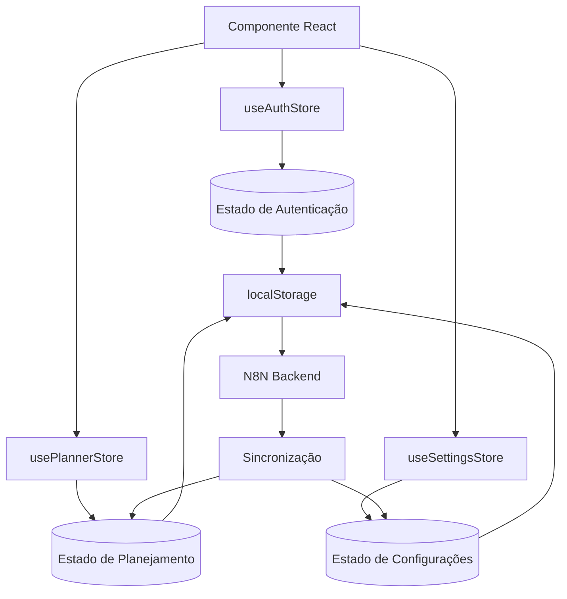
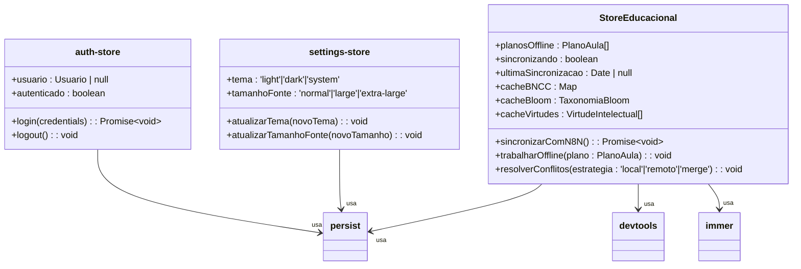
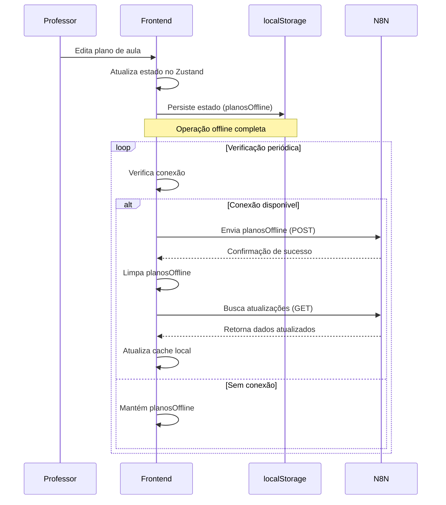

# Gerenciamento de Estado

<cite>
**Arquivos Referenciados neste Documento**  
- [package.json](file://package.json)
- [README.md](file://README.md)
- [SPECS.md](file://docs/development/SPECS.md)
- [utils.ts](file://src/lib/utils.ts)
- [theme-provider.tsx](file://src/providers/theme-provider.tsx)
</cite>

## Sumário

1. [Introdução](#introdução)
2. [Arquitetura de Estado com Zustand](#arquitetura-de-estado-com-zustand)
3. [Organização dos Stores](#organização-dos-stores)
4. [Padrões de Uso do Zustand](#padrões-de-uso-do-zustand)
5. [Gestão de Estado de Planejamento](#gestão-de-estado-de-planejamento)
6. [Integração com Offline-First](#integração-com-offline-first)
7. [Relação com Helpers e Utilitários](#relação-com-helpers-e-utilitários)
8. [Conclusão](#conclusão)

## Introdução

O sistema de gerenciamento de estado do VirtuQuest é construído sobre **Zustand
5.0.8**, uma escolha estratégica que supera as limitações da Context API para
estados globais complexos. Enquanto a Context API pode causar renderizações
desnecessárias e dificultar a depuração em aplicações grandes, o Zustand oferece
uma solução leve, performática e modular que se alinha perfeitamente com os
requisitos pedagógicos do sistema.

O VirtuQuest lida com múltiplas dimensões de estado crítico: autenticação de
usuário, plano pedagógico atual, configurações de interface e sincronização com
backend via N8N. O uso do Zustand permite que esses estados sejam gerenciados de
forma isolada, com acesso direto aos dados sem a necessidade de passar props
através da árvore de componentes, evitando o "prop drilling" e melhorando
significativamente a manutenibilidade do código.

A arquitetura offline-first do sistema exige um gerenciamento de estado robusto
que possa persistir dados localmente e sincronizá-los com o backend quando
possível. O Zustand, com seus middlewares de persistência e devtools, é a base
ideal para implementar esse fluxo, garantindo que os educadores possam planejar
suas aulas mesmo sem conexão com a internet.

**Section sources**

- [README.md](file://README.md#L46-L90)
- [package.json](file://package.json#L35-L36)

## Arquitetura de Estado com Zustand

A escolha do Zustand como biblioteca de gerenciamento de estado é uma decisão
arquitetural fundamental para o VirtuQuest. Diferentemente da Context API, que
força uma árvore de contexto única e pode levar a renderizações ineficientes, o
Zustand opera com stores independentes e leves, permitindo uma granularidade
fina no controle de estado.

Cada store no Zustand é um hook React autocontido que encapsula seu próprio
estado e lógica. Isso elimina a necessidade de um Provider no topo da árvore de
componentes, simplificando a estrutura da aplicação. Quando um componente
precisa acessar um estado, ele simplesmente importa e usa o hook correspondente,
resultando em um código mais limpo e direto.

O Zustand também oferece suporte nativo a middlewares poderosos, como `persist`
para armazenamento local, `devtools` para depuração em tempo real e `immer` para
mutações de estado imutáveis de forma imperativa. Esses middlewares são
essenciais para o VirtuQuest, especialmente o `persist`, que permite a
persistência offline dos planos de aula e configurações do usuário.

A integração com React é transparente, graças ao uso de subscrições internas que
garantem que apenas os componentes que dependem de um estado específico sejam
renderizados novamente quando esse estado muda. Isso resulta em uma performance
superior em comparação com a Context API, onde qualquer mudança no valor do
contexto pode causar renderizações em cascata.



**Diagram sources**

- [SPECS.md](file://docs/development/SPECS.md#L1227-L1298)
- [README.md](file://README.md#L46-L90)

## Organização dos Stores

A organização dos stores no diretório `src/stores/` seguirá uma estrutura
modular e por domínio, refletindo as principais funcionalidades do sistema.
Embora os arquivos ainda não tenham sido criados, o planejamento é claro e está
alinhado com as especificações do projeto.

O diretório `src/stores/` conterá stores especializados, cada um responsável por
uma área específica do estado global. A principal store será
`educational-store.ts`, que gerenciará o estado complexo do planejamento
pedagógico, incluindo planos de aula offline, cache inteligente de dados BNCC,
Bloom e Virtudes, e a lógica de sincronização com o backend N8N.

Além disso, serão criados stores separados para autenticação (`auth-store.ts`),
configurações de usuário (`settings-store.ts`) e estado da interface
(`ui-store.ts`). Essa separação por responsabilidade garante que cada store
permaneça focado e de fácil manutenção. O uso do middleware `persist` será
aplicado a stores que precisam sobreviver a recargas de página, como as
configurações do usuário e os planos de aula offline.

A estrutura de diretórios proposta é:

```
src/
└── stores/
    ├── auth-store.ts
    ├── educational-store.ts
    ├── settings-store.ts
    └── ui-store.ts
```

Essa organização clara facilita a descoberta e a colaboração entre
desenvolvedores, permitindo que novos membros da equipe compreendam rapidamente
onde encontrar e modificar a lógica de estado.

**Section sources**

- [README.md](file://README.md#L216-L277)
- [SPECS.md](file://docs/development/SPECS.md#L1227-L1298)

## Padrões de Uso do Zustand

Os padrões de uso do Zustand no VirtuQuest seguem as melhores práticas para
garantir um código robusto, testável e escalável. A criação de um store começa
com a definição de uma interface TypeScript que descreve a forma do estado e as
ações disponíveis.

O middleware `immer` é utilizado para permitir mutações de estado de forma
imperativa dentro dos redutores, enquanto o estado real permanece imutável. Isso
simplifica significativamente a lógica de atualização de objetos complexos, como
planos de aula aninhados, tornando o código mais legível e menos propenso a
erros.

O middleware `persist` é configurado para serializar apenas os dados essenciais,
usando a opção `partialize`. Por exemplo, no `educational-store`, apenas
`planosOffline` e `ultimaSincronizacao` serão persistidos no `localStorage`,
evitando o armazenamento desnecessário de caches ou estados transitórios.

O middleware `devtools` é habilitado em ambientes de desenvolvimento, permitindo
que os desenvolvedores inspecionem as mudanças de estado, revertam ações e
depurem problemas com facilidade. Isso é crucial para um sistema complexo como o
VirtuQuest, onde o estado pode mudar em resposta a múltiplas fontes (usuário,
IA, backend).

A integração com React é feita através de hooks personalizados, como
`useStoreEducacional`, que são exportados diretamente do arquivo do store. Os
componentes os consomem de forma simples, sem necessidade de wrappers ou
providers adicionais.



**Diagram sources**

- [SPECS.md](file://docs/development/SPECS.md#L1227-L1298)
- [theme-provider.tsx](file://src/providers/theme-provider.tsx#L43-L80)

## Gestão de Estado de Planejamento

O estado de planejamento é o coração do VirtuQuest, integrando as três dimensões
pedagógicas: BNCC, Taxonomia de Bloom e Virtudes Intelectuais. O
`educational-store` será responsável por gerenciar essa integração complexa,
fornecendo uma API coerente para os componentes da interface.

O store manterá um cache inteligente de dados BNCC, Bloom e Virtudes, reduzindo
a necessidade de chamadas repetidas ao backend. Esse cache será atualizado
durante a sincronização com o N8N, garantindo que os dados locais estejam sempre
atualizados. A utilização de estruturas de dados como `Map` para o `cacheBNCC`
permite buscas rápidas por código de habilidade.

A lógica de sincronização com o backend N8N será encapsulada dentro da ação
`sincronizarComN8N`. Essa ação seguirá um fluxo bem definido: primeiro, envia as
mudanças locais (planos offline) para o N8N; em seguida, busca atualizações
remotas; e finalmente, realiza um merge inteligente para resolver conflitos. A
estratégia de resolução de conflitos será configurável, permitindo que o usuário
escolha entre manter a versão local, remota ou tentar uma fusão.

O estado `sincronizando` será usado para controlar o fluxo de UI, desabilitando
ações de edição durante a sincronização e exibindo indicadores de progresso.
Isso é crucial para uma experiência de usuário suave em um sistema
offline-first.

**Section sources**

- [SPECS.md](file://docs/development/SPECS.md#L1227-L1298)
- [SPECS.md](file://docs/development/SPECS.md#L2285-L2364)

## Integração com Offline-First

A arquitetura offline-first do VirtuQuest é fundamental para sua adoção em
ambientes educacionais com conectividade instável. O Zustand, com o middleware
`persist`, é a espinha dorsal dessa funcionalidade, permitindo que o estado
crítico da aplicação seja armazenado localmente no `localStorage` do navegador.

Quando um professor cria ou edita um plano de aula, essas mudanças são
imediatamente salvas no `planosOffline` dentro do `educational-store` e
persistidas no armazenamento local. O usuário pode continuar trabalhando sem
interrupções, mesmo se a conexão com a internet for perdida.

A sincronização com o backend N8N ocorre em segundo plano, geralmente quando a
aplicação é iniciada ou em intervalos regulares. O sistema de webhooks do N8N é
usado para enviar os planos locais e receber atualizações. O fluxo de
sincronização é projetado para ser resiliente a falhas de rede, enfileirando as
operações e tentando novamente quando a conexão for restaurada.

A variável de ambiente `NEXT_PUBLIC_ENABLE_OFFLINE_MODE` (definida como `true`
por padrão) ativa essa funcionalidade, permitindo que ela seja desativada para
fins de depuração ou em ambientes de teste específicos. O uso do `localStorage`
como camada de persistência é uma escolha prática, embora em versões futuras
possa ser expandido para usar IndexedDB para armazenar volumes maiores de dados.



**Diagram sources**

- [SPECS.md](file://docs/development/SPECS.md#L1227-L1298)
- [env.ts](file://src/lib/env.ts#L26-L87)

## Relação com Helpers e Utilitários

Os helpers e utilitários no diretório `src/lib/` complementam o sistema de
estado, fornecendo funções puras para manipulação de dados que não pertencem à
lógica de estado em si. O arquivo `utils.ts` é um exemplo perfeito, contendo
funções como `cn` para mesclar classes CSS com resolução de conflitos do
Tailwind.

Essas funções são independentes do estado global e podem ser usadas em qualquer
parte da aplicação. Por exemplo, um componente que exibe um plano de aula pode
usar `cn` para aplicar estilos condicionais baseados no status do plano
(rascunho, aprovado, etc.), mas a decisão sobre qual status usar virá do
`educational-store`.

A separação clara entre estado (gerenciado pelo Zustand) e utilitários (funções
puras em `utils.ts`) promove a reutilização e a testabilidade. As funções em
`utils.ts` são fáceis de testar porque não têm efeitos colaterais e não dependem
de um estado externo.

Embora os utilitários atuais sejam focados em manipulação de UI, o sistema está
preparado para expandir com funções de validação e formatação específicas do
domínio educacional. Por exemplo, uma função `validarAlinhamentoBNCC` poderia
ser adicionada para verificar se um plano de aula cobre as competências
obrigatórias, e essa função poderia ser chamada dentro de uma ação do
`educational-store` antes de permitir a sincronização.

**Section sources**

- [utils.ts](file://src/lib/utils.ts#L0-L71)
- [SPECS.md](file://docs/development/SPECS.md#L1227-L1298)

## Conclusão

O sistema de gerenciamento de estado do VirtuQuest, baseado no Zustand, é uma
solução elegante e eficaz para os desafios de uma aplicação pedagógica complexa
e offline-first. Ao escolher o Zustand em vez da Context API, a arquitetura
ganha em simplicidade, performance e facilidade de depuração.

A organização planejada dos stores em `src/stores/` promete uma estrutura
modular e escalável, onde cada domínio de estado é claramente definido. Os
padrões de uso, com middlewares como `persist`, `devtools` e `immer`, garantem
que o estado seja robusto, persistente e fácil de desenvolver.

A gestão do estado de planejamento, que integra BNCC, Bloom e Virtudes, é o
cerne do sistema, e o Zustand fornece as ferramentas necessárias para gerenciar
essa complexidade de forma coerente. A integração com o fluxo offline-first é
perfeita, permitindo que os educadores sejam produtivos em qualquer situação de
conectividade.

Por fim, a relação harmoniosa entre o estado gerenciado pelo Zustand e os
helpers utilitários em `utils.ts` demonstra uma arquitetura bem pensada, onde
cada peça tem seu lugar e propósito. Isso resulta em um códigobase limpo,
manutenível e preparado para o futuro.
