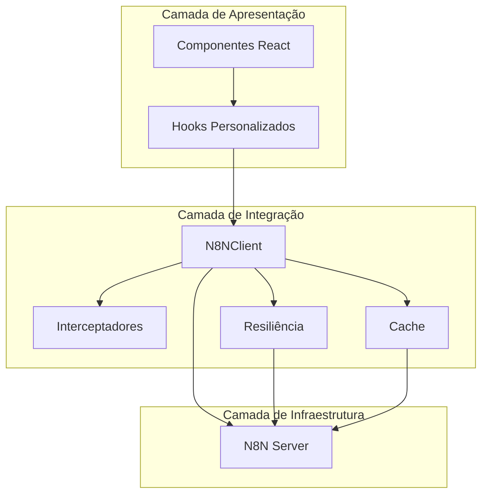
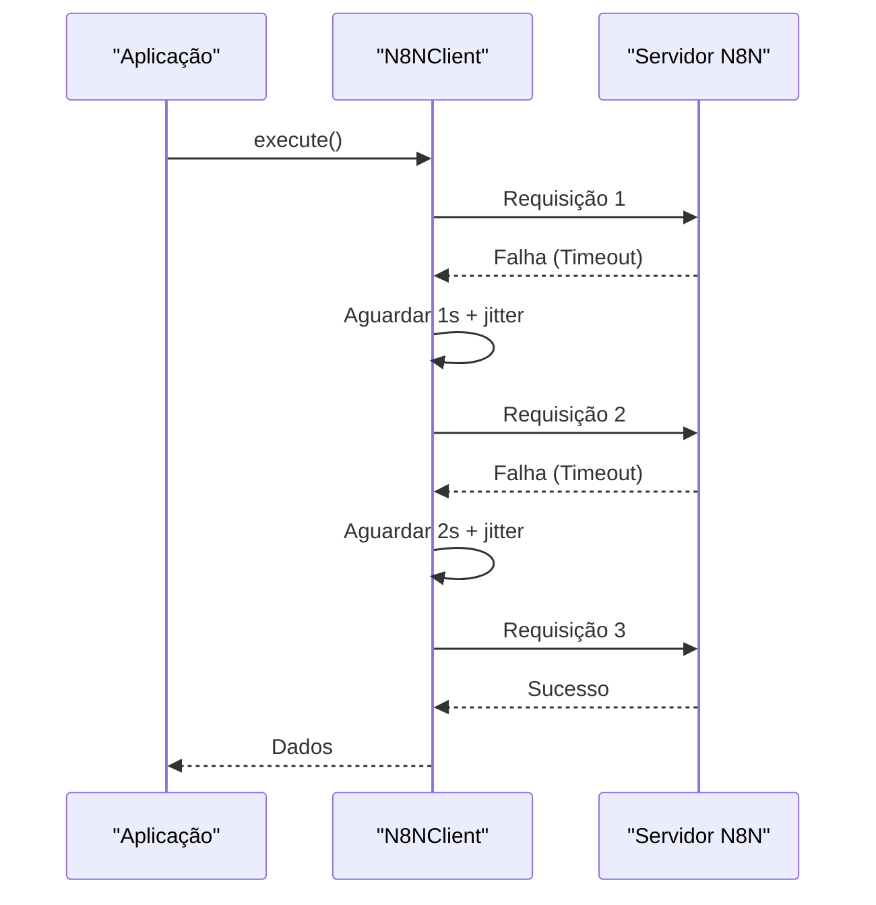
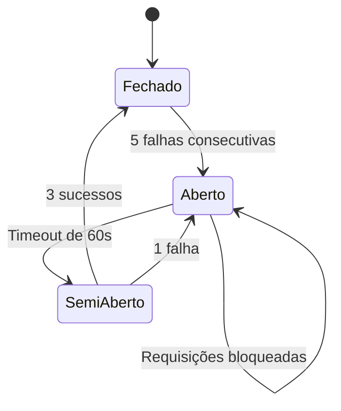
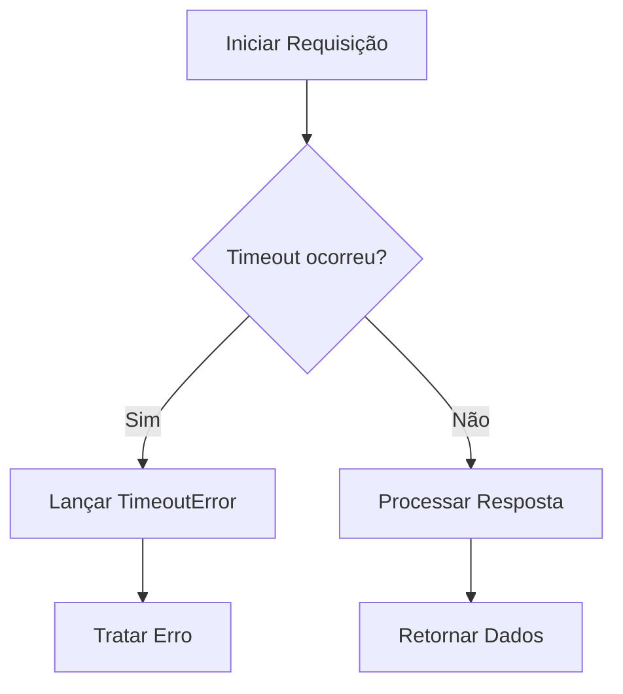
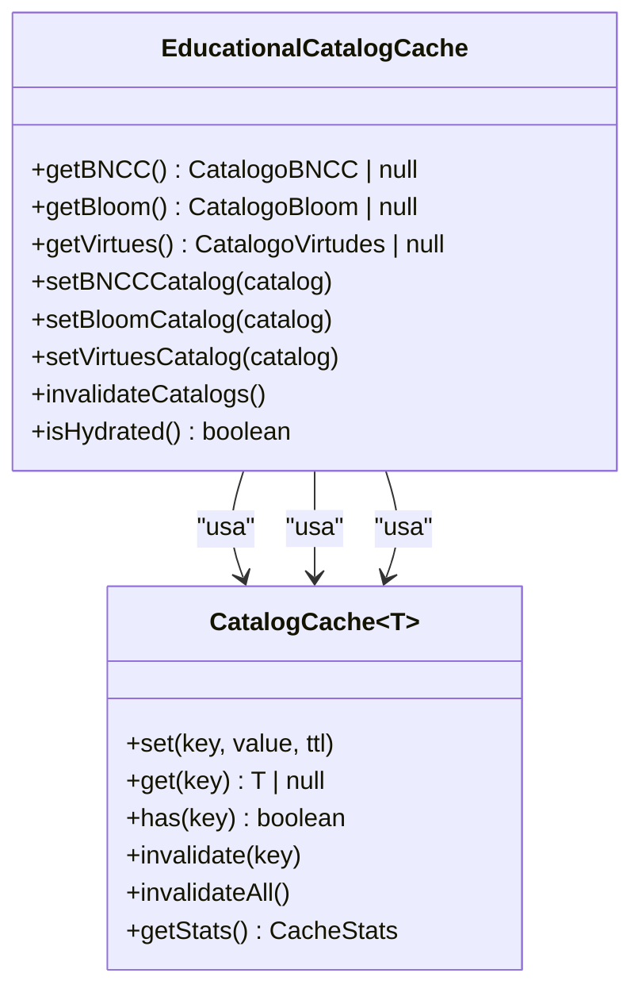
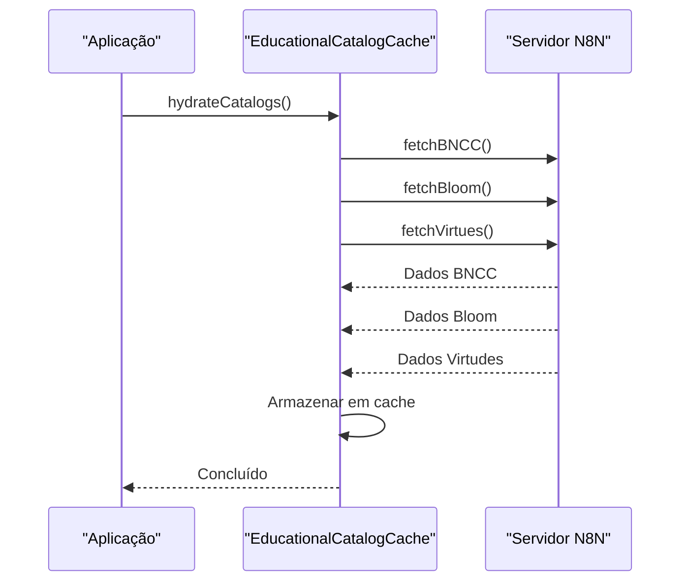
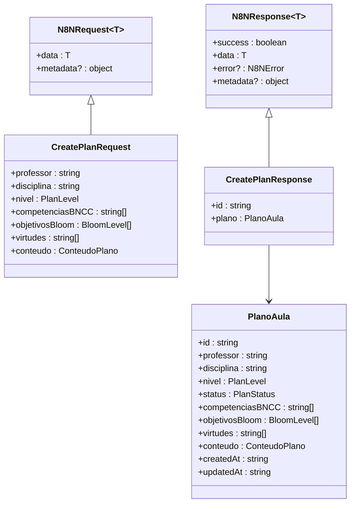
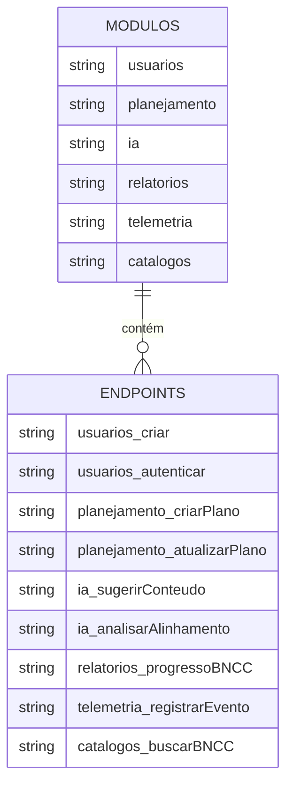
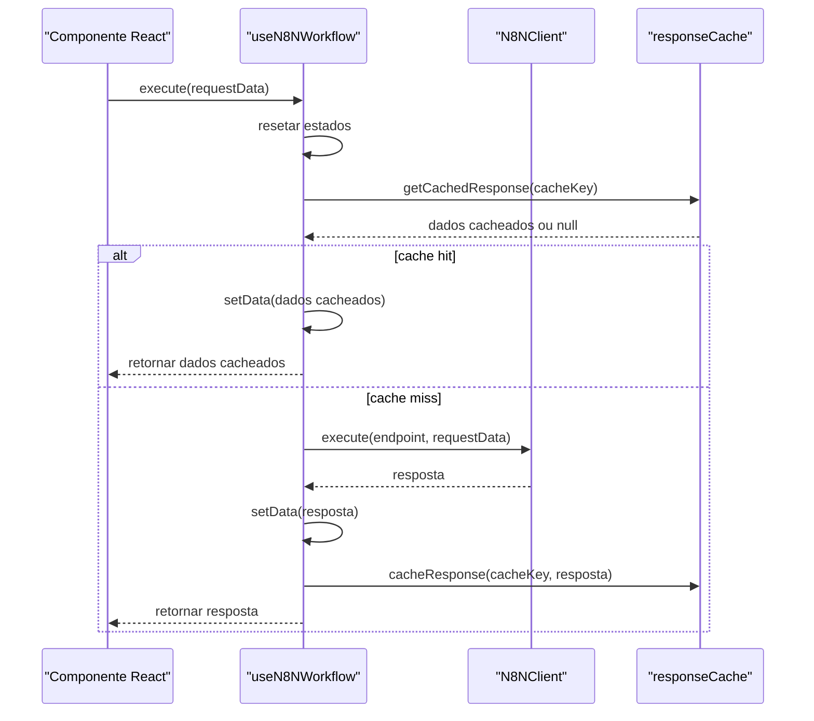

# Integração com N8N

<cite>
**Arquivos Referenciados neste Documento**   
- [client.ts](file://src/core/infrastructure/n8n/client.ts) - *Atualizado no commit recente*
- [types.ts](file://src/core/infrastructure/n8n/types.ts) - *Atualizado no commit recente*
- [endpoints.ts](file://src/core/infrastructure/n8n/endpoints.ts) - *Atualizado no commit recente*
- [errors.ts](file://src/core/infrastructure/n8n/errors.ts) - *Atualizado no commit recente*
- [retry.ts](file://src/core/infrastructure/resilience/retry.ts) - *Atualizado no commit recente*
- [circuit-breaker.ts](file://src/core/infrastructure/resilience/circuit-breaker.ts) - *Atualizado no commit recente*
- [timeout.ts](file://src/core/infrastructure/resilience/timeout.ts) - *Atualizado no commit recente*
- [catalog-cache.ts](file://src/core/infrastructure/cache/catalog-cache.ts) - *Adicionado no commit recente*
- [use-n8n-workflow.ts](file://src/hooks/use-n8n-workflow.ts) - *Atualizado no commit recente*
- [repository.ts](file://src/core/domain/perrenoud/repository.ts) - *Implementado no commit recente*
- [types.ts](file://src/core/domain/perrenoud/types.ts) - *Adicionado no commit recente*
</cite>

## Resumo das Atualizações

- Atualização da seção de arquitetura com base na implementação do domínio
  pedagógico
- Adição de detalhes sobre os repositórios de domínio BNCC, Bloom, Perrenoud e
  Virtudes
- Atualização dos diagramas para refletir a integração com os novos repositórios
  de domínio
- Revisão das estratégias de cache para incluir a hidratação paralela dos
  catálogos
- Atualização dos exemplos de uso com base nas mudanças na camada de integração
- Adição da nova implementação do repositório Perrenoud e sua integração com o
  sistema de cache

## Sumário

1. [Introdução](#introdução)
2. [Arquitetura da Camada de Integração](#arquitetura-da-camada-de-integração)
3. [Padrões de Resiliência](#padrões-de-resiliência)
4. [Estratégias de Cache](#estratégias-de-cache)
5. [API Tipada](#api-tipada)
6. [Exemplos de Uso](#exemplos-de-uso)
7. [Guia de Solução de Problemas](#guia-de-solução-de-problemas)
8. [Boas Práticas](#boas-práticas)

## Introdução

Este documento fornece uma análise abrangente da camada de integração com N8N no
projeto Virtuquest. A integração é implementada como uma camada de
infraestrutura robusta, projetada para garantir confiabilidade, desempenho e
facilidade de uso ao interagir com os fluxos de trabalho do N8N. A arquitetura
adota padrões modernos de resiliência, incluindo retry exponencial, circuit
breaker e timeout, além de implementar estratégias de cache eficientes para
dados estáticos. A API é completamente tipada usando TypeScript, proporcionando
segurança em tempo de compilação e melhor experiência de desenvolvimento.

## Arquitetura da Camada de Integração

A camada de integração com N8N é estruturada em torno de um cliente HTTP
centralizado, o `N8NClient`, que encapsula toda a lógica de comunicação com o
servidor N8N. Esta arquitetura segue o padrão de design "Facade", fornecendo uma
interface simples e consistente para o restante da aplicação.



**Fontes da Seção**

- [client.ts](file://src/core/infrastructure/n8n/client.ts#L125-L631)
- [index.ts](file://src/core/infrastructure/n8n/index.ts#L0-L32)

## Padrões de Resiliência

A integração implementa uma pilha completa de padrões de resiliência para lidar
com falhas transitórias e proteger o sistema contra falhas em cascata.

### Estratégia de Retry

A estratégia de retry utiliza backoff exponencial com jitter para evitar
sobrecarga no servidor. A configuração padrão permite até 3 tentativas, com
delay inicial de 1 segundo, dobrando a cada tentativa até um máximo de 10
segundos.



**Fontes do Diagrama**

- [retry.ts](file://src/core/infrastructure/resilience/retry.ts#L156-L237)
- [client.ts](file://src/core/infrastructure/n8n/client.ts#L125-L631)

### Circuit Breaker

O circuit breaker monitora o número de falhas consecutivas. Após 5 falhas, o
circuito é aberto, bloqueando temporariamente as requisições por 60 segundos.
Após esse período, o circuito entra em estado semi-aberto, permitindo um número
limitado de tentativas para verificar a recuperação do serviço.



**Fontes do Diagrama**

- [circuit-breaker.ts](file://src/core/infrastructure/resilience/circuit-breaker.ts#L69-L237)
- [client.ts](file://src/core/infrastructure/n8n/client.ts#L125-L631)

### Timeout

Todas as requisições possuem um timeout padrão de 30 segundos. O timeout pode
ser configurado globalmente ou por requisição específica. O gerenciador de
timeout utiliza `Promise.race` para cancelar requisições que excedam o tempo
limite.



**Fontes do Diagrama**

- [timeout.ts](file://src/core/infrastructure/resilience/timeout.ts#L77-L214)
- [client.ts](file://src/core/infrastructure/n8n/client.ts#L125-L631)

**Fontes da Seção**

- [retry.ts](file://src/core/infrastructure/resilience/retry.ts#L156-L237)
- [circuit-breaker.ts](file://src/core/infrastructure/resilience/circuit-breaker.ts#L69-L237)
- [timeout.ts](file://src/core/infrastructure/resilience/timeout.ts#L77-L214)

## Estratégias de Cache

A camada de integração implementa um sistema de cache em memória para dados
estáticos e de leitura frequente, reduzindo significativamente o número de
chamadas ao servidor N8N.

### Cache de Catálogos Educacionais

O `EducationalCatalogCache` gerencia três catálogos principais: BNCC, Bloom e
Virtudes. Cada catálogo possui um TTL configurável, definido nas variáveis de
ambiente (`CACHE_TTL_BNCC`, `CACHE_TTL_BLOOM`, `CACHE_TTL_VIRTUDES`).



**Fontes do Diagrama**

- [catalog-cache.ts](file://src/core/infrastructure/cache/catalog-cache.ts#L236-L390)
- [client.ts](file://src/core/infrastructure/n8n/client.ts#L125-L631)

### Hidratação de Cache

O cache pode ser hidratado de forma assíncrona com todos os catálogos em
paralelo, garantindo que os dados estejam disponíveis antes de operações
críticas.



**Fontes do Diagrama**

- [catalog-cache.ts](file://src/core/infrastructure/cache/catalog-cache.ts#L236-L390)
- [client.ts](file://src/core/infrastructure/n8n/client.ts#L550-L585)

**Fontes da Seção**

- [catalog-cache.ts](file://src/core/infrastructure/cache/catalog-cache.ts#L236-L390)
- [client.ts](file://src/core/infrastructure/n8n/client.ts#L500-L585)

## API Tipada

A API de integração com N8N é completamente tipada, proporcionando segurança em
tempo de compilação e melhor experiência de desenvolvimento.

### Tipos de Requisição e Resposta

Todos os endpoints possuem tipos específicos para requisição e resposta,
definidos no arquivo `types.ts`. O mapeamento entre endpoints e seus tipos é
feito através da interface `EndpointTypeMap`.



**Fontes do Diagrama**

- [types.ts](file://src/core/infrastructure/n8n/types.ts#L0-L446)
- [endpoints.ts](file://src/core/infrastructure/n8n/endpoints.ts#L43-L98)

### Endpoints Tipados

Os endpoints são definidos como uma constante tipada `N8N_ENDPOINTS`, organizada
hierarquicamente por módulo funcional (usuários, planejamento, IA, relatórios,
etc.).



**Fontes do Diagrama**

- [endpoints.ts](file://src/core/infrastructure/n8n/endpoints.ts#L43-L98)
- [types.ts](file://src/core/infrastructure/n8n/types.ts#L0-L446)

**Fontes da Seção**

- [types.ts](file://src/core/infrastructure/n8n/types.ts#L0-L446)
- [endpoints.ts](file://src/core/infrastructure/n8n/endpoints.ts#L43-L98)

## Exemplos de Uso

### Utilizando o Hook useN8NWorkflow

O hook `useN8NWorkflow` fornece uma interface React para executar workflows N8N
com gerenciamento de estado.



**Fontes do Diagrama**

- [use-n8n-workflow.ts](file://src/hooks/use-n8n-workflow.ts#L118-L201)
- [client.ts](file://src/core/infrastructure/n8n/client.ts#L184-L195)

### Hooks Especializados

A aplicação fornece hooks especializados para operações comuns, como
`useCreatePlan`, `useUpdatePlan`, etc.

```typescript
function CreatePlanForm() {
  const { execute, isLoading, error } = useCreatePlan({
    onSuccess: (plan) => {
      toast.success('Plano criado com sucesso!');
      router.push(`/planos/${plan.id}`);
    },
    onError: (error) => {
      toast.error(error.message);
    },
  });

  const handleSubmit = async (data: CreatePlanRequest) => {
    await execute(data);
  };

  return (
    <form onSubmit={handleSubmit}>
      <Button type="submit" disabled={isLoading}>
        {isLoading ? 'Criando...' : 'Criar Plano'}
      </Button>
      {error && <ErrorMessage error={error} />}
    </form>
  );
}
```

**Fontes da Seção**

- [use-n8n-workflow.ts](file://src/hooks/use-n8n-workflow.ts#L118-L201)
- [use-n8n-workflow.ts](file://src/hooks/use-n8n-workflow.ts#L210-L217)

## Guia de Solução de Problemas

### Erros Comuns e Soluções

A seguir estão os erros mais comuns e suas soluções:

| Erro                        | Causa Provável                                     | Solução                                                    |
| --------------------------- | -------------------------------------------------- | ---------------------------------------------------------- |
| **CircuitBreakerOpenError** | O serviço N8N está indisponível ou sobrecarregado  | Aguardar o tempo de reset (60 segundos) e tentar novamente |
| **TimeoutError**            | A requisição excedeu o tempo limite de 30 segundos | Verificar a conexão de rede e o status do servidor N8N     |
| **AuthenticationError**     | API key inválida ou ausente                        | Verificar a variável de ambiente N8N_API_KEY               |
| **ValidationError**         | Dados de entrada inválidos                         | Validar os dados de entrada conforme os tipos definidos    |
| **ConnectionRefusedError**  | Servidor N8N indisponível                          | Verificar se o servidor N8N está em execução e acessível   |

**Fontes da Seção**

- [errors.ts](file://src/core/infrastructure/n8n/errors.ts#L0-L439)
- [client.ts](file://src/core/infrastructure/n8n/client.ts#L125-L631)

## Boas Práticas

### Configuração de Retries

Utilize configurações de retry customizadas para operações críticas, ajustando o
número máximo de tentativas e o delay inicial conforme a criticidade da
operação.

```typescript
const { execute } = useCreatePlan({
  retryConfig: {
    maxRetries: 5,
    initialDelay: 2000,
  },
});
```

### Cache de Respostas

Habilite o cache de respostas para operações de leitura que não mudam
frequentemente, utilizando uma chave de cache significativa.

```typescript
const { execute } = useQueryPlans({
  enableCache: true,
  cacheKey: `plans-${userId}-${status}`,
});
```

### Tratamento de Erros

Sempre implemente callbacks de erro para fornecer feedback ao usuário e
registrar erros para análise posterior.

```typescript
const { execute } = useCreatePlan({
  onError: (error) => {
    console.error('Erro ao criar plano:', error);
    showErrorToast(error.message);
  },
});
```

### Monitoramento de Métricas

Utilize o método `getMetrics()` do `N8NClient` para monitorar o desempenho e a
saúde da integração.

```typescript
const metrics = n8nClient.getMetrics();
console.log('Taxa de sucesso:', metrics.successRate);
console.log('Tempo médio de resposta:', metrics.averageResponseTime);
```

**Fontes da Seção**

- [client.ts](file://src/core/infrastructure/n8n/client.ts#L600-L630)
- [use-n8n-workflow.ts](file://src/hooks/use-n8n-workflow.ts#L118-L201)
- [errors.ts](file://src/core/infrastructure/n8n/errors.ts#L0-L439)
