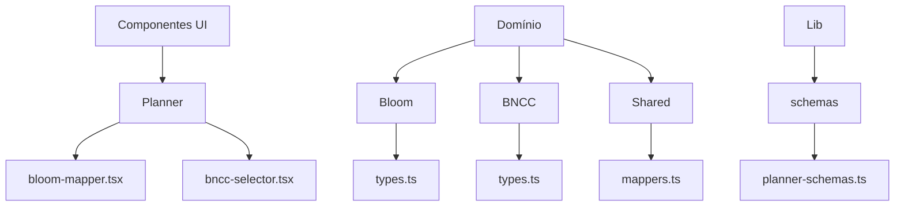
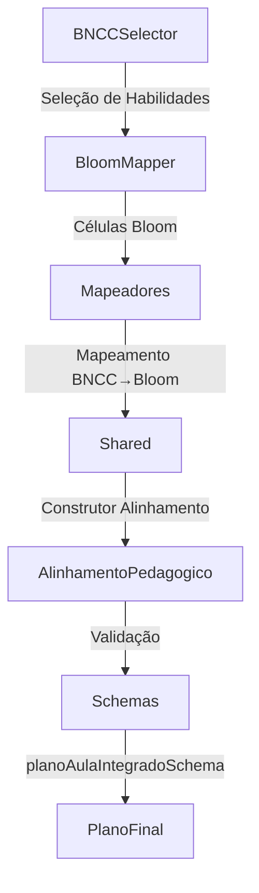
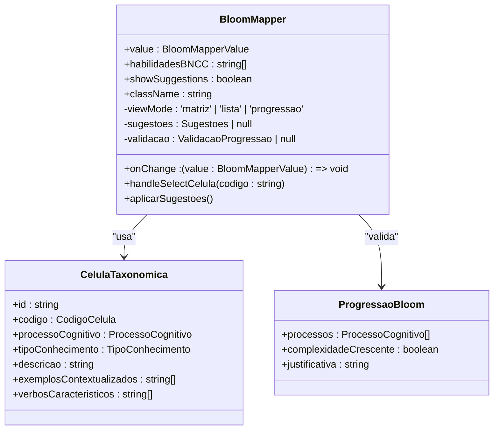
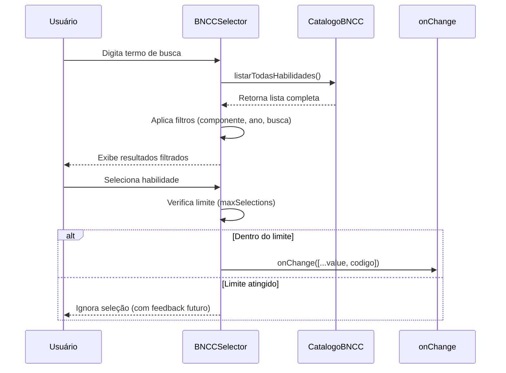
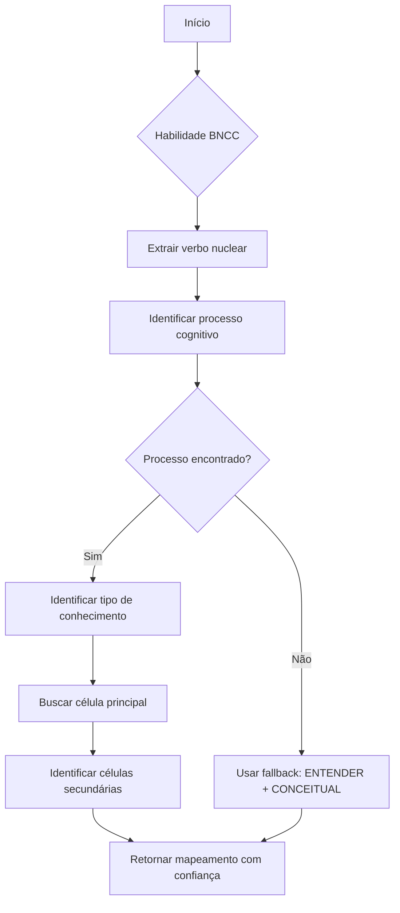
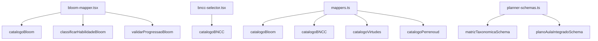

# Mapeadores de Alinhamento

<cite>
**Arquivos Referenciados neste Documento**  
- [bloom-mapper.tsx](file://src/components/planner/bloom-mapper.tsx)
- [bncc-selector.tsx](file://src/components/planner/bncc-selector.tsx)
- [types.ts](file://src/core/domain/bloom/types.ts)
- [types.ts](file://src/core/domain/bncc/types.ts)
- [mappers.ts](file://src/core/domain/shared/mappers.ts)
- [planner-schemas.ts](file://src/lib/schemas/planner-schemas.ts)
</cite>

## Sumário

1. [Introdução](#introdução)
2. [Estrutura do Projeto](#estrutura-do-projeto)
3. [Componentes Principais](#componentes-principais)
4. [Visão Geral da Arquitetura](#visão-geral-da-arquitetura)
5. [Análise Detalhada dos Componentes](#análise-detalhada-dos-componentes)
6. [Análise de Dependências](#análise-de-dependências)
7. [Considerações de Desempenho](#considerações-de-desempenho)
8. [Guia de Solução de Problemas](#guia-de-solução-de-problemas)
9. [Conclusão](#conclusão)

## Introdução

Os Mapeadores de Alinhamento Pedagógico são componentes centrais do sistema
VirtuQuest, projetados para integrar fundamentos pedagógicos como a Taxonomia de
Bloom, a Base Nacional Comum Curricular (BNCC) e virtudes intelectuais em um
plano de aula coerente. Este documento fornece uma análise abrangente de sua
finalidade, implementação, interfaces de API e padrões de integração, com
exemplos práticos e orientações para solução de problemas.

## Estrutura do Projeto

**Fontes do Diagrama**

- [bloom-mapper.tsx](file://src/components/planner/bloom-mapper.tsx)
- [bncc-selector.tsx](file://src/components/planner/bncc-selector.tsx)
- [types.ts](file://src/core/domain/bloom/types.ts)
- [types.ts](file://src/core/domain/bncc/types.ts)
- [mappers.ts](file://src/core/domain/shared/mappers.ts)
- [planner-schemas.ts](file://src/lib/schemas/planner-schemas.ts)

**Fontes da Seção**

- [bloom-mapper.tsx](file://src/components/planner/bloom-mapper.tsx)
- [bncc-selector.tsx](file://src/components/planner/bncc-selector.tsx)

## Componentes Principais

Os principais componentes de mapeamento são o `BloomMapper` e o `BNCCSelector`,
responsáveis pela seleção e visualização de objetivos de aprendizagem alinhados
à Taxonomia de Bloom e à BNCC, respectivamente. Ambos operam com base em
catálogos de domínio e fornecem interfaces interativas para suporte à decisão
pedagógica.

**Fontes da Seção**

- [bloom-mapper.tsx](file://src/components/planner/bloom-mapper.tsx#L1-L405)
- [bncc-selector.tsx](file://src/components/planner/bncc-selector.tsx#L1-L266)

## Visão Geral da Arquitetura

**Fontes do Diagrama**

- [bloom-mapper.tsx](file://src/components/planner/bloom-mapper.tsx)
- [bncc-selector.tsx](file://src/components/planner/bncc-selector.tsx)
- [mappers.ts](file://src/core/domain/shared/mappers.ts)
- [planner-schemas.ts](file://src/lib/schemas/planner-schemas.ts)

## Análise Detalhada dos Componentes

### Análise do BloomMapper

O componente `BloomMapper` permite o mapeamento visual de objetivos de
aprendizagem na matriz 6×4 da Taxonomia de Bloom Revisada (Anderson &
Krathwohl). Oferece três modos de visualização: matriz, lista e progressão
cognitiva.

#### Diagrama de Classe do BloomMapper

**Fontes do Diagrama**

- [bloom-mapper.tsx](file://src/components/planner/bloom-mapper.tsx#L1-L405)
- [types.ts](file://src/core/domain/bloom/types.ts#L1-L257)

**Fontes da Seção**

- [bloom-mapper.tsx](file://src/components/planner/bloom-mapper.tsx#L1-L405)
- [types.ts](file://src/core/domain/bloom/types.ts#L1-L257)

### Análise do BNCCSelector

O `BNCCSelector` é um componente de seleção múltipla que permite filtrar e
escolher habilidades da BNCC com base em critérios como componente curricular,
ano e código. Inclui validação de limite de seleção e exibição de habilidades
selecionadas.

#### Diagrama de Sequência do BNCCSelector

**Fontes do Diagrama**

- [bncc-selector.tsx](file://src/components/planner/bncc-selector.tsx#L1-L266)
- [types.ts](file://src/core/domain/bncc/types.ts#L1-L224)

**Fontes da Seção**

- [bncc-selector.tsx](file://src/components/planner/bncc-selector.tsx#L1-L266)
- [types.ts](file://src/core/domain/bncc/types.ts#L1-L224)

### Análise dos Mapeadores de Domínio

Os mapeadores implementam a lógica de alinhamento entre diferentes frameworks
pedagógicos. O `MapeadorBNCCBloom` converte habilidades BNCC em células da
Taxonomia de Bloom com base em verbos descritivos.

#### Diagrama de Fluxo do Mapeamento BNCC → Bloom

**Fontes do Diagrama**

- [mappers.ts](file://src/core/domain/shared/mappers.ts#L1-L473)
- [types.ts](file://src/core/domain/bloom/types.ts#L1-L257)
- [types.ts](file://src/core/domain/bncc/types.ts#L1-L224)

**Fontes da Seção**

- [mappers.ts](file://src/core/domain/shared/mappers.ts#L1-L473)

## Análise de Dependências

**Fontes do Diagrama**

- [bloom-mapper.tsx](file://src/components/planner/bloom-mapper.tsx)
- [bncc-selector.tsx](file://src/components/planner/bncc-selector.tsx)
- [mappers.ts](file://src/core/domain/shared/mappers.ts)
- [planner-schemas.ts](file://src/lib/schemas/planner-schemas.ts)

**Fontes da Seção**

- [bloom-mapper.tsx](file://src/components/planner/bloom-mapper.tsx)
- [bncc-selector.tsx](file://src/components/planner/bncc-selector.tsx)
- [mappers.ts](file://src/core/domain/shared/mappers.ts)
- [planner-schemas.ts](file://src/lib/schemas/planner-schemas.ts)

## Considerações de Desempenho

Os mapeadores utilizam memoização (`useMemo`) para evitar cálculos
desnecessários em renderizações. O `BNCCSelector` limita a exibição a 50
resultados para manter a performance. O `ConstrutorAlinhamento` realiza
mapeamentos em lote, otimizando o processamento de múltiplas habilidades.

## Guia de Solução de Problemas

- **Sugestões não aparecem no BloomMapper**: Verifique se `habilidadesBNCC` está
  preenchido e `showSuggestions` é verdadeiro.
- **Habilidades não são encontradas no BNCCSelector**: Confirme se o código está
  no formato correto (ex: EF67LP08).
- **Erro de validação de progressão Bloom**: A sequência de processos cognitivos
  não pode regredir (ex: de ANALISAR para LEMBRAR).
- **Confiança baixa no mapeamento BNCC→Bloom**: O verbo nuclear da habilidade
  não foi identificado; o sistema usa fallback para ENTENDER.

**Fontes da Seção**

- [bloom-mapper.tsx](file://src/components/planner/bloom-mapper.tsx#L1-L405)
- [bncc-selector.tsx](file://src/components/planner/bncc-selector.tsx#L1-L266)
- [mappers.ts](file://src/core/domain/shared/mappers.ts#L1-L473)
- [planner-schemas.ts](file://src/lib/schemas/planner-schemas.ts#L1-L453)

## Conclusão

Os Mapeadores de Alinhamento Pedagógico fornecem uma base robusta para a
integração de frameworks educacionais no planejamento de aulas. Sua arquitetura
modular e baseada em domínio permite extensibilidade e coerência pedagógica,
enquanto os componentes UI oferecem uma experiência interativa e informativa
para educadores.
