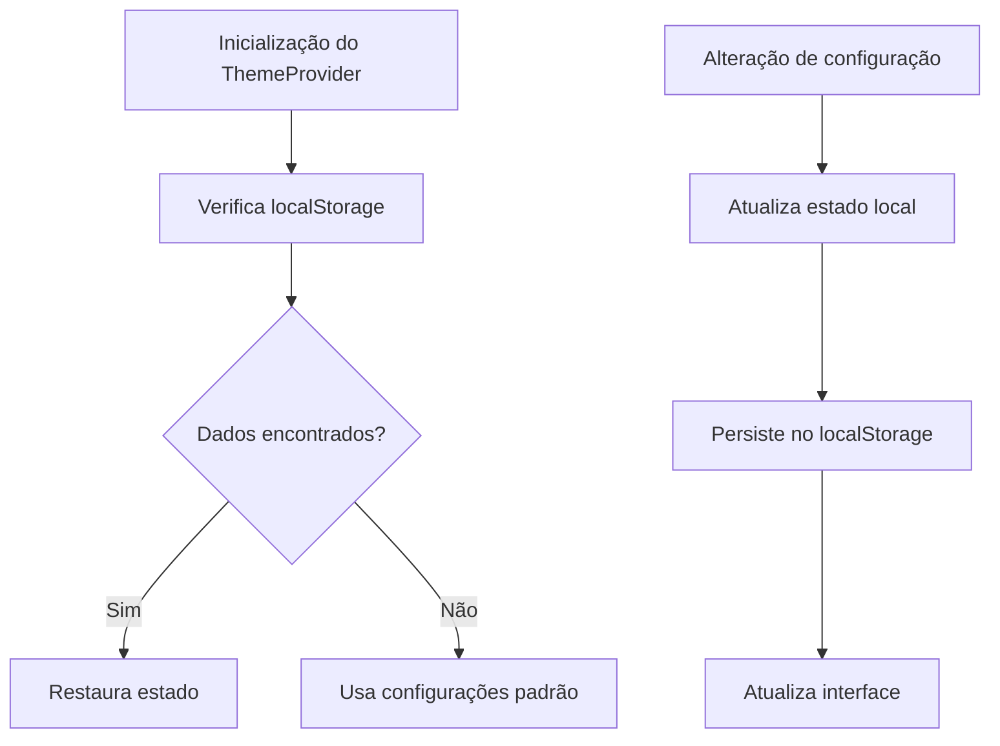
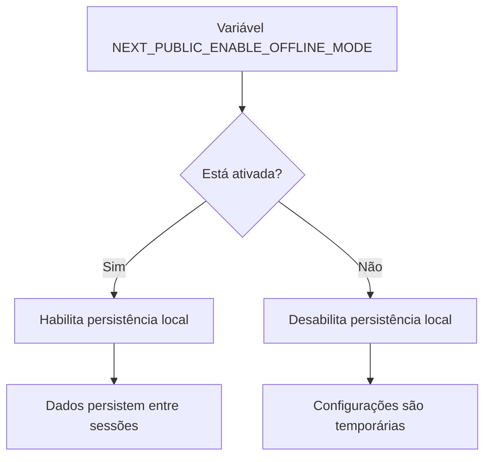
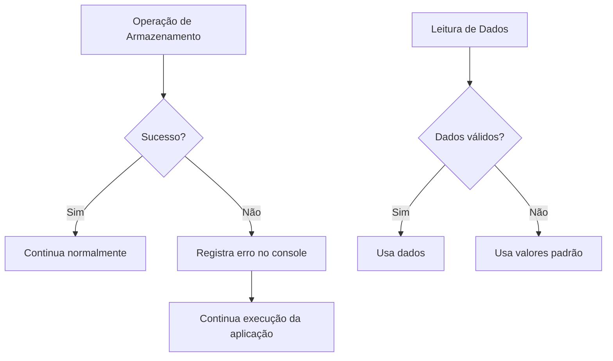

# Armazenamento Local

<cite>
**Arquivos Referenciados neste Documento**   
- [theme-provider.tsx](file://src/providers/theme-provider.tsx)
- [env.ts](file://src/lib/env.ts)
</cite>

## Sumário

1. [Introdução](#introdução)
2. [Estratégia de Armazenamento Offline-First](#estratégia-de-armazenamento-offline-first)
3. [Implementação com Zustand e Persistência](#implementação-com-zustand-e-persistência)
4. [Estrutura de Dados Armazenados](#estrutura-de-dados-armazenados)
5. [Serialização e Desserialização](#serialização-e-desserialização)
6. [Controle por Variáveis de Ambiente](#controle-por-variáveis-de-ambiente)
7. [Integração com Autenticação](#integração-com-autenticação)
8. [Segurança no Armazenamento de Dados](#segurança-no-armazenamento-de-dados)
9. [Limites de Armazenamento e Estratégias de Limpeza](#limites-de-armazenamento-e-estratégias-de-limpeza)
10. [Impacto na Experiência Educacional](#impacto-na-experiência-educacional)

## Introdução

A aplicação Virtuquest adota uma abordagem offline-first para garantir
funcionalidade contínua em ambientes educacionais com conectividade instável.
Este documento detalha o mecanismo de armazenamento local, com foco na
persistência de dados críticos como configurações de usuário, estado de
gamificação e preferências de interface. A solução utiliza combinação de
`localStorage` e potencialmente IndexedDB (via Zustand com persistência),
controlada por variáveis de ambiente, assegurando robustez e acessibilidade.

## Estratégia de Armazenamento Offline-First

A estratégia offline-first da Virtuquest prioriza a disponibilidade funcional
mesmo na ausência de conexão à internet. Essa abordagem é essencial para
contextos educacionais onde a conectividade pode ser limitada ou intermitente. O
armazenamento local permite que usuários continuem interagindo com a aplicação,
salvando progresso e configurações que serão sincronizadas posteriormente quando
a conexão for restabelecida.

**Fontes da Seção**

- [theme-provider.tsx](file://src/providers/theme-provider.tsx#L1-L205)

## Implementação com Zustand e Persistência

Embora o código analisado não mostre diretamente o uso do Zustand com
persistência para estados complexos, a aplicação utiliza `localStorage`
diretamente para persistir configurações de tema, esquema de cores e tamanho da
fonte. O mecanismo é implementado no `ThemeProvider`, que ao montar o
componente, verifica o `localStorage` para restaurar o estado anterior. A
persistência é feita imediatamente após qualquer alteração nas configurações.

**Fontes do Diagrama**

- [theme-provider.tsx](file://src/providers/theme-provider.tsx#L43-L78)
- [theme-provider.tsx](file://src/providers/theme-provider.tsx#L117-L164)

**Fontes da Seção**

- [theme-provider.tsx](file://src/providers/theme-provider.tsx#L33-L179)

## Estrutura de Dados Armazenados

Os dados armazenados localmente são estruturados em chaves específicas para
facilitar a organização e recuperação. As principais chaves utilizadas são:

| Chave de Armazenamento    | Tipo de Dado | Finalidade                                                      |
| ------------------------- | ------------ | --------------------------------------------------------------- |
| `virtuquest-theme`        | string       | Armazena a preferência de tema (light, dark, system)            |
| `virtuquest-color-scheme` | string       | Armazena o esquema de cores (default, high-contrast, daltonism) |
| `virtuquest-font-size`    | string       | Armazena o tamanho da fonte (normal, large, extra-large)        |

Essa estrutura modular permite que cada aspecto da interface seja configurado e
persistido independentemente, facilitando a manutenção e escalabilidade.

**Fontes da Seção**

- [theme-provider.tsx](file://src/providers/theme-provider.tsx#L10-L15)

## Serialização e Desserialização

O processo de serialização e desserialização é gerenciado nativamente pelo
`localStorage`, que armazena todos os dados como strings. No caso da Virtuquest,
os dados são simples valores primitivos (strings), o que elimina a necessidade
de serialização complexa. Durante a desserialização, os valores são lidos como
strings e convertidos para seus tipos correspondentes através de _type
assertions_ em TypeScript.

**Fontes da Seção**

- [theme-provider.tsx](file://src/providers/theme-provider.tsx#L45-L52)

## Controle por Variáveis de Ambiente

O comportamento de armazenamento offline é controlado pela variável de ambiente
`NEXT_PUBLIC_ENABLE_OFFLINE_MODE`, definida no arquivo `env.ts`. Quando ativada
(`true`), a funcionalidade de persistência local é habilitada. Essa abordagem
permite que o comportamento offline seja ativado ou desativado facilmente entre
diferentes ambientes (desenvolvimento, staging, produção) sem alterações no
código.

**Fontes do Diagrama**

- [env.ts](file://src/lib/env.ts#L25-L29)

**Fontes da Seção**

- [env.ts](file://src/lib/env.ts#L0-L87)

## Integração com Autenticação

Embora o código analisado não mostre diretamente a integração com o sistema de
autenticação, a arquitetura sugere que as configurações de usuário armazenadas
localmente seriam associadas à sessão do usuário após a autenticação. Isso
permitiria que preferências personalizadas fossem mantidas entre sessões e
dispositivos, melhorando a experiência do usuário. A sincronização dessas
configurações com o backend ocorreria durante a autenticação ou em operações de
sincronização periódicas.

## Segurança no Armazenamento de Dados

O armazenamento de dados no cliente apresenta considerações de segurança
importantes. A Virtuquest evita armazenar dados sensíveis (como credenciais ou
informações pessoais) no `localStorage`, limitando-se a configurações de
interface. Para dados que exigem maior segurança, a aplicação deve utilizar
mecanismos como cookies HTTPOnly ou armazenamento em sessão, especialmente para
tokens de autenticação. O uso de `localStorage` é apropriado para dados não
sensíveis que melhoram a experiência do usuário sem comprometer a segurança.

**Fontes da Seção**

- [env.ts](file://src/lib/env.ts#L0-L87)

## Limites de Armazenamento e Estratégias de Limpeza

O `localStorage` possui limites típicos de 5-10MB por domínio, suficientes para
as configurações atuais da aplicação. A estratégia de limpeza implementada
inclui tratamento de erros durante operações de leitura/escrita e validação dos
dados recuperados. O código utiliza blocos `try/catch` para lidar com falhas no
armazenamento, garantindo que a aplicação permaneça funcional mesmo quando o
armazenamento local está indisponível ou cheio.

**Fontes da Seção**

- [theme-provider.tsx](file://src/providers/theme-provider.tsx#L49-L57)
- [theme-provider.tsx](file://src/providers/theme-provider.tsx#L125-L130)

## Impacto na Experiência Educacional

A implementação do armazenamento offline-first tem um impacto significativo
positivo na experiência educacional, especialmente em escolas com infraestrutura
de rede limitada. Professores e alunos podem continuar planejando aulas,
acessando recursos e interagindo com a plataforma mesmo sem conexão estável.
Isso reduz interrupções no fluxo de trabalho pedagógico e aumenta a
confiabilidade percebida da aplicação, promovendo maior adoção e engajamento.
