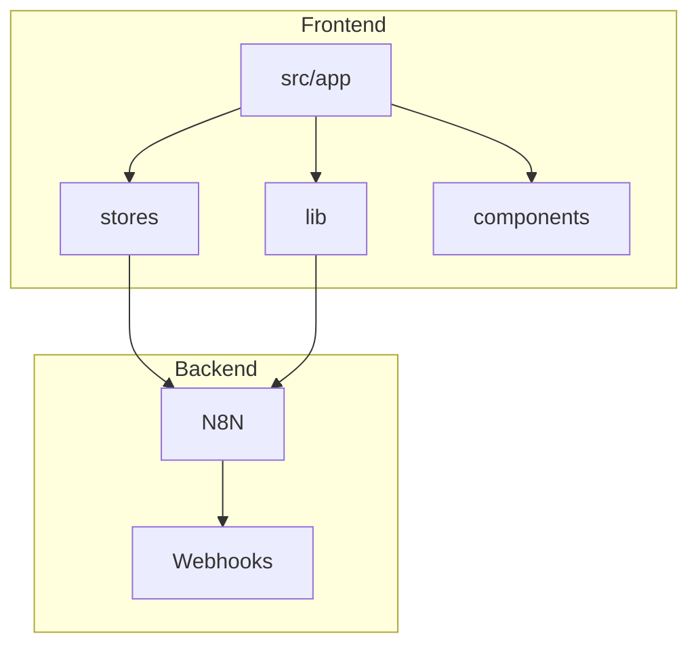
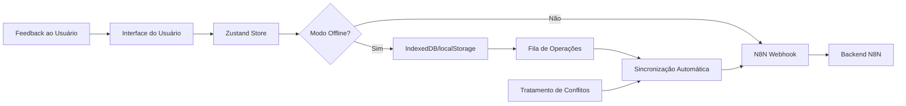
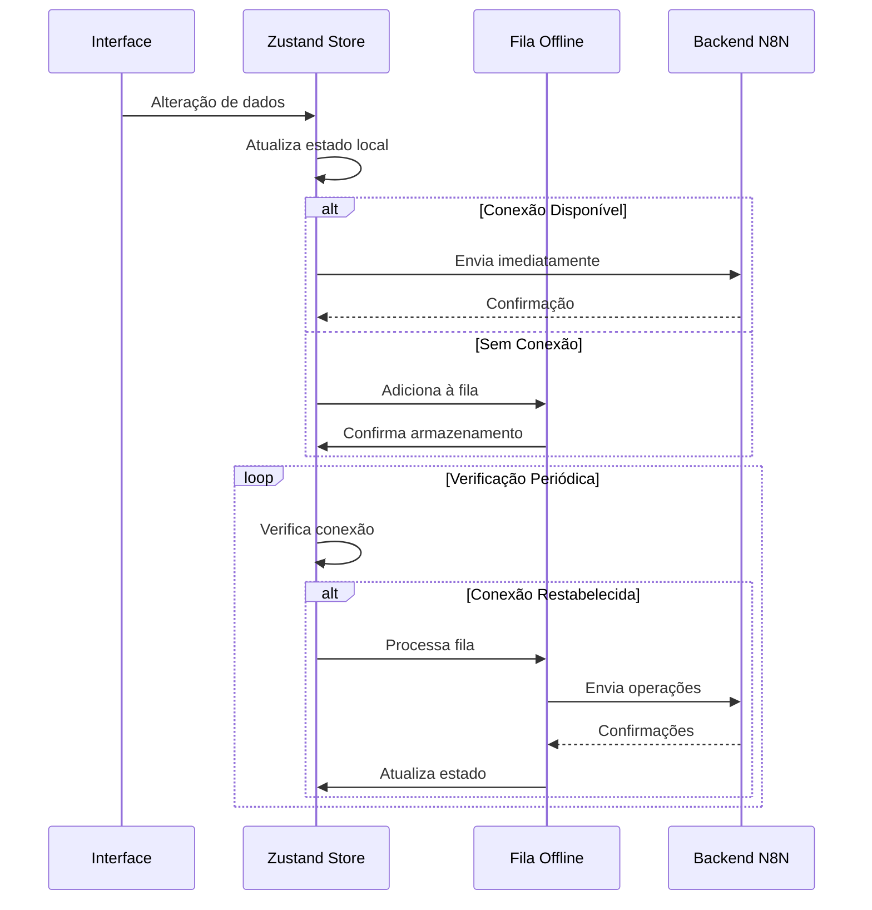
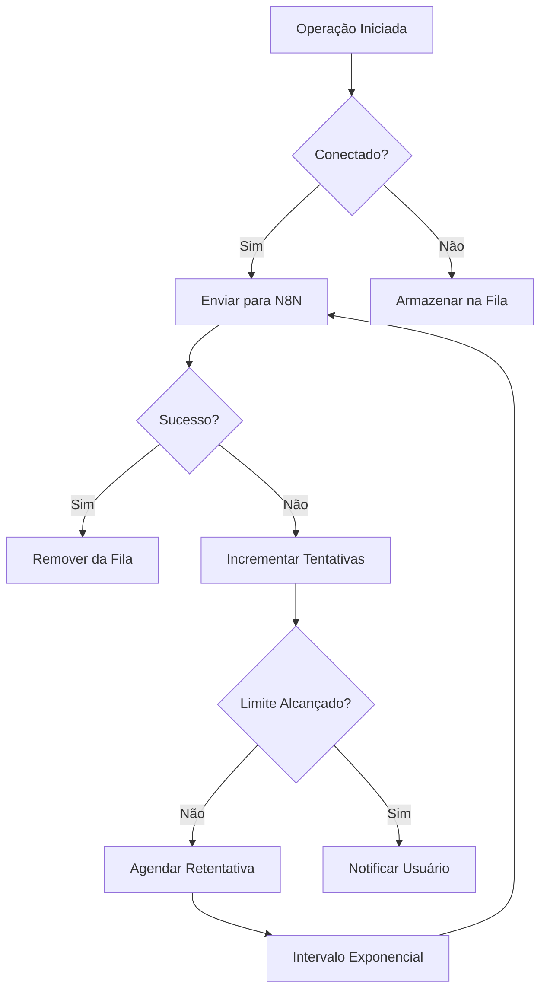
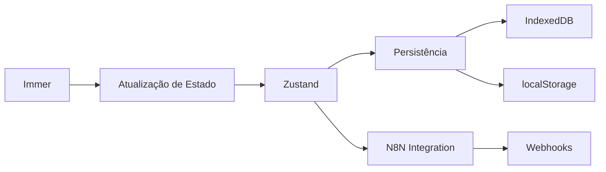

# Offline-First e Sincronização

<cite>
**Arquivos Referenciados neste Documento**  
- [env.ts](file://src/lib/env.ts)
- [README.md](file://README.md)
- [package.json](file://package.json)
</cite>

## Sumário

1. [Introdução](#introdução)
2. [Estrutura do Projeto](#estrutura-do-projeto)
3. [Componentes Principais](#componentes-principais)
4. [Visão Geral da Arquitetura](#visão-geral-da-arquitetura)
5. [Análise Detalhada dos Componentes](#análise-detalhada-dos-componentes)
6. [Análise de Dependências](#análise-de-dependências)
7. [Considerações de Desempenho](#considerações-de-desempenho)
8. [Guia de Solução de Problemas](#guia-de-solução-de-problemas)
9. [Conclusão](#conclusão)

## Introdução

A aplicação VirtuQuest é projetada com uma abordagem offline-first, permitindo
que educadores planejem suas aulas mesmo em ambientes com conectividade
instável. Esta documentação detalha a arquitetura de armazenamento local,
sincronização com o backend N8N, tratamento de conflitos e experiência do
usuário em cenários offline.

## Estrutura do Projeto

**Fontes do Diagrama**

- [README.md](file://README.md#L115-L159)

**Fontes da Seção**

- [README.md](file://README.md#L115-L159)

## Componentes Principais

A aplicação utiliza Zustand como solução de gerenciamento de estado com
persistência local, permitindo o armazenamento de dados no IndexedDB ou
localStorage. A sincronização com o backend N8N é configurável através de
variáveis de ambiente, com suporte a modos offline e mock para desenvolvimento.

O recurso offline é controlado pela feature flag
`NEXT_PUBLIC_ENABLE_OFFLINE_MODE`, que quando ativada, permite que a aplicação
funcione sem conexão com a internet, armazenando operações em uma fila para
posterior sincronização.

**Fontes da Seção**

- [env.ts](file://src/lib/env.ts#L29-L87)
- [README.md](file://README.md#L168-L216)

## Visão Geral da Arquitetura

**Fontes do Diagrama**

- [env.ts](file://src/lib/env.ts#L29-L87)
- [README.md](file://README.md#L46-L90)

## Análise Detalhada dos Componentes

### Armazenamento Local com Zustand

O estado da aplicação é persistido localmente utilizando o middleware de
persistência do Zustand, que automaticamente sincroniza o estado com o
armazenamento do navegador (IndexedDB ou localStorage). Isso garante que os
dados do planejamento pedagógico permaneçam disponíveis mesmo após recargas ou
desconexões.

A configuração do armazenamento respeita as preferências do usuário e as
capacidades do dispositivo, priorizando o IndexedDB para grandes volumes de
dados e fallback para localStorage quando necessário.

**Fontes da Seção**

- [package.json](file://package.json#L38-L39)
- [README.md](file://README.md#L46-L90)

### Sincronização com N8N

A comunicação com o backend ocorre através de webhooks N8N, configuráveis via
variável de ambiente `N8N_BASE_URL`. Quando a conexão está disponível, as
operações armazenadas localmente são enviadas em lote para o servidor, seguindo
uma política de retry configurável.

O sistema implementa uma fila de operações que prioriza as ações críticas e
garante a ordem de execução, tratando adequadamente os conflitos que possam
surgir durante a sincronização.

**Fontes do Diagrama**

- [env.ts](file://src/lib/env.ts#L0-L87)
- [README.md](file://README.md#L46-L90)

### Tratamento de Conflitos e Retentativas

O sistema implementa estratégias robustas de tratamento de conflitos, utilizando
timestamps e identificadores únicos para resolver discrepâncias entre versões
local e remota dos dados. As políticas de retry são configuráveis através das
variáveis de ambiente, permitindo ajuste fino do comportamento conforme as
condições de rede.

As operações falhas são mantidas na fila com um contador de tentativas, sendo
reprocessadas com intervalos exponenciais até o sucesso ou limite máximo.

**Fontes do Diagrama**

- [env.ts](file://src/lib/env.ts#L29-L87)
- [README.md](file://README.md#L168-L216)

### Feedback ao Usuário

O sistema fornece feedback contínuo sobre o estado de sincronização, utilizando
indicadores visuais para informar se os dados estão sincronizados, pendentes ou
em conflito. Isso é especialmente importante em ambientes educacionais com
conectividade instável, onde professores precisam saber se suas alterações foram
salvas permanentemente.

Os estados de sincronização são exibidos de forma clara na interface, com cores
e ícones intuitivos que comunicam o status atual da conexão e das operações
pendentes.

**Fontes da Seção**

- [env.ts](file://src/lib/env.ts#L29-L87)
- [README.md](file://README.md#L168-L216)

## Análise de Dependências

**Fontes do Diagrama**

- [package.json](file://package.json#L38-L39)
- [README.md](file://README.md#L46-L90)

**Fontes da Seção**

- [package.json](file://package.json#L0-L70)
- [README.md](file://README.md#L46-L90)

## Considerações de Desempenho

A abordagem offline-first melhora significativamente a experiência do usuário em
áreas com conectividade precária, comum em instituições educacionais. O uso de
Zustand com persistência reduz a latência das operações locais, enquanto a
sincronização em lote otimiza o uso da largura de banda.

A configuração de timeouts e políticas de retry deve ser ajustada conforme o
ambiente de implantação, balanceando a agressividade das retentativas com o
consumo de recursos do dispositivo.

**Fontes da Seção**

- [env.ts](file://src/lib/env.ts#L29-L87)

## Guia de Solução de Problemas

Problemas comuns relacionados à sincronização offline incluem falhas
persistentes na comunicação com o N8N, conflitos de dados não resolvidos e
consumo excessivo de armazenamento local. A verificação das variáveis de
ambiente e dos logs de sincronização é essencial para diagnóstico.

A feature flag `NEXT_PUBLIC_SHOW_DEBUG_INFO` pode ser ativada para exibir
informações detalhadas sobre o estado da conexão e operações pendentes,
auxiliando na identificação de problemas.

**Fontes da Seção**

- [env.ts](file://src/lib/env.ts#L29-L87)
- [README.md](file://README.md#L261-L277)

## Conclusão

A arquitetura offline-first do VirtuQuest, baseada em Zustand com persistência e
sincronização com N8N, oferece uma solução robusta para o planejamento
pedagógico em ambientes com conectividade instável. O design cuidadoso do
armazenamento local, fila de operações e tratamento de conflitos garante a
integridade dos dados enquanto proporciona uma experiência de usuário fluida.

A implementação futura deve focar na melhoria das estratégias de resolução de
conflitos e na otimização do consumo de recursos, especialmente em dispositivos
móveis com armazenamento limitado.
