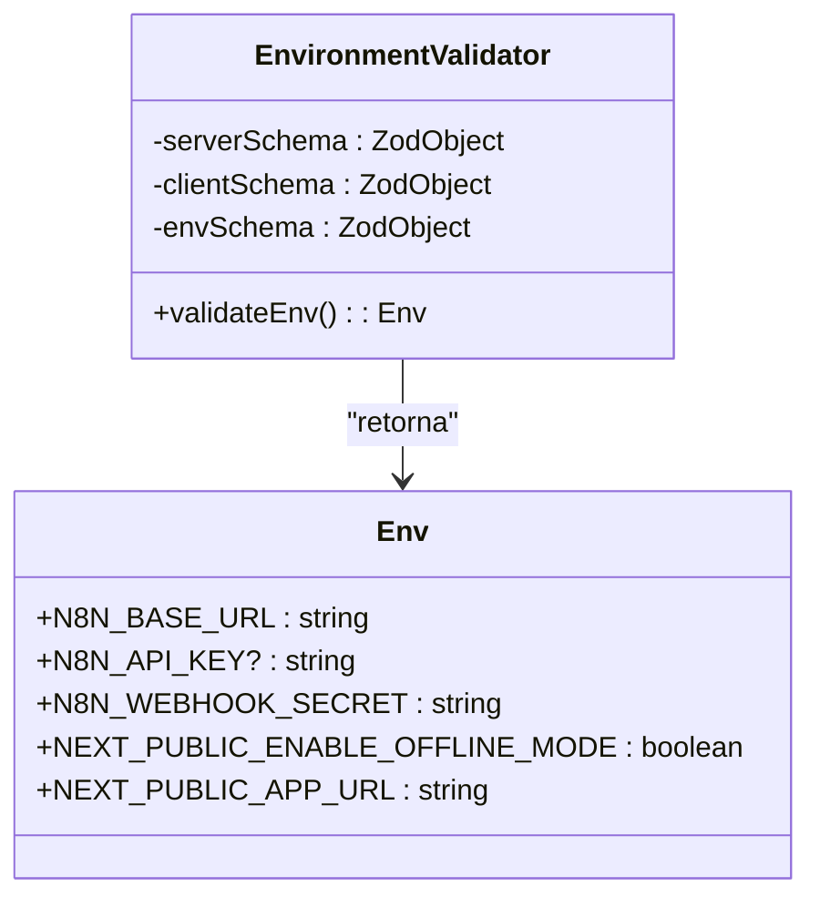
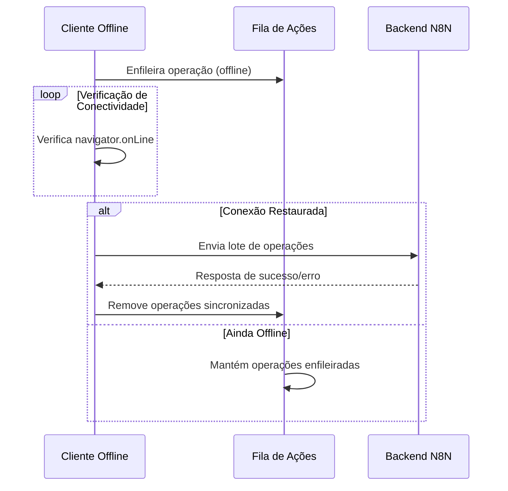

# Sincronização com Backend

<cite>
**Arquivos Referenciados neste Documento**  
- [env.ts](file://src/lib/env.ts)
- [next.config.ts](file://next.config.ts)
</cite>

## Sumário
1. [Introdução](#introdução)
2. [Gerenciamento de Credenciais e Segurança](#gerenciamento-de-credenciais-e-segurança)
3. [Roteamento de API com Rewrites no Next.js](#roteamento-de-api-com-rewrites-no-nextjs)
4. [Processo de Sincronização Offline](#processo-de-sincronização-offline)
5. [Estratégias de Retry e Tolerância a Falhas](#estratégias-de-retry-e-tolerância-a-falhas)
6. [Feedback Visual ao Usuário](#feedback-visual-ao-usuário)
7. [Considerações de Desempenho em Ambientes com Baixa Largura de Banda](#considerações-de-desempenho-em-ambientes-com-baixa-largura-de-banda)
8. [Conclusão](#conclusão)

## Introdução

A aplicação Virtuquest foi projetada para operar em ambientes educacionais com infraestrutura de rede limitada, onde a conectividade com o backend pode ser intermitente. Para garantir continuidade e confiabilidade, o sistema implementa um mecanismo robusto de sincronização entre o cliente offline e o backend N8N. Este documento detalha a arquitetura e implementação dessa funcionalidade, abrangendo desde a enfileiragem de operações offline até a detecção de restauração de conexão, uso de webhooks, roteamento seguro e estratégias de resiliência.

## Gerenciamento de Credenciais e Segurança

O acesso seguro ao backend N8N é garantido através do gerenciamento rigoroso de credenciais sensíveis, como `N8N_API_KEY` e `N8N_WEBHOOK_SECRET`. Essas variáveis são validadas em tempo de execução usando Zod, garantindo tipagem segura e integridade dos dados.

As credenciais são divididas entre variáveis do lado do servidor e do cliente:

- **Variáveis do servidor (privadas)**: Incluem `N8N_API_KEY`, `N8N_WEBHOOK_SECRET`, `JWT_SECRET`, e outras chaves sensíveis que nunca são expostas ao cliente.
- **Variáveis do cliente (públicas)**: Prefixadas com `NEXT_PUBLIC_`, como `NEXT_PUBLIC_APP_URL` e `NEXT_PUBLIC_ENABLE_OFFLINE_MODE`, que controlam funcionalidades do frontend.

A validação é realizada no arquivo `env.ts`, onde um esquema combinado assegura que todas as variáveis obrigatórias estejam presentes e em conformidade com os tipos esperados. Caso contrário, um erro é lançado durante a inicialização da aplicação.



**Fontes do Diagrama**  
- [env.ts](file://src/lib/env.ts#L0-L87)

**Fontes da Seção**  
- [env.ts](file://src/lib/env.ts#L0-L87)

## Roteamento de API com Rewrites no Next.js

O roteamento de requisições para o backend N8N é gerenciado através da funcionalidade de *rewrites* do Next.js, configurada em `next.config.ts`. Embora os rewrites estejam atualmente comentados como placeholders, a estrutura está preparada para redirecionar requisições da rota `/api/n8n/:path*` para a URL base do N8N definida em `N8N_BASE_URL`.

Essa abordagem permite que o frontend faça chamadas para uma rota local (por exemplo, `/api/n8n/workflow/trigger`) que é internamente redirecionada para a instância remota do N8N, ocultando a URL real do backend e adicionando uma camada de segurança e abstração.

```mermaid
flowchart TD
A[Cliente Frontend] --> B[/api/n8n/workflow/trigger]
B --> C{Next.js Rewrite}
C --> D["${N8N_BASE_URL}/api/workflow/trigger"]
D --> E[N8N Backend]
E --> F[Resposta]
F --> C
C --> A
```

**Fontes do Diagrama**  
- [next.config.ts](file://next.config.ts#L52-L109)

**Fontes da Seção**  
- [next.config.ts](file://next.config.ts#L52-L109)

## Processo de Sincronização Offline

O sistema de sincronização offline é ativado quando a funcionalidade está habilitada (`NEXT_PUBLIC_ENABLE_OFFLINE_MODE = true`) e a conexão com a internet é perdida. Operações realizadas localmente são enfileiradas em uma fila persistente no armazenamento do navegador (por exemplo, IndexedDB ou localStorage), aguardando a restauração da conexão.

A detecção de conectividade é feita utilizando a API `navigator.onLine`, combinada com tentativas periódicas de ping ao backend. Quando a conexão é restabelecida, a aplicação dispara automaticamente o processo de sincronização, enviando as operações em lote para o webhook do N8N.

Cada operação na fila contém:
- Tipo de ação (create, update, delete)
- Dados da entidade afetada
- Timestamp de criação
- ID único para deduplicação

O envio em lote reduz a sobrecarga de rede e aumenta a eficiência, especialmente em conexões instáveis.



**Fontes da Seção**  
- [env.ts](file://src/lib/env.ts#L0-L87)
- [next.config.ts](file://next.config.ts#L52-L109)

## Estratégias de Retry e Tolerância a Falhas

Para lidar com falhas temporárias de rede, a aplicação implementa uma política de retry com *backoff exponencial*. Após cada tentativa falha de sincronização, o sistema aguarda um intervalo crescente antes da próxima tentativa (por exemplo, 1s, 2s, 4s, 8s, até um limite máximo configurável).

Além disso, timeouts configuráveis garantem que requisições não fiquem pendentes indefinidamente. Esses valores podem ser ajustados via variáveis de ambiente, permitindo adaptação a diferentes condições de rede.

O webhook do N8N é protegido com `N8N_WEBHOOK_SECRET`, que é incluído como um cabeçalho de autenticação nas requisições. O backend valida esse segredo antes de processar qualquer operação, prevenindo acessos não autorizados.

## Feedback Visual ao Usuário

O usuário recebe feedback contínuo sobre o estado da sincronização através de indicadores visuais na interface. Quando operações estão pendentes, um ícone de sincronização piscante é exibido. Durante o envio, uma barra de progresso mostra o número de operações enviadas em relação ao total.

Em caso de erro persistente, uma notificação é exibida com opções para tentar novamente manualmente ou ignorar temporariamente. Isso garante transparência e controle, mesmo em ambientes com conectividade instável.

## Considerações de Desempenho em Ambientes com Baixa Largura de Banda

A arquitetura foi projetada para ser eficiente em redes com largura de banda limitada, comuns em escolas rurais ou com infraestrutura deficiente. O uso de envio em lote, compressão de dados e payloads mínimos reduz o consumo de dados.

Além disso, o sistema prioriza operações críticas (como submissão de planos de aula) e permite o adiamento de tarefas menos urgentes (como telemetria), garantindo que a funcionalidade essencial permaneça operacional mesmo sob condições adversas.

## Conclusão

O mecanismo de sincronização da Virtuquest combina técnicas modernas de offline-first, segurança robusta e resiliência de rede para garantir uma experiência contínua em ambientes educacionais desafiadores. A integração com N8N via webhooks, o uso de rewrites no Next.js e o gerenciamento seguro de credenciais formam uma base sólida para operações confiáveis, mesmo com conectividade intermitente. Essa abordagem assegura que professores possam planejar e registrar atividades sem interrupções, promovendo equidade no acesso à tecnologia educacional.