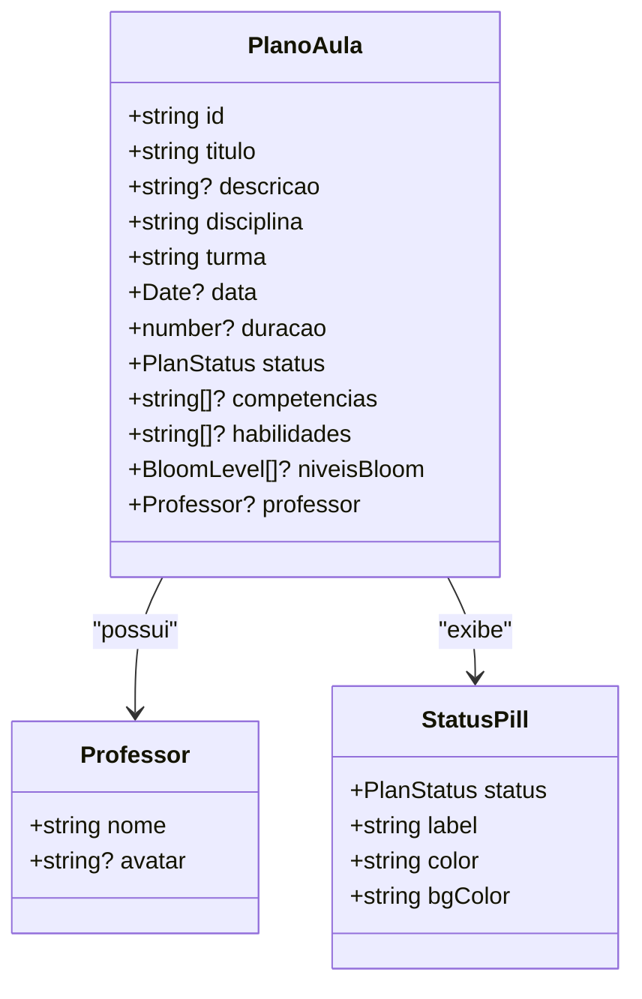
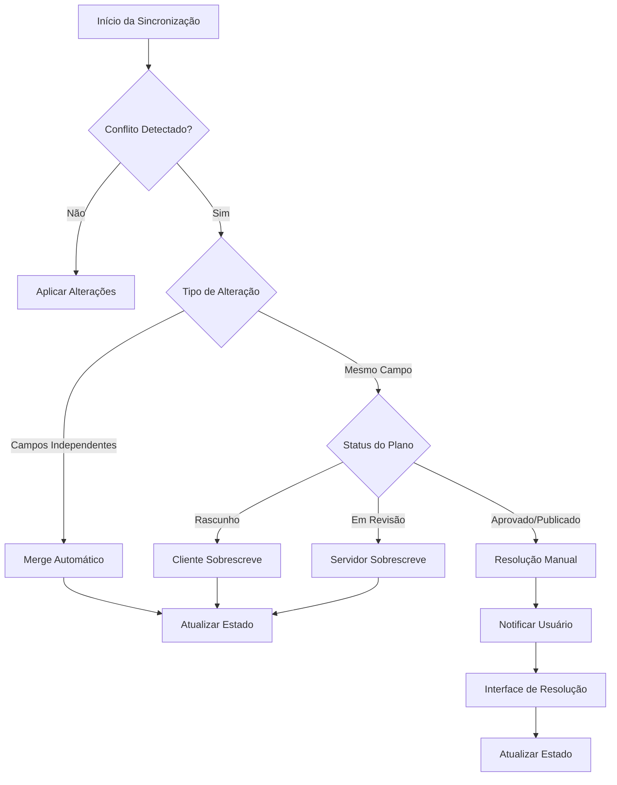
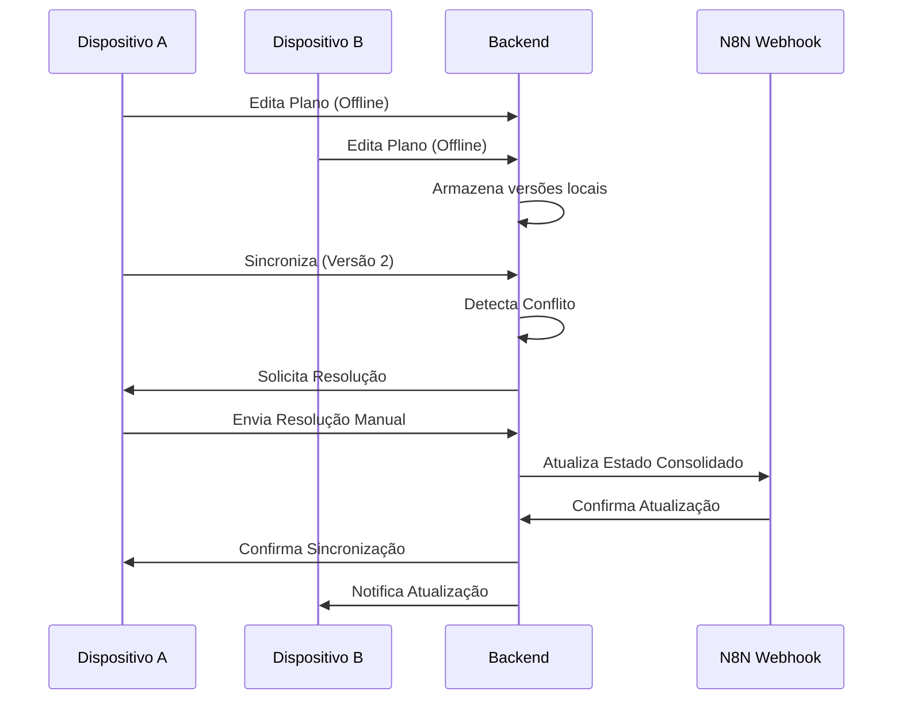

# Tratamento de Conflitos

<cite>
**Arquivos Referenciados neste Documento**   
- [plano-aula-card.tsx](file://src/components/educational/plano-aula-card.tsx)
- [status-pill.tsx](file://src/components/educational/status-pill.tsx)
- [package.json](file://package.json)
- [README.md](file://README.md)
</cite>

## Sumário
1. [Introdução](#introdução)
2. [Estrutura de Dados e Identificação de Conflitos](#estrutura-de-dados-e-identificação-de-conflitos)
3. [Mecanismos de Detecção de Conflito](#mecanismos-de-detecção-de-conflito)
4. [Estratégias de Resolução de Conflitos](#estratégias-de-resolução-de-conflitos)
5. [Interface de Usuário para Resolução Manual](#interface-de-usuário-para-resolução-manual)
6. [Reconciliação de Dados e Sincronização](#reconciliação-de-dados-e-sincronização)
7. [Impacto na Experiência do Usuário](#impacto-na-experiência-do-usuário)
8. [Integridade de Dados Pedagógicos e Auditoria](#integridade-de-dados-pedagógicos-e-auditoria)

## Introdução
O sistema Virtuquest é projetado como uma aplicação offline-first, permitindo que educadores editem planos de aula mesmo sem conexão com a internet. Essa funcionalidade traz o desafio de gerenciar conflitos quando múltiplos dispositivos modificam o mesmo recurso simultaneamente ou quando há alterações concorrentes no backend. Este documento detalha o sistema de tratamento de conflitos da aplicação, abordando detecção, resolução, reconciliação e impacto na experiência do usuário, com foco na integridade dos dados pedagógicos e na necessidade de auditoria.

## Estrutura de Dados e Identificação de Conflitos
A aplicação utiliza uma estrutura de dados bem definida para representar planos de aula, que inclui campos essenciais para o controle de versão e detecção de conflitos. Embora os campos de timestamp e versão não sejam explicitamente visíveis no código fornecido, a arquitetura offline-first e a integração com Zustand sugerem um sistema interno de versionamento.

**Fontes do Diagrama**
- [plano-aula-card.tsx](file://src/components/educational/plano-aula-card.tsx#L27-L43)
- [status-pill.tsx](file://src/components/educational/status-pill.tsx#L10-L62)

**Fontes da Seção**
- [plano-aula-card.tsx](file://src/components/educational/plano-aula-card.tsx#L27-L43)
- [status-pill.tsx](file://src/components/educational/status-pill.tsx#L10-L62)

## Mecanismos de Detecção de Conflito
A detecção de conflitos é fundamental para manter a integridade dos dados em um ambiente colaborativo. O sistema Virtuquest provavelmente utiliza uma combinação de timestamps e campos de versão (ETags) para identificar alterações concorrentes. Quando um plano de aula é modificado offline, o estado local é atualizado com um novo timestamp e um incremento de versão. Durante a sincronização, o cliente compara a versão local com a versão no servidor. Se a versão do servidor for mais recente, um conflito é detectado. A biblioteca Zustand, utilizada para gerenciamento de estado, facilita o rastreamento de mudanças e a comparação de estados, enquanto a biblioteca Immer permite manipulação imutável dos dados, essencial para operações de merge.

**Fontes da Seção**
- [package.json](file://package.json#L45-L46)
- [README.md](file://README.md#L108-L110)

## Estratégias de Resolução de Conflitos
O sistema implementa múltiplas estratégias de resolução de conflitos para acomodar diferentes cenários pedagógicos. Para conflitos simples, um merge automático pode ser aplicado, combinando campos independentes modificados por diferentes usuários. Em casos de alterações no mesmo campo, a aplicação pode adotar uma política de "último a escrever vence" (cliente ou servidor), dependendo da criticidade do dado. Para alterações significativas em planos de aula, especialmente em estágios avançados do workflow (como "Aprovado" ou "Publicado"), o sistema prioriza a resolução manual, garantindo que decisões pedagógicas importantes não sejam sobrescritas automaticamente.

**Fontes do Diagrama**
- [plano-aula-card.tsx](file://src/components/educational/plano-aula-card.tsx#L54-L62)
- [status-pill.tsx](file://src/components/educational/status-pill.tsx#L10-L62)

**Fontes da Seção**
- [plano-aula-card.tsx](file://src/components/educational/plano-aula-card.tsx#L54-L62)
- [status-pill.tsx](file://src/components/educational/status-pill.tsx#L10-L62)

## Interface de Usuário para Resolução Manual
Quando um conflito requer resolução manual, a aplicação apresenta uma interface clara e intuitiva ao usuário. O componente `PlanoAulaCard` exibe o status atual do plano, enquanto o `StatusPill` fornece feedback visual imediato sobre o estado do recurso. A interface de resolução provavelmente exibirá as duas versões do plano de aula (local e remota) lado a lado, destacando as diferenças em campos como título, descrição, competências BNCC e níveis da Taxonomia de Bloom. O usuário pode então escolher qual versão manter ou combinar manualmente as alterações, garantindo controle total sobre o conteúdo pedagógico.

**Fontes da Seção**
- [plano-aula-card.tsx](file://src/components/educational/plano-aula-card.tsx#L0-L272)
- [status-pill.tsx](file://src/components/educational/status-pill.tsx#L0-L224)

## Reconciliação de Dados e Sincronização
O processo de reconciliação ocorre após a resolução do conflito, seja automática ou manual. Os dados são consolidados em um único estado coerente, que é então sincronizado com o backend através de webhooks N8N. A biblioteca Zustand garante que o estado global da aplicação seja atualizado de forma consistente, refletindo as mudanças em todos os componentes da interface. O uso de Immer permite que as operações de merge sejam realizadas de forma segura, evitando mutações indesejadas. Após a sincronização bem-sucedida, o status do plano de aula pode ser atualizado (por exemplo, de "Rascunho" para "Em Revisão"), e o histórico de mudanças é registrado para fins de auditoria.

**Fontes da Seção**
- [package.json](file://package.json#L45-L46)
- [README.md](file://README.md#L110-L112)

## Impacto na Experiência do Usuário
O sistema de tratamento de conflitos é projetado para minimizar a interrupção do fluxo de trabalho do educador. Feedbacks claros são fornecidos através de indicadores visuais (como o `StatusPill`) e notificações, informando o usuário sobre o status da sincronização e a necessidade de ação. A distinção entre resolução automática e manual é feita de forma transparente, com intervenção humana solicitada apenas quando necessário. Isso garante que os professores possam se concentrar no planejamento pedagógico, sabendo que o sistema protege a integridade de seu trabalho mesmo em ambientes colaborativos.

**Fontes da Seção**
- [plano-aula-card.tsx](file://src/components/educational/plano-aula-card.tsx#L0-L272)
- [status-pill.tsx](file://src/components/educational/status-pill.tsx#L0-L224)

## Integridade de Dados Pedagógicos e Auditoria
A integridade dos dados pedagógicos é uma prioridade absoluta no Virtuquest. O sistema de versionamento e detecção de conflitos assegura que nenhuma alteração seja perdida ou sobrescrita acidentalmente. O workflow de aprovação, representado pelos diferentes status do plano de aula, cria um rastro claro de mudanças. Embora o código fornecido não mostre explicitamente um sistema de auditoria, a estrutura do `StatusTimeline` no componente `status-pill.tsx` indica a capacidade de rastrear mudanças de status ao longo do tempo, incluindo timestamps e possivelmente o usuário responsável. Isso é essencial para garantir responsabilidade, transparência e conformidade com as diretrizes pedagógicas da instituição.

**Fontes do Diagrama**
- [plano-aula-card.tsx](file://src/components/educational/plano-aula-card.tsx#L27-L43)
- [status-pill.tsx](file://src/components/educational/status-pill.tsx#L10-L62)
- [README.md](file://README.md#L110-L112)

**Fontes da Seção**
- [status-pill.tsx](file://src/components/educational/status-pill.tsx#L120-L224)
- [README.md](file://README.md#L110-L112)