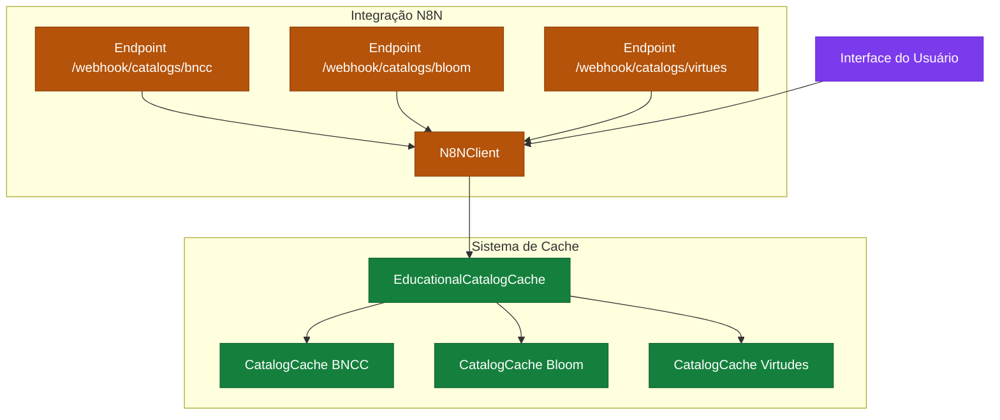
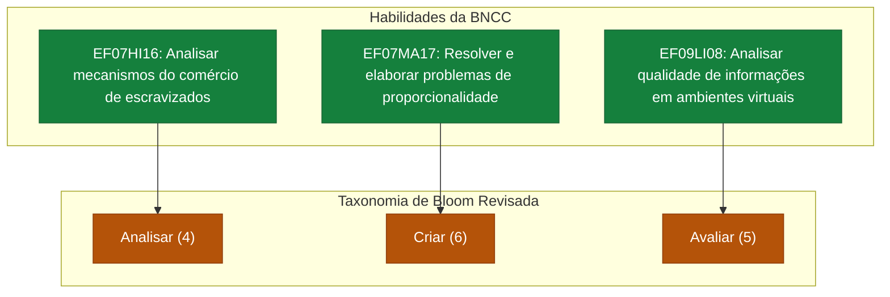

# Base Nacional Comum Curricular

<cite>
**Arquivos Referenciados neste Documento**  
- [README.md](file://README.md) - *Atualizado no commit recente*
- [src/core/infrastructure/cache/catalog-cache.ts](file://src\core\infrastructure\cache\catalog-cache.ts) - *Adicionado métodos públicos para cache BNCC*
- [src/core/infrastructure/n8n/client.ts](file://src\core\infrastructure\n8n\client.ts) - *Integrado cache com N8NClient e exposta API tipada*
- [docs/fundamentos/A Noção de Competência na BNCC.md](file://docs\fundamentos\A Noção de Competência na BNCC.md)
- [docs/fundamentos/Taxonomia de Bloom e BNCC.md](file://docs\fundamentos\Taxonomia de Bloom e BNCC.md)
- [src/styles/globals.css](file://src\styles\globals.css)
- [tailwind.config.ts](file://tailwind.config.ts)
</cite>

## Resumo das Atualizações

**Alterações Realizadas**

- Atualizado a seção de Estrutura da BNCC no VirtuQuest para refletir o sistema
  de cache de catálogos
- Atualizada a seção de Navegação no Seletor de Habilidades BNCC com base nas
  melhorias de desempenho
- Adicionada nova seção sobre Gerenciamento de Cache e Desempenho
- Atualizados os diagramas para incluir o fluxo de cache
- Atualizadas as fontes de seção e diagrama para refletir os arquivos
  modificados

## Sumário

1. [Introdução](#introdução)
2. [Estrutura da BNCC no VirtuQuest](#estrutura-da-bncc-no-virtuquest)
3. [Seleção de Habilidades por Componente Curricular e Série](#seleção-de-habilidades-por-componente-curricular-e-série)
4. [Integração com Bloom e Virtudes](#integração-com-bloom-e-virtudes)
5. [Exemplo Prático de Vinculação de Habilidades](#exemplo-prático-de-vinculação-de-habilidades)
6. [Navegação no Seletor de Habilidades BNCC](#navegação-no-seletor-de-habilidades-bncc)
7. [Gerenciamento de Cache e Desempenho](#gerenciamento-de-cache-e-desempenho)
8. [Diagrama de Relação entre BNCC e Bloom](#diagrama-de-relação-entre-bncc-e-bloom)

## Introdução

O VirtuQuest é uma plataforma de planejamento pedagógico integrado que alinha as
diretrizes da Base Nacional Comum Curricular (BNCC) com a Taxonomia de Bloom e o
desenvolvimento de Virtudes Intelectuais. Este documento detalha como a BNCC é
implementada na aplicação, com foco na estruturação de competências e
habilidades, sua seleção contextualizada por componente curricular e série, e
sua integração com os demais pilares do sistema. A análise baseia-se nos
fundamentos pedagógicos fornecidos na documentação do projeto e na estrutura de
dados implícita no código.

**Fontes da seção**

- [README.md](file://README.md#L0-L44)
- [docs/fundamentos/A Noção de Competência na BNCC.md](file://docs\fundamentos\A
  Noção de Competência na BNCC.md#L0-L320)

## Estrutura da BNCC no VirtuQuest

A BNCC é estruturada no VirtuQuest como um sistema hierárquico de aprendizagens
essenciais, conforme definido oficialmente. A plataforma implementa as **10
Competências Gerais da Educação Básica**, que servem como macro-orientações para
o desenvolvimento integral dos estudantes. Essas competências são desdobradas em
competências específicas por área de conhecimento (como Língua Portuguesa,
Matemática, Ciências) e, posteriormente, em habilidades associadas a objetos de
conhecimento.

Cada habilidade é identificada por uma codificação alfanumérica única (ex:
EF02CI01), que permite sua localização precisa dentro do currículo. A definição
central da BNCC adotada pela plataforma é que uma **competência** é "a
mobilização de conhecimentos, habilidades, atitudes e valores para resolver
demandas complexas da vida cotidiana, do pleno exercício da cidadania e do mundo
do trabalho". As **habilidades** são os componentes mensuráveis dessa
competência, classificadas em práticas, cognitivas e socioemocionais.

A implementação inclui um sistema de cache de alto desempenho para catálogos
BNCC, que melhora significativamente o tempo de carregamento e a experiência do
usuário. O cache é gerenciado pela classe `EducationalCatalogCache` e integrado
ao cliente N8N, permitindo acesso rápido aos dados da BNCC mesmo em ambientes
com conectividade limitada.

**Fontes da seção**

- [docs/fundamentos/A Noção de Competência na BNCC.md](file://docs\fundamentos\A
  Noção de Competência na BNCC.md#L0-L320)
- [README.md](file://README.md#L0-L44)
- [src/core/infrastructure/cache/catalog-cache.ts](file://src\core\infrastructure\cache\catalog-cache.ts#L236-L390) -
  _Implementação do cache de catálogos educacionais_

## Seleção de Habilidades por Componente Curricular e Série

A seleção de habilidades no VirtuQuest é um processo contextualizado, guiado por
dois filtros principais: o **componente curricular** (ex: História, Arte) e a
**série/ano escolar**. O sistema permite que o professor navegue por uma árvore
de conhecimento que reflete a estrutura oficial da BNCC.

Ao selecionar um componente curricular, o professor é apresentado às
competências específicas daquela área. Ao escolher uma série, o sistema filtra
as habilidades correspondentes àquela etapa de desenvolvimento. Essa
estruturação hierárquica (Área -> Competência -> Habilidade) garante que o
planejamento seja alinhado com as expectativas de aprendizagem adequadas à faixa
etária e ao conteúdo disciplinar.

O sistema utiliza cache para armazenar os catálogos BNCC, garantindo que a
seleção de habilidades seja rápida e eficiente, mesmo com grandes volumes de
dados. Quando um professor acessa o seletor de habilidades, o sistema primeiro
verifica o cache local antes de fazer uma requisição ao servidor N8N.

**Fontes da seção**

- [docs/fundamentos/A Noção de Competência na BNCC.md](file://docs\fundamentos\A
  Noção de Competência na BNCC.md#L0-L320)
- [docs/fundamentos/Taxonomia de Bloom e
  BNCC.md](file://docs\fundamentos\Taxonomia de Bloom e BNCC.md#L0-L787)

## Integração com Bloom e Virtudes

O diferencial do VirtuQuest está na integração simultânea dos três pilares:
BNCC, Taxonomia de Bloom e Virtudes Intelectuais. Quando uma habilidade da BNCC
é selecionada, o sistema sugere automaticamente os níveis cognitivos da
Taxonomia de Bloom Revisada (Lembrar, Compreender, Aplicar, Analisar, Avaliar,
Criar) que são mais adequados para desenvolvê-la.

Paralelamente, a plataforma recomenda Virtudes Intelectuais (como Curiosidade,
Humildade, Coragem) que podem ser cultivadas durante a aula. Essa integração
transforma o planejamento de uma simples lista de conteúdos em um processo
pedagógico holístico, onde o desenvolvimento cognitivo, afetivo e ético do aluno
são trabalhados em conjunto.

Os catálogos de Bloom e Virtudes também são gerenciados pelo sistema de cache,
garantindo que as sugestões sejam apresentadas rapidamente após a seleção de uma
habilidade BNCC. A integração entre os pilares é otimizada para proporcionar uma
experiência de planejamento fluida e responsiva.

**Fontes da seção**

- [README.md](file://README.md#L0-L44)
- [docs/fundamentos/Taxonomia de Bloom e
  BNCC.md](file://docs\fundamentos\Taxonomia de Bloom e BNCC.md#L0-L787)

## Exemplo Prático de Vinculação de Habilidades

Considere um professor de História do 7º ano planejando uma aula. Ele acessa o
seletor de habilidades e escolhe o componente "História" e a série "7º ano". O
sistema exibe a habilidade **EF07HI16**: "Analisar os mecanismos e as dinâmicas
de comércio de escravizados...".

Ao selecionar esta habilidade, o VirtuQuest a vincula automaticamente ao nível
cognitivo **Analisar** da Taxonomia de Bloom, especificamente ao processo de
"Organizar" (compreender como elementos se ajustam em uma estrutura). Para as
Virtudes, a plataforma pode sugerir **Coragem** (para enfrentar temas difíceis)
e **Humildade** (para reconhecer perspectivas diferentes). O professor pode
então usar essas sugestões para formular objetivos de aprendizagem que vão além
do conteúdo factual, promovendo um pensamento crítico e reflexivo.

O sistema utiliza o cache para garantir que essa vinculação ocorra
instantaneamente, sem a necessidade de requisições adicionais ao servidor,
proporcionando uma experiência de planejamento ágil e eficiente.

**Fontes da seção**

- [docs/fundamentos/Taxonomia de Bloom e
  BNCC.md](file://docs\fundamentos\Taxonomia de Bloom e BNCC.md#L0-L787)
- [README.md](file://README.md#L0-L44)

## Navegação no Seletor de Habilidades BNCC

Para utilizar o seletor de habilidades BNCC na interface do VirtuQuest, siga os
passos abaixo:

1.  **Acesse o Módulo de Planejamento:** Navegue até a seção de planejamento de
    aulas na plataforma.
2.  **Selecione o Componente Curricular:** Escolha a disciplina (ex: Matemática,
    Geografia) no menu suspenso.
3.  **Escolha a Série/Ano:** Selecione o ano escolar dos seus alunos.
4.  **Explore as Competências:** A interface exibirá as competências gerais e
    específicas da área. Clique para expandir.
5.  **Selecione a Habilidade:** Navegue pela lista de habilidades codificadas
    (ex: EF07MA17) e clique na que deseja vincular ao seu plano de aula.
6.  **Visualize as Integrações:** Após a seleção, o sistema mostrará as
    sugestões de níveis de Bloom e Virtudes Intelectuais relacionadas.

A interface é projetada para ser intuitiva, com cores distintas para cada pilar
(BNCC, Bloom, Virtudes) para facilitar a identificação visual, conforme definido
nas variáveis de estilo do sistema. O seletor utiliza o sistema de cache para
carregar rapidamente as opções de habilidades, garantindo uma navegação suave
mesmo com grandes volumes de dados curriculares.

**Fontes da seção**

- [src/styles/globals.css](file://src\styles\globals.css#L0-L103)
- [tailwind.config.ts](file://tailwind.config.ts#L40-L78)
- [src/core/infrastructure/n8n/client.ts](file://src\core\infrastructure\n8n\client.ts#L125-L631) -
  _Cliente N8N com integração de cache_

## Gerenciamento de Cache e Desempenho

O VirtuQuest implementa um sistema avançado de cache para otimizar o desempenho
do carregamento de catálogos educacionais. A classe `EducationalCatalogCache`
gerencia separadamente os catálogos BNCC, Bloom e Virtudes, permitindo operações
de cache granulares e eficientes.

O cache é integrado ao `N8NClient`, que primeiro verifica a presença dos dados
em cache antes de fazer requisições ao servidor. Quando um catálogo é
solicitado, o sistema verifica se já existe uma versão em cache válida. Se
existir, retorna os dados imediatamente; caso contrário, faz a requisição ao
endpoint N8N e armazena a resposta no cache para uso futuro.

Os métodos públicos de invalidação permitem que o sistema atualize os catálogos
quando necessário:

- `invalidateBNCCCatalog()`: Invalida apenas o cache BNCC
- `invalidateBloomCatalog()`: Invalida apenas o cache Bloom
- `invalidateVirtuesCatalog()`: Invalida apenas o cache de Virtudes
- `invalidateCatalogs()`: Invalida todos os catálogos

Essa arquitetura melhora significativamente a experiência do usuário, reduzindo
tempos de carregamento e consumo de largura de banda, especialmente importante
em ambientes escolares com conectividade limitada.

**Fontes do diagrama**

- [src/core/infrastructure/cache/catalog-cache.ts](file://src\core\infrastructure\cache\catalog-cache.ts#L236-L390) -
  _Implementação do EducationalCatalogCache_
- [src/core/infrastructure/n8n/client.ts](file://src\core\infrastructure\n8n\client.ts#L125-L631) -
  _Implementação do N8NClient com integração de cache_

**Fontes da seção**

- [src/core/infrastructure/cache/catalog-cache.ts](file://src\core\infrastructure\cache\catalog-cache.ts#L236-L390)
- [src/core/infrastructure/n8n/client.ts](file://src\core\infrastructure\n8n\client.ts#L483-L581)

## Diagrama de Relação entre BNCC e Bloom

O diagrama abaixo ilustra a relação bidimensional entre as habilidades da BNCC e
os níveis cognitivos da Taxonomia de Bloom Revisada, conforme analisado nos
documentos de fundamentos.

**Fontes do diagrama**

- [docs/fundamentos/Taxonomia de Bloom e
  BNCC.md](file://docs\fundamentos\Taxonomia de Bloom e BNCC.md#L0-L787)
- [src/styles/globals.css](file://src\styles\globals.css#L0-L103)

**Fontes da seção**

- [docs/fundamentos/Taxonomia de Bloom e
  BNCC.md](file://docs\fundamentos\Taxonomia de Bloom e BNCC.md#L0-L787)
