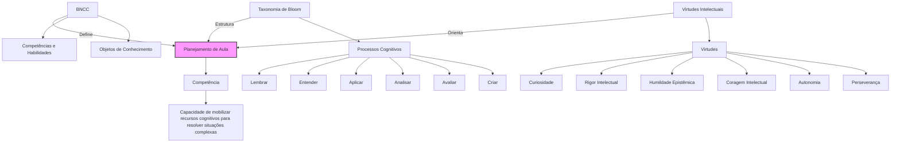

# Recursos Educacionais

<cite>
**Arquivos Referenciados neste Documento**  
- [README.md](file://README.md)
- [docs/fundamentos/Taxonomia de Bloom e BNCC.md](file://docs/fundamentos/Taxonomia de Bloom e BNCC.md)
- [docs/fundamentos/Teoria das Competências e Taxonomia de Bloom.md](file://docs/fundamentos/Teoria das Competências e Taxonomia de Bloom.md)
- [src/components/icons/educational.tsx](file://src/components/icons/educational.tsx)
- [DESIGN_SYSTEM_README.md](file://DESIGN_SYSTEM_README.md)
</cite>

## Sumário

1. [Introdução](#introdução)
2. [Pilares Pedagógicos do VirtuQuest](#pilares-pedagógicos-do-virtuquest)
3. [Implementação da BNCC na Plataforma](#implementação-da-bncc-na-plataforma)
4. [Aplicação da Taxonomia de Bloom](#aplicação-da-taxonomia-de-bloom)
5. [Desenvolvimento de Virtudes Intelectuais](#desenvolvimento-de-virtudes-intelectuais)
6. [Integração entre BNCC, Bloom e Virtudes](#integração-entre-bncc-bloom-e-virtudes)
7. [Orientações Práticas para Professores](#orientações-práticas-para-professores)
8. [Conclusão](#conclusão)

## Introdução

O VirtuQuest é uma plataforma inovadora de planejamento pedagógico que integra
três pilares fundamentais da educação contemporânea: a Base Nacional Comum
Curricular (BNCC), a Taxonomia de Bloom Revisada e o desenvolvimento de Virtudes
Intelectuais. Este documento apresenta uma análise abrangente de como esses
frameworks são implementados na aplicação, com foco na sinergia entre eles no
planejamento de aulas. A integração desses pilares permite uma abordagem
holística do ensino, alinhando objetivos curriculares oficiais, processos
cognitivos estruturados e o desenvolvimento do caráter intelectual dos
estudantes.

A plataforma foi projetada para auxiliar professores na criação de experiências
de aprendizagem significativas, utilizando assistência com IA para sugerir
conteúdos, avaliações e estratégias pedagógicas alinhadas a esses três eixos. A
análise baseia-se principalmente nos documentos de fundamentos pedagógicos
disponíveis no repositório, complementada por elementos de interface e estrutura
de código que refletem a implementação prática desses conceitos.

**Seção fontes**

- [README.md](file://README.md#L0-L44)

## Pilares Pedagógicos do VirtuQuest

O VirtuQuest se fundamenta em três pilares pedagógicos interconectados que
orientam todo o processo de planejamento e avaliação: a BNCC, que estabelece as
competências e habilidades curriculares oficiais; a Taxonomia de Bloom Revisada,
que estrutura os processos cognitivos necessários para o desenvolvimento dessas
competências; e as Virtudes Intelectuais, que promovem o desenvolvimento do
caráter e do pensamento crítico. Essa integração representa uma evolução em
relação a modelos tradicionais de planejamento, que frequentemente tratam esses
aspectos de forma isolada.

A BNCC fornece o conteúdo e as habilidades específicas que devem ser
desenvolvidas, servindo como base curricular obrigatória. A Taxonomia de Bloom,
por sua vez, oferece uma estrutura para classificar os objetivos de aprendizagem
de acordo com seu nível de complexidade cognitiva, desde a simples recordação
até a criação de novos conhecimentos. As Virtudes Intelectuais complementam esse
quadro ao enfatizar qualidades como curiosidade, rigor intelectual, humildade
epistêmica e coragem intelectual, que são essenciais para uma aprendizagem
profunda e autêntica.

Essa tríade pedagógica é implementada na plataforma através de componentes
visuais, fluxos de trabalho e assistência com IA, permitindo que professores
planejem aulas que não apenas atendam aos requisitos curriculares, mas também
promovam o desenvolvimento integral dos estudantes. A integração é evidente na
interface da aplicação, onde os três eixos são representados visualmente e
utilizados em conjunto para gerar sugestões pedagógicas.

**Seção fontes**

- [README.md](file://README.md#L0-L44)
- [docs/fundamentos/Taxonomia de Bloom e
  BNCC.md](file://docs/fundamentos/Taxonomia de Bloom e BNCC.md#L0-L787)
- [docs/fundamentos/Teoria das Competências e Taxonomia de
  Bloom.md](file://docs/fundamentos/Teoria das Competências e Taxonomia de
  Bloom.md#L0-L888)

## Implementação da BNCC na Plataforma

A implementação da BNCC no VirtuQuest vai além da simples listagem de
competências e habilidades, integrando-as profundamente ao processo de
planejamento pedagógico. A plataforma permite a seleção e classificação de
habilidades da BNCC com base em critérios analíticos sistemáticos, utilizando
uma matriz bidimensional que combina o tipo de conhecimento (factual,
conceitual, procedimental, metacognitivo) com o processo cognitivo predominante
(lembrar, entender, aplicar, analisar, avaliar, criar).

Cada habilidade da BNCC é classificada mediante especificação de uma **célula
principal** (intersecção primária entre processo cognitivo e tipo de
conhecimento) e, quando pertinente, uma **célula secundária** (processo ou
conhecimento subsidiário relevante). Por exemplo, a habilidade de identificar
efeitos de sentido em textos multimodais (EF67LP08) é classificada na célula
principal B2 (Conhecimento Conceitual × Compreender), indicando que o foco está
na construção de significado a partir de princípios semióticos, e não na mera
recordação de terminologias.

A plataforma utiliza ícones semânticos para representar visualmente os
componentes da BNCC, facilitando a identificação e seleção por parte dos
professores. O ícone de **competência** é representado por um livro aberto
(BookOpen), o de **habilidade** por um alvo (Target) e o de **objeto de
conhecimento** por um marcador de página (BookMarked). Essa representação visual
ajuda a diferenciar claramente os diferentes níveis da estrutura curricular da
BNCC durante o planejamento.

A análise das habilidades da BNCC revela padrões significativos na estruturação
curricular, com concentração marcante em processos cognitivos de nível
intermediário-superior (Analisar, Avaliar, Criar) e predominância de
conhecimento conceitual como foco educacional. Isso indica que a BNCC orienta-se
por uma concepção de aprendizagem que prioriza a compreensão profunda sobre a
memorização factual, alinhando-se com as premissas da psicologia cognitiva
contemporânea.

**Seção fontes**

- [docs/fundamentos/Taxonomia de Bloom e
  BNCC.md](file://docs/fundamentos/Taxonomia de Bloom e BNCC.md#L0-L787)
- [src/components/icons/educational.tsx](file://src/components/icons/educational.tsx#L38-L42)

## Aplicação da Taxonomia de Bloom

A Taxonomia de Bloom Revisada é implementada no VirtuQuest como um framework
estruturado para classificar e desenvolver os processos cognitivos dos
estudantes. A versão revisada de 2001, proposta por Anderson e Krathwohl, é
utilizada por sua estrutura bidimensional que combina a dimensão do processo
cognitivo com a dimensão do conhecimento, permitindo uma análise mais precisa
dos objetivos educacionais.

Os seis níveis da Taxonomia de Bloom são representados na plataforma com ícones
semânticos que facilitam sua identificação: **lembrar** (cérebro), **entender**
(lâmpada), **aplicar** (chave inglesa), **analisar** (lupa), **avaliar**
(balança) e **criar** (faísca). Essa representação visual ajuda professores a
planejar atividades que desenvolvam especificamente cada nível cognitivo,
promovendo uma progressão do pensamento de ordem inferior para ordem superior.

A plataforma utiliza uma codificação alfanumérica para referenciar as células da
tabela taxonômica, combinando uma letra (tipo de conhecimento) com um numeral
(processo cognitivo). Por exemplo, B4 representa Conhecimento Conceitual ×
Analisar, enquanto C6 representa Conhecimento Procedimental × Criar. Essa
codificação permite uma comunicação precisa entre educadores sobre os objetivos
de aprendizagem e facilita a construção de tarefas avaliativas alinhadas.

A análise das habilidades da BNCC mostra que a célula B4 (Conhecimento
Conceitual × Analisar) emerge como modal, sugerindo uma ênfase curricular no
desenvolvimento de capacidades analíticas fundamentadas em compreensão
conceitual profunda. Componentes curriculares distintos apresentam distribuições
diferenciadas: Língua Portuguesa e Arte enfatizam Compreender e Analisar,
Ciências e Ensino Religioso concentram-se em Avaliar, enquanto Matemática e
Educação Física situam-se em Criar.

A implementação da Taxonomia de Bloom no VirtuQuest supera tensões
epistemológicas da versão original, flexibilizando a hierarquia cumulativa
rígida e reconhecendo a especificidade de domínio dos processos cognitivos. Isso
permite uma integração mais produtiva com a teoria das competências de
Perrenoud, onde a mobilização de recursos cognitivos ocorre de forma recursiva e
situada, não linear e universal.

**Seção fontes**

- [docs/fundamentos/Taxonomia de Bloom e
  BNCC.md](file://docs/fundamentos/Taxonomia de Bloom e BNCC.md#L0-L787)
- [docs/fundamentos/Teoria das Competências e Taxonomia de
  Bloom.md](file://docs/fundamentos/Teoria das Competências e Taxonomia de
  Bloom.md#L0-L888)
- [src/components/icons/educational.tsx](file://src/components/icons/educational.tsx#L48-L55)
- [DESIGN_SYSTEM_README.md](file://DESIGN_SYSTEM_README.md#L58-L64)

## Desenvolvimento de Virtudes Intelectuais

O desenvolvimento de Virtudes Intelectuais é um pilar inovador do VirtuQuest,
que complementa a BNCC e a Taxonomia de Bloom ao focar no caráter e no
pensamento crítico dos estudantes. As virtudes intelectuais são qualidades do
caráter que promovem a excelência no pensamento e na aprendizagem, como
curiosidade, rigor intelectual, humildade epistêmica, coragem intelectual,
autonomia e perseverança.

A plataforma implementa essas virtudes através de um sistema de acompanhamento e
integração no planejamento de aulas, permitindo que professores identifiquem e
promovam especificamente cada virtude durante as atividades pedagógicas. Embora
os componentes específicos para virtudes ainda estejam em desenvolvimento (como
indicado nos comentários do código), a estrutura da aplicação já prevê sua
integração completa.

As virtudes são representadas visualmente com ícones e cores específicas,
facilitando sua identificação e seleção. Por exemplo, a **curiosidade** é
associada a uma cor azul claro, a **humildade** a um verde escuro, a **coragem**
a uma cor laranja, a **autonomia** a um roxo e a **perseverança** a um laranja
escuro. Essa representação visual ajuda a tornar abstratos conceitos de caráter
mais concretos e acessíveis tanto para professores quanto para estudantes.

A integração das virtudes intelectuais no planejamento pedagógico permite que
professores planejem aulas que não apenas desenvolvam conhecimentos e
habilidades, mas também formem estudantes mais reflexivos, críticos e éticos.
Por exemplo, uma aula sobre análise de informações digitais pode ser planejada
para desenvolver simultaneamente a habilidade de avaliação crítica (Bloom) e a
virtude da curiosidade intelectual, incentivando os estudantes a investigar
profundamente a validade das fontes.

A implementação dessas virtudes alinha-se com a dimensão metacognitiva da
Taxonomia de Bloom, pois envolve reflexão sobre o próprio processo de
pensamento, autoconhecimento e regulamentação cognitiva. Isso cria uma ponte
natural entre o desenvolvimento cognitivo e o desenvolvimento do caráter,
promovendo uma educação mais integral.

**Seção fontes**

- [README.md](file://README.md#L0-L44)
- [src/components/icons/educational.tsx](file://src/components/icons/educational.tsx#L57-L60)
- [DESIGN_SYSTEM_README.md](file://DESIGN_SYSTEM_README.md#L66-L74)

## Integração entre BNCC, Bloom e Virtudes

A verdadeira inovação do VirtuQuest reside na integração harmoniosa entre os
três pilares pedagógicos: BNCC, Taxonomia de Bloom e Virtudes Intelectuais. Essa
integração não é meramente justaposição de frameworks, mas uma convergência
estrutural que permite um planejamento pedagógico mais completo e eficaz. A
plataforma utiliza esses três eixos de forma complementar, onde a BNCC define o
quê ensinar, a Taxonomia de Bloom define como desenvolver os processos
cognitivos, e as Virtudes Intelectuais definem o caráter e a atitude com que o
aprendizado deve ser abordado.

**Fontes do diagrama**

- [README.md](file://README.md#L0-L44)
- [docs/fundamentos/Taxonomia de Bloom e
  BNCC.md](file://docs/fundamentos/Taxonomia de Bloom e BNCC.md#L0-L787)
- [docs/fundamentos/Teoria das Competências e Taxonomia de
  Bloom.md](file://docs/fundamentos/Teoria das Competências e Taxonomia de
  Bloom.md#L0-L888)

Essa integração permite uma abordagem mais rica e contextualizada do ensino,
onde os objetivos curriculares são alcançados não apenas através da aquisição de
conhecimentos, mas também através do desenvolvimento de processos cognitivos
sofisticados e de qualidades de caráter intelectual. Por exemplo, uma habilidade
de Ciências que exige avaliar impactos sociotecnológicos (BNCC) pode ser
desenvolvida através de processos de avaliação crítica (Bloom) enquanto se
promove a virtude da curiosidade intelectual e da coragem para questionar.

A matriz bidimensional da Taxonomia de Bloom serve como instrumento analítico
para identificar os recursos cognitivos que compõem competências complexas,
enquanto as virtudes intelectuais funcionam como elementos articuladores que
permitem ao estudante monitorar, regular e adaptar sua mobilização de recursos
em função das especificidades situacionais. Isso cria uma ponte entre a teoria
das competências de Perrenoud e a estrutura cognitiva da Taxonomia de Bloom.

A plataforma utiliza essa integração para gerar sugestões pedagógicas com IA,
propondo atividades que alinhem especificamente uma habilidade da BNCC, um nível
cognitivo de Bloom e uma ou mais virtudes intelectuais a serem desenvolvidas.
Isso permite um planejamento mais intencional e reflexivo, onde cada aula é
projetada para desenvolver múltiplas dimensões do aprendizado de forma
integrada.

**Seção fontes**

- [README.md](file://README.md#L0-L44)
- [docs/fundamentos/Taxonomia de Bloom e
  BNCC.md](file://docs/fundamentos/Taxonomia de Bloom e BNCC.md#L0-L787)
- [docs/fundamentos/Teoria das Competências e Taxonomia de
  Bloom.md](file://docs/fundamentos/Teoria das Competências e Taxonomia de
  Bloom.md#L0-L888)

## Orientações Práticas para Professores

Para utilizar efetivamente o VirtuQuest no planejamento de aulas alinhadas aos
três pilares pedagógicos, os professores podem seguir as seguintes orientações
práticas:

**1. Seleção de Competências e Habilidades BNCC:**

- Utilize a busca por código de habilidade (ex: EF67LP08) ou por descritor para
  localizar rapidamente as competências e habilidades relevantes para sua
  disciplina e ano.
- Considere não apenas a habilidade principal, mas também as células secundárias
  de conhecimento e processo cognitivo que podem ser mobilizadas.
- Priorize habilidades que promovam processos cognitivos de ordem superior
  (Analisar, Avaliar, Criar), que são mais alinhados com uma aprendizagem
  significativa.

**2. Definição de Níveis Cognitivos de Bloom:**

- Identifique claramente o processo cognitivo principal que será desenvolvido na
  aula, utilizando a codificação alfanumérica (ex: B4 para Conhecimento
  Conceitual × Analisar).
- Planeje atividades que exijam a aplicação do conhecimento a novos contextos
  (transferência), e não apenas a repetição de procedimentos já aprendidos.
- Utilize os ícones da Taxonomia de Bloom como guia visual para garantir uma
  progressão adequada dos níveis cognitivos ao longo da sequência didática.

**3. Integração de Virtudes Intelectuais:**

- Identifique uma ou duas virtudes intelectuais que sejam especialmente
  relevantes para o conteúdo e objetivos da aula.
- Planeje atividades que naturalmente promovam essas virtudes, como debates para
  coragem intelectual, investigações abertas para curiosidade, ou revisão de
  hipóteses para humildade epistêmica.
- Utilize a linguagem das virtudes no feedback aos estudantes, destacando quando
  demonstram qualidades como rigor intelectual ou perseverança.

**4. Planejamento Integrado:**

- Utilize a visão integrada da plataforma para planejar aulas que alinhem
  especificamente uma habilidade BNCC, um nível cognitivo de Bloom e uma ou mais
  virtudes intelectuais.
- Exemplo: Para a habilidade de analisar a distribuição populacional (EF07GE04),
  planeje uma atividade que desenvolva o processo de Organizar (Bloom) enquanto
  promove a virtude da curiosidade intelectual e da humildade epistêmica ao
  investigar dados demográficos.
- Utilize a assistência com IA para gerar sugestões de atividades, avaliações e
  recursos que alinhem esses três eixos de forma criativa e eficaz.

**5. Avaliação Multidimensional:**

- Desenvolva rubricas que avaliem não apenas o domínio do conteúdo (BNCC) e dos
  processos cognitivos (Bloom), mas também a manifestação das virtudes
  intelectuais.
- Utilize tarefas complexas que exijam a mobilização integrada de conhecimentos,
  habilidades cognitivas e qualidades de caráter.
- Inclua momentos de reflexão metacognitiva onde os estudantes possam avaliar
  seu próprio desenvolvimento em relação às virtudes intelectuais.

Essas orientações permitem que os professores utilizem o VirtuQuest não apenas
como uma ferramenta de organização, mas como um verdadeiro parceiro pedagógico
no desenvolvimento de um ensino mais completo, significativo e formativo.

**Seção fontes**

- [docs/fundamentos/Taxonomia de Bloom e
  BNCC.md](file://docs/fundamentos/Taxonomia de Bloom e BNCC.md#L0-L787)
- [docs/fundamentos/Teoria das Competências e Taxonomia de
  Bloom.md](file://docs/fundamentos/Teoria das Competências e Taxonomia de
  Bloom.md#L0-L888)

## Conclusão

O VirtuQuest representa uma inovação significativa no campo do planejamento
pedagógico ao integrar de forma harmoniosa e estruturada três pilares
fundamentais da educação contemporânea: a BNCC, a Taxonomia de Bloom Revisada e
o desenvolvimento de Virtudes Intelectuais. Essa integração permite uma
abordagem mais completa e eficaz do ensino, onde os objetivos curriculares
oficiais são alcançados não apenas através da aquisição de conhecimentos, mas
também através do desenvolvimento de processos cognitivos sofisticados e de
qualidades de caráter intelectual.

A implementação desses frameworks na plataforma é cuidadosamente pensada,
utilizando representações visuais (ícones, cores), codificações sistemáticas
(matriz bidimensional) e assistência com IA para tornar o planejamento mais
acessível, intencional e reflexivo. A análise dos documentos de fundamentos
revela uma base teórica sólida, com alinhamento entre a estrutura da Taxonomia
de Bloom Revisada e a teoria das competências de Perrenoud, superando tensões
epistemológicas da versão original da taxonomia.

Para os professores, o VirtuQuest oferece uma ferramenta poderosa para planejar
aulas que promovam uma aprendizagem verdadeiramente significativa, desenvolvendo
não apenas o que os estudantes sabem, mas como pensam e qual é o seu caráter
intelectual. As orientações práticas apresentadas neste documento fornecem um
guia claro para utilizar a plataforma de forma eficaz, alinhando as três
dimensões do aprendizado de forma integrada e intencional.

Essa abordagem integrada representa um avanço em relação a modelos tradicionais
de planejamento, que frequentemente tratam esses aspectos de forma isolada. Ao
unir conteúdo, cognição e caráter, o VirtuQuest contribui para formar estudantes
mais completos, críticos, reflexivos e preparados para os desafios do século
XXI.
