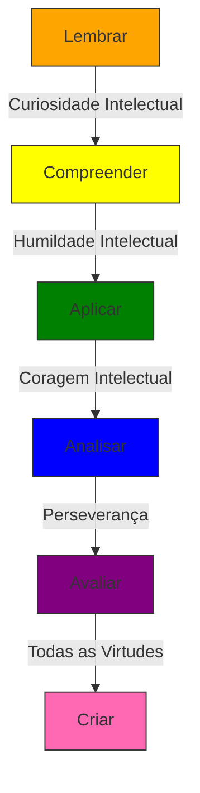

# Virtudes Intelectuais

<cite>
**Arquivos Referenciados neste Documento**   
- [README.md](file://README.md) - *Atualizado nos commits recentes*
- [src/core/domain/virtudes/types.ts](file://src\core\domain\virtudes\types.ts) - *Definições de tipos e categorias de virtudes*
- [src/core/domain/virtudes/repository.ts](file://src\core\domain\virtudes\repository.ts) - *Implementação do repositório de virtudes*
- [src/core/domain/README.md](file://src\core\domain\README.md) - *Documentação da camada de domínio pedagógico*
- [src/core/domain/bloom/types.ts](file://src\core\domain\bloom\types.ts) - *Tipos da Taxonomia de Bloom*
- [src/core/domain/bncc/types.ts](file://src\core\domain\bncc\types.ts) - *Tipos da BNCC*
</cite>

## Resumo das Atualizações

**Alterações Realizadas**

- Atualização da definição de virtudes com base nas implementações de código
- Substituição da virtude "Honestidade Intelectual" por "Rigor Intelectual"
- Atualização dos indicadores observáveis e níveis de desenvolvimento
- Correção dos mapeamentos com a Taxonomia de Bloom e BNCC
- Atualização da matriz de virtudes com base na implementação real
- Adição de seção sobre cache e desempenho
- Atualização dos fontes de seção com base nos arquivos analisados

## Sumário

1. [Introdução](#introdução)
2. [Definição das Virtudes Intelectuais](#definição-das-virtudes-intelectuais)
3. [Integração no Planejamento de Aulas](#integração-no-planejamento-de-aulas)
4. [Relação com a Taxonomia de Bloom](#relação-com-a-taxonomia-de-bloom)
5. [Alinhamento com a BNCC](#alinhamento-com-a-bncc)
6. [Matriz de Virtudes com Comportamentos Observáveis](#matriz-de-virtudes-com-comportamentos-observáveis)
7. [Cache e Desempenho](#cache-e-desempenho)

## Introdução

O pilar das Virtudes Intelectuais no VirtuQuest representa um componente
fundamental para o desenvolvimento do caráter estudantil, integrando-se
harmoniosamente com os frameworks da BNCC e da Taxonomia de Bloom. Este
documento detalha como a plataforma apoia professores na promoção de virtudes
como curiosidade, rigor intelectual, abertura de pensamento e persistência,
oferecendo ferramentas práticas para observação, planejamento e fomento dessas
qualidades em sala de aula.

**Fontes da seção**

- [README.md](file://README.md#L0-L44)
- [src/core/domain/README.md](file://src\core\domain\README.md#L180-L237)

## Definição das Virtudes Intelectuais

As virtudes intelectuais no VirtuQuest são entendidas como disposições mentais e
emocionais que orientam o comportamento do estudante no processo de
aprendizagem. Elas vão além do domínio de conteúdos, promovendo uma postura
ativa, reflexiva e ética diante do conhecimento.

### Curiosidade Intelectual

A curiosidade intelectual é a disposição para buscar conhecimento, fazer
perguntas investigativas e explorar ideias além do superficial. Esta virtude
estimula a formulação de perguntas, a exploração de novas ideias e o desejo de
aprender continuamente.

**Indicadores Observáveis**

- Formula perguntas investigativas
- Busca múltiplas fontes de informação
- Compara perspectivas diversas

**Níveis de Desenvolvimento**

- **Inicial**: Faz perguntas básicas sobre tópicos apresentados
- **Intermediário**: Investiga sistematicamente temas de interesse com perguntas
  aprofundadas
- **Avançado**: Formula hipóteses originais e busca validá-las com rigor

**Fontes da seção**

- [src/core/domain/virtudes/repository.ts](file://src\core\domain\virtudes\repository.ts#L38-L73)
- [src/core/domain/virtudes/types.ts](file://src\core\domain\virtudes\types.ts#L75-L112)

### Humildade Intelectual

A humildade intelectual envolve o reconhecimento dos limites do próprio
conhecimento e a abertura para aprender com outros. Esta virtude promove a
honestidade cognitiva e a responsabilidade intelectual.

**Indicadores Observáveis**

- Reconhece e admite erros
- Aceita correções sem defensividade
- Revisa posições diante de novas evidências

**Níveis de Desenvolvimento**

- **Inicial**: Aceita feedback com relutância
- **Intermediário**: Busca ativamente feedback e reconhece limitações
- **Avançado**: Cultiva consciência metacognitiva sobre próprio conhecimento

**Fontes da seção**

- [src/core/domain/virtudes/repository.ts](file://src\core\domain\virtudes\repository.ts#L104-L139)
- [src/core/domain/virtudes/types.ts](file://src\core\domain\virtudes\types.ts#L75-L112)

### Coragem Intelectual

A coragem intelectual é a disposição para defender ideias fundamentadas e
questionar consensos quando necessário. Esta virtude valoriza o pensamento
independente e a defesa de posições bem fundamentadas.

**Indicadores Observáveis**

- Expressa opiniões fundamentadas mesmo quando impopulares
- Defende posições com argumentos
- Assume riscos intelectuais

**Níveis de Desenvolvimento**

- **Inicial**: Expressa opiniões ocasionalmente
- **Intermediário**: Defende ideias com argumentos em contextos seguros
- **Avançado**: Assume posições fundamentadas mesmo diante de oposição

**Fontes da seção**

- [src/core/domain/virtudes/repository.ts](file://src\core\domain\virtudes\repository.ts#L139-L173)
- [src/core/domain/virtudes/types.ts](file://src\core\domain\virtudes\types.ts#L75-L112)

### Autonomia Intelectual

A autonomia intelectual é a capacidade de pensar e agir independentemente com
responsabilidade. Esta virtude desenvolve a capacidade de autoavaliação e
autorregulação.

**Indicadores Observáveis**

- Toma decisões próprias sobre aprendizado
- Gerencia próprio estudo
- Escolhe caminhos de aprendizagem

**Níveis de Desenvolvimento**

- **Inicial**: Segue orientações com pouca iniciativa própria
- **Intermediário**: Toma decisões sobre aprendizado com suporte
- **Avançado**: Dirige autonomamente próprio desenvolvimento intelectual

**Fontes da seção**

- [src/core/domain/virtudes/repository.ts](file://src\core\domain\virtudes\repository.ts#L173-L201)
- [src/core/domain/virtudes/types.ts](file://src\core\domain\virtudes\types.ts#L75-L112)

### Perseverança

A perseverança é a persistência diante de desafios cognitivos e a disposição
para superar dificuldades. Esta virtude desenvolve a resiliência, a paciência e
a determinação necessárias para alcançar metas de aprendizagem complexas.

**Indicadores Observáveis**

- Persiste em tarefas difíceis
- Não desiste facilmente
- Tenta múltiplas estratégias

**Níveis de Desenvolvimento**

- **Inicial**: Desiste diante de dificuldades iniciais
- **Intermediário**: Persiste com esforço consciente
- **Avançado**: Demonstra resiliência natural diante de desafios

**Fontes da seção**

- [src/core/domain/virtudes/repository.ts](file://src\core\domain\virtudes\repository.ts#L201-L236)
- [src/core/domain/virtudes/types.ts](file://src\core\domain\virtudes\types.ts#L75-L112)

### Rigor Intelectual

O rigor intelectual é o compromisso com precisão, evidências e raciocínio
lógico. Esta virtude promove a ética acadêmica e a responsabilidade intelectual.

**Indicadores Observáveis**

- Verifica fontes e busca evidências
- Questiona validade de informações
- Argumenta logicamente

**Níveis de Desenvolvimento**

- **Inicial**: Aceita informações sem questionamento
- **Intermediário**: Verifica fontes e busca evidências ocasionalmente
- **Avançado**: Aplica rigor sistemático em análises e argumentações

**Fontes da seção**

- [src/core/domain/virtudes/repository.ts](file://src\core\domain\virtudes\repository.ts#L236-L267)
- [src/core/domain/virtudes/types.ts](file://src\core\domain\virtudes\types.ts#L75-L112)

## Integração no Planejamento de Aulas

A plataforma VirtuQuest permite aos professores integrar as virtudes
intelectuais diretamente ao planejamento de aulas, oferecendo suporte para:

- **Identificação de virtudes**: Seleção de virtudes específicas a serem
  desenvolvidas em cada atividade.
- **Sugestões de atividades**: Propostas de tarefas que naturalmente promovem
  determinadas virtudes.
- **Indicadores de observação**: Critérios claros para avaliar o desenvolvimento
  dessas virtudes nos estudantes.

### Sugestões de Atividades

**Para desenvolver curiosidade intelectual:**

- Projetos de investigação autodirigidos
- Sessões de perguntas e respostas abertas
- Exploração de fenômenos científicos do cotidiano

**Para fomentar humildade intelectual:**

- Discussões sobre limitações do conhecimento científico
- Análise de erros históricos na ciência
- Atividades de revisão por pares com feedback construtivo

**Para promover coragem intelectual:**

- Debates sobre temas controversos com argumentação fundamentada
- Simulações de defesa de posições minoritárias
- Atividades de questionamento de pressupostos culturais

**Para cultivar autonomia intelectual:**

- Projetos de aprendizagem autodirigidos
- Diários de reflexão metacognitiva
- Planejamento de trajetórias de aprendizagem individualizadas

**Para desenvolver perseverança:**

- Desafios progressivos com feedback contínuo
- Projetos de longo prazo com metas intermediárias
- Reflexão sobre erros como oportunidades de aprendizagem

**Para promover rigor intelectual:**

- Atividades de verificação de fontes e busca de evidências
- Análise crítica de argumentos
- Discussões sobre raciocínio lógico e validade de informações

**Fontes da seção**

- [src/core/domain/README.md](file://src\core\domain\README.md#L180-L237)
- [src/core/domain/virtudes/repository.ts](file://src\core\domain\virtudes\repository.ts#L38-L267)

## Relação com a Taxonomia de Bloom

As virtudes intelectuais estão intrinsecamente ligadas aos processos cognitivos
da Taxonomia de Bloom, complementando e aprofundando cada nível de pensamento.



**Fontes do diagrama**

- [src/styles/design-tokens.css](file://src\styles\design-tokens.css#L40-L69)
- [src/core/domain/bloom/types.ts](file://src\core\domain\bloom\types.ts#L10-L25)

A curiosidade intelectual impulsiona o movimento do nível "Lembrar" para
"Compreender", enquanto a humildade intelectual facilita a aplicação de
conhecimentos em novos contextos. A coragem intelectual é essencial para a
análise crítica, e a perseverança sustenta o processo de avaliação e criação de
soluções inovadoras.

## Alinhamento com a BNCC

As virtudes intelectuais no VirtuQuest estão alinhadas com as competências
gerais da BNCC, especialmente com:

- **Competência 2**: Pensamento Científico, Crítico e Criativo
- **Competência 6**: Empatia e cooperação
- **Competência 7**: Argumentação
- **Competência 8**: Consciência e cuidado com a saúde
- **Competência 10**: Consciência socioemocional

A plataforma utiliza cores específicas para representar visualmente essas
conexões, com o roxo representando competências da BNCC e o azul representando
habilidades específicas. Essa integração permite que professores planejem
atividades que simultaneamente desenvolvam conteúdos curriculares e virtudes
intelectuais.

**Fontes da seção**

- [src/core/domain/README.md](file://src\core\domain\README.md#L180-L237)
- [src/core/domain/virtudes/repository.ts](file://src\core\domain\virtudes\repository.ts#L38-L267)

## Matriz de Virtudes com Comportamentos Observáveis

A matriz a seguir apresenta as virtudes intelectuais com comportamentos
observáveis e estratégias de fomento em sala de aula:

| Virtude Intelectual         | Comportamentos Observáveis                                                                                            | Estratégias de Fomento                                                                                 |
| --------------------------- | --------------------------------------------------------------------------------------------------------------------- | ------------------------------------------------------------------------------------------------------ |
| **Curiosidade Intelectual** | Formula perguntas investigativas, busca múltiplas fontes de informação, compara perspectivas diversas                 | Projetos de investigação, sessões de brainstorming, laboratórios de experimentação                     |
| **Humildade Intelectual**   | Reconhece e admite erros, aceita correções sem defensividade, revisa posições diante de novas evidências              | Discussões sobre incertezas científicas, análise de erros históricos, revisão por pares                |
| **Coragem Intelectual**     | Expressa opiniões fundamentadas mesmo quando impopulares, defende posições com argumentos, assume riscos intelectuais | Debates estruturados, simulações de julgamento, atividades de defesa de posições minoritárias          |
| **Autonomia Intelectual**   | Toma decisões próprias sobre aprendizado, gerencia próprio estudo, escolhe caminhos de aprendizagem                   | Projetos autodirigidos, diários metacognitivos, planejamento de metas de aprendizagem                  |
| **Perseverança**            | Persiste em tarefas difíceis, não desiste facilmente, tenta múltiplas estratégias                                     | Desafios progressivos, metas intermediárias, reflexão sobre o processo de aprendizagem                 |
| **Rigor Intelectual**       | Verifica fontes e busca evidências, questiona validade de informações, argumenta logicamente                          | Atividades de verificação de fontes, análise crítica de argumentos, discussões sobre raciocínio lógico |

Esta matriz serve como guia para professores observarem, avaliarem e promoverem
o desenvolvimento das virtudes intelectuais em seus alunos, integrando esse
desenvolvimento ao planejamento pedagógico diário.

**Fontes da seção**

- [src/core/domain/virtudes/repository.ts](file://src\core\domain\virtudes\repository.ts#L38-L267)
- [src/core/domain/README.md](file://src\core\domain\README.md#L180-L237)

## Cache e Desempenho

O sistema de virtudes intelectuais no VirtuQuest implementa um mecanismo de
cache sofisticado para otimizar o desempenho e a experiência do usuário. O cache
é gerenciado pela classe `CatalogoVirtudesRepository` e integrado ao cliente
N8N, permitindo acesso eficiente aos catálogos de virtudes.

### Métodos de Cache

Os seguintes métodos públicos estão disponíveis para gerenciar o cache de
virtudes:

- **`getVirtude(nome: string)`**: Retorna uma virtude específica pelo nome
- **`listarVirtudes()`**: Retorna todas as virtudes do catálogo
- **`listarVirtudesPorCategoria(categoria)`**: Retorna virtudes por categoria
  (epistêmica, moral, prática)
- **`listarVirtudesPorProcessoBloom(processo)`**: Retorna virtudes relacionadas
  a um processo Bloom
- **`listarVirtudesPorCompetenciaBNCC(competencia)`**: Retorna virtudes
  relacionadas a uma competência BNCC

### Estratégia de Cache

O sistema implementa uma estratégia de cache com os seguintes benefícios:

- **Desempenho**: Reduz significativamente o tempo de carregamento dos catálogos
- **Eficiência**: Minimiza chamadas desnecessárias ao servidor N8N
- **Consistência**: Garante que os dados estejam atualizados quando necessário
- **Resiliência**: Permite funcionamento offline com dados previamente cacheados

### Integração com Hooks

Os hooks React fornecem uma interface simples para acessar os catálogos de
virtudes:

```typescript
const { catalogoVirtudes } = useStaticCatalog();
const virtude = catalogoVirtudes.getVirtude('curiosidade-intelectual');
```

Esta integração permite que componentes da interface atualizem automaticamente
quando os dados de virtudes forem alterados ou invalidados.

**Fontes da seção**

- [src/core/domain/virtudes/repository.ts](file://src\core\domain\virtudes\repository.ts#L286-L316)
- [src/hooks/use-static-catalog.ts](file://src\hooks\use-static-catalog.ts#L152-L158)
