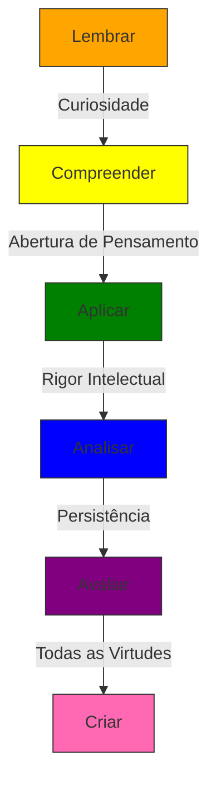

# Virtudes Intelectuais

<cite>
**Arquivos Referenciados neste Documento**   
- [README.md](file://README.md)
- [DESIGN_SYSTEM_README.md](file://DESIGN_SYSTEM_README.md)
- [src/components/icons/educational.tsx](file://src/components/icons/educational.tsx)
- [src/styles/design-tokens.css](file://src/styles/design-tokens.css)
</cite>

## Sumário
1. [Introdução](#introdução)
2. [Definição das Virtudes Intelectuais](#definição-das-virtudes-intelectuais)
3. [Integração no Planejamento de Aulas](#integração-no-planejamento-de-aulas)
4. [Relação com a Taxonomia de Bloom](#relação-com-a-taxonomia-de-bloom)
5. [Alinhamento com a BNCC](#alinhamento-com-a-bncc)
6. [Matriz de Virtudes com Comportamentos Observáveis](#matriz-de-virtudes-com-comportamentos-observáveis)

## Introdução

O pilar das Virtudes Intelectuais no VirtuQuest representa um componente fundamental para o desenvolvimento do caráter estudantil, integrando-se harmoniosamente com os frameworks da BNCC e da Taxonomia de Bloom. Este documento detalha como a plataforma apoia professores na promoção de virtudes como curiosidade, rigor intelectual, abertura de pensamento e persistência, oferecendo ferramentas práticas para observação, planejamento e fomento dessas qualidades em sala de aula.

**Section sources**
- [README.md](file://README.md#L0-L44)

## Definição das Virtudes Intelectuais

As virtudes intelectuais no VirtuQuest são entendidas como disposições mentais e emocionais que orientam o comportamento do estudante no processo de aprendizagem. Elas vão além do domínio de conteúdos, promovendo uma postura ativa, reflexiva e ética diante do conhecimento.

### Curiosidade
A curiosidade é a disposição para questionar, investigar e buscar compreensão mais profunda sobre o mundo. Representada visualmente pelo ícone de olho (Eye) e pela cor azul-turquesa, esta virtude estimula a formulação de perguntas, a exploração de novas ideias e o desejo de aprender continuamente.

### Rigor Intelectual
O rigor intelectual envolve a busca pela precisão, clareza e profundidade no pensamento. Associado ao ícone de coração (Heart), esta virtude promove a honestidade cognitiva, o exame crítico de evidências e a responsabilidade intelectual.

### Abertura de Pensamento
A abertura de pensamento é a capacidade de considerar diferentes perspectivas, revisar crenças e aceitar feedback construtivo. Representada pelo raio (Zap), esta virtude valoriza o diálogo, a humildade intelectual e a disposição para mudar de ideia diante de novas evidências.

### Persistência
A persistência é a disposição para continuar esforçando-se diante de desafios e obstáculos. Simbolizada pela seta ascendente (TrendingUp), esta virtude desenvolve a resiliência, a paciência e a determinação necessárias para alcançar metas de aprendizagem complexas.

**Section sources**
- [src/components/icons/educational.tsx](file://src/components/icons/educational.tsx#L57-L105)
- [DESIGN_SYSTEM_README.md](file://DESIGN_SYSTEM_README.md#L54-L116)

## Integração no Planejamento de Aulas

A plataforma VirtuQuest permite aos professores integrar as virtudes intelectuais diretamente ao planejamento de aulas, oferecendo suporte para:

- **Identificação de virtudes**: Seleção de virtudes específicas a serem desenvolvidas em cada atividade.
- **Sugestões de atividades**: Propostas de tarefas que naturalmente promovem determinadas virtudes.
- **Indicadores de observação**: Critérios claros para avaliar o desenvolvimento dessas virtudes nos estudantes.

### Sugestões de Atividades

**Para desenvolver curiosidade:**
- Projetos de investigação autodirigidos
- Sessões de perguntas e respostas abertas
- Exploração de fenômenos científicos do cotidiano

**Para fomentar rigor intelectual:**
- Análise crítica de fontes de informação
- Debates com argumentação fundamentada
- Revisão por pares de trabalhos acadêmicos

**Para promover abertura de pensamento:**
- Simulações de diferentes perspectivas
- Discussões sobre dilemas éticos
- Atividades de escuta ativa e empatia

**Para cultivar persistência:**
- Desafios progressivos com feedback contínuo
- Projetos de longo prazo com metas intermediárias
- Reflexão sobre erros como oportunidades de aprendizagem

**Section sources**
- [README.md](file://README.md#L0-L44)
- [src/components/icons/educational.tsx](file://src/components/icons/educational.tsx#L107-L179)

## Relação com a Taxonomia de Bloom

As virtudes intelectuais estão intrinsecamente ligadas aos processos cognitivos da Taxonomia de Bloom, complementando e aprofundando cada nível de pensamento.

**Diagram sources**
- [src/styles/design-tokens.css](file://src/styles/design-tokens.css#L40-L69)
- [src/components/icons/educational.tsx](file://src/components/icons/educational.tsx#L57-L105)

A curiosidade impulsiona o movimento do nível "Lembrar" para "Compreender", enquanto a abertura de pensamento facilita a aplicação de conhecimentos em novos contextos. O rigor intelectual é essencial para a análise crítica, e a persistência sustenta o processo de avaliação e criação de soluções inovadoras.

## Alinhamento com a BNCC

As virtudes intelectuais no VirtuQuest estão alinhadas com as competências gerais da BNCC, especialmente com:

- **Competência 2**: Pensamento Científico, Crítico e Criativo
- **Competência 3**: Comunicação
- **Competência 5**: Autoconhecimento e Autocuidado
- **Competência 6**: Empatia e cooperação

A plataforma utiliza cores específicas para representar visualmente essas conexões, com o roxo representando competências da BNCC e o azul representando habilidades específicas. Essa integração permite que professores planejem atividades que simultaneamente desenvolvam conteúdos curriculares e virtudes intelectuais.

**Section sources**
- [src/styles/design-tokens.css](file://src/styles/design-tokens.css#L40-L69)
- [README.md](file://README.md#L0-L44)

## Matriz de Virtudes com Comportamentos Observáveis

A matriz a seguir apresenta as virtudes intelectuais com comportamentos observáveis e estratégias de fomento em sala de aula:

| Virtude Intelectual | Comportamentos Observáveis | Estratégias de Fomento |
|---------------------|----------------------------|------------------------|
| **Curiosidade** | Formula perguntas originais, demonstra interesse por temas além do conteúdo, busca fontes adicionais | Projetos de investigação, sessões de brainstorming, laboratórios de experimentação |
| **Rigor Intelectual** | Verifica fontes, cita referências, reconhece limitações do próprio conhecimento | Análise crítica de textos, revisão por pares, debates com evidências |
| **Abertura de Pensamento** | Considera perspectivas diferentes, aceita feedback, modifica opiniões com base em novas evidências | Debates estruturados, simulações de papéis, atividades de escuta ativa |
| **Persistência** | Continua tentando após falhas, busca ajuda quando necessário, completa tarefas desafiadoras | Desafios progressivos, metas intermediárias, reflexão sobre o processo de aprendizagem |

Esta matriz serve como guia para professores observarem, avaliarem e promoverem o desenvolvimento das virtudes intelectuais em seus alunos, integrando esse desenvolvimento ao planejamento pedagógico diário.

**Section sources**
- [src/components/icons/educational.tsx](file://src/components/icons/educational.tsx#L57-L105)
- [README.md](file://README.md#L0-L44)