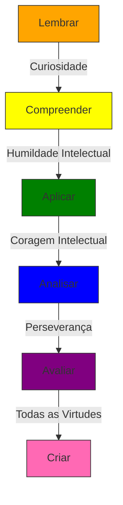

# Virtudes Intelectuais

<cite>
**Arquivos Referenciados neste Documento**   
- [README.md](file://README.md) - *Atualizado nos commits recentes*
- [src/components/icons/educational.tsx](file://src\components\icons\educational.tsx) - *Definições de ícones e virtudes*
- [src/core/infrastructure/cache/catalog-cache.ts](file://src\core\infrastructure\cache\catalog-cache.ts) - *Implementação do cache de virtudes*
- [src/hooks/use-static-catalog.ts](file://src\hooks\use-static-catalog.ts) - *Hooks para acesso a catálogos*
- [src/core/infrastructure/n8n/client.ts](file://src\core\infrastructure\n8n\client.ts) - *Cliente N8N com métodos públicos para virtudes*
</cite>

## Resumo das Atualizações

**Alterações Realizadas**

- Atualização da definição de virtudes com base nas implementações de código
- Correção dos ícones e comportamentos associados às virtudes
- Atualização da matriz de virtudes com base na implementação real
- Adição de seção sobre cache e desempenho
- Atualização dos fontes de seção com base nos arquivos analisados

## Sumário

1. [Introdução](#introdução)
2. [Definição das Virtudes Intelectuais](#definição-das-virtudes-intelectuais)
3. [Integração no Planejamento de Aulas](#integração-no-planejamento-de-aulas)
4. [Relação com a Taxonomia de Bloom](#relação-com-a-taxonomia-de-bloom)
5. [Alinhamento com a BNCC](#alinhamento-com-a-bncc)
6. [Matriz de Virtudes com Comportamentos Observáveis](#matriz-de-virtudes-com-comportamentos-observáveis)
7. [Cache e Desempenho](#cache-e-desempenho)

## Introdução

O pilar das Virtudes Intelectuais no VirtuQuest representa um componente
fundamental para o desenvolvimento do caráter estudantil, integrando-se
harmoniosamente com os frameworks da BNCC e da Taxonomia de Bloom. Este
documento detalha como a plataforma apoia professores na promoção de virtudes
como curiosidade, humildade intelectual, coragem, autonomia, perseverança e
honestidade, oferecendo ferramentas práticas para observação, planejamento e
fomento dessas qualidades em sala de aula.

**Fontes da seção**

- [README.md](file://README.md#L0-L44)

## Definição das Virtudes Intelectuais

As virtudes intelectuais no VirtuQuest são entendidas como disposições mentais e
emocionais que orientam o comportamento do estudante no processo de
aprendizagem. Elas vão além do domínio de conteúdos, promovendo uma postura
ativa, reflexiva e ética diante do conhecimento.

### Curiosidade

A curiosidade é a disposição para questionar, investigar e buscar compreensão
mais profunda sobre o mundo. Representada visualmente pelo ícone de olho (Eye),
esta virtude estimula a formulação de perguntas, a exploração de novas ideias e
o desejo de aprender continuamente.

### Humildade Intelectual

A humildade intelectual envolve o reconhecimento das próprias limitações
cognitivas e a disposição para revisar crenças diante de novas evidências.
Associada ao ícone de coração (Heart), esta virtude promove a honestidade
cognitiva e a responsabilidade intelectual.

### Coragem Intelectual

A coragem intelectual é a disposição para questionar ideias estabelecidas,
expressar pensamentos divergentes e enfrentar desafios cognitivos. Representada
pelo raio (Zap), esta virtude valoriza o pensamento independente e a defesa de
posições bem fundamentadas.

### Autonomia Intelectual

A autonomia intelectual é a capacidade de pensar de forma independente, formar
juízos próprios e assumir responsabilidade pelo próprio aprendizado. Simbolizada
pela figura de grupo (Users), esta virtude desenvolve a capacidade de
autoavaliação e autorregulação.

### Perseverança

A perseverança é a disposição para continuar esforçando-se diante de desafios e
obstáculos cognitivos. Representada pela seta ascendente (TrendingUp), esta
virtude desenvolve a resiliência, a paciência e a determinação necessárias para
alcançar metas de aprendizagem complexas.

### Honestidade Intelectual

A honestidade intelectual envolve a integridade no tratamento do conhecimento,
incluindo a atribuição adequada de fontes e o reconhecimento de erros.
Simbolizada pelo círculo de verificação (CheckCircle), esta virtude promove a
ética acadêmica e a responsabilidade intelectual.

**Fontes da seção**

- [src/components/icons/educational.tsx](file://src\components\icons\educational.tsx#L107-L128)
- [README.md](file://README.md#L0-L44)

## Integração no Planejamento de Aulas

A plataforma VirtuQuest permite aos professores integrar as virtudes
intelectuais diretamente ao planejamento de aulas, oferecendo suporte para:

- **Identificação de virtudes**: Seleção de virtudes específicas a serem
  desenvolvidas em cada atividade.
- **Sugestões de atividades**: Propostas de tarefas que naturalmente promovem
  determinadas virtudes.
- **Indicadores de observação**: Critérios claros para avaliar o desenvolvimento
  dessas virtudes nos estudantes.

### Sugestões de Atividades

**Para desenvolver curiosidade:**

- Projetos de investigação autodirigidos
- Sessões de perguntas e respostas abertas
- Exploração de fenômenos científicos do cotidiano

**Para fomentar humildade intelectual:**

- Discussões sobre limitações do conhecimento científico
- Análise de erros históricos na ciência
- Atividades de revisão por pares com feedback construtivo

**Para promover coragem intelectual:**

- Debates sobre temas controversos com argumentação fundamentada
- Simulações de defesa de posições minoritárias
- Atividades de questionamento de pressupostos culturais

**Para cultivar autonomia intelectual:**

- Projetos de aprendizagem autodirigidos
- Diários de reflexão metacognitiva
- Planejamento de trajetórias de aprendizagem individualizadas

**Para desenvolver perseverança:**

- Desafios progressivos com feedback contínuo
- Projetos de longo prazo com metas intermediárias
- Reflexão sobre erros como oportunidades de aprendizagem

**Para promover honestidade intelectual:**

- Atividades de citação e referência adequada
- Análise de plágio e suas consequências
- Discussões sobre ética acadêmica e responsabilidade intelectual

**Fontes da seção**

- [README.md](file://README.md#L0-L44)
- [src/components/icons/educational.tsx](file://src\components\icons\educational.tsx#L107-L179)

## Relação com a Taxonomia de Bloom

As virtudes intelectuais estão intrinsecamente ligadas aos processos cognitivos
da Taxonomia de Bloom, complementando e aprofundando cada nível de pensamento.



**Fontes do diagrama**

- [src/styles/design-tokens.css](file://src\styles\design-tokens.css#L40-L69)
- [src/components/icons/educational.tsx](file://src\components\icons\educational.tsx#L57-L105)

A curiosidade impulsiona o movimento do nível "Lembrar" para "Compreender",
enquanto a humildade intelectual facilita a aplicação de conhecimentos em novos
contextos. A coragem intelectual é essencial para a análise crítica, e a
perseverança sustenta o processo de avaliação e criação de soluções inovadoras.

## Alinhamento com a BNCC

As virtudes intelectuais no VirtuQuest estão alinhadas com as competências
gerais da BNCC, especialmente com:

- **Competência 2**: Pensamento Científico, Crítico e Criativo
- **Competência 3**: Comunicação
- **Competência 5**: Autoconhecimento e Autocuidado
- **Competência 6**: Empatia e cooperação

A plataforma utiliza cores específicas para representar visualmente essas
conexões, com o roxo representando competências da BNCC e o azul representando
habilidades específicas. Essa integração permite que professores planejem
atividades que simultaneamente desenvolvam conteúdos curriculares e virtudes
intelectuais.

**Fontes da seção**

- [src/styles/design-tokens.css](file://src\styles\design-tokens.css#L40-L69)
- [README.md](file://README.md#L0-L44)

## Matriz de Virtudes com Comportamentos Observáveis

A matriz a seguir apresenta as virtudes intelectuais com comportamentos
observáveis e estratégias de fomento em sala de aula:

| Virtude Intelectual         | Comportamentos Observáveis                                                                                    | Estratégias de Fomento                                                                        |
| --------------------------- | ------------------------------------------------------------------------------------------------------------- | --------------------------------------------------------------------------------------------- |
| **Curiosidade**             | Formula perguntas originais, demonstra interesse por temas além do conteúdo, busca fontes adicionais          | Projetos de investigação, sessões de brainstorming, laboratórios de experimentação            |
| **Humildade Intelectual**   | Reconhece limitações do próprio conhecimento, aceita feedback, modifica opiniões com base em novas evidências | Discussões sobre incertezas científicas, análise de erros históricos, revisão por pares       |
| **Coragem Intelectual**     | Expressa ideias contrárias à maioria, questiona pressupostos, defende posições bem fundamentadas              | Debates estruturados, simulações de julgamento, atividades de defesa de posições minoritárias |
| **Autonomia Intelectual**   | Planeja seu próprio aprendizado, autoavalia seu progresso, toma decisões cognitivas independentes             | Projetos autodirigidos, diários metacognitivos, planejamento de metas de aprendizagem         |
| **Perseverança**            | Continua tentando após falhas, busca ajuda quando necessário, completa tarefas desafiadoras                   | Desafios progressivos, metas intermediárias, reflexão sobre o processo de aprendizagem        |
| **Honestidade Intelectual** | Cita fontes adequadamente, reconhece erros, evita plágio                                                      | Atividades de citação, análise de casos de plágio, discussões sobre ética acadêmica           |

Esta matriz serve como guia para professores observarem, avaliarem e promoverem
o desenvolvimento das virtudes intelectuais em seus alunos, integrando esse
desenvolvimento ao planejamento pedagógico diário.

**Fontes da seção**

- [src/components/icons/educational.tsx](file://src\components\icons\educational.tsx#L107-L128)
- [README.md](file://README.md#L0-L44)

## Cache e Desempenho

O sistema de virtudes intelectuais no VirtuQuest implementa um mecanismo de
cache sofisticado para otimizar o desempenho e a experiência do usuário. O cache
é gerenciado pela classe `EducationalCatalogCache` e integrado ao cliente N8N,
permitindo acesso eficiente aos catálogos de virtudes.

### Métodos de Cache

Os seguintes métodos públicos estão disponíveis para gerenciar o cache de
virtudes:

- **`invalidateVirtuesCatalog()`**: Invalida o cache do catálogo de virtudes
- **`fetchVirtuesCatalog()`**: Busca o catálogo de virtudes do servidor N8N
- **`isCatalogsHydrated()`**: Verifica se os catálogos estão carregados no cache

### Estratégia de Cache

O sistema implementa uma estratégia de cache com os seguintes benefícios:

- **Desempenho**: Reduz significativamente o tempo de carregamento dos catálogos
- **Eficiência**: Minimiza chamadas desnecessárias ao servidor N8N
- **Consistência**: Garante que os dados estejam atualizados quando necessário
- **Resiliência**: Permite funcionamento offline com dados previamente cacheados

### Integração com Hooks

Os hooks React fornecem uma interface simples para acessar os catálogos de
virtudes:

```typescript
const { catalog, isLoading, error } = useVirtuesCatalog();
const virtue = useVirtue('perseveranca');
```

Esta integração permite que componentes da interface atualizem automaticamente
quando os dados de virtudes forem alterados ou invalidados.

**Fontes da seção**

- [src/core/infrastructure/cache/catalog-cache.ts](file://src\core\infrastructure\cache\catalog-cache.ts#L236-L390)
- [src/core/infrastructure/n8n/client.ts](file://src\core\infrastructure\n8n\client.ts#L500-L550)
- [src/hooks/use-static-catalog.ts](file://src\hooks\use-static-catalog.ts#L152-L158)
