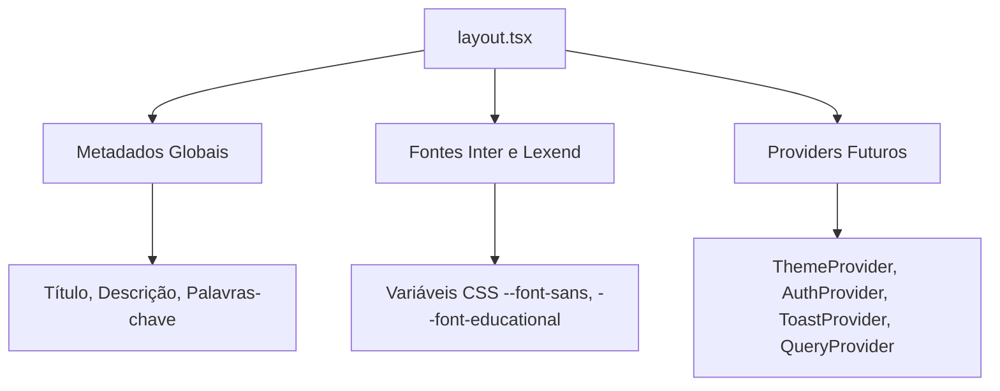
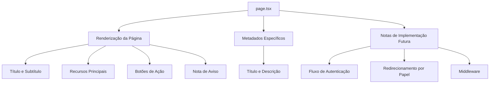
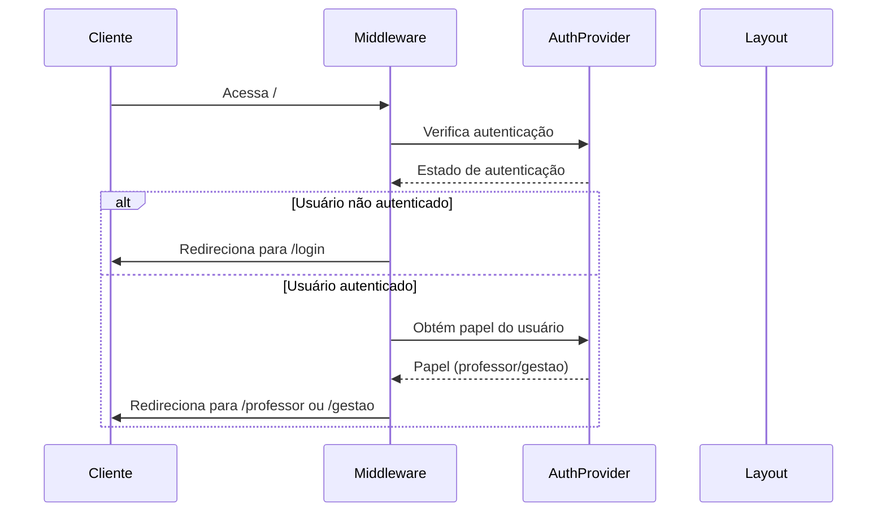

# Roteamento e Navegação

<cite>
**Arquivos Referenciados neste Documento**   
- [layout.tsx](file://src/app/layout.tsx)
- [page.tsx](file://src/app/page.tsx)
- [next.config.ts](file://next.config.ts)
</cite>

## Sumário
1. [Introdução](#introdução)
2. [Estrutura do Diretório `app/`](#estrutura-do-diretório-app)
3. [Layout Raiz com `layout.tsx`](#layout-raiz-com-layouttsx)
4. [Página Principal com `page.tsx`](#página-principal-com-pagetSX)
5. [Configuração de Rotas Futuras](#configuração-de-rotas-futuras)
6. [Componentes do Servidor e Metadados Dinâmicos](#componentes-do-servidor-e-metadados-dinâmicos)
7. [Integração com Autenticação e Controle de Acesso](#integração-com-autenticação-e-controle-de-acesso)
8. [Navegação Programática e Boas Práticas](#navegação-programática-e-boas-práticas)
9. [Conclusão](#conclusão)

## Introdução
O sistema de roteamento baseado no App Router do Next.js 15 é o núcleo da arquitetura de navegação da aplicação VirtuQuest. Este documento detalha a estrutura, funcionamento e boas práticas relacionadas ao roteamento, com foco na integração com autenticação, metadados dinâmicos e organização de rotas em aplicações educacionais complexas. O App Router permite uma abordagem moderna e eficiente para gerenciar rotas, layouts e navegação, aproveitando os recursos avançados do Next.js.

## Estrutura do Diretório `app/`
O diretório `app/` é a base do sistema de roteamento do Next.js 15, seguindo o modelo de App Router. Ele contém os arquivos principais que definem a estrutura da aplicação:
- `layout.tsx`: Define o layout raiz aplicado a todas as rotas.
- `page.tsx`: Representa a rota principal (`/`) da aplicação.

Essa estrutura permite uma organização clara e escalável, onde novas rotas podem ser adicionadas criando subdiretórios com seus próprios arquivos `page.tsx` e `layout.tsx`. O App Router utiliza a estrutura de diretórios para inferir automaticamente as rotas, eliminando a necessidade de configuração manual de rotas.

**Section sources**
- [layout.tsx](file://src/app/layout.tsx#L1-L72)
- [page.tsx](file://src/app/page.tsx#L1-L85)

## Layout Raiz com `layout.tsx`
O arquivo `layout.tsx` define o layout raiz da aplicação, que envolve todas as páginas com elementos comuns, como metadados, fontes e providers. Ele exporta uma função assíncrona `RootLayout` que recebe `children` como propriedade, permitindo que o conteúdo das páginas seja injetado dinamicamente.

### Configuração de Metadados
O layout raiz inclui uma configuração de metadados global através da exportação `metadata`, que define:
- Título padrão e template para todas as páginas.
- Descrição, palavras-chave, autores e viewport.
- Cores do tema, ícones e manifest.

Esses metadados são herdados por todas as páginas, garantindo consistência na identidade visual e no SEO.

### Fontes e Estilos
O layout carrega duas fontes do Google Fonts:
- `Inter`: Usada como fonte principal (`--font-sans`).
- `Lexend`: Usada como fonte educacional (`--font-educational`).

As variáveis CSS dessas fontes são aplicadas ao corpo do documento, permitindo uma tipografia consistente em toda a aplicação.

### Providers Futuros
O layout está preparado para receber providers essenciais, como `ThemeProvider`, `AuthProvider`, `ToastProvider` e `QueryProvider`, que serão implementados nas fases subsequentes. Esses providers serão adicionados diretamente ao corpo do documento, garantindo que seus contextos estejam disponíveis em toda a aplicação.



**Diagram sources**
- [layout.tsx](file://src/app/layout.tsx#L1-L72)

**Section sources**
- [layout.tsx](file://src/app/layout.tsx#L1-L72)

## Página Principal com `page.tsx`
O arquivo `page.tsx` representa a rota principal da aplicação (`/`). Ele exporta uma função `HomePage` que renderiza uma página de boas-vindas temporária com informações sobre a plataforma VirtuQuest.

### Conteúdo da Página
A página inclui:
- Um título e subtítulo destacando o propósito da plataforma.
- Quatro recursos principais: Alinhamento BNCC, Taxonomia de Bloom, Virtudes Intelectuais e Integração com IA.
- Botões de ação para "Entrar" e "Saber Mais", com navegação para `/login` e `/about`.
- Uma nota de aviso indicando que esta é uma página temporária.

### Metadados Específicos
A página define metadados específicos através da exportação `metadata`, que sobrescreve o título e a descrição globais para esta rota específica.

### Notas de Implementação Futura
Comentários no código indicam que esta página será substituída por um fluxo de autenticação adequado na Fase 1. Isso inclui:
- Redirecionamento para `/professor` ou `/gestao` com base no papel do usuário.
- Implementação de lógica de redirecionamento no middleware.



**Diagram sources**
- [page.tsx](file://src/app/page.tsx#L1-L85)

**Section sources**
- [page.tsx](file://src/app/page.tsx#L1-L85)

## Configuração de Rotas Futuras
O sistema de roteamento está preparado para a implementação de rotas futuras, como `/login`, `/professor` e `/gestao`. Essas rotas serão criadas adicionando subdiretórios ao diretório `app/` com seus próprios arquivos `page.tsx`.

### Estratégia de Redirecionamento
O arquivo `next.config.ts` inclui um placeholder para a função `redirects`, que será usada para implementar redirecionamentos com base no estado de autenticação. Por exemplo:
- Usuários não autenticados serão redirecionados de `/` para `/login`.
- Usuários autenticados serão redirecionados para `/professor` ou `/gestao` com base em seu papel.

### Proxy de API
O arquivo `next.config.ts` também inclui um placeholder para a função `rewrites`, que pode ser usada para criar um proxy para a API do N8N. Isso permite que a aplicação se comunique com o backend sem expor URLs sensíveis.

```mermaid
graph TD
A[Rotas Futuras] --> B[/login]
A --> C[/professor]
A --> D[/gestao]
A --> E[/about]
B --> F[Autenticação]
C --> G[Painel do Professor]
D --> H[Painel de Gestão]
E --> I[Sobre a Plataforma]
F --> J[Redirecionamento no Middleware]
G --> K[Controle de Acesso por Papel]
H --> K
```

**Diagram sources**
- [next.config.ts](file://next.config.ts#L1-L111)

**Section sources**
- [next.config.ts](file://next.config.ts#L1-L111)

## Componentes do Servidor e Metadados Dinâmicos
O App Router do Next.js 15 permite o uso de Server Components, que são renderizados no servidor e não geram custo de bundle no cliente. Isso é ideal para componentes que não precisam de interatividade, como layouts e páginas estáticas.

### Metadados Dinâmicos
Os metadados podem ser gerados dinamicamente em Server Components, permitindo personalização com base em dados do servidor. Por exemplo, o título de uma página pode ser gerado com base no nome de um curso ou professor.

### Benefícios
- Redução do tamanho do bundle do cliente.
- Melhoria no desempenho de carregamento da página.
- Segurança aprimorada, pois a lógica sensível permanece no servidor.

**Section sources**
- [layout.tsx](file://src/app/layout.tsx#L1-L72)
- [page.tsx](file://src/app/page.tsx#L1-L85)

## Integração com Autenticação e Controle de Acesso
A integração com autenticação é um aspecto crítico do sistema de roteamento. O fluxo de autenticação será implementado na Fase 1, com base nos seguintes princípios:

### Fluxo de Autenticação
1. Usuários não autenticados são redirecionados para `/login`.
2. Após o login bem-sucedido, o usuário é redirecionado para sua rota principal com base em seu papel:
   - Professores: `/professor`
   - Gestores: `/gestao`
3. O estado de autenticação é gerenciado pelo `AuthProvider`, que será adicionado ao `layout.tsx`.

### Controle de Acesso Baseado em Papéis (RBAC)
O controle de acesso será implementado no middleware, garantindo que:
- Usuários com papéis inadequados não possam acessar rotas restritas.
- O redirecionamento seja feito de forma segura e transparente.

### Variáveis de Ambiente
As variáveis de ambiente, definidas em `src/lib/env.ts`, incluem segredos essenciais para a autenticação, como `JWT_SECRET` e `JWT_REFRESH_SECRET`. Essas variáveis são validadas em tempo de execução, garantindo a integridade da configuração.



**Diagram sources**
- [layout.tsx](file://src/app/layout.tsx#L1-L72)
- [page.tsx](file://src/app/page.tsx#L1-L85)
- [env.ts](file://src/lib/env.ts#L1-L87)

**Section sources**
- [layout.tsx](file://src/app/layout.tsx#L1-L72)
- [page.tsx](file://src/app/page.tsx#L1-L85)
- [env.ts](file://src/lib/env.ts#L1-L87)

## Navegação Programática e Boas Práticas
A navegação programática é essencial para criar experiências de usuário fluidas. No Next.js 15, isso pode ser feito usando o hook `useRouter` ou a função `redirect`.

### Navegação Programática
- Use `useRouter.push` para navegar entre rotas de forma programática.
- Use `redirect` em Server Components para redirecionar o usuário com base em condições do servidor.

### Boas Práticas para Organização de Rotas
1. **Estrutura Hierárquica**: Organize as rotas em subdiretórios com base em funcionalidades (ex: `app/professor`, `app/gestao`).
2. **Reutilização de Layouts**: Use `layout.tsx` em subdiretórios para definir layouts específicos para grupos de rotas.
3. **Validação de Acesso**: Implemente middleware para validar o acesso a rotas sensíveis.
4. **Carregamento de Dados**: Use Server Components para carregar dados no servidor, reduzindo a carga no cliente.

### Exemplo de Navegação
```tsx
'use client';

import { useRouter } from 'next/navigation';

export default function LoginButton() {
  const router = useRouter();

  const handleLogin = () => {
    // Lógica de autenticação
    router.push('/professor'); // Redireciona para o painel do professor
  };

  return <button onClick={handleLogin}>Entrar</button>;
}
```

**Section sources**
- [page.tsx](file://src/app/page.tsx#L1-L85)
- [next.config.ts](file://next.config.ts#L1-L111)

## Conclusão
O sistema de roteamento baseado no App Router do Next.js 15 oferece uma base sólida e escalável para a aplicação VirtuQuest. A estrutura do diretório `app/`, combinada com o uso de Server Components, metadados dinâmicos e integração com autenticação, permite uma navegação eficiente e segura. A implementação de rotas futuras, como `/login`, `/professor` e `/gestao`, será facilitada pela organização clara e pelos placeholders já definidos no código. Seguindo as boas práticas de organização de rotas, a aplicação poderá evoluir de forma sustentável, atendendo às necessidades de uma plataforma educacional complexa.