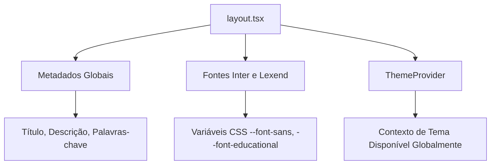
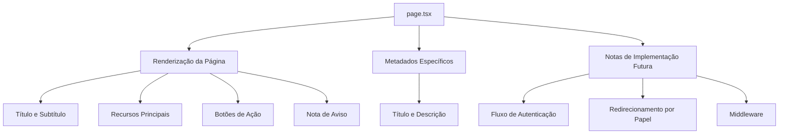
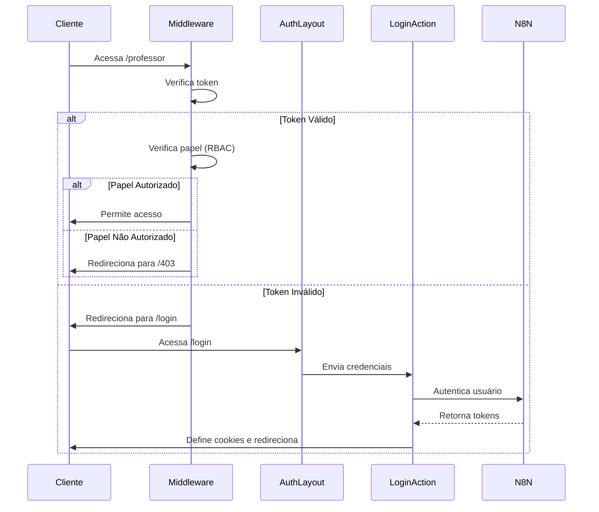

# Roteamento e Navegação

<cite>
**Arquivos Referenciados neste Documento**   
- [layout.tsx](file://src/app/layout.tsx) - *Atualizado no commit recente*
- [page.tsx](file://src/app/page.tsx) - *Página temporária com fluxo futuro*
- [next.config.ts](file://next.config.ts) - *Configuração de redirecionamentos e reescritas*
- [middleware.ts](file://middleware.ts) - *Implementado controle de acesso e refresh de token*
- [(auth)/layout.tsx](file://src/app/(auth)/layout.tsx) - *Layout de autenticação com redirecionamento por papel*
- [(auth)/login/page.tsx](file://src/app/(auth)/login/page.tsx) - *Página de login com navegação programática*
- [(protected)/professor/layout.tsx](file://src/app/(protected)/professor/layout.tsx) - *Layout protegido para professores*
- [(protected)/gestao/layout.tsx](file://src/app/(protected)/gestao/layout.tsx) - *Layout protegido para gestão*
- [core/auth/session.ts](file://src/core/auth/session.ts) - *Funções de sessão e autorização*
- [core/auth/actions.ts](file://src/core/auth/actions.ts) - *Server Actions para autenticação*
</cite>

## Resumo das Atualizações

**Alterações Realizadas**

- Atualização da seção de roteamento com base na nova estrutura de diretórios e
  rotas protegidas
- Adição de detalhes sobre o fluxo de autenticação completo com redirecionamento
  baseado em papéis
- Expansão da seção de controle de acesso (RBAC) com implementação real no
  middleware e layouts
- Inclusão de exemplos de Server Components e Server Actions para autenticação
- Atualização dos diagramas para refletir o fluxo real de autenticação e
  autorização
- Correção de informações desatualizadas sobre a página de design system

## Sumário

1. [Introdução](#introdução)
2. [Estrutura do Diretório `app/`](#estrutura-do-diretório-app)
3. [Layout Raiz com `layout.tsx`](#layout-raiz-com-layouttsx)
4. [Página Principal com `page.tsx`](#página-principal-com-pagetSX)
5. [Configuração de Rotas Futuras](#configuração-de-rotas-futuras)
6. [Componentes do Servidor e Metadados Dinâmicos](#componentes-do-servidor-e-metadados-dinâmicos)
7. [Integração com Autenticação e Controle de Acesso](#integração-com-autenticação-e-controle-de-acesso)
8. [Navegação Programática e Boas Práticas](#navegação-programática-e-boas-práticas)
9. [Conclusão](#conclusão)

## Introdução

O sistema de roteamento baseado no App Router do Next.js 15 é o núcleo da
arquitetura de navegação da aplicação VirtuQuest. Este documento detalha a
estrutura, funcionamento e boas práticas relacionadas ao roteamento, com foco na
integração com autenticação, metadados dinâmicos e organização de rotas em
aplicações educacionais complexas. O App Router permite uma abordagem moderna e
eficiente para gerenciar rotas, layouts e navegação, aproveitando os recursos
avançados do Next.js.

## Estrutura do Diretório `app/`

O diretório `app/` é a base do sistema de roteamento do Next.js 15, seguindo o
modelo de App Router. Ele contém os arquivos principais que definem a estrutura
da aplicação:

- `layout.tsx`: Define o layout raiz aplicado a todas as rotas.
- `page.tsx`: Representa a rota principal (`/`) da aplicação.

A estrutura inclui grupos de rotas organizados por parênteses:

- `(auth)`: Rotas relacionadas à autenticação (login, registro).
- `(protected)`: Rotas protegidas por autenticação e controle de acesso.

Essa estrutura permite uma organização clara e escalável, onde novas rotas podem
ser adicionadas criando subdiretórios com seus próprios arquivos `page.tsx` e
`layout.tsx`. O App Router utiliza a estrutura de diretórios para inferir
automaticamente as rotas, eliminando a necessidade de configuração manual de
rotas.

**Fontes da seção**

- [layout.tsx](file://src/app/layout.tsx#L1-L65)
- [page.tsx](file://src/app/page.tsx#L1-L88)

## Layout Raiz com `layout.tsx`

O arquivo `layout.tsx` define o layout raiz da aplicação, que envolve todas as
páginas com elementos comuns, como metadados, fontes e providers. Ele exporta
uma função assíncrona `RootLayout` que recebe `children` como propriedade,
permitindo que o conteúdo das páginas seja injetado dinamicamente.

### Configuração de Metadados

O layout raiz inclui uma configuração de metadados global através da exportação
`metadata`, que define:

- Título padrão e template para todas as páginas.
- Descrição, palavras-chave, autores e viewport.
- Cores do tema, ícones e manifest.

Esses metadados são herdados por todas as páginas, garantindo consistência na
identidade visual e no SEO.

### Fontes e Estilos

O layout carrega duas fontes do Google Fonts:

- `Inter`: Usada como fonte principal (`--font-sans`).
- `Lexend`: Usada como fonte educacional (`--font-educational`).

As variáveis CSS dessas fontes são aplicadas ao corpo do documento, permitindo
uma tipografia consistente em toda a aplicação.

### Providers

O layout inclui o `ThemeProvider` do sistema de design, que envolve todos os
filhos, garantindo que o contexto de tema esteja disponível em toda a aplicação.



**Fontes do diagrama**

- [layout.tsx](file://src/app/layout.tsx#L1-L65)

**Fontes da seção**

- [layout.tsx](file://src/app/layout.tsx#L1-L65)

## Página Principal com `page.tsx`

O arquivo `page.tsx` representa a rota principal da aplicação (`/`). Ele exporta
uma função `HomePage` que renderiza uma página de boas-vindas temporária com
informações sobre a plataforma VirtuQuest.

### Conteúdo da Página

A página inclui:

- Um título e subtítulo destacando o propósito da plataforma.
- Quatro recursos principais: Alinhamento BNCC, Taxonomia de Bloom, Virtudes
  Intelectuais e Integração com IA.
- Botões de ação para "Entrar" e "Saber Mais", com navegação para `/login` e
  `/about`.
- Uma nota de aviso indicando que esta é uma página temporária.

### Metadados Específicos

A página define metadados específicos através da exportação `metadata`, que
sobrescreve o título e a descrição globais para esta rota específica.

### Notas de Implementação Futura

Comentários no código indicam que esta página será substituída por um fluxo de
autenticação adequado na Fase 1. Isso inclui:

- Redirecionamento para `/professor` ou `/gestao` com base no papel do usuário.
- Implementação de lógica de redirecionamento no middleware.



**Fontes do diagrama**

- [page.tsx](file://src/app/page.tsx#L1-L88)

**Fontes da seção**

- [page.tsx](file://src/app/page.tsx#L1-L88)

## Configuração de Rotas Futuras

O sistema de roteamento está preparado para a implementação de rotas futuras,
como `/login`, `/professor` e `/gestao`. Essas rotas estão organizadas em
grupos:

- `(auth)`: Contém a rota `/login` com seu próprio layout.
- `(protected)`: Contém rotas protegidas como `/professor`, `/gestao`, `/admin`.

### Estratégia de Redirecionamento

O middleware implementa a lógica de redirecionamento com base no estado de
autenticação:

- Usuários não autenticados são redirecionados de rotas protegidas para
  `/login`.
- Usuários autenticados são redirecionados de rotas de autenticação para sua
  rota principal com base em seu papel.

### Controle de Acesso Baseado em Papéis (RBAC)

Os layouts em `(protected)` utilizam a função `requireRole` para validar o
acesso:

- `/professor`: Apenas usuários com papel `PROFESSOR` ou `ADMIN`.
- `/gestao`: Usuários com papéis de gestão (`COORDENADOR`, `SUPERVISOR`,
  `DIRETOR`) ou `ADMIN`.

```mermaid
graph TD
A[Rotas Futuras] --> B[/login]
A --> C[/professor]
A --> D[/gestao]
A --> E[/admin]
A --> F[/403]
B --> G[Autenticação]
C --> H[Painel do Professor]
D --> I[Painel de Gestão]
E --> J[Painel de Administração]
F --> K[Acesso Negado]
G --> L[Redirecionamento no Middleware]
H --> M[requireRole PROFESSOR]
I --> N[requireRole GESTÃO]
J --> O[requireRole ADMIN]
```

**Fontes do diagrama**

- [middleware.ts](file://middleware.ts#L1-L172)
- [(protected)/professor/layout.tsx](<file://src/app/(protected)/professor/layout.tsx#L1-L20>)
- [(protected)/gestao/layout.tsx](<file://src/app/(protected)/gestao/layout.tsx#L1-L25>)

**Fontes da seção**

- [middleware.ts](file://middleware.ts#L1-L172)
- [(auth)/layout.tsx](<file://src/app/(auth)/layout.tsx#L1-L53>)
- [(protected)/professor/layout.tsx](<file://src/app/(protected)/professor/layout.tsx#L1-L20>)
- [(protected)/gestao/layout.tsx](<file://src/app/(protected)/gestao/layout.tsx#L1-L25>)

## Componentes do Servidor e Metadados Dinâmicos

O App Router do Next.js 15 permite o uso de Server Components, que são
renderizados no servidor e não geram custo de bundle no cliente. Isso é ideal
para componentes que não precisam de interatividade, como layouts e páginas
estáticas.

### Server Actions para Autenticação

A autenticação é implementada usando Server Actions em
`src/core/auth/actions.ts`:

- `loginAction`: Processa credenciais e cria sessão.
- `logoutAction`: Encerra sessão e redireciona.
- `refreshTokenAction`: Renova tokens automaticamente.

### Metadados Dinâmicos

Os metadados podem ser gerados dinamicamente em Server Components, permitindo
personalização com base em dados do servidor. Por exemplo, o título de uma
página pode ser gerado com base no nome de um curso ou professor.

### Benefícios

- Redução do tamanho do bundle do cliente.
- Melhoria no desempenho de carregamento da página.
- Segurança aprimorada, pois a lógica sensível permanece no servidor.

**Fontes da seção**

- [core/auth/actions.ts](file://src/core/auth/actions.ts#L1-L231)
- [core/auth/session.ts](file://src/core/auth/session.ts#L1-L142)

## Integração com Autenticação e Controle de Acesso

A integração com autenticação é um aspecto crítico do sistema de roteamento. O
fluxo de autenticação está implementado com base nos seguintes princípios:

### Fluxo de Autenticação

1. Usuários acessam `/` e são mantidos na página temporária.
2. Ao clicar em "Entrar", são redirecionados para `/login`.
3. Após login bem-sucedido, o middleware redireciona para `/professor` ou
   `/gestao` com base no papel.
4. O estado de autenticação é gerenciado por cookies e validado no middleware.

### Controle de Acesso Baseado em Papéis (RBAC)

O controle de acesso é implementado em múltiplos níveis:

- **Middleware**: Valida acesso a rotas protegidas e adiciona headers com dados
  do usuário.
- **Layouts Protegidos**: Usam `requireRole` para garantir acesso apenas a
  papéis autorizados.
- **Server Actions**: Podem usar `requireUser` ou `requireRole` para proteger
  operações.

### Variáveis de Ambiente

As variáveis de ambiente, definidas em `src/lib/env.ts`, incluem segredos
essenciais para a autenticação, como `JWT_SECRET` e `JWT_REFRESH_SECRET`. Essas
variáveis são validadas em tempo de execução, garantindo a integridade da
configuração.



**Fontes do diagrama**

- [middleware.ts](file://middleware.ts#L1-L172)
- [(auth)/layout.tsx](<file://src/app/(auth)/layout.tsx#L1-L53>)
- [(auth)/login/page.tsx](<file://src/app/(auth)/login/page.tsx#L1-L131>)
- [core/auth/actions.ts](file://src/core/auth/actions.ts#L1-L231)

**Fontes da seção**

- [middleware.ts](file://middleware.ts#L1-L172)
- [core/auth/session.ts](file://src/core/auth/session.ts#L1-L142)
- [core/auth/actions.ts](file://src/core/auth/actions.ts#L1-L231)
- [(auth)/login/page.tsx](<file://src/app/(auth)/login/page.tsx#L1-L131>)

## Navegação Programática e Boas Práticas

A navegação programática é essencial para criar experiências de usuário fluidas.
No Next.js 15, isso pode ser feito usando o hook `useRouter` ou a função
`redirect`.

### Navegação Programática

- Use `useRouter.push` para navegar entre rotas de forma programática no
  cliente.
- Use `redirect` em Server Components para redirecionar o usuário com base em
  condições do servidor.
- Utilize parâmetros de consulta para manter o estado de redirecionamento (ex:
  `?redirect=/professor`).

### Boas Práticas para Organização de Rotas

1. **Estrutura Hierárquica**: Organize as rotas em subdiretórios com base em
   funcionalidades (ex: `app/professor`, `app/gestao`).
2. **Grupos de Rotas**: Use parênteses `(grupo)` para agrupar rotas logicamente
   sem afetar a URL.
3. **Reutilização de Layouts**: Use `layout.tsx` em subdiretórios para definir
   layouts específicos para grupos de rotas.
4. **Validação de Acesso**: Implemente middleware e Server Components para
   validar o acesso a rotas sensíveis.
5. **Carregamento de Dados**: Use Server Components para carregar dados no
   servidor, reduzindo a carga no cliente.

### Exemplo de Navegação

```tsx
'use client';

import { useRouter } from 'next/navigation';

export default function LoginButton() {
  const router = useRouter();

  const handleLogin = () => {
    // Lógica de autenticação
    router.push('/professor'); // Redireciona para o painel do professor
  };

  return <button onClick={handleLogin}>Entrar</button>;
}
```

**Fontes da seção**

- [(auth)/login/page.tsx](<file://src/app/(auth)/login/page.tsx#L1-L131>)
- [middleware.ts](file://middleware.ts#L1-L172)

## Conclusão

O sistema de roteamento baseado no App Router do Next.js 15 oferece uma base
sólida e escalável para a aplicação VirtuQuest. A estrutura do diretório `app/`,
combinada com o uso de Server Components, metadados dinâmicos e integração com
autenticação, permite uma navegação eficiente e segura. A implementação de rotas
futuras, como `/login`, `/professor` e `/gestao`, foi facilitada pela
organização clara e pelos placeholders já definidos no código. Seguindo as boas
práticas de organização de rotas, a aplicação poderá evoluir de forma
sustentável, atendendo às necessidades de uma plataforma educacional complexa.
