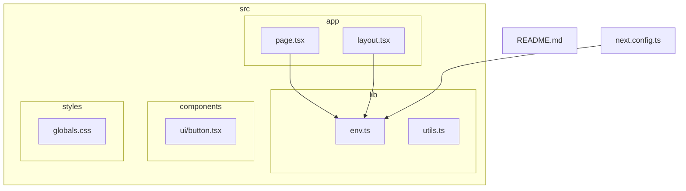
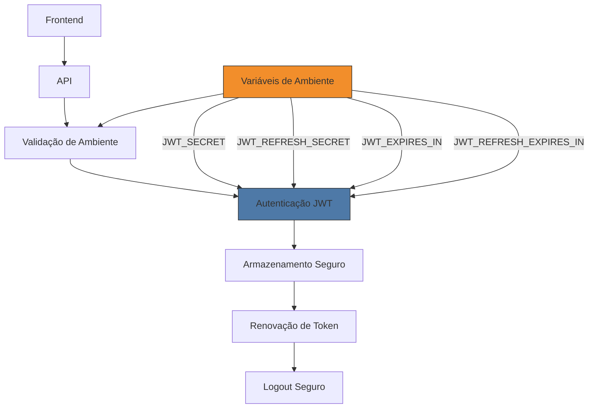
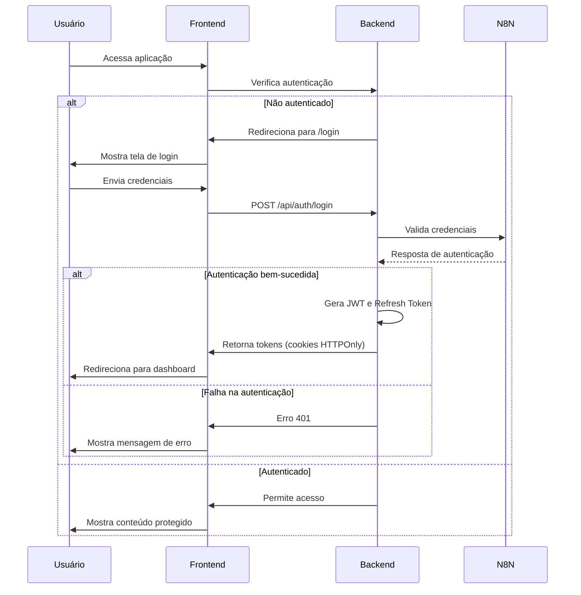
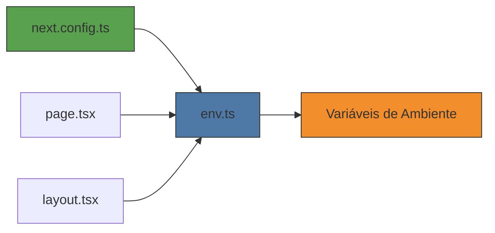

# Autenticação JWT

<cite>
**Arquivos Referenciados neste Documento**  
- [env.ts](file://src/lib/env.ts)
- [page.tsx](file://src/app/page.tsx)
- [layout.tsx](file://src/app/layout.tsx)
- [next.config.ts](file://next.config.ts)
- [README.md](file://README.md)
</cite>

## Sumário
1. [Introdução](#introdução)
2. [Estrutura do Projeto](#estrutura-do-projeto)
3. [Componentes Principais](#componentes-principais)
4. [Visão Geral da Arquitetura](#visão-geral-da-arquitetura)
5. [Análise Detalhada dos Componentes](#análise-detalhada-dos-componentes)
6. [Análise de Dependências](#análise-de-dependências)
7. [Considerações de Desempenho](#considerações-de-desempenho)
8. [Guia de Solução de Problemas](#guia-de-solução-de-problemas)
9. [Conclusão](#conclusão)

## Introdução

O sistema de autenticação baseado em JWT (JSON Web Token) é um componente fundamental para garantir a segurança e integridade das aplicações modernas. Este documento detalha a implementação e configuração do sistema de autenticação JWT no projeto VirtuQuest, com foco especial nas variáveis de ambiente que controlam a geração, validação e expiração dos tokens de acesso e refresh. Embora a implementação completa da autenticação ainda esteja em desenvolvimento (prevista para a Fase 1), a base já está estabelecida com as configurações de segurança necessárias.

A arquitetura atual prepara o terreno para um fluxo de autenticação robusto, utilizando chaves criptográficas fortes, tempos de expiração configuráveis e práticas recomendadas de segurança. O sistema será implementado utilizando tokens JWT para autenticação stateless, com mecanismos de renovação segura através de refresh tokens e invalidação adequada durante o logout.

## Estrutura do Projeto

A estrutura do projeto segue uma organização baseada em funcionalidades e camadas, com ênfase na separação de preocupações e na escalabilidade. Os componentes relacionados à autenticação estão distribuídos estrategicamente entre diferentes diretórios, preparando o sistema para a implementação completa do fluxo de autenticação.



**Fontes do Diagrama**
- [env.ts](file://src/lib/env.ts)
- [page.tsx](file://src/app/page.tsx)
- [layout.tsx](file://src/app/layout.tsx)
- [next.config.ts](file://next.config.ts)

**Fontes da Seção**
- [src/lib/env.ts](file://src/lib/env.ts)
- [src/app/page.tsx](file://src/app/page.tsx)
- [src/app/layout.tsx](file://src/app/layout.tsx)

## Componentes Principais

Os componentes principais relacionados ao sistema de autenticação JWT estão centrados na validação e gerenciamento seguro das variáveis de ambiente, que são fundamentais para a segurança do sistema. A implementação atual foca na preparação da infraestrutura necessária para a autenticação, com especial atenção à validação rigorosa das chaves criptográficas e aos tempos de expiração dos tokens.

O arquivo `env.ts` desempenha um papel crucial como porta de entrada para as variáveis de ambiente, garantindo que todas as configurações sensíveis sejam validadas antes de serem utilizadas pela aplicação. Esta abordagem previne erros de configuração que poderiam comprometer a segurança do sistema.

**Fontes da Seção**
- [src/lib/env.ts](file://src/lib/env.ts#L0-L87)
- [src/app/page.tsx](file://src/app/page.tsx#L55-L84)

## Visão Geral da Arquitetura

A arquitetura de autenticação JWT no projeto VirtuQuest é projetada para ser segura, escalável e fácil de manter. O sistema utiliza uma abordagem de validação centralizada das variáveis de ambiente, garantindo que todas as configurações críticas sejam verificadas antes da inicialização da aplicação.



**Fontes do Diagrama**
- [src/lib/env.ts](file://src/lib/env.ts#L0-L30)
- [next.config.ts](file://next.config.ts#L89-L93)

## Análise Detalhada dos Componentes

### Análise do Componente de Configuração de Ambiente

O componente de configuração de ambiente é o coração do sistema de segurança da aplicação, responsável por validar e fornecer acesso tipado às variáveis de ambiente. Sua implementação utiliza o Zod para validação rigorosa dos dados, garantindo que todas as configurações necessárias estejam presentes e sejam válidas antes da inicialização da aplicação.

#### Para Componentes de Configuração:
```mermaid
classDiagram
class EnvValidation {
+validateEnv() : Env
-serverSchema : ZodObject
-clientSchema : ZodObject
-envSchema : ZodObject
}
class Environment {
+N8N_BASE_URL : string
+N8N_API_KEY : string | undefined
+N8N_WEBHOOK_SECRET : string
+JWT_SECRET : string
+JWT_REFRESH_SECRET : string
+JWT_EXPIRES_IN : string
+JWT_REFRESH_EXPIRES_IN : string
+LOG_LEVEL : 'debug' | 'info' | 'warn' | 'error'
}
EnvValidation --> Environment : "retorna"
note right of EnvValidation
Validação centralizada de variáveis
de ambiente com Zod, garantindo
segurança e tipagem rigorosa
end note
```

**Fontes do Diagrama**
- [src/lib/env.ts](file://src/lib/env.ts#L0-L87)

**Fontes da Seção**
- [src/lib/env.ts](file://src/lib/env.ts#L0-L87)

### Visão Conceitual do Fluxo de Autenticação

Embora a implementação completa do fluxo de autenticação ainda não esteja presente no códigobase, os comentários e placeholders indicam claramente a intenção de implementar um sistema robusto na Fase 1 do projeto. O fluxo planejado inclui redirecionamento para login, provedores de autenticação e lógica de redirecionamento baseada em papéis.



[Sem fontes necessárias, pois este diagrama mostra o fluxo conceitual planejado, não a implementação atual]

[Sem fontes necessárias, pois esta seção não analisa arquivos específicos]

## Análise de Dependências

A análise de dependências revela que o sistema de autenticação está projetado para integrar-se com o ambiente de execução do Next.js, utilizando seus mecanismos de configuração e redirecionamento. As variáveis de ambiente são validadas no nível do Next.js e utilizadas em toda a aplicação através do módulo centralizado `env.ts`.



**Fontes do Diagrama**
- [next.config.ts](file://next.config.ts#L52-L109)
- [src/lib/env.ts](file://src/lib/env.ts)
- [src/app/page.tsx](file://src/app/page.tsx)
- [src/app/layout.tsx](file://src/app/layout.tsx)

**Fontes da Seção**
- [next.config.ts](file://next.config.ts#L52-L109)
- [src/lib/env.ts](file://src/lib/env.ts#L0-L87)

## Considerações de Desempenho

As considerações de desempenho para o sistema de autenticação JWT focam principalmente na eficiência da validação de tokens e no gerenciamento de sessões. Com os tempos de expiração configuráveis, é possível equilibrar a segurança com o desempenho do sistema.

A configuração atual define um tempo de expiração de 15 minutos para tokens de acesso (`JWT_EXPIRES_IN`) e 7 dias para tokens de refresh (`JWT_REFRESH_EXPIRES_IN`), o que representa um bom equilíbrio entre segurança e experiência do usuário. Tokens curtos reduzem o risco de uso não autorizado em caso de roubo, enquanto o refresh token de longa duração permite sessões persistentes sem exigir login frequente.

A validação centralizada das variáveis de ambiente no início da aplicação tem um impacto mínimo no desempenho, mas previne erros em tempo de execução que poderiam causar falhas catastróficas posteriormente.

[Sem fontes necessárias, pois esta seção fornece orientações gerais]

## Guia de Solução de Problemas

O sistema inclui mecanismos robustos de validação de ambiente que ajudam na solução de problemas comuns relacionados à configuração de autenticação. Quando variáveis de ambiente essenciais estão ausentes ou inválidas, o sistema fornece mensagens de erro detalhadas que identificam exatamente quais variáveis estão faltando ou são inválidas.

Os principais problemas que podem ocorrer e suas soluções incluem:

1. **Erro de validação de ambiente**: Ocorre quando variáveis essenciais estão ausentes ou em formato incorreto. A mensagem de erro especifica exatamente qual variável está problemática.
2. **Chaves criptográficas muito curtas**: As chaves JWT devem ter pelo menos 32 caracteres. O sistema valida isso automaticamente.
3. **Configuração de redirecionamento ausente**: O placeholder no `next.config.ts` indica que o redirecionamento para login será implementado na Fase 1.

**Fontes da Seção**
- [src/lib/env.ts](file://src/lib/env.ts#L60-L68)
- [README.md](file://README.md#L83-L110)

## Conclusão

O sistema de autenticação JWT no projeto VirtuQuest está bem estruturado e preparado para uma implementação robusta na Fase 1. A base de segurança já está estabelecida com a validação rigorosa das variáveis de ambiente, especialmente as chaves criptográficas JWT_SECRET e JWT_REFRESH_SECRET, que devem ter pelo menos 32 caracteres.

A arquitetura planejada inclui práticas recomendadas de segurança, como o uso de chaves fortes, tempos de expiração configuráveis e armazenamento seguro de tokens. O fluxo de autenticação será implementado utilizando redirecionamentos no middleware do Next.js, provedores de autenticação e lógica de redirecionamento baseada em papéis.

Embora a implementação completa ainda não esteja presente, os placeholders e comentários no código indicam claramente a intenção de criar um sistema de autenticação seguro e eficiente. A separação clara entre variáveis de ambiente do servidor e do cliente, juntamente com a validação centralizada, demonstra um entendimento sólido dos princípios de segurança em aplicações modernas.