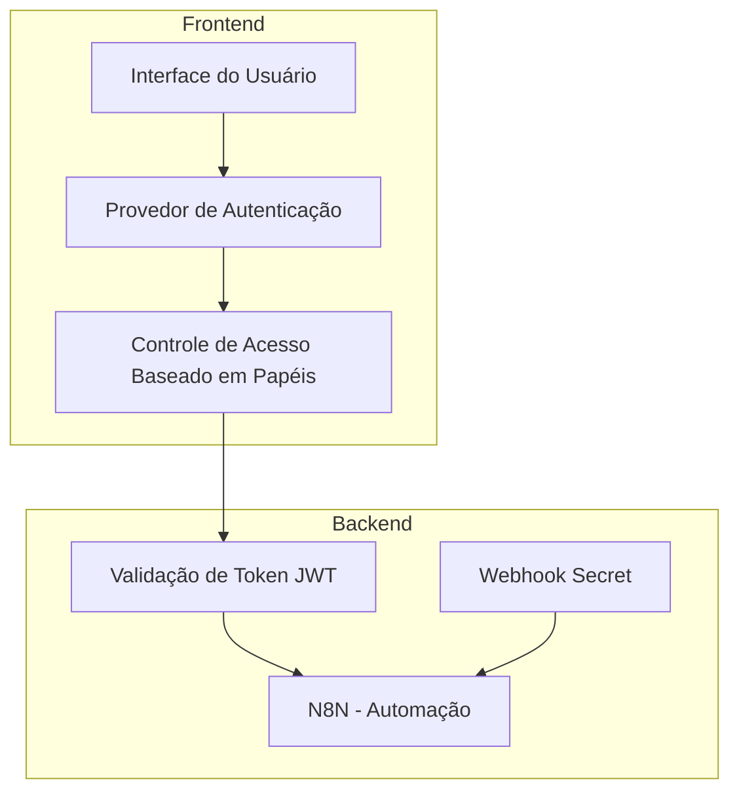
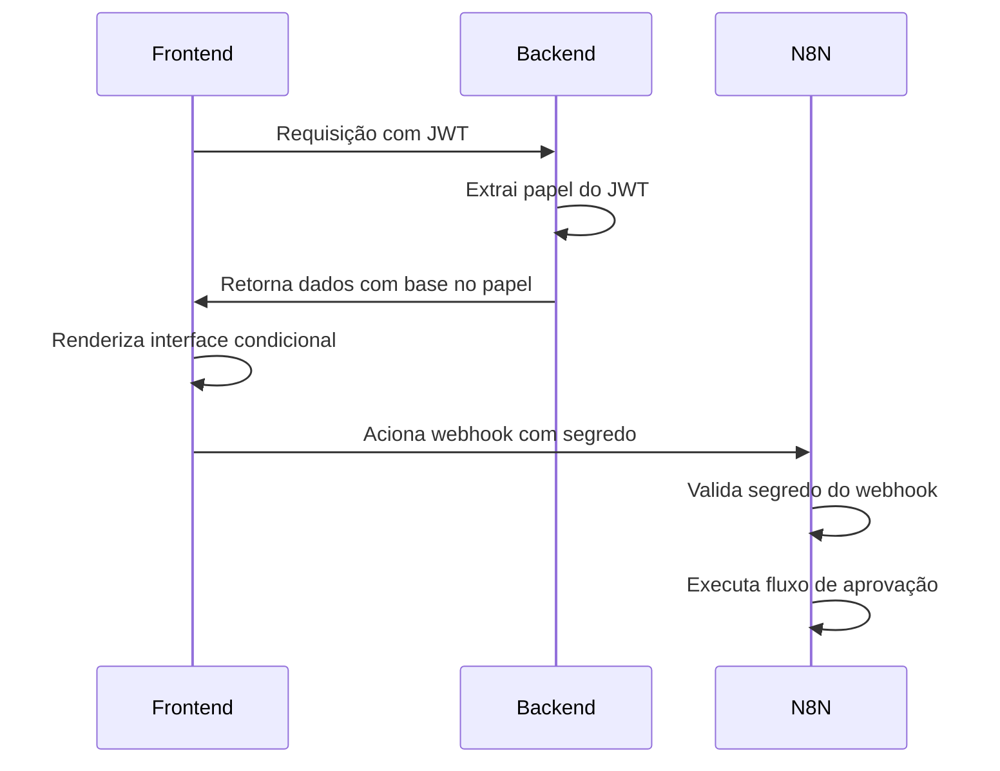
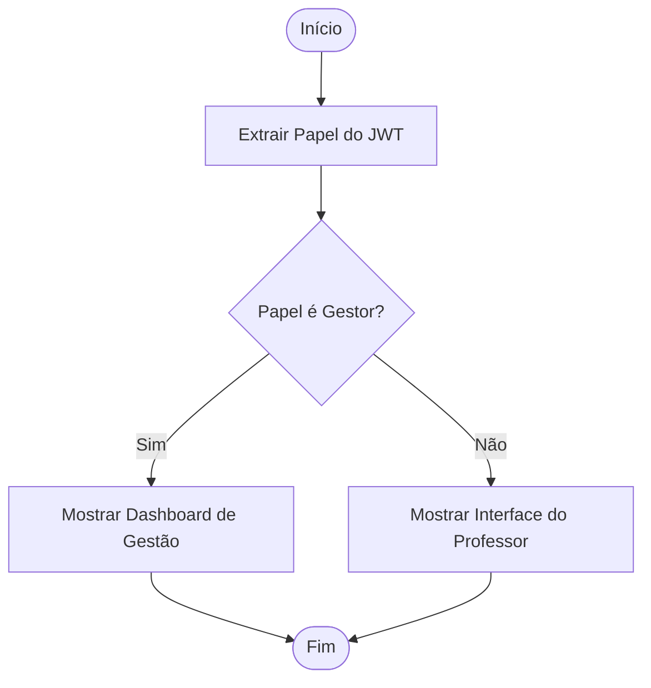
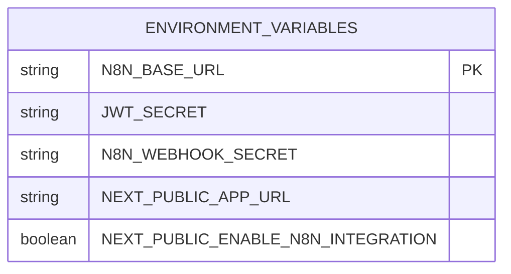

# Autorização com RBAC

<cite>
**Arquivos Referenciados neste Documento**  
- [src/lib/env.ts](file://src/lib/env.ts)
- [.env.example](file://.env.example)
- [next.config.ts](file://next.config.ts)
- [src/app/page.tsx](file://src/app/page.tsx)
- [README.md](file://README.md)
</cite>

## Sumário
1. [Introdução](#introdução)
2. [Estrutura do Projeto](#estrutura-do-projeto)
3. [Componentes Principais](#componentes-principais)
4. [Visão Geral da Arquitetura](#visão-geral-da-arquitetura)
5. [Análise Detalhada dos Componentes](#análise-detalhada-dos-componentes)
6. [Análise de Dependências](#análise-de-dependências)
7. [Considerações de Desempenho](#considerações-de-desempenho)
8. [Guia de Solução de Problemas](#guia-de-solução-de-problemas)
9. [Conclusão](#conclusão)

## Introdução
Este documento fornece uma análise detalhada do sistema de controle de acesso baseado em papéis (RBAC) implementado no projeto VirtuQuest. O sistema utiliza tokens JWT para gerenciar permissões de usuários, com papéis definidos como "professor" e "gestor". O frontend utiliza essas permissões para renderizar interfaces condicionais, enquanto o backend N8N valida autorizações em rotas protegidas. A configuração de ambiente é crítica para garantir a consistência entre frontend e backend, especialmente em relação aos segredos JWT e URLs de integração.

## Estrutura do Projeto
A estrutura do projeto é organizada com base no App Router do Next.js, com componentes separados por funcionalidade. O sistema de autenticação e autorização está em fase de implementação, com fluxos de autenticação planejados para a Fase 1. O controle de acesso baseado em papéis (RBAC) será implementado com redirecionamento baseado em papéis após autenticação.

**Fontes do Diagrama**  
- [src/app/page.tsx](file://src/app/page.tsx#L1-L84)
- [next.config.ts](file://next.config.ts#L1-L109)
- [.env.example](file://.env.example#L1-L106)

**Fontes da Seção**  
- [src/app/page.tsx](file://src/app/page.tsx#L1-L84)
- [next.config.ts](file://next.config.ts#L1-L109)

## Componentes Principais
Os componentes principais do sistema RBAC incluem a validação de tokens JWT, extração de papéis e permissões, e o controle de acesso no frontend e backend. O sistema utiliza variáveis de ambiente para configurar segredos JWT e URLs de integração com o N8N. O redirecionamento baseado em papéis será implementado para direcionar usuários autenticados para `/professor` ou `/gestao` conforme seu papel.

**Fontes da Seção**  
- [src/lib/env.ts](file://src/lib/env.ts#L1-L87)
- [.env.example](file://.env.example#L1-L106)

## Visão Geral da Arquitetura
A arquitetura do sistema RBAC integra frontend Next.js com backend N8N através de webhooks seguros. O token JWT contém informações de papel que são utilizadas tanto no frontend para renderização condicional quanto no backend para validação de autorizações. O segredo do webhook N8N garante que apenas requisições autenticadas possam acionar fluxos de trabalho.

**Fontes do Diagrama**  
- [src/lib/env.ts](file://src/lib/env.ts#L1-L87)
- [README.md](file://README.md#L1-L277)

## Análise Detalhada dos Componentes
### Análise do Componente de Autenticação
O sistema de autenticação extrai papéis do token JWT para determinar as permissões do usuário. No frontend, isso permite renderizar condicionalmente interfaces como o dashboard de gestão e a aprovação de planos. No backend N8N, as rotas protegidas validam as autorizações com base no papel contido no token.

#### Para Componentes de API/Serviço:

**Fontes do Diagrama**  
- [src/lib/env.ts](file://src/lib/env.ts#L1-L87)
- [src/app/page.tsx](file://src/app/page.tsx#L1-L84)

**Fontes da Seção**  
- [src/lib/env.ts](file://src/lib/env.ts#L1-L87)
- [src/app/page.tsx](file://src/app/page.tsx#L1-L84)

## Análise de Dependências
O sistema RBAC depende de variáveis de ambiente para funcionar corretamente, especialmente os segredos JWT e o segredo do webhook N8N. A consistência entre as configurações de frontend e backend é essencial para evitar erros de autenticação e autorização. O arquivo `.env.example` fornece um modelo completo para configuração.

**Fontes do Diagrama**  
- [.env.example](file://.env.example#L1-L106)
- [src/lib/env.ts](file://src/lib/env.ts#L1-L87)

**Fontes da Seção**  
- [.env.example](file://.env.example#L1-L106)
- [src/lib/env.ts](file://src/lib/env.ts#L1-L87)

## Considerações de Desempenho
O sistema RBAC foi projetado para ser eficiente, com validação de tokens JWT em tempo real e cache de permissões para reduzir a latência. O uso de webhooks seguros com o N8N permite automação de fluxos de trabalho sem comprometer a segurança. A validação de ambiente em tempo de inicialização garante que todas as variáveis necessárias estejam presentes, evitando falhas em tempo de execução.

## Guia de Solução de Problemas
Problemas comuns incluem acesso negado devido a tokens JWT inválidos ou papéis incorretos, e permissões não sincronizadas entre frontend e backend. Para resolver, verifique se os segredos JWT e do webhook N8N estão corretamente configurados em ambos os ambientes. Certifique-se de que o papel no token JWT corresponde ao esperado para a ação que está sendo realizada.

**Fontes da Seção**  
- [.env.example](file://.env.example#L1-L106)
- [src/lib/env.ts](file://src/lib/env.ts#L1-L87)

## Conclusão
O sistema RBAC do VirtuQuest fornece um controle de acesso robusto baseado em papéis, utilizando tokens JWT para gerenciar permissões de forma segura e eficiente. A integração com o N8N permite automação de fluxos de trabalho protegidos, enquanto o frontend renderiza interfaces condicionais com base no papel do usuário. A configuração adequada de ambiente é crucial para garantir a consistência e segurança do sistema.