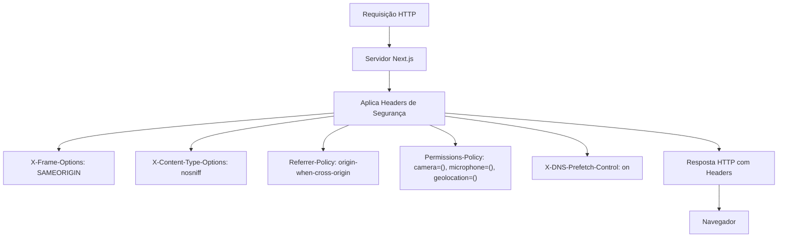
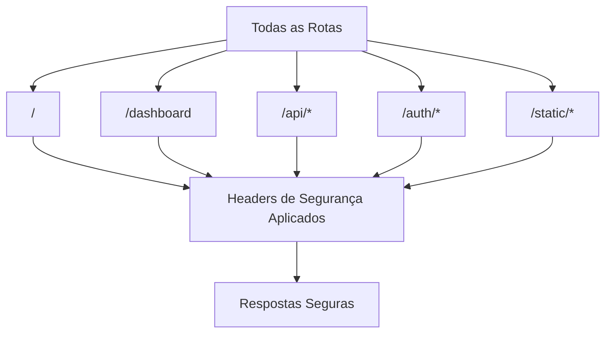

# Segurança com Headers HTTP

<cite>
**Arquivos Referenciados neste Documento**  
- [next.config.ts](file://next.config.ts)
- [src/lib/env.ts](file://src/lib/env.ts)
</cite>

## Sumário
1. [Introdução](#introdução)
2. [Configuração de Segurança em next.config.ts](#configuração-de-segurança-em-next.config.ts)
3. [Análise Detalhada dos Headers de Segurança](#análise-detalhada-dos-headers-de-segurança)
4. [Aplicação Global e Impacto na Segurança](#aplicação-global-e-impacto-na-segurança)
5. [Boas Práticas e Ajustes por Ambiente](#boas-práticas-e-ajustes-por-ambiente)
6. [Testes e Validação da Efetividade](#testes-e-validação-da-efetividade)
7. [Conclusão](#conclusão)

## Introdução

A segurança em aplicações web modernas exige uma abordagem multifacetada, onde os headers HTTP desempenham um papel fundamental como camada de defesa proativa contra diversas ameaças. Este documento analisa a configuração de segurança implementada no arquivo `next.config.ts` de uma aplicação Next.js, focando nos headers HTTP que protegem contra ataques comuns como clickjacking, MIME sniffing, vazamento de informações e acesso não autorizado a recursos do navegador. A configuração apresentada segue boas práticas de segurança web, aplicando medidas preventivas que fortalecem a postura de segurança da aplicação em todos os ambientes.

## Configuração de Segurança em next.config.ts

A configuração de segurança é implementada através da função assíncrona `headers()` no arquivo `next.config.ts`, que define uma política global de headers aplicada a todas as rotas da aplicação. A regra utiliza um padrão de expressão regular `/(.*)` que corresponde a todas as rotas, garantindo que os headers de segurança sejam incluídos em todas as respostas HTTP do servidor.

**Diagram sources**
- [next.config.ts](file://next.config.ts#L44-L72)

**Section sources**
- [next.config.ts](file://next.config.ts#L44-L72)

## Análise Detalhada dos Headers de Segurança

### X-Frame-Options (Proteção contra Clickjacking)

O header `X-Frame-Options` com valor `SAMEORIGIN` previne ataques de clickjacking ao restringir que a página seja incorporada em frames ou iframes de origens diferentes. Isso protege contra tentativas de enganar usuários para clicar em elementos ocultos ou deslocados em páginas maliciosas.

**Impacto na segurança:**
- Impede que sites maliciosos embutam a aplicação em iframes para realizar ataques de UI redress
- Protege funcionalidades sensíveis como autenticação e transações financeiras
- Mitiga riscos de phishing que exploram a interface da aplicação

### X-Content-Type-Options (Proteção contra MIME Sniffing)

O header `X-Content-Type-Options` com valor `nosniff` desativa o MIME sniffing realizado pelos navegadores, forçando-os a respeitar o tipo de conteúdo declarado no header `Content-Type`. Isso é crucial para prevenir ataques de execução de scripts em arquivos que deveriam ser tratados como conteúdo estático.

**Impacto na segurança:**
- Previne ataques XSS que exploram interpretação incorreta de tipos MIME
- Garante que arquivos como imagens ou documentos não sejam executados como código JavaScript
- Reduz superfície de ataque em uploads de arquivos

### Referrer-Policy (Controle de Informações de Referência)

O header `Referrer-Policy` com valor `origin-when-cross-origin` controla quanta informação sobre a página de origem é enviada no header `Referer` ao fazer requisições para outros domínios. Esta configuração representa um equilíbrio entre privacidade e funcionalidade.

**Impacto na segurança:**
- Protege informações sensíveis na URL da página de origem
- Reduz vazamento de dados em logs de servidores de terceiros
- Mantém informações suficientes para funcionalidades legítimas como análise de tráfego

### Permissions-Policy (Restrição de Recursos de Navegador)

O header `Permissions-Policy` desativa explicitamente o acesso a recursos sensíveis do navegador como câmera, microfone e geolocalização. Esta política por negação é uma abordagem de segurança proativa que minimiza riscos mesmo que a aplicação não utilize esses recursos.

**Impacto na segurança:**
- Previne acesso não autorizado a hardware sensível do usuário
- Mitiga riscos de espionagem e coleta de dados sem consentimento
- Reduz superfície de ataque para exploits que exploram APIs de dispositivo

### X-DNS-Prefetch-Control

O header `X-DNS-Prefetch-Control` com valor `on` permite o prefetch de DNS, uma otimização de desempenho que pode ter implicações de segurança. Ao habilitar o prefetch, o navegador pode resolver nomes de domínio antecipadamente, mas isso deve ser considerado cuidadosamente em relação à privacidade.

**Impacto na segurança:**
- Melhora desempenho ao reduzir tempo de latência em navegação
- Pode revelar padrões de navegação em logs de DNS
- Requer avaliação de risco entre desempenho e privacidade

**Section sources**
- [next.config.ts](file://next.config.ts#L52-L72)

## Aplicação Global e Impacto na Segurança

A configuração de headers no `next.config.ts` é aplicada globalmente a todas as rotas da aplicação através do padrão de rota `/(.*)`, que utiliza uma expressão regular para corresponder a qualquer caminho. Esta abordagem garante que não haja rotas desprotegidas, eliminando lacunas de segurança que poderiam ser exploradas em endpoints específicos.

**Diagram sources**
- [next.config.ts](file://next.config.ts#L44-L72)

O impacto cumulativo desses headers cria uma camada de defesa em profundidade que:
- Reduz significativamente a superfície de ataque da aplicação
- Protege contra ameaças conhecidas e emergentes
- Demonstra conformidade com padrões de segurança web
- Aumenta a confiança do usuário na integridade da aplicação

**Section sources**
- [next.config.ts](file://next.config.ts#L44-L72)

## Boas Práticas e Ajustes por Ambiente

A configuração apresentada segue boas práticas de segurança web recomendadas por organizações como OWASP e Mozilla. No entanto, pode ser ajustada para diferentes ambientes de acordo com as necessidades específicas:

### Ambiente de Desenvolvimento
- Considerar `Referrer-Policy: no-referrer` para máxima privacidade
- Manter `X-Frame-Options: DENY` se não houver necessidade de iframes
- Adicionar `Content-Security-Policy` para proteção adicional contra XSS

### Ambiente de Produção
- Manter configuração atual como padrão seguro
- Monitorar logs para detectar tentativas de exploração
- Considerar implementação de HSTS para proteção contra downgrade de protocolo

### Considerações de Conflito
Algumas funcionalidades podem entrar em conflito com políticas de segurança rígidas:
- Integrações com iframes de terceiros podem exigir ajustes no `X-Frame-Options`
- Funcionalidades que utilizam câmera ou microfone precisam de permissões explícitas
- Analytics e rastreamento podem ser afetados pelo `Referrer-Policy`

A gestão desses conflitos deve ser feita através de políticas granulares que equilibrem segurança e funcionalidade.

**Section sources**
- [next.config.ts](file://next.config.ts#L44-L72)
- [src/lib/env.ts](file://src/lib/env.ts#L32-L87)

## Testes e Validação da Efetividade

Para garantir a eficácia dos headers de segurança, recomenda-se a realização de testes regulares:

1. **Verificação de Headers**: Utilizar ferramentas como curl ou navegadores para inspecionar os headers de resposta
2. **Testes de Penetração**: Realizar testes específicos para validar a proteção contra clickjacking e MIME sniffing
3. **Ferramentas Automatizadas**: Utilizar scanners de segurança como OWASP ZAP ou Burp Suite
4. **Monitoramento Contínuo**: Implementar alertas para mudanças não autorizadas na política de headers

A validação contínua garante que a configuração de segurança permaneça eficaz mesmo após alterações na aplicação.

## Conclusão

A configuração de headers de segurança no `next.config.ts` representa uma implementação robusta de medidas de proteção proativas que fortalecem significativamente a postura de segurança da aplicação. Ao aplicar políticas globais que protegem contra ameaças comuns como clickjacking, MIME sniffing e vazamento de informações, a aplicação demonstra compromisso com as melhores práticas de segurança web. A abordagem de defesa em profundidade, combinada com a aplicação global dos headers, cria uma barreira eficaz contra diversas classes de ataques. Recomenda-se manter esta configuração como padrão, com ajustes pontuais apenas quando necessários para funcionalidades específicas, sempre após avaliação cuidadosa de riscos.