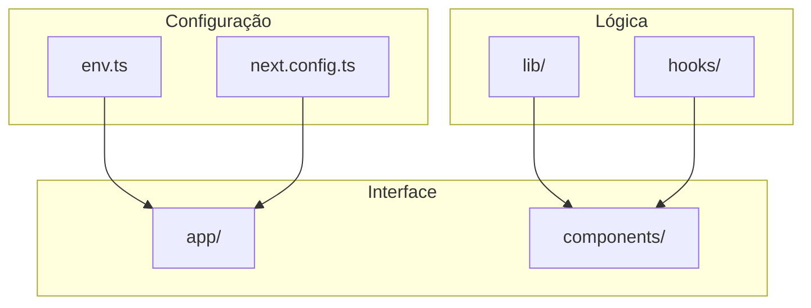
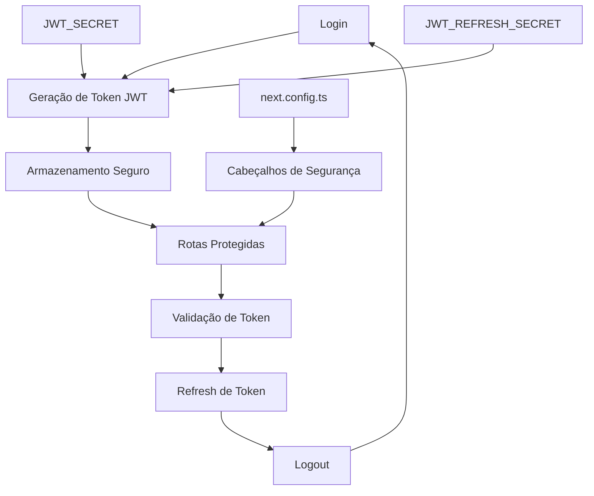
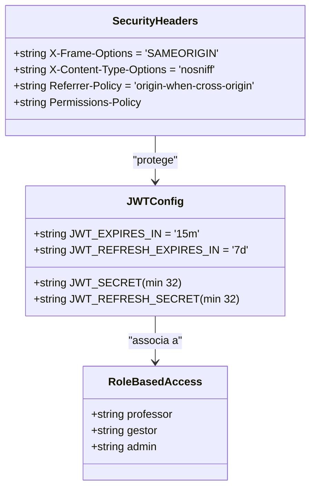
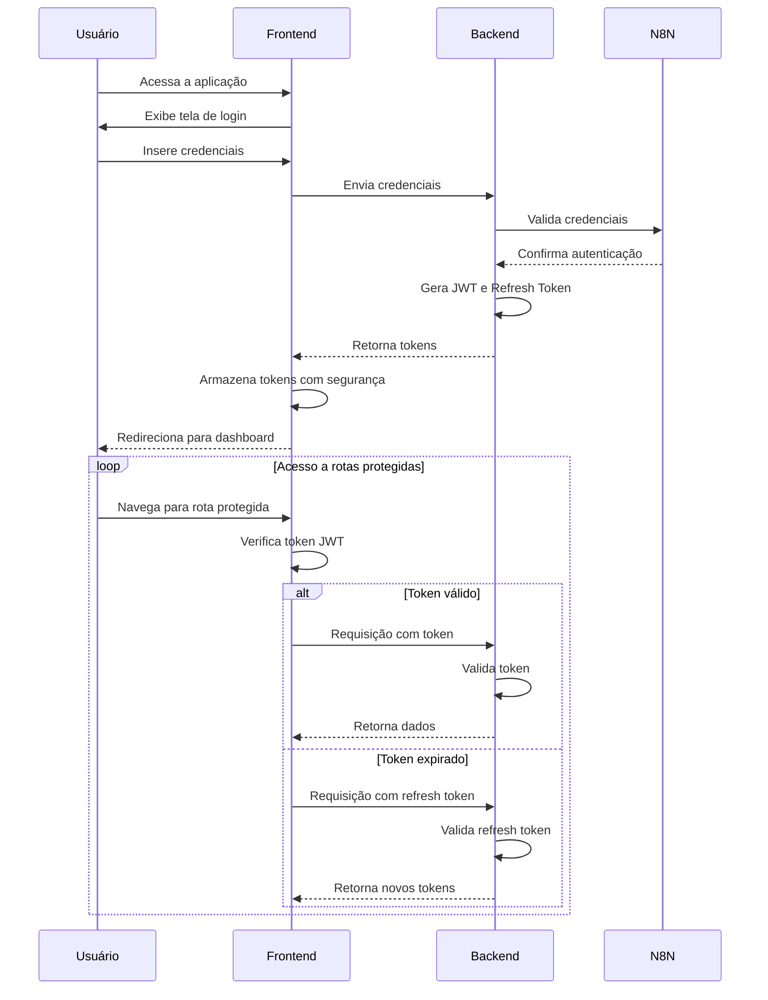
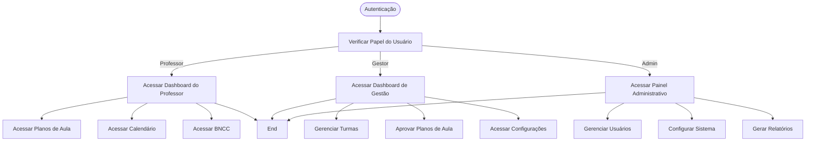
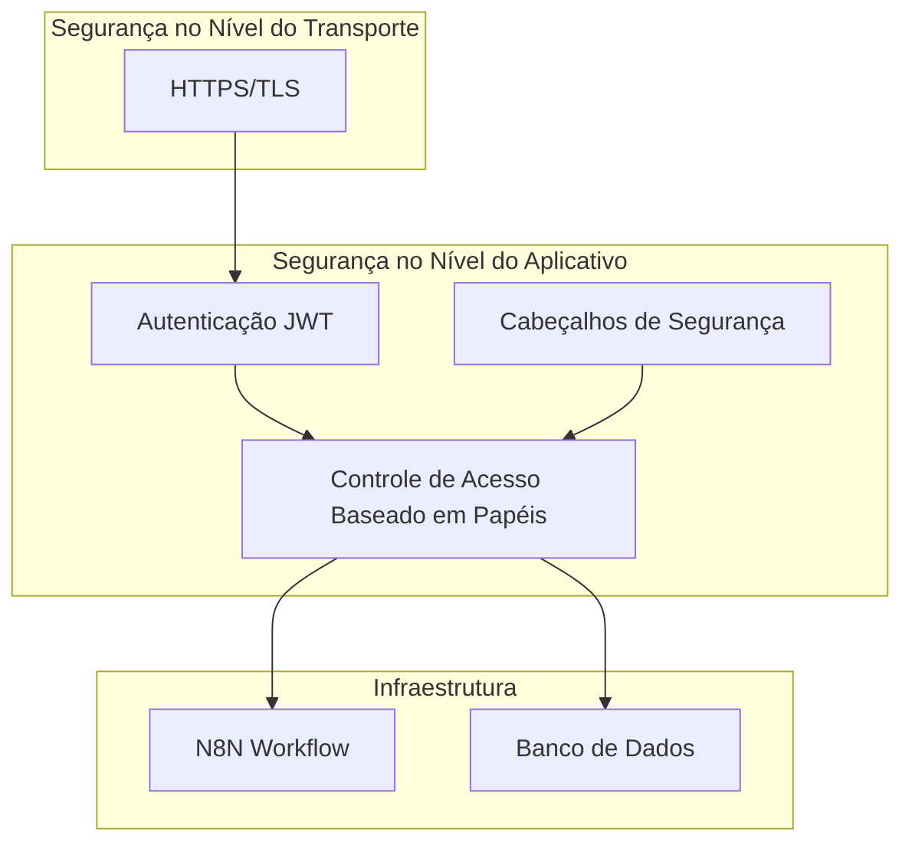
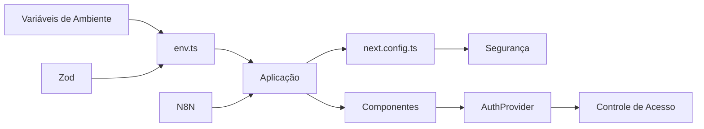

# Segurança e Autenticação

<cite>
**Arquivos Referenciados neste Documento**   
- [env.ts](file://src/lib/env.ts)
- [next.config.ts](file://next.config.ts)
- [sidebar.tsx](file://src/components/layouts/sidebar.tsx)
- [page.tsx](file://src/app/page.tsx)
</cite>

## Sumário
1. [Introdução](#introdução)
2. [Estrutura do Projeto](#estrutura-do-projeto)
3. [Componentes Principais](#componentes-principais)
4. [Visão Geral da Arquitetura](#visão-geral-da-arquitetura)
5. [Análise Detalhada dos Componentes](#análise-detalhada-dos-componentes)
6. [Análise de Dependências](#análise-de-dependências)
7. [Considerações de Desempenho](#considerações-de-desempenho)
8. [Guia de Solução de Problemas](#guia-de-solução-de-problemas)
9. [Conclusão](#conclusão)

## Introdução
Este documento apresenta a arquitetura de segurança e autenticação baseada em JWT com controle de acesso baseado em papéis (RBAC) para o sistema VirtuQuest. O sistema está em fase de desenvolvimento, com o fluxo de autenticação planejado para implementação na Fase 1. A arquitetura utiliza segredos JWT para assinatura e validação de tokens, com proteção adicional fornecida por cabeçalhos de segurança no Next.js. O controle de acesso será implementado com base em papéis como professor e gestor, com interfaces específicas para cada função.

## Estrutura do Projeto
A estrutura do projeto segue uma organização baseada em recursos e camadas, com componentes claramente separados por responsabilidade. O diretório `src/app` contém os componentes principais da aplicação, enquanto `src/lib` armazena utilitários e configurações. A segurança é gerenciada principalmente através de variáveis de ambiente e configurações no `next.config.ts`.

**Diagram sources**
- [next.config.ts](file://next.config.ts#L1-L111)
- [env.ts](file://src/lib/env.ts#L1-L88)

**Section sources**
- [next.config.ts](file://next.config.ts#L1-L111)
- [env.ts](file://src/lib/env.ts#L1-L88)

## Componentes Principais
Os componentes principais relacionados à segurança incluem o gerenciamento de variáveis de ambiente em `env.ts`, a configuração de segurança em `next.config.ts`, e os componentes de interface que refletem a estrutura de acesso baseada em papéis. O sistema utiliza dois segredos JWT distintos para tokens de acesso e refresh, com tempos de expiração configuráveis. A estrutura de navegação no `sidebar.tsx` indica rotas diferentes para papéis de professor e gestão.

**Section sources**
- [env.ts](file://src/lib/env.ts#L1-L88)
- [next.config.ts](file://next.config.ts#L1-L111)
- [sidebar.tsx](file://src/components/layouts/sidebar.tsx#L1-L163)

## Visão Geral da Arquitetura
A arquitetura de segurança combina proteção no nível do servidor com controle de acesso baseado em papéis no frontend. Os tokens JWT são assinados com segredos distintos para acesso e refresh, armazenados como variáveis de ambiente privadas. O sistema Next.js aplica cabeçalhos de segurança padrão para proteção contra ameaças comuns. O fluxo de autenticação completo será implementado com login, geração de token, armazenamento seguro, refresh e logout.

**Diagram sources**
- [env.ts](file://src/lib/env.ts#L1-L88)
- [next.config.ts](file://next.config.ts#L1-L111)

## Análise Detalhada dos Componentes

### Análise de Segurança JWT
O sistema utiliza dois segredos JWT para separar responsabilidades de segurança. O `JWT_SECRET` é usado para assinar tokens de acesso de curta duração (15 minutos por padrão), enquanto o `JWT_REFRESH_SECRET` é usado para tokens de refresh de longa duração (7 dias por padrão). Essa separação melhora a segurança ao permitir a rotação de segredos independentemente.

**Diagram sources**
- [env.ts](file://src/lib/env.ts#L1-L88)

#### Fluxo de Autenticação
O fluxo de autenticação planejado inclui várias etapas críticas para garantir segurança e usabilidade. Após o login bem-sucedido, um token JWT é gerado e armazenado de forma segura no cliente. O sistema verificará a validade do token em rotas protegidas e permitirá a renovação do token sem exigir novo login quando necessário.

**Diagram sources**
- [env.ts](file://src/lib/env.ts#L1-L88)
- [next.config.ts](file://next.config.ts#L1-L111)

#### Controle de Acesso Baseado em Papéis
O sistema implementará controle de acesso baseado em papéis (RBAC) com papéis definidos como professor e gestor. Cada papel terá acesso a diferentes funcionalidades e interfaces, como o dashboard de gestão e a aprovação de planos de aula. O controle será implementado tanto no frontend quanto no backend para garantir segurança em múltiplas camadas.

**Diagram sources**
- [sidebar.tsx](file://src/components/layouts/sidebar.tsx#L1-L163)

**Section sources**
- [env.ts](file://src/lib/env.ts#L1-L88)
- [next.config.ts](file://next.config.ts#L1-L111)
- [sidebar.tsx](file://src/components/layouts/sidebar.tsx#L1-L163)

### Visão Conceitual
A arquitetura de segurança é projetada para fornecer proteção em múltiplas camadas, combinando autenticação robusta com autorização baseada em papéis. O uso de segredos JWT distintos para tokens de acesso e refresh segue as melhores práticas de segurança, enquanto os cabeçalhos de segurança no Next.js protegem contra vulnerabilidades comuns.

## Análise de Dependências
O sistema depende de variáveis de ambiente para configuração de segurança, com validação rigorosa através do Zod. As dependências principais incluem o Next.js para a estrutura da aplicação, N8N para automação de fluxos de trabalho, e bibliotecas de criptografia para manipulação segura de tokens JWT. A separação clara entre variáveis de ambiente do servidor e do cliente garante que segredos sensíveis não sejam expostos no frontend.

**Diagram sources**
- [env.ts](file://src/lib/env.ts#L1-L88)
- [next.config.ts](file://next.config.ts#L1-L111)

**Section sources**
- [env.ts](file://src/lib/env.ts#L1-L88)
- [next.config.ts](file://next.config.ts#L1-L111)

## Considerações de Desempenho
A arquitetura de segurança foi projetada para equilibrar proteção e desempenho. O uso de tokens JWT de curta duração com refresh tokens permite segurança reforçada sem comprometer a experiência do usuário com logins frequentes. O armazenamento em cache de configurações e a validação eficiente de tokens contribuem para tempos de resposta rápidos nas rotas protegidas.

## Guia de Solução de Problemas
Para problemas relacionados à autenticação, verifique primeiro a configuração das variáveis de ambiente JWT. Certifique-se de que `JWT_SECRET` e `JWT_REFRESH_SECRET` tenham pelo menos 32 caracteres e sejam gerados com criptografia segura. Problemas de acesso a rotas protegidas podem estar relacionados à expiração de tokens ou à configuração incorreta dos cabeçalhos de segurança no `next.config.ts`.

**Section sources**
- [env.ts](file://src/lib/env.ts#L1-L88)
- [next.config.ts](file://next.config.ts#L1-L111)

## Conclusão
A arquitetura de segurança e autenticação proposta para o VirtuQuest fornece uma base sólida para um sistema educacional seguro e escalável. Com a implementação planejada do fluxo de autenticação na Fase 1, o sistema será capaz de oferecer acesso seguro baseado em papéis, com proteção robusta contra ameaças comuns. A combinação de JWT com controle de acesso baseado em papéis e cabeçalhos de segurança do Next.js cria uma defesa em profundidade eficaz para proteger dados sensíveis de usuários e instituições educacionais.