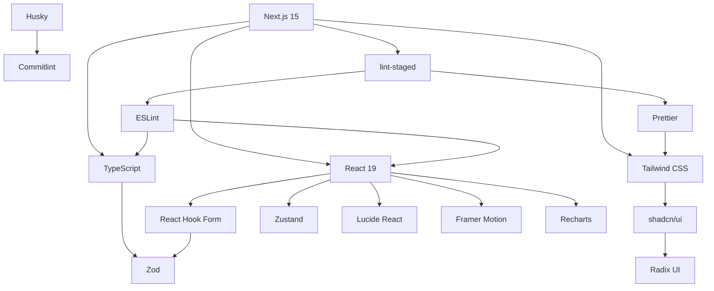

# Stack Tecnológica e Dependências

<cite>
**Arquivos Referenciados neste Documento**   
- [package.json](file://package.json)
- [tsconfig.json](file://tsconfig.json)
- [next.config.ts](file://next.config.ts)
- [tailwind.config.ts](file://tailwind.config.ts)
- [commitlint.config.js](file://commitlint.config.js)
- [eslint.config.mjs](file://eslint.config.mjs)
- [postcss.config.mjs](file://postcss.config.mjs)
- [.npmrc](file://.npmrc)
- [components.json](file://components.json)
</cite>

## Sumário
1. [Introdução](#introdução)
2. [Stack Principal de Frontend](#stack-principal-de-frontend)
3. [Dependências de Desenvolvimento e Qualidade de Código](#dependências-de-desenvolvimento-e-qualidade-de-código)
4. [Configuração do Projeto e Requisitos de Ambiente](#configuração-do-projeto-e-requisitos-de-ambiente)
5. [Integração entre Tecnologias](#integração-entre-tecnologias)
6. [Conclusão](#conclusão)

## Introdução

O VirtuQuest é um sistema avançado de planejamento pedagógico integrado, alinhado às diretrizes da BNCC, taxonomia de Bloom e desenvolvimento de virtudes. Este documento detalha a stack tecnológica adotada, explicando as escolhas estratégicas por trás de cada tecnologia principal, seu papel na arquitetura da aplicação, benefícios, padrões de uso e integração com os demais componentes. Também aborda as dependências de desenvolvimento que garantem qualidade de código, consistência e um fluxo de contribuição eficiente.

**Seção fontes**
- [package.json](file://package.json)
- [README.md](file://README.md)

## Stack Principal de Frontend

### Next.js 15 com App Router

O Next.js 15 serve como framework principal da aplicação, utilizando o App Router para estruturação de rotas baseada em arquivos. Essa abordagem permite uma organização clara e escalável do sistema de rotas, facilitando a navegação, o pré-rendering (SSR e SSG) e a otimização de desempenho. O App Router oferece suporte nativo a layouts aninhados, paralel routes e streaming, essenciais para uma experiência de usuário fluida em uma aplicação complexa como o VirtuQuest.

**Seção fontes**
- [next.config.ts](file://next.config.ts)
- [src/app/page.tsx](file://src/app/page.tsx)
- [src/app/layout.tsx](file://src/app/layout.tsx)

### React 19

O React 19 é a biblioteca de interface de usuário fundamental, responsável pela construção da UI declarativa e componentizada. Sua adoção traz benefícios significativos em termos de reatividade, reutilização de componentes e ecossistema maduro. O modo estrito do React (ativado em `next.config.ts`) garante que efeitos colaterais sejam detectados precocemente, promovendo práticas de codificação mais seguras.

**Seção fontes**
- [package.json](file://package.json#L25-L27)
- [next.config.ts](file://next.config.ts#L5-L6)

### TypeScript strict

O TypeScript é utilizado com configuração estrita (`"strict": true` no `tsconfig.json`), garantindo segurança de tipos em toda a base de código. Isso inclui verificações rigorosas para valores nulos, inicialização de propriedades, retorno de funções e inferência de tipos. A configuração estrita reduz erros em tempo de execução, melhora a manutenibilidade e fornece uma excelente experiência de desenvolvimento com IntelliSense avançado.

**Seção fontes**
- [tsconfig.json](file://tsconfig.json#L12-L13)
- [tsconfig.json](file://tsconfig.json#L25-L34)

### Tailwind CSS 4

O Tailwind CSS é o framework de estilização utilizado, permitindo a criação de interfaces altamente personalizadas com classes utilitárias diretamente no JSX. A versão 4 (via `tailwindcss` no `package.json`) é integrada com o PostCSS e Autoprefixer, garantindo compatibilidade com navegadores modernos. O uso de variáveis CSS no `tailwind.config.ts` permite temas claros/escuros e uma paleta de cores educacional alinhada aos domínios BNCC, Bloom e Virtudes.

**Seção fontes**
- [tailwind.config.ts](file://tailwind.config.ts)
- [postcss.config.mjs](file://postcss.config.mjs)
- [src/styles/globals.css](file://src/styles/globals.css)

### shadcn/ui com Radix UI

O sistema de componentes UI é baseado no shadcn/ui, que utiliza Radix UI como base. O Radix UI fornece componentes primitivos acessíveis, sem estilização, enquanto o shadcn/ui adiciona estilos baseados em Tailwind CSS e padrões de composição. Essa combinação oferece componentes acessíveis, altamente customizáveis e que seguem as melhores práticas de acessibilidade (WCAG). O arquivo `components.json` indica a configuração do CLI do shadcn/ui para geração de componentes.

**Seção fontes**
- [components.json](file://components.json)
- [tailwind.config.ts](file://tailwind.config.ts#L10-L15)
- [src/components/ui/button.tsx](file://src/components/ui/button.tsx)

### Zustand

O Zustand é a biblioteca de gerenciamento de estado escolhida para o VirtuQuest. Sua simplicidade, desacoplamento e desempenho são ideais para uma aplicação onde o estado global é necessário em múltiplos componentes, como preferências do usuário, estado de autenticação ou dados do planejador pedagógico. Diferentemente do Redux, o Zustand não exige boilerplate excessivo e se integra perfeitamente com React e TypeScript.

**Seção fontes**
- [package.json](file://package.json#L40)
- [src/lib/utils.ts](file://src/lib/utils.ts)

### React Hook Form + Zod

O React Hook Form é utilizado para gerenciamento eficiente de formulários, minimizando renderizações desnecessárias e oferecendo uma API intuitiva. Ele é integrado ao Zod para validação de esquemas, garantindo que os dados do formulário sejam validados em tempo de execução com base em esquemas TypeScript definidos. Essa combinação oferece segurança de tipos, mensagens de erro claras e uma experiência de usuário responsiva.

**Seção fontes**
- [package.json](file://package.json#L37-L38)
- [package.json](file://package.json#L41)
- [src/lib/env.ts](file://src/lib/env.ts)

### Lucide React

O Lucide React fornece ícones consistentes, acessíveis e leves para toda a interface. Sua integração com React permite o uso de ícones como componentes, facilitando a estilização com Tailwind CSS e a manutenção. A otimização de pacote é garantida pela configuração `optimizePackageImports` no `next.config.ts`.

**Seção fontes**
- [package.json](file://package.json#L39)
- [next.config.ts](file://next.config.ts#L14-L18)

### Framer Motion

O Framer Motion é responsável pelas animações e transições na interface, proporcionando uma experiência de usuário mais envolvente. Ele é usado para animações de entrada/saída de componentes, feedback visual e microinterações. Sua integração com React é natural, e ele é otimizado para desempenho.

**Seção fontes**
- [package.json](file://package.json#L36)
- [next.config.ts](file://next.config.ts#L14-L18)

### Recharts

O Recharts é a biblioteca escolhida para visualização de dados, permitindo a criação de gráficos interativos e responsivos para representar métricas pedagógicas, progresso do aluno e análise de planejamento. Sua base em React e SVG garante integração perfeita com o restante da stack.

**Seção fontes**
- [package.json](file://package.json#L42)
- [next.config.ts](file://next.config.ts#L14-L18)

## Dependências de Desenvolvimento e Qualidade de Código

### ESLint

O ESLint é configurado com regras rigorosas para TypeScript, React e acessibilidade. O arquivo `eslint.config.mjs` define regras que exigem tipagem explícita, evitam o uso de `any`, garantem o uso correto dos hooks do React e validam acessibilidade (via `jsx-a11y`). Isso assegura um código limpo, seguro e acessível.

**Seção fontes**
- [eslint.config.mjs](file://eslint.config.mjs)
- [package.json](file://package.json#L50-L51)

### Prettier

O Prettier é usado para formatação automática de código, garantindo consistência de estilo em toda a base de código. O plugin `prettier-plugin-tailwindcss` otimiza a ordenação de classes do Tailwind, melhorando a legibilidade. Os scripts `format` e `format:check` permitem formatação em massa e verificação em CI.

**Seção fontes**
- [package.json](file://package.json#L15-L16)
- [package.json](file://package.json#L58-L59)

### Husky e Commitlint

O Husky integra ganchos do Git ao processo de desenvolvimento, enquanto o Commitlint valida a convenção de mensagens de commit. O arquivo `commitlint.config.js` define tipos e escopos permitidos (como `feat(planner)`, `fix(auth)`), garantindo um histórico de commits claro, padronizado e útil para geração de changelogs e análise de impacto.

**Seção fontes**
- [commitlint.config.js](file://commitlint.config.js)
- [package.json](file://package.json#L18-L19)
- [package.json](file://package.json#L60)

### lint-staged

O lint-staged executa ESLint e Prettier apenas nos arquivos modificados antes do commit, garantindo que apenas código formatado e válido seja enviado ao repositório. Essa configuração está definida no campo `lint-staged` do `package.json`.

**Seção fontes**
- [package.json](file://package.json#L61-L70)

## Configuração do Projeto e Requisitos de Ambiente

### Requisitos de Engine

O projeto exige Node.js >=20.0.0 e pnpm >=9.0.0, conforme especificado no campo `engines` do `package.json`. Isso garante compatibilidade com as últimas funcionalidades do JavaScript, TypeScript e otimizações do Next.js 15.

**Seção fontes**
- [package.json](file://package.json#L5-L7)

### Gerenciador de Pacotes

O pnpm é o gerenciador de pacotes oficial, configurado via `.npmrc` para garantir resolução estrita de peer dependencies e isolamento de dependências, enquanto permite o hoisting de ferramentas de desenvolvimento como ESLint e Prettier para uso global nos scripts.

**Seção fontes**
- [.npmrc](file://.npmrc)
- [package.json](file://package.json#L8)

### Configurações de Build

O `next.config.ts` define configurações essenciais como modo estrito, cabeçalhos de segurança (X-Frame-Options, X-Content-Type-Options), otimização de imagens e saída standalone para implantação. O `tsconfig.json` define caminhos absolutos (`@/`) para importações limpas e organizadas.

**Seção fontes**
- [next.config.ts](file://next.config.ts)
- [tsconfig.json](file://tsconfig.json#L42-L48)

## Integração entre Tecnologias

A stack do VirtuQuest é projetada para integração perfeita. O Next.js serve como orquestrador, integrando React, TypeScript e Tailwind. O shadcn/ui combina Radix UI (acessibilidade) com Tailwind (estilização). React Hook Form e Zod validam dados com segurança de tipos. Zustand gerencia estado global de forma eficiente. As ferramentas de desenvolvimento (ESLint, Prettier, Husky, Commitlint) são executadas em conjunto via lint-staged, garantindo qualidade antes do commit. A configuração do PostCSS conecta Tailwind e Autoprefixer, enquanto o TypeScript fornece base para todas as ferramentas de análise estática.

**Fontes do diagrama**
- [package.json](file://package.json)
- [next.config.ts](file://next.config.ts)
- [tailwind.config.ts](file://tailwind.config.ts)

**Seção fontes**
- [package.json](file://package.json)
- [next.config.ts](file://next.config.ts)
- [tailwind.config.ts](file://tailwind.config.ts)
- [eslint.config.mjs](file://eslint.config.mjs)

## Conclusão

A stack tecnológica do VirtuQuest representa uma escolha cuidadosa e moderna, equilibrando produtividade, desempenho, acessibilidade e qualidade de código. A combinação de Next.js 15, React 19, TypeScript strict e Tailwind CSS forma uma base robusta e escalável. O uso de shadcn/ui com Radix UI garante componentes acessíveis e bonitos. Zustand, React Hook Form e Zod simplificam o gerenciamento de estado e formulários. As ferramentas de desenvolvimento automatizam a manutenção de padrões, permitindo que a equipe se concentre na lógica de negócios pedagógica. Essa stack está bem posicionada para suportar o crescimento contínuo e a complexidade do sistema de planejamento pedagógico do VirtuQuest.