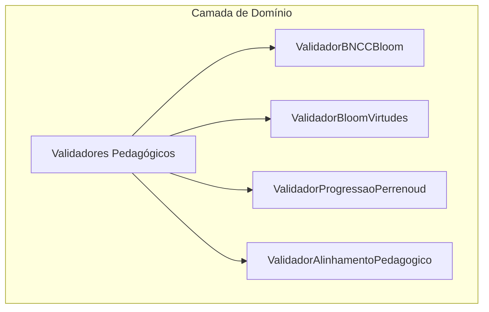
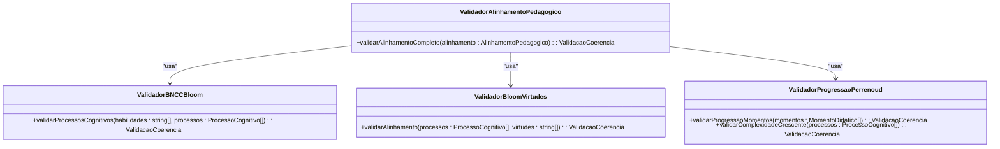
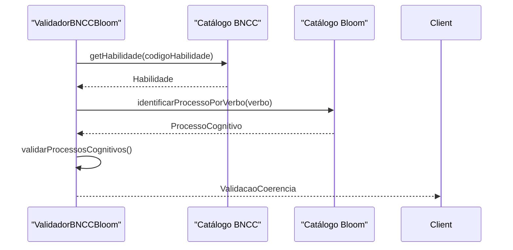
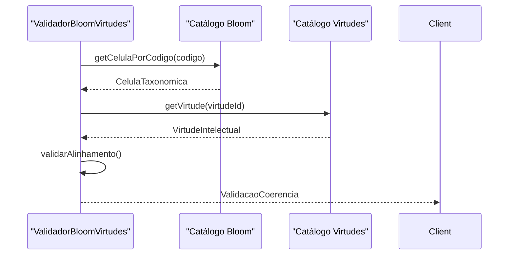
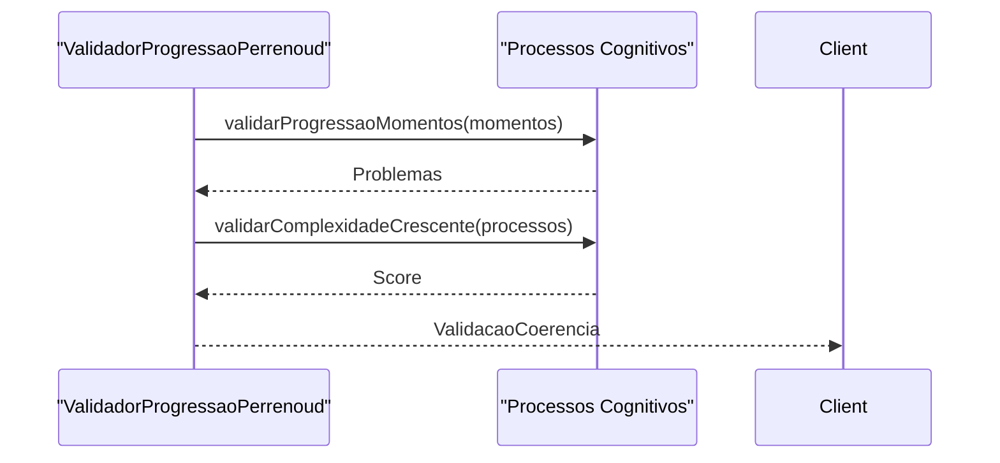
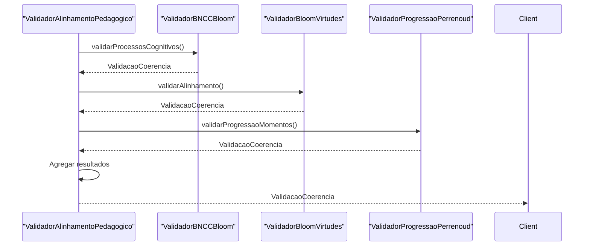
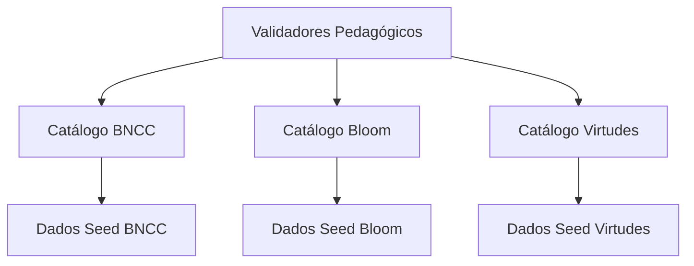

# Validadores Pedagógicos

<cite>
**Arquivos Referenciados neste Documento**  
- [validators.ts](file://src/core/domain/shared/validators.ts)
- [types.ts](file://src/core/domain/shared/types.ts)
- [bloom/repository.ts](file://src/core/domain/bloom/repository.ts)
- [virtudes/repository.ts](file://src/core/domain/virtudes/repository.ts)
- [bncc/repository.ts](file://src/core/domain/bncc/repository.ts)
- [planner/bloom-tab.tsx](file://src/components/planner/bloom-tab.tsx)
- [planner/bloom-mapper.tsx](file://src/components/planner/bloom-mapper.tsx)
</cite>

## Sumário

1. [Introdução](#introdução)
2. [Estrutura do Projeto](#estrutura-do-projeto)
3. [Componentes Principais](#componentes-principais)
4. [Visão Geral da Arquitetura](#visão-geral-da-arquitetura)
5. [Análise Detalhada dos Componentes](#análise-detalhada-dos-componentes)
6. [Análise de Dependências](#análise-de-dependências)
7. [Considerações de Desempenho](#considerações-de-desempenho)
8. [Guia de Solução de Problemas](#guia-de-solução-de-problemas)
9. [Conclusão](#conclusão)

## Introdução

Os validadores pedagógicos são componentes centrais do sistema VirtuQuest,
responsáveis por garantir a coerência e alinhamento pedagógico entre diferentes
modelos educacionais. Eles validam a integridade do planejamento docente,
verificando a consistência entre a Base Nacional Comum Curricular (BNCC), a
Taxonomia de Bloom, as Virtudes Intelectuais e a Teoria das Competências de
Perrenoud. Este documento apresenta uma análise abrangente desses validadores,
detalhando seu propósito, implementação, interfaces de API e padrões de
integração.

## Estrutura do Projeto

A estrutura do projeto organiza os validadores pedagógicos dentro da camada de
domínio, seguindo princípios de Domain-Driven Design. Os validadores estão
localizados no diretório `src/core/domain/shared/validators.ts`, onde são
implementados como classes que encapsulam regras de validação específicas para
cada dimensão pedagógica.

**Fontes do Diagrama**

- [validators.ts](file://src/core/domain/shared/validators.ts#L96-L457)

**Fontes da Seção**

- [validators.ts](file://src/core/domain/shared/validators.ts#L1-L457)
- [index.ts](file://src/core/domain/index.ts#L1-L35)

## Componentes Principais

Os validadores pedagógicos são compostos por quatro classes principais:
`ValidadorBNCCBloom`, `ValidadorBloomVirtudes`, `ValidadorProgressaoPerrenoud` e
`ValidadorAlinhamentoPedagogico`. Cada uma dessas classes é responsável por
validar um aspecto específico do alinhamento pedagógico, garantindo que o
planejamento docente esteja em conformidade com os fundamentos teóricos.

**Fontes da Seção**

- [validators.ts](file://src/core/domain/shared/validators.ts#L96-L457)

## Visão Geral da Arquitetura

A arquitetura dos validadores pedagógicos é baseada em um padrão de composição,
onde o `ValidadorAlinhamentoPedagogico` integra os validadores individuais para
fornecer uma validação completa. Essa abordagem permite que cada validador seja
testado e mantido independentemente, enquanto o validador integrado oferece uma
visão holística da coerência pedagógica.

**Fontes do Diagrama**

- [validators.ts](file://src/core/domain/shared/validators.ts#L96-L457)

**Fontes da Seção**

- [validators.ts](file://src/core/domain/shared/validators.ts#L96-L457)

## Análise Detalhada dos Componentes

### Análise do Validador BNCC ↔ Bloom

O `ValidadorBNCCBloom` é responsável por verificar se os processos cognitivos da
Taxonomia de Bloom estão alinhados com as habilidades da BNCC. Ele valida a
presença de pelo menos uma habilidade BNCC e um processo cognitivo, além de
analisar a complexidade cognitiva sugerida pela habilidade.

**Fontes do Diagrama**

- [validators.ts](file://src/core/domain/shared/validators.ts#L96-L134)
- [bncc/repository.ts](file://src/core/domain/bncc/repository.ts#L1-L370)
- [bloom/repository.ts](file://src/core/domain/bloom/repository.ts#L1-L175)

**Fontes da Seção**

- [validators.ts](file://src/core/domain/shared/validators.ts#L96-L134)

### Análise do Validador Bloom ↔ Virtudes

O `ValidadorBloomVirtudes` verifica se as virtudes intelectuais selecionadas
estão alinhadas com os processos cognitivos da Taxonomia de Bloom. Ele valida a
cobertura dos processos cognitivos pelas virtudes e fornece recomendações para
melhorar o alinhamento.

**Fontes do Diagrama**

- [validators.ts](file://src/core/domain/shared/validators.ts#L248-L295)
- [bloom/repository.ts](file://src/core/domain/bloom/repository.ts#L1-L175)
- [virtudes/repository.ts](file://src/core/domain/virtudes/repository.ts#L1-L317)

**Fontes da Seção**

- [validators.ts](file://src/core/domain/shared/validators.ts#L248-L295)

### Análise do Validador de Progressão Pedagógica (Perrenoud)

O `ValidadorProgressaoPerrenoud` valida a progressão pedagógica através dos
quatro momentos didáticos: apropriação, aplicação guiada, análise e avaliação, e
criação. Ele verifica se a sequência de momentos segue a ordem esperada e se há
progressão crescente de complexidade cognitiva.

**Fontes do Diagrama**

- [validators.ts](file://src/core/domain/shared/validators.ts#L295-L383)
- [bloom/repository.ts](file://src/core/domain/bloom/repository.ts#L1-L175)

**Fontes da Seção**

- [validators.ts](file://src/core/domain/shared/validators.ts#L295-L383)

### Análise do Validador Integrado de Alinhamento Pedagógico

O `ValidadorAlinhamentoPedagogico` integra os validadores individuais para
fornecer uma validação completa do alinhamento pedagógico. Ele combina os
resultados dos validadores BNCC ↔ Bloom, Bloom ↔ Virtudes e Progressão
Perrenoud para gerar um score geral de qualidade.

**Fontes do Diagrama**

- [validators.ts](file://src/core/domain/shared/validators.ts#L383-L457)
- [validators.ts](file://src/core/domain/shared/validators.ts#L96-L134)
- [validators.ts](file://src/core/domain/shared/validators.ts#L248-L295)
- [validators.ts](file://src/core/domain/shared/validators.ts#L295-L383)

**Fontes da Seção**

- [validators.ts](file://src/core/domain/shared/validators.ts#L383-L457)

## Análise de Dependências

Os validadores pedagógicos dependem de repositórios estáticos que fornecem
acesso imutável aos catálogos BNCC, Bloom e Virtudes. Essas dependências são
injetadas diretamente nas classes dos validadores, garantindo que os dados
utilizados na validação sejam consistentes e atualizados.

**Fontes do Diagrama**

- [validators.ts](file://src/core/domain/shared/validators.ts#L96-L457)
- [bncc/repository.ts](file://src/core/domain/bncc/repository.ts#L1-L370)
- [bloom/repository.ts](file://src/core/domain/bloom/repository.ts#L1-L175)
- [virtudes/repository.ts](file://src/core/domain/virtudes/repository.ts#L1-L317)

**Fontes da Seção**

- [validators.ts](file://src/core/domain/shared/validators.ts#L96-L457)
- [bncc/repository.ts](file://src/core/domain/bncc/repository.ts#L1-L370)
- [bloom/repository.ts](file://src/core/domain/bloom/repository.ts#L1-L175)
- [virtudes/repository.ts](file://src/core/domain/virtudes/repository.ts#L1-L317)

## Considerações de Desempenho

Os validadores pedagógicos são projetados para serem eficientes e escaláveis,
utilizando estruturas de dados imutáveis e operações de consulta otimizadas. O
uso de repositórios estáticos com dados seed permite que os validadores acessem
rapidamente as informações necessárias para a validação, sem a necessidade de
operações de I/O.

## Guia de Solução de Problemas

Ao utilizar os validadores pedagógicos, é importante garantir que os dados de
entrada estejam corretamente formatados e que os códigos das habilidades BNCC,
células Bloom e virtudes intelectuais sejam válidos. Caso contrário, os
validadores podem retornar erros de integridade ou avisos de alinhamento.

**Fontes da Seção**

- [validators.ts](file://src/core/domain/shared/validators.ts#L96-L457)
- [bncc/decomposer.ts](file://src/core/domain/bncc/decomposer.ts#L1-L209)

## Conclusão

Os validadores pedagógicos são componentes essenciais para garantir a qualidade
e coerência do planejamento docente no sistema VirtuQuest. Eles fornecem uma
abordagem sistemática para validar o alinhamento entre diferentes modelos
educacionais, ajudando os professores a criar planos de aula mais eficazes e
alinhados com os fundamentos pedagógicos.
