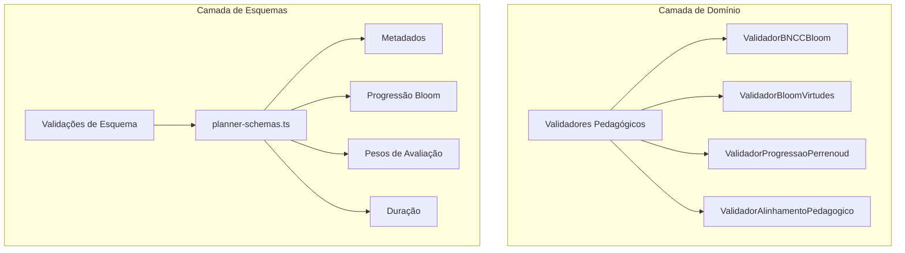
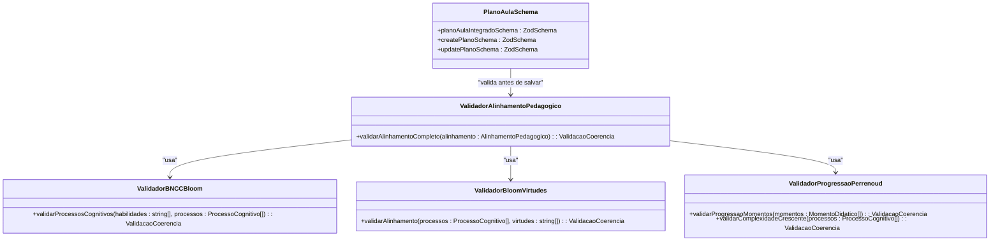
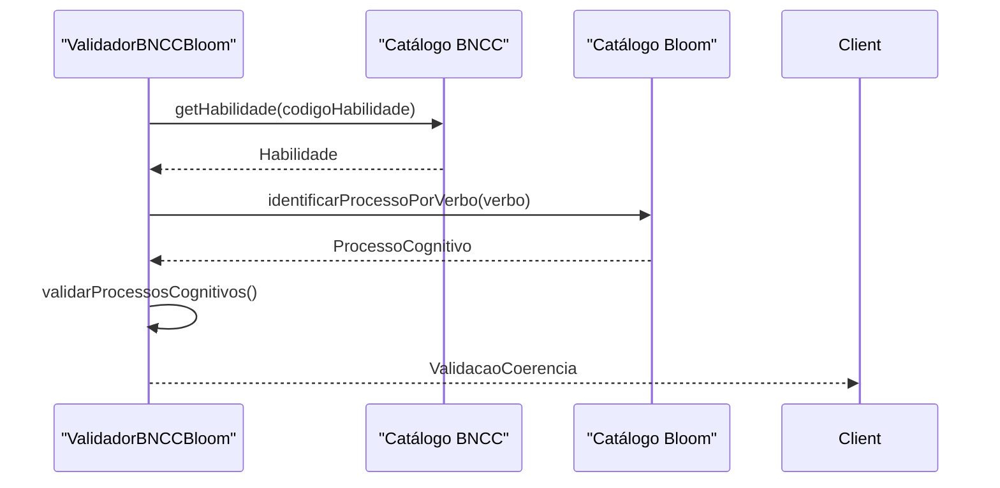
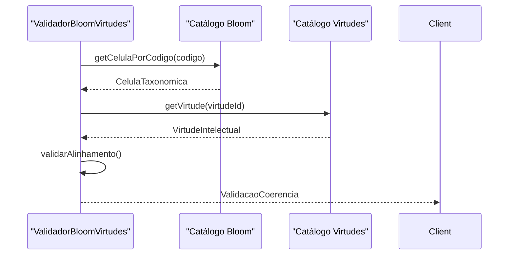
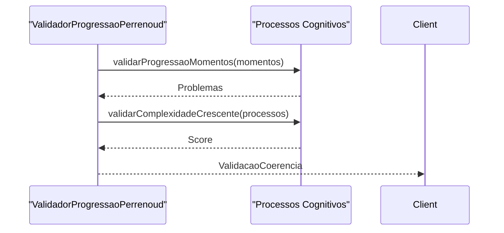
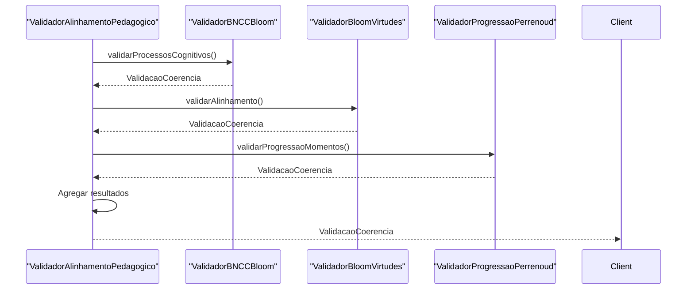
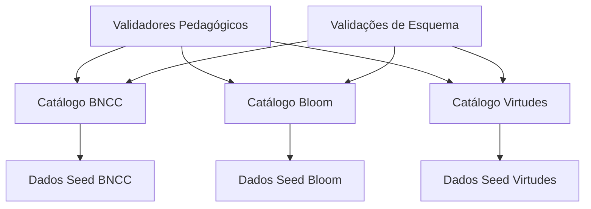

# Validadores Pedagógicos

<cite>
**Arquivos Referenciados neste Documento**  
- [validators.ts](file://src/core/domain/shared/validators.ts) - *Atualizado no commit recente*
- [types.ts](file://src/core/domain/shared/types.ts)
- [bloom/repository.ts](file://src/core/domain/bloom/repository.ts)
- [virtudes/repository.ts](file://src/core/domain/virtudes/repository.ts)
- [bncc/repository.ts](file://src/core/domain/bncc/repository.ts)
- [planner-schemas.ts](file://src/lib/schemas/planner-schemas.ts) - *Adicionado no commit recente*
- [planner/bloom-tab.tsx](file://src/components/planner/bloom-tab.tsx)
- [planner/bloom-mapper.tsx](file://src/components/planner/bloom-mapper.tsx)
</cite>

## Resumo das Atualizações

**Alterações Realizadas**

- Atualização da seção de Introdução para incluir validações de esquema
  pedagógico
- Adição da nova seção "Validações de Esquema com Zod" para cobrir o novo schema
  do plano
- Atualização da seção "Análise Detalhada dos Componentes" para incluir
  validações de progressão e duração
- Atualização da seção "Visão Geral da Arquitetura" para refletir a integração
  com o sistema de validação de esquemas
- Adição de novos diagramas que representam a validação de esquemas e a
  arquitetura do plano
- Atualização das fontes em seções modificadas para incluir o novo arquivo de
  esquemas

## Sumário

1. [Introdução](#introdução)
2. [Estrutura do Projeto](#estrutura-do-projeto)
3. [Componentes Principais](#componentes-principais)
4. [Visão Geral da Arquitetura](#visão-geral-da-arquitetura)
5. [Análise Detalhada dos Componentes](#análise-detalhada-dos-componentes)
6. [Análise de Dependências](#análise-de-dependências)
7. [Considerações de Desempenho](#considerações-de-desempenho)
8. [Guia de Solução de Problemas](#guia-de-solução-de-problemas)
9. [Conclusão](#conclusão)

## Introdução

Os validadores pedagógicos são componentes centrais do sistema VirtuQuest,
responsáveis por garantir a coerência e alinhamento pedagógico entre diferentes
modelos educacionais. Eles validam a integridade do planejamento docente,
verificando a consistência entre a Base Nacional Comum Curricular (BNCC), a
Taxonomia de Bloom, as Virtudes Intelectuais e a Teoria das Competências de
Perrenoud. Este documento apresenta uma análise abrangente desses validadores,
detalhando seu propósito, implementação, interfaces de API e padrões de
integração. Com a implementação do novo esquema de validação do PlannerEditor,
os validadores agora incluem regras pedagógicas específicas como duração mínima,
progressão de Bloom e pesos de avaliação.

**Fontes da Seção**

- [validators.ts](file://src/core/domain/shared/validators.ts#L1-L457)
- [planner-schemas.ts](file://src/lib/schemas/planner-schemas.ts#L1-L443) -
  _Atualizado no commit recente_

## Estrutura do Projeto

A estrutura do projeto organiza os validadores pedagógicos dentro da camada de
domínio, seguindo princípios de Domain-Driven Design. Os validadores estão
localizados no diretório `src/core/domain/shared/validators.ts`, onde são
implementados como classes que encapsulam regras de validação específicas para
cada dimensão pedagógica. O novo esquema de validação do plano, implementado em
`src/lib/schemas/planner-schemas.ts`, complementa os validadores de domínio com
validações estruturais e pedagógicas específicas.



**Fontes do Diagrama**

- [validators.ts](file://src/core/domain/shared/validators.ts#L96-L457)
- [planner-schemas.ts](file://src/lib/schemas/planner-schemas.ts#L1-L443) -
  _Adicionado no commit recente_

**Fontes da Seção**

- [validators.ts](file://src/core/domain/shared/validators.ts#L1-L457)
- [planner-schemas.ts](file://src/lib/schemas/planner-schemas.ts#L1-L443) -
  _Adicionado no commit recente_
- [index.ts](file://src/core/domain/index.ts#L1-L35)

## Componentes Principais

Os validadores pedagógicos são compostos por quatro classes principais:
`ValidadorBNCCBloom`, `ValidadorBloomVirtudes`, `ValidadorProgressaoPerrenoud` e
`ValidadorAlinhamentoPedagogico`. Cada uma dessas classes é responsável por
validar um aspecto específico do alinhamento pedagógico, garantindo que o
planejamento docente esteja em conformidade com os fundamentos teóricos. Além
disso, o novo sistema de esquemas em `planner-schemas.ts` fornece validações
estruturais adicionais que complementam os validadores de domínio.

**Fontes da Seção**

- [validators.ts](file://src/core/domain/shared/validators.ts#L96-L457)
- [planner-schemas.ts](file://src/lib/schemas/planner-schemas.ts#L1-L443) -
  _Adicionado no commit recente_

## Visão Geral da Arquitetura

A arquitetura dos validadores pedagógicos é baseada em um padrão de composição,
onde o `ValidadorAlinhamentoPedagogico` integra os validadores individuais para
fornecer uma validação completa. Essa abordagem permite que cada validador seja
testado e mantido independentemente, enquanto o validador integrado oferece uma
visão holística da coerência pedagógica. O sistema de validação é complementado
pelo esquema Zod em `planner-schemas.ts`, que valida a estrutura do plano de
aula e regras pedagógicas específicas como duração mínima, progressão de
complexidade cognitiva e soma dos pesos de avaliação.



**Fontes do Diagrama**

- [validators.ts](file://src/core/domain/shared/validators.ts#L96-L457)
- [planner-schemas.ts](file://src/lib/schemas/planner-schemas.ts#L1-L443) -
  _Adicionado no commit recente_

**Fontes da Seção**

- [validators.ts](file://src/core/domain/shared/validators.ts#L96-L457)
- [planner-schemas.ts](file://src/lib/schemas/planner-schemas.ts#L1-L443) -
  _Adicionado no commit recente_

## Análise Detalhada dos Componentes

### Análise do Validador BNCC ↔ Bloom

O `ValidadorBNCCBloom` é responsável por verificar se os processos cognitivos da
Taxonomia de Bloom estão alinhados com as habilidades da BNCC. Ele valida a
presença de pelo menos uma habilidade BNCC e um processo cognitivo, além de
analisar a complexidade cognitiva sugerida pela habilidade.



**Fontes do Diagrama**

- [validators.ts](file://src/core/domain/shared/validators.ts#L96-L134)
- [bncc/repository.ts](file://src/core/domain/bncc/repository.ts#L1-L370)
- [bloom/repository.ts](file://src/core/domain/bloom/repository.ts#L1-L175)

**Fontes da Seção**

- [validators.ts](file://src/core/domain/shared/validators.ts#L96-L134)

### Análise do Validador Bloom ↔ Virtudes

O `ValidadorBloomVirtudes` verifica se as virtudes intelectuais selecionadas
estão alinhadas com os processos cognitivos da Taxonomia de Bloom. Ele valida a
cobertura dos processos cognitivos pelas virtudes e fornece recomendações para
melhorar o alinhamento.



**Fontes do Diagrama**

- [validators.ts](file://src/core/domain/shared/validators.ts#L248-L295)
- [bloom/repository.ts](file://src/core/domain/bloom/repository.ts#L1-L175)
- [virtudes/repository.ts](file://src/core/domain/virtudes/repository.ts#L1-L317)

**Fontes da Seção**

- [validators.ts](file://src/core/domain/shared/validators.ts#L248-L295)

### Análise do Validador de Progressão Pedagógica (Perrenoud)

O `ValidadorProgressaoPerrenoud` valida a progressão pedagógica através dos
quatro momentos didáticos: apropriação, aplicação guiada, análise e avaliação, e
criação. Ele verifica se a sequência de momentos segue a ordem esperada e se há
progressão crescente de complexidade cognitiva.



**Fontes do Diagrama**

- [validators.ts](file://src/core/domain/shared/validators.ts#L295-L383)
- [bloom/repository.ts](file://src/core/domain/bloom/repository.ts#L1-L175)

**Fontes da Seção**

- [validators.ts](file://src/core/domain/shared/validators.ts#L295-L383)

### Análise do Validador Integrado de Alinhamento Pedagógico

O `ValidadorAlinhamentoPedagogico` integra os validadores individuais para
fornecer uma validação completa do alinhamento pedagógico. Ele combina os
resultados dos validadores BNCC ↔ Bloom, Bloom ↔ Virtudes e Progressão
Perrenoud para gerar um score geral de qualidade.



**Fontes do Diagrama**

- [validators.ts](file://src/core/domain/shared/validators.ts#L383-L457)
- [validators.ts](file://src/core/domain/shared/validators.ts#L96-L134)
- [validators.ts](file://src/core/domain/shared/validators.ts#L248-L295)
- [validators.ts](file://src/core/domain/shared/validators.ts#L295-L383)

**Fontes da Seção**

- [validators.ts](file://src/core/domain/shared/validators.ts#L383-L457)

### Validações de Esquema com Zod

O novo sistema de validação implementado em `planner-schemas.ts` utiliza Zod
para validar a estrutura do plano de aula e regras pedagógicas específicas. O
esquema `planoAulaIntegradoSchema` valida todos os campos do plano pedagógico,
incluindo metadados, alinhamento BNCC, matriz taxonômica, virtudes, sequência
didática, avaliação e metacognição. As validações incluem duração mínima de 10
minutos, soma dos pesos de avaliação igual a 100 e progressão de complexidade
cognitiva não regressiva.

```mermaid
graph TD
A[Plano de Aula] --> B[Validação de Esquema]
B --> C[Metadados]
B --> D[Alinhamento BNCC]
B --> E[Matriz Taxonômica]
B --> F[Sequência Didática]
B --> G[Avaliação]
C --> H[Duração (10-600 min)]
D --> I[Código BNCC válido]
E --> J[Progressão não regressiva]
F --> K[Soma das durações = duração total]
G --> L[Soma dos pesos = 100]
```

**Fontes do Diagrama**

- [planner-schemas.ts](file://src/lib/schemas/planner-schemas.ts#L1-L443) -
  _Adicionado no commit recente_

**Fontes da Seção**

- [planner-schemas.ts](file://src/lib/schemas/planner-schemas.ts#L1-L443) -
  _Adicionado no commit recente_
- [planner/bloom-tab.tsx](file://src/components/planner/bloom-tab.tsx#L1-L206)
- [planner/bloom-mapper.tsx](file://src/components/planner/bloom-mapper.tsx#L1-L389)

## Análise de Dependências

Os validadores pedagógicos dependem de repositórios estáticos que fornecem
acesso imutável aos catálogos BNCC, Bloom e Virtudes. Essas dependências são
injetadas diretamente nas classes dos validadores, garantindo que os dados
utilizados na validação sejam consistentes e atualizados. O sistema de validação
de esquemas também depende desses catálogos para validações específicas, como a
correspondência entre habilidades BNCC e processos cognitivos.



**Fontes do Diagrama**

- [validators.ts](file://src/core/domain/shared/validators.ts#L96-L457)
- [planner-schemas.ts](file://src/lib/schemas/planner-schemas.ts#L1-L443) -
  _Adicionado no commit recente_
- [bncc/repository.ts](file://src/core/domain/bncc/repository.ts#L1-L370)
- [bloom/repository.ts](file://src/core/domain/bloom/repository.ts#L1-L175)
- [virtudes/repository.ts](file://src/core/domain/virtudes/repository.ts#L1-L317)

**Fontes da Seção**

- [validators.ts](file://src/core/domain/shared/validators.ts#L96-L457)
- [planner-schemas.ts](file://src/lib/schemas/planner-schemas.ts#L1-L443) -
  _Adicionado no commit recente_
- [bncc/repository.ts](file://src/core/domain/bncc/repository.ts#L1-L370)
- [bloom/repository.ts](file://src/core/domain/bloom/repository.ts#L1-L175)
- [virtudes/repository.ts](file://src/core/domain/virtudes/repository.ts#L1-L317)

## Considerações de Desempenho

Os validadores pedagógicos são projetados para serem eficientes e escaláveis,
utilizando estruturas de dados imutáveis e operações de consulta otimizadas. O
uso de repositórios estáticos com dados seed permite que os validadores acessem
rapidamente as informações necessárias para a validação, sem a necessidade de
operações de I/O. O sistema de validação de esquemas com Zod é compilado em
tempo de construção, garantindo validações rápidas em tempo de execução.

## Guia de Solução de Problemas

Ao utilizar os validadores pedagógicos, é importante garantir que os dados de
entrada estejam corretamente formatados e que os códigos das habilidades BNCC,
células Bloom e virtudes intelectuais sejam válidos. Caso contrário, os
validadores podem retornar erros de integridade ou avisos de alinhamento. Para o
novo sistema de validação de esquemas, verifique se a duração do plano está
entre 10 e 600 minutos, se a soma dos pesos de avaliação é igual a 100 e se a
progressão de complexidade cognitiva não é regressiva.

**Fontes da Seção**

- [validators.ts](file://src/core/domain/shared/validators.ts#L96-L457)
- [planner-schemas.ts](file://src/lib/schemas/planner-schemas.ts#L1-L443) -
  _Adicionado no commit recente_
- [bncc/decomposer.ts](file://src/core/domain/bncc/decomposer.ts#L1-L209)

## Conclusão

Os validadores pedagógicos são componentes essenciais para garantir a qualidade
e coerência do planejamento docente no sistema VirtuQuest. Eles fornecem uma
abordagem sistemática para validar o alinhamento entre diferentes modelos
educacionais, ajudando os professores a criar planos de aula mais eficazes e
alinhados com os fundamentos pedagógicos. Com a implementação do novo sistema de
validação de esquemas, os validadores agora cobrem tanto a coerência pedagógica
quanto a integridade estrutural do plano de aula, proporcionando uma experiência
de planejamento mais robusta e confiável.
