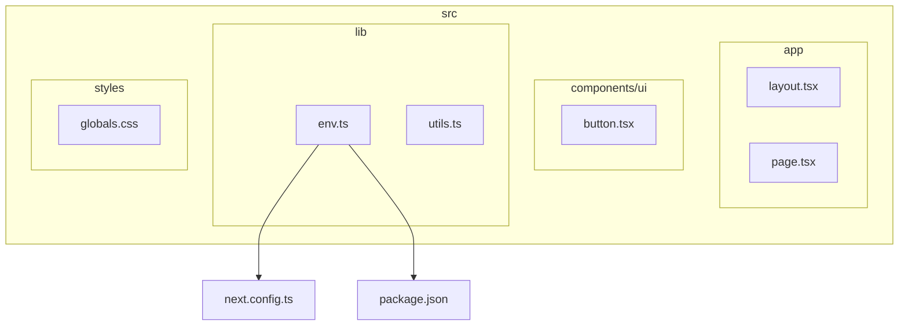
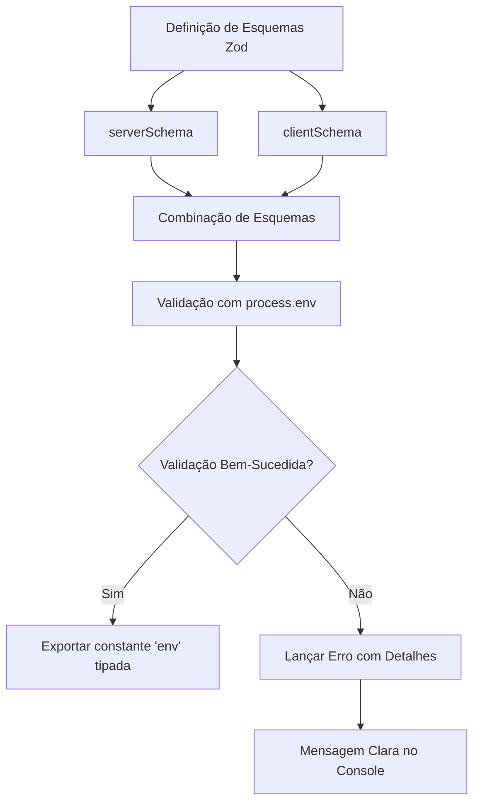
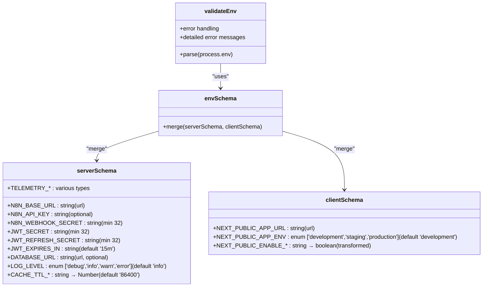
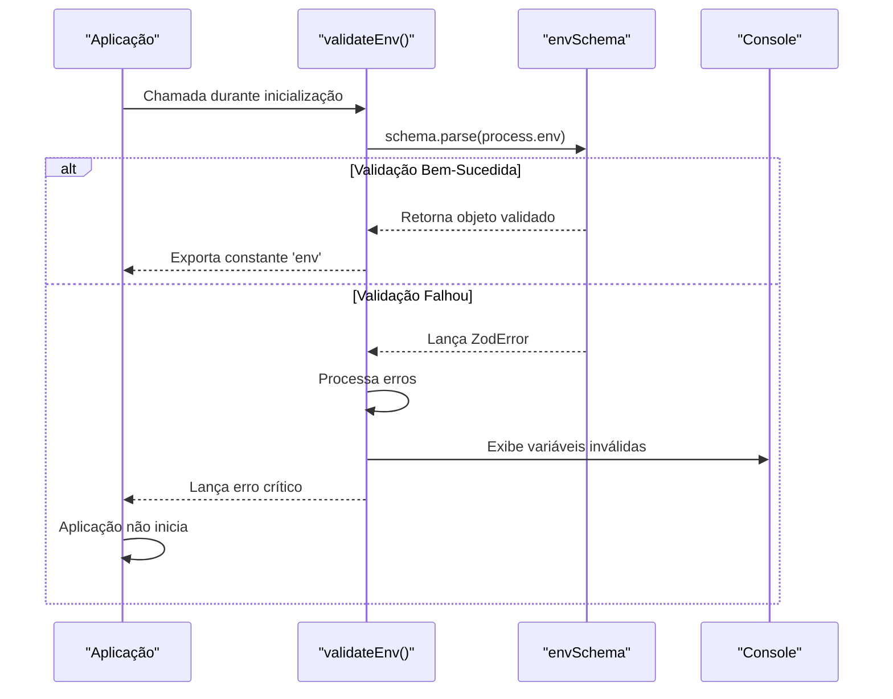
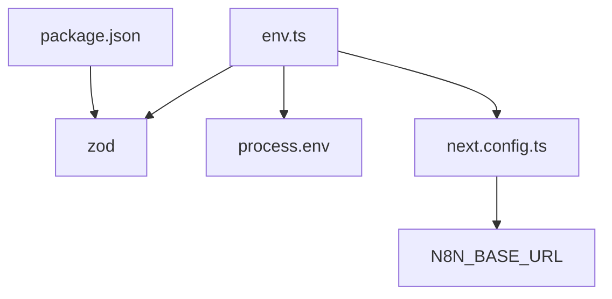

# Validação de Ambiente

<cite>
**Arquivos Referenciados neste Documento**  
- [env.ts](file://src/lib/env.ts)
- [next.config.ts](file://next.config.ts)
- [package.json](file://package.json)
</cite>

## Sumário
1. [Introdução](#introdução)
2. [Estrutura do Projeto](#estrutura-do-projeto)
3. [Componentes Principais](#componentes-principais)
4. [Visão Geral da Arquitetura](#visão-geral-da-arquitetura)
5. [Análise Detalhada dos Componentes](#análise-detalhada-dos-componentes)
6. [Análise de Dependências](#análise-de-dependências)
7. [Considerações de Desempenho](#considerações-de-desempenho)
8. [Guia de Solução de Problemas](#guia-de-solução-de-problemas)
9. [Conclusão](#conclusão)

## Introdução

Este documento fornece uma análise detalhada do sistema de validação de variáveis de ambiente implementado no arquivo `env.ts` do projeto Virtuquest. O sistema utiliza a biblioteca Zod para garantir a segurança, consistência e tipagem rigorosa das variáveis de ambiente, diferenciando claramente entre variáveis do servidor (privadas) e do cliente (públicas). A validação ocorre no momento da inicialização da aplicação, impedindo a execução com configurações inválidas e fornecendo mensagens de erro claras para facilitar a correção por desenvolvedores.

## Estrutura do Projeto

A estrutura do projeto segue uma organização baseada em funcionalidades e camadas, com ênfase em boas práticas de desenvolvimento moderno com Next.js. O sistema de validação de ambiente está centralizado no diretório `src/lib`, refletindo seu papel como utilitário fundamental para toda a aplicação.

**Diagram sources**  
- [env.ts](file://src/lib/env.ts)
- [next.config.ts](file://next.config.ts)

**Section sources**  
- [env.ts](file://src/lib/env.ts)
- [next.config.ts](file://next.config.ts)

## Componentes Principais

O componente principal deste sistema é o arquivo `env.ts`, localizado em `src/lib/env.ts`, que implementa a validação completa das variáveis de ambiente. Ele define dois esquemas distintos com Zod: um para variáveis do servidor (privadas) e outro para variáveis do cliente (públicas), combinando-os em um esquema único que é validado contra `process.env`. O resultado é uma constante `env` tipada e segura para uso em toda a aplicação, com um tipo `Env` exportado para reutilização.

**Section sources**  
- [env.ts](file://src/lib/env.ts#L1-L88)

## Visão Geral da Arquitetura

A arquitetura de validação de ambiente é projetada para fornecer segurança em tempo de execução e desenvolvimento, garantindo que todas as variáveis necessárias estejam presentes e corretamente formatadas antes que a aplicação inicie. O processo envolve a definição de esquemas com Zod, a validação contra o ambiente de execução e a exportação de uma interface tipada para uso seguro em toda a base de código.

**Diagram sources**  
- [env.ts](file://src/lib/env.ts#L1-L88)

## Análise Detalhada dos Componentes

### Análise do Componente de Validação de Ambiente

O componente `env.ts` implementa um sistema robusto de validação de ambiente que combina segurança, usabilidade e boas práticas de desenvolvimento. Ele separa claramente as preocupações entre variáveis privadas do servidor e variáveis públicas do cliente, aplicando regras de validação apropriadas para cada categoria.

#### Esquemas de Validação com Zod

O sistema utiliza dois esquemas Zod distintos para separar variáveis de ambiente com base em sua visibilidade e sensibilidade. O `serverSchema` valida variáveis privadas do servidor, enquanto o `clientSchema` valida variáveis públicas que serão expostas ao cliente.

**Diagram sources**  
- [env.ts](file://src/lib/env.ts#L1-L88)

#### Processo de Parsing e Tratamento de Erros

O processo de validação é implementado na função `validateEnv`, que tenta fazer o parsing de `process.env` usando o esquema combinado. Em caso de falha, a função captura erros do Zod e gera mensagens de erro detalhadas que identificam exatamente quais variáveis estão faltando ou são inválidas, facilitando a correção por desenvolvedores.

**Diagram sources**  
- [env.ts](file://src/lib/env.ts#L58-L76)

#### Adição de Novas Variáveis com Validação Robusta

Adicionar novas variáveis ao sistema de validação é um processo simples e padronizado. O desenvolvedor deve adicionar a nova variável ao esquema apropriado (`serverSchema` para variáveis privadas, `clientSchema` para públicas) com as regras de validação necessárias, como URLs, segredos com comprimento mínimo, valores booleanos transformados ou valores numéricos convertidos.

**Section sources**  
- [env.ts](file://src/lib/env.ts#L1-L88)

## Análise de Dependências

O sistema de validação de ambiente depende diretamente da biblioteca Zod, declarada como dependência no `package.json`, e integra-se com a configuração do Next.js através do arquivo `next.config.ts`. A integração com o Next.js é parcial, com apenas a variável `N8N_BASE_URL` sendo explicitamente referenciada na configuração, indicando uma oportunidade de aprimoramento para garantir que todas as variáveis necessárias sejam definidas.

**Diagram sources**  
- [env.ts](file://src/lib/env.ts)
- [next.config.ts](file://next.config.ts)
- [package.json](file://package.json)

**Section sources**  
- [env.ts](file://src/lib/env.ts)
- [next.config.ts](file://next.config.ts)
- [package.json](file://package.json)

## Considerações de Desempenho

O processo de validação de ambiente ocorre apenas uma vez durante a inicialização da aplicação, portanto seu impacto no desempenho em tempo de execução é insignificante. A validação é uma operação síncrona que impede a inicialização da aplicação se as variáveis de ambiente forem inválidas, garantindo que a aplicação nunca entre em um estado inconsistente. A utilização de tipos gerados automaticamente elimina erros em tempo de execução relacionados a variáveis de ambiente, melhorando a estabilidade geral do sistema.

## Guia de Solução de Problemas

Quando a validação de ambiente falha, o sistema fornece mensagens de erro detalhadas no console que identificam exatamente quais variáveis estão faltando ou são inválidas. Para resolver problemas comuns, os desenvolvedores devem verificar se todas as variáveis obrigatórias estão definidas nos arquivos `.env`, se os valores estão no formato correto (especialmente URLs e segredos), e se as variáveis públicas seguem a convenção de prefixo `NEXT_PUBLIC_`.

**Section sources**  
- [env.ts](file://src/lib/env.ts#L60-L70)

## Conclusão

O sistema de validação de ambiente implementado em `env.ts` representa uma prática exemplar de segurança e robustez em aplicações Next.js. Ao utilizar Zod para validação rigorosa, separar claramente variáveis privadas e públicas, e fornecer mensagens de erro claras, o sistema garante que a aplicação sempre inicie com uma configuração válida e segura. A integração com o Next.js pode ser aprimorada para garantir que todas as variáveis necessárias sejam definidas, mas mesmo na forma atual, o sistema fornece uma base sólida para o gerenciamento de configuração em diferentes ambientes de desenvolvimento, teste e produção.