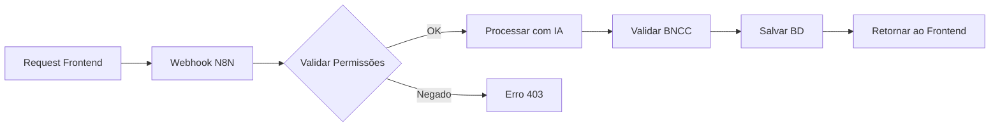
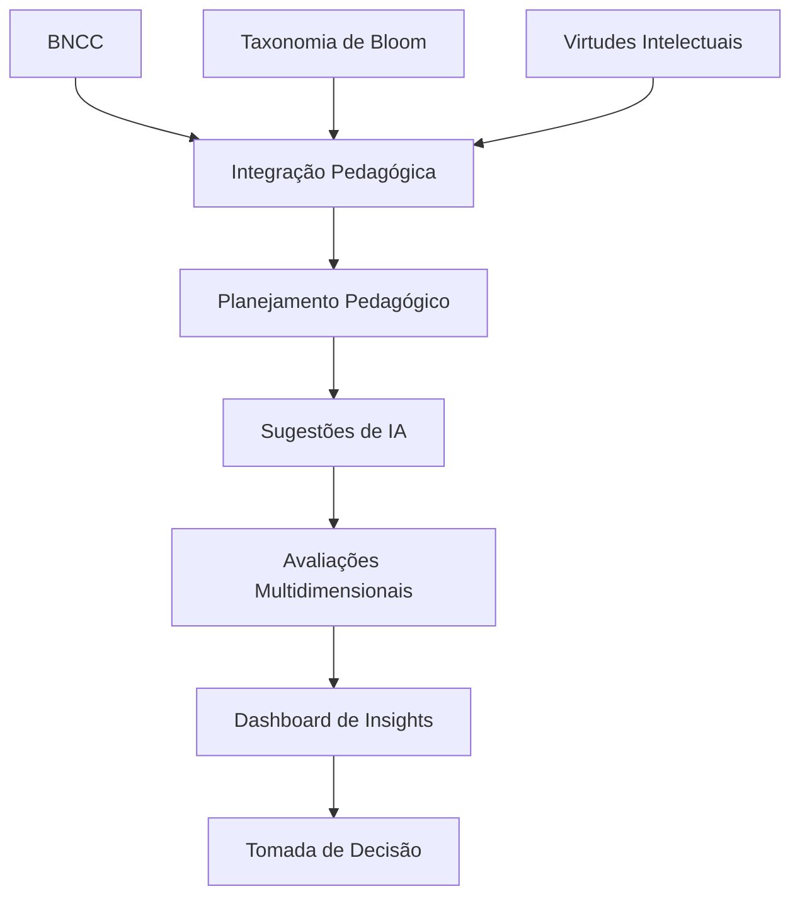
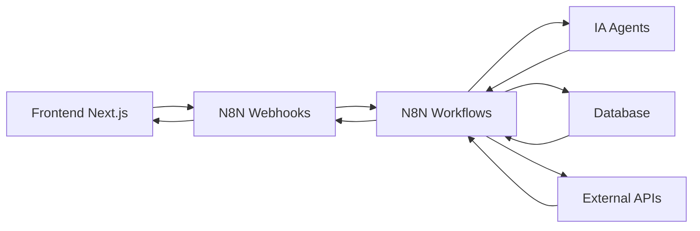

# Visão Geral do Projeto

<cite>
**Arquivos Referenciados neste Documento**  
- [README.md](file://README.md)
- [SPECS.md](file://docs/development/SPECS.md)
- [Taxonomia de Bloom e BNCC.md](file://docs/fundamentos/Taxonomia%20de%20Bloom%20e%20BNCC.md)
- [Teoria das Competências e Taxonomia de Bloom.md](file://docs/fundamentos/Teoria%20das%20Competências%20e%20Taxonomia%20de%20Bloom.md)
- [page.tsx](file://src/app/page.tsx)
- [layout.tsx](file://src/app/layout.tsx)
- [env.ts](file://src/lib/env.ts)
- [DEPENDENCY_VERSIONS.md](file://docs/development/DEPENDENCY_VERSIONS.md)
- [.env.example](file://.env.example)
</cite>

## Tabela de Conteúdos
1. [Introdução](#introdução)
2. [Integração Pedagógica: BNCC, Bloom e Virtudes Intelectuais](#integração-pedagógica-bncc-bloom-e-virtudes-intelectuais)
3. [Arquitetura Técnica e Stack Tecnológica](#arquitetura-técnica-e-stack-tecnológica)
4. [Componentes Principais e Fluxo de Dados](#componentes-principais-e-fluxo-de-dados)
5. [Casos de Uso Primários](#casos-de-uso-primários)
6. [Integração com N8N via Webhooks](#integração-com-n8n-via-webhooks)
7. [Exemplos Práticos de Cenários de Uso](#exemplos-práticos-de-cenários-de-uso)
8. [Diagramas Conceituais](#diagramas-conceituais)
9. [Conclusão](#conclusão)

## Introdução

O VirtuQuest é uma plataforma inovadora de planejamento pedagógico que integra harmoniosamente três pilares fundamentais da educação contemporânea: a Base Nacional Comum Curricular (BNCC), a Taxonomia de Bloom Revisada e o desenvolvimento de Virtudes Intelectuais. Esta integração é potencializada por assistência pedagógica com inteligência artificial, criando um ecossistema completo para otimização do processo educacional.

A plataforma foi projetada como um sistema open-source que proporciona planejamento pedagógico multinível, abrangendo desde aula individual até planejamento anual, com suporte de IA para personalização e otimização. O VirtuQuest se posiciona como uma solução completa para educadores e gestores escolares, oferecendo ferramentas para planejamento de aulas, geração de avaliações, fluxos de aprovação e dashboard de insights pedagógicos.

**Section sources**
- [README.md](file://README.md#L0-L40)
- [SPECS.md](file://docs/development/SPECS.md#L0-L50)

## Integração Pedagógica: BNCC, Bloom e Virtudes Intelectuais

### Fundamentação Teórica

A integração entre a BNCC, a Taxonomia de Bloom Revisada e as Virtudes Intelectuais constitui uma abordagem teórico-metodológica que transcende a mera justaposição de frameworks, representando uma convergência estrutural entre políticas curriculares brasileiras e fundamentos da psicologia cognitiva aplicada à educação.

A BNCC organiza suas prescrições curriculares mediante competências (descrições amplas de aprendizagens essenciais) e habilidades (objetivos específicos associados a objetos de conhecimento). A Taxonomia de Bloom Revisada, por sua vez, apresenta uma estrutura bidimensional composta por: (a) dimensão do conhecimento, subdividida em conhecimento factual, conceitual, procedimental e metacognitivo; e (b) dimensão do processo cognitivo, organizada progressivamente em lembrar, compreender, aplicar, analisar, avaliar e criar.

**Section sources**
- [Taxonomia de Bloom e BNCC.md](file://docs/fundamentos/Taxonomia%20de%20Bloom%20e%20BNCC.md#L0-L50)
- [Teoria das Competências e Taxonomia de Bloom.md](file://docs/fundamentos/Teoria%20das%20Competências%20e%20Taxonomia%20de%20Bloom.md#L0-L50)

### Mapeamento Taxonômico das Competências

As dez competências gerais da BNCC podem ser interpretadas como objetivos educacionais globais, fornecendo direcionamento amplo que deve ser desdobrado em objetivos educacionais e instrucionais mais específicos. Na BNCC, essa especificidade reside nas habilidades instituídas em cada componente curricular.

A análise taxonômica das habilidades da BNCC revela padrões significativos na estruturação curricular:

- **Distribuição por categoria de processo cognitivo**: Concentração pronunciada nas categorias de processo cognitivo de nível intermediário-superior (Analisar e Avaliar), que conjuntamente representam 66,6% das habilidades analisadas.
- **Distribuição por tipo de conhecimento**: Predominância marcante de conhecimento conceitual (77,8% das habilidades), com ausência completa de conhecimento factual e metacognitivo como focos principais.
- **Célula modal**: B4 (Conhecimento Conceitual × Analisar) emerge como célula modal, sugerindo ênfase curricular em desenvolvimento de capacidades analíticas fundamentadas em compreensão conceitual profunda.

**Section sources**
- [Taxonomia de Bloom e BNCC.md](file://docs/fundamentos/Taxonomia%20de%20Bloom%20e%20BNCC.md#L50-L100)
- [SPECS.md](file://docs/development/SPECS.md#L50-L100)

### Virtudes Intelectuais no Contexto Educacional

As Virtudes Intelectuais representam o terceiro pilar do VirtuQuest, complementando a dimensão cognitiva com o desenvolvimento do caráter e pensamento crítico. Esta dimensão reconhece que a educação efetiva não se limita à aquisição de conhecimentos e habilidades, mas envolve também o desenvolvimento de características epistemológicas e éticas do pensamento.

A integração das Virtudes Intelectuais com a BNCC e a Taxonomia de Bloom cria um sistema pedagógico tridimensional que aborda simultaneamente:
- **Domínio do conteúdo** (BNCC)
- **Processos cognitivos** (Bloom)
- **Desenvolvimento do caráter** (Virtudes Intelectuais)

**Section sources**
- [README.md](file://README.md#L40-L80)
- [SPECS.md](file://docs/development/SPECS.md#L100-L150)

## Arquitetura Técnica e Stack Tecnológica

### Stack Tecnológica Confirmada

O VirtuQuest utiliza uma stack tecnológica moderna e robusta, cuidadosamente selecionada para atender às necessidades pedagógicas e técnicas da plataforma:

| Categoria | Tecnologia | Versão | Status |
|---------|-----------|-------|-------|
| **Framework** | Next.js | 15.5.4 | ✅ Confirmado |
| **Linguagem** | TypeScript | 5.9.3 | ✅ Confirmado |
| **Estilização** | Tailwind CSS | 3.4.17 | ✅ Confirmado |
| **Componentes UI** | shadcn/ui + Radix UI | - | ✅ Confirmado |
| **Gerenciamento de Estado** | Zustand | 5.0.8 | ✅ Confirmado |
| **Formulários** | React Hook Form + Zod | 7.63.0 + 4.1.11 | ✅ Confirmado |
| **Gráficos** | Recharts | 3.2.1 | ✅ Confirmado |
| **Animações** | Framer Motion | 12.23.12 | ✅ Confirmado |
| **Ícones** | Lucide React | 0.544.0 | ✅ Confirmado |
| **Integração Backend** | Webhooks N8N | - | ✅ Confirmado |
| **Gerenciador de Pacotes** | pnpm | 9.x | ✅ Recomendado |

**Section sources**
- [README.md](file://README.md#L95-L140)
- [DEPENDENCY_VERSIONS.md](file://docs/development/DEPENDENCY_VERSIONS.md#L0-L50)

### Decisões Arquiteturais

A arquitetura do VirtuQuest foi projetada com base em princípios de separação de responsabilidades e escalabilidade. A plataforma adota uma arquitetura frontend-backend onde o frontend (Next.js) é exclusivamente responsável pela interface e orquestração, enquanto toda a lógica de negócio, persistência e processamento de IA residem no backend (N8N).

Principais decisões arquiteturais:
1. **Separação de Responsabilidades**: O Next.js é exclusivamente interface e orquestração. TODA lógica de negócio, persistência e IA residem no N8N.
2. **Comunicação Assíncrona**: Todas as operações com N8N devem ser não-bloqueantes, com tratamento adequado de estados de loading e erro.
3. **Cache Inteligente**: Implementar cache no frontend para dados estáticos (BNCC, Bloom, Virtudes) mas sempre validar com backend para dados dinâmicos.
4. **Tipagem Rigorosa**: TypeScript com strict mode. Todos os contratos de API devem ter interfaces correspondentes.

**Section sources**
- [SPECS.md](file://docs/development/SPECS.md#L600-L650)
- [env.ts](file://src/lib/env.ts#L0-L30)

## Componentes Principais e Fluxo de Dados

### Estrutura de Diretórios

A estrutura de diretórios do VirtuQuest reflete a arquitetura modular da aplicação:

```
virtuquest/
├── src/
│   ├── app/                    # Next.js App Router
│   │   ├── (auth)/             # Rotas autenticadas
│   │   │   ├── professor/      # Interface professor
│   │   │   ├── gestao/         # Interface gestão escolar
│   │   │   └── admin/          # Interface administrador
│   │   ├── api/                # API routes (proxy para N8N)
│   │   └── (public)/           # Páginas públicas
│   ├── core/
│   │   ├── domain/             # Regras de negócio
│   │   │   ├── bncc/
│   │   │   ├── bloom/
│   │   │   └── virtudes/
│   │   ├── infrastructure/     # Integrações
│   │   │   └── n8n/           # Cliente HTTP para webhooks
│   │   └── application/        # Casos de uso
│   ├── components/
│   │   ├── planning/           # Componentes de planejamento
│   │   ├── assessment/         # Componentes de avaliação
│   │   └── shared/            # Componentes compartilhados
│   └── lib/
│       ├── hooks/             # React hooks customizados
│       └── utils/             # Funções utilitárias
├── docs/
│   ├── fundamentos/           # Arquivos teóricos base
│   ├── api/                   # Documentação da API
│   └── n8n/                   # Mapeamento de webhooks
└── n8n-workflows/             # Exportação dos workflows N8N
```

**Section sources**
- [SPECS.md](file://docs/development/SPECS.md#L190-L270)
- [README.md](file://README.md#L140-L180)

### Modelo de Domínio

O modelo de domínio do VirtuQuest define as entidades principais do sistema:

```typescript
// Tipos de Usuário
interface Usuario {
  id: string;
  tipo: 'PROFESSOR' | 'GESTOR' | 'SUPERVISOR' | 'DIRETOR' | 'ADMIN';
  escola?: Escola;
  disciplinas?: Disciplina[];
  permissoes: Permissao[];
}

// Planejamento Pedagógico
interface PlanoAula {
  id: string;
  professor: Usuario;
  disciplina: Disciplina;
  nivel: 'AULA' | 'UNIDADE' | 'BIMESTRE' | 'SEMESTRE' | 'ANO';
  competenciasBNCC: CompetenciaBNCC[];
  objetivosBloom: ObjetivoBloom[];
  virtudesIntelectuais: VirtudeIntelectual[];
  conteudo: ConteudoPedagogico;
  avaliacoes?: Avaliacao[];
  status: 'RASCUNHO' | 'PENDENTE_APROVACAO' | 'APROVADO' | 'BLOQUEADO';
}
```

**Section sources**
- [SPECS.md](file://docs/development/SPECS.md#L270-L350)

## Casos de Uso Primários

### Planejamento de Aulas

O VirtuQuest permite o planejamento integrado de aulas com alinhamento automático à BNCC, Taxonomia de Bloom e Virtudes Intelectuais. Os professores podem criar planos de aula que especificam:

- Competências e habilidades da BNCC
- Objetivos cognitivos segundo a Taxonomia de Bloom
- Virtudes Intelectuais a serem desenvolvidas
- Conteúdo pedagógico
- Avaliações multidimensionais

O sistema oferece sugestões inteligentes com base na IA, facilitando o processo de planejamento e garantindo coerência pedagógica.

**Section sources**
- [README.md](file://README.md#L40-L60)
- [SPECS.md](file://docs/development/SPECS.md#L350-L400)

### Geração de Avaliações

A plataforma permite a geração de avaliações multidimensionais que avaliam simultaneamente:

- Domínio do conteúdo (BNCC)
- Processos cognitivos (Bloom)
- Desenvolvimento de virtudes (Virtudes Intelectuais)

As avaliações podem ser geradas automaticamente com base no planejamento da aula, ou criadas manualmente com suporte de IA para sugestões de questões e critérios de avaliação.

**Section sources**
- [README.md](file://README.md#L60-L70)
- [SPECS.md](file://docs/development/SPECS.md#L400-L450)

### Dashboard de Insights

O dashboard de insights fornece uma visão consolidada do progresso pedagógico, incluindo:

- Cobertura da BNCC por disciplina e turma
- Desenvolvimento das Virtudes Intelectuais
- Progressão na Taxonomia de Bloom
- Métricas de engajamento e desempenho

Os gestores escolares podem utilizar esses insights para tomada de decisões estratégicas e acompanhamento do alinhamento curricular.

**Section sources**
- [README.md](file://README.md#L70-L80)
- [SPECS.md](file://docs/development/SPECS.md#L450-L500)

## Integração com N8N via Webhooks

### Arquitetura de Integração

O VirtuQuest utiliza uma arquitetura de integração baseada em webhooks N8N, onde o frontend (Next.js) se comunica com o backend (N8N) através de requisições HTTP assíncronas. Esta arquitetura permite:

- Processamento centralizado no N8N
- Integração com múltiplas fontes de dados
- Automação de fluxos de trabalho
- Processamento de IA através de agentes N8N

```typescript
const N8N_ENDPOINTS = {
  // Gestão de Usuários
  usuarios: {
    criar: '/webhook/user/create',
    autenticar: '/webhook/user/auth',
    atualizar: '/webhook/user/update',
    listar: '/webhook/user/list'
  },
  
  // Planejamento
  planejamento: {
    criarPlano: '/webhook/planning/create',
    atualizarPlano: '/webhook/planning/update',
    aprovarPlano: '/webhook/planning/approve',
    consultarPlanos: '/webhook/planning/query'
  },
  
  // IA
  ia: {
    sugerirConteudo: '/webhook/ai/suggest-content',
    analisarAlinhamento: '/webhook/ai/analyze-alignment',
    gerarAvaliacao: '/webhook/ai/generate-assessment'
  },
  
  // Relatórios
  relatorios: {
    progressoBNCC: '/webhook/reports/bncc-progress',
    desenvolvimentoVirtudes: '/webhook/reports/virtues-development'
  }
};
```

**Section sources**
- [SPECS.md](file://docs/development/SPECS.md#L500-L580)
- [env.ts](file://src/lib/env.ts#L0-L30)

### Fluxo de Criação de Plano



**Diagram sources**
- [SPECS.md](file://docs/development/SPECS.md#L700-L720)

### Variáveis de Ambiente para Integração

As variáveis de ambiente essenciais para a integração com N8N incluem:

- `N8N_BASE_URL`: URL da instância N8N
- `N8N_WEBHOOK_SECRET`: Segredo para validação de webhooks N8N
- `NEXT_PUBLIC_ENABLE_N8N_INTEGRATION`: Habilita integração N8N

```env
# URL base da instância N8N
N8N_BASE_URL=http://localhost:5678

# Secret para validação de webhooks N8N
N8N_WEBHOOK_SECRET=your_n8n_webhook_secret_here
```

**Section sources**
- [.env.example](file://.env.example#L10-L20)
- [env.ts](file://src/lib/env.ts#L0-L10)

## Exemplos Práticos de Cenários de Uso

### Cenário 1: Planejamento de Aula de Matemática

Um professor de matemática utiliza o VirtuQuest para planejar uma aula sobre proporcionalidade. O sistema sugere:

- **BNCC**: Habilidade EF07MA17 (Resolver e elaborar problemas que envolvem variação de proporcionalidade direta e de proporcionalidade inversa)
- **Bloom**: Nível "Criar" (elaborar problemas originais)
- **Virtudes Intelectuais**: Curiosidade e autonomia

O professor aceita as sugestões e o sistema gera automaticamente uma avaliação com questões que avaliam simultaneamente o domínio do conteúdo, os processos cognitivos e as virtudes intelectuais.

**Section sources**
- [Taxonomia de Bloom e BNCC.md](file://docs/fundamentos/Taxonomia%20de%20Bloom%20e%20BNCC.md#L500-L550)
- [SPECS.md](file://docs/development/SPECS.md#L350-L400)

### Cenário 2: Aprovação de Planejamento pela Gestão

Um coordenador pedagógico recebe uma notificação sobre um plano de aula pendente de aprovação. No dashboard, ele visualiza:

- Alinhamento com a BNCC (95% de cobertura)
- Distribuição dos objetivos na Taxonomia de Bloom
- Virtudes Intelectuais desenvolvidas
- Sugestões de IA para melhorias

Após análise, o coordenador aprova o plano, que passa para o status "APROVADO" e fica disponível para o professor.

**Section sources**
- [README.md](file://README.md#L60-L70)
- [SPECS.md](file://docs/development/SPECS.md#L400-L450)

## Diagramas Conceituais

### Integração Pedagógica



**Diagram sources**
- [README.md](file://README.md#L40-L80)
- [SPECS.md](file://docs/development/SPECS.md#L0-L100)

### Arquitetura do Sistema



**Diagram sources**
- [SPECS.md](file://docs/development/SPECS.md#L200-L250)
- [env.ts](file://src/lib/env.ts#L0-L30)

## Conclusão

O VirtuQuest representa uma inovação significativa no campo do planejamento pedagógico, integrando harmoniosamente os três pilares fundamentais da educação contemporânea: BNCC, Taxonomia de Bloom e Virtudes Intelectuais. A plataforma combina uma fundamentação teórica sólida com uma arquitetura técnica moderna e robusta, baseada em Next.js e N8N, criando um ecossistema completo para otimização do processo educacional.

A integração com IA através de webhooks N8N permite sugestões pedagógicas inteligentes, geração automática de avaliações e análise de alinhamento pedagógico, enquanto o dashboard de insights fornece uma visão consolidada do progresso educacional. Esta combinação de fundamentação pedagógica e tecnologia avançada posiciona o VirtuQuest como uma solução completa para educadores e gestores escolares que buscam elevar a qualidade do ensino.

A arquitetura modular e a stack tecnológica moderna garantem escalabilidade e manutenibilidade, enquanto a integração com N8N permite flexibilidade e automação de fluxos de trabalho. O VirtuQuest demonstra como a tecnologia pode ser utilizada para potencializar a educação, criando um sistema que vai além do planejamento tradicional, promovendo um ensino mais alinhado, eficiente e centrado no desenvolvimento integral do aluno.