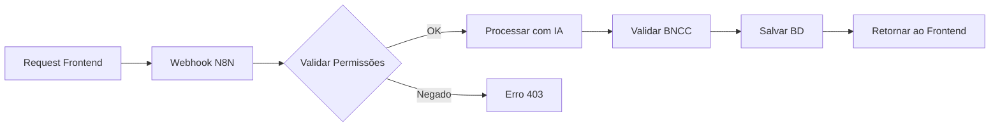
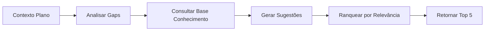

# VirtuQuest - Especificação Técnica e Instruções para Agente de Codificação

## 1. Visão Geral do Sistema

### 1.1 Conceito Central

VirtuQuest é um framework educacional integrado que harmoniza três dimensões
pedagógicas fundamentais:

- **Base Nacional Comum Curricular (BNCC)**: Define competências e habilidades
  obrigatórias
- **Taxonomia de Bloom**: Estrutura hierárquica de objetivos educacionais
  cognitivos
- **Virtudes Intelectuais**: Desenvolvimento de características epistemológicas
  e éticas do pensamento

### 1.2 Proposta de Valor

Sistema open-source que proporciona planejamento pedagógico multinível (aula
individual → unidade → bimestre → semestre → ano) com suporte de IA para
otimização e personalização do processo educacional.

## 2. Arquitetura Técnica

### 2.1 Stack Tecnológico

```
Frontend: Next.js (App Router)
Backend: N8N (processamento centralizado)
Database: Tabelas nativas N8N
IA: Agentes processados via N8N workflows
Comunicação: HTTP webhooks
```

### 2.2 Estrutura de Diretórios Proposta

```
virtuquest/
├── src/
│   ├── app/                    # Next.js App Router
│   │   ├── (auth)/             # Rotas autenticadas
│   │   │   ├── professor/      # Interface professor
│   │   │   ├── gestao/         # Interface gestão escolar
│   │   │   └── admin/          # Interface administrador
│   │   ├── api/                # API routes (proxy para N8N)
│   │   └── (public)/           # Páginas públicas
│   ├── core/
│   │   ├── domain/             # Regras de negócio
│   │   │   ├── bncc/
│   │   │   ├── bloom/
│   │   │   └── virtudes/
│   │   ├── infrastructure/     # Integrações
│   │   │   └── n8n/           # Cliente HTTP para webhooks
│   │   └── application/        # Casos de uso
│   ├── components/
│   │   ├── planning/           # Componentes de planejamento
│   │   ├── assessment/         # Componentes de avaliação
│   │   └── shared/            # Componentes compartilhados
│   └── lib/
│       ├── hooks/             # React hooks customizados
│       └── utils/             # Funções utilitárias
├── docs/
│   ├── fundamentos/           # Arquivos teóricos base
│   ├── api/                   # Documentação da API
│   └── n8n/                   # Mapeamento de webhooks
└── n8n-workflows/             # Exportação dos workflows N8N
```

## 3. Modelo de Domínio

### 3.1 Entidades Principais

```typescript
// Tipos de Usuário
interface Usuario {
  id: string;
  tipo: 'PROFESSOR' | 'GESTOR' | 'SUPERVISOR' | 'DIRETOR' | 'ADMIN';
  escola?: Escola;
  disciplinas?: Disciplina[];
  permissoes: Permissao[];
}

// Estrutura Escolar
interface Escola {
  id: string;
  nome: string;
  calendario: CalendarioEscolar;
  estruturaOrganizacional: {
    niveis: NivelEnsino[];
    turmas: Turma[];
    disciplinas: Disciplina[];
  };
}

// Planejamento Pedagógico
interface PlanoAula {
  id: string;
  professor: Usuario;
  disciplina: Disciplina;
  nivel: 'AULA' | 'UNIDADE' | 'BIMESTRE' | 'SEMESTRE' | 'ANO';
  competenciasBNCC: CompetenciaBNCC[];
  objetivosBloom: ObjetivoBloom[];
  virtudesIntelectuais: VirtudeIntelectual[];
  conteudo: ConteudoPedagogico;
  avaliacoes?: Avaliacao[];
  status: 'RASCUNHO' | 'PENDENTE_APROVACAO' | 'APROVADO' | 'BLOQUEADO';
}
```

### 3.2 Mapeamento N8N Webhooks

```typescript
const N8N_ENDPOINTS = {
  // Gestão de Usuários
  usuarios: {
    criar: '/webhook/user/create',
    autenticar: '/webhook/user/auth',
    atualizar: '/webhook/user/update',
    listar: '/webhook/user/list',
  },

  // Planejamento
  planejamento: {
    criarPlano: '/webhook/planning/create',
    atualizarPlano: '/webhook/planning/update',
    aprovarPlano: '/webhook/planning/approve',
    consultarPlanos: '/webhook/planning/query',
  },

  // IA
  ia: {
    sugerirConteudo: '/webhook/ai/suggest-content',
    analisarAlinhamento: '/webhook/ai/analyze-alignment',
    gerarAvaliacao: '/webhook/ai/generate-assessment',
  },

  // Relatórios
  relatorios: {
    progressoBNCC: '/webhook/reports/bncc-progress',
    desenvolvimentoVirtudes: '/webhook/reports/virtues-development',
  },
};
```

## 4. Funcionalidades por Tipo de Usuário

### 4.1 Professor Individual

- Cadastro com definição de disciplinas
- Planejamento flexível (aula/unidade/bimestre)
- Integração com BNCC para sua disciplina
- Sugestões de IA para conteúdo e avaliações
- Acompanhamento de virtudes intelectuais

### 4.2 Gestão Escolar (Supervisor/Coordenador/Diretor)

- Cadastro de professores e turmas
- Definição de calendário escolar
- Controle de prazos (entregas, provas)
- Aprovação/bloqueio de planejamentos
- Visão consolidada de alinhamento BNCC
- Relatórios de desenvolvimento de virtudes

### 4.3 Administrador Sistema

- Configuração completa do ambiente escolar
- Gestão de permissões granulares
- Monitoramento de uso do sistema
- Configuração de integrações IA

## 5. Regras de Negócio Críticas

### 5.1 Hierarquia de Planejamento

```typescript
const REGRAS_PLANEJAMENTO = {
  // Planos de nível superior devem agregar níveis inferiores
  agregacao: {
    ANO: ['SEMESTRE', 'BIMESTRE'],
    SEMESTRE: ['BIMESTRE', 'UNIDADE'],
    BIMESTRE: ['UNIDADE', 'AULA'],
    UNIDADE: ['AULA'],
  },

  // Gestão pode travar modificações
  bloqueio: {
    origem: ['SUPERVISOR', 'COORDENADOR', 'DIRETOR'],
    aplica: ['PROFESSOR'],
    niveis: ['TODOS'],
  },
};
```

### 5.2 Alinhamento BNCC-Bloom-Virtudes

```typescript
interface AlinhamentoPedagogico {
  // Cada atividade deve mapear para:
  competenciaBNCC: string; // Obrigatório
  nivelBloom: NivelTaxonomico; // Obrigatório
  virtudes: VirtudeIntelectual[]; // Mínimo 1

  // Validação de coerência
  validar(): boolean;
}
```

## 6. Instruções Específicas para o Agente de Codificação

### 6.1 Princípios de Desenvolvimento

1. **Separação de Responsabilidades**: O Next.js é exclusivamente interface e
   orquestração. TODA lógica de negócio, persistência e IA residem no N8N.

2. **Comunicação Assíncrona**: Todas as operações com N8N devem ser
   não-bloqueantes, com tratamento adequado de estados de loading e erro.

3. **Cache Inteligente**: Implementar cache no frontend para dados estáticos
   (BNCC, Bloom, Virtudes) mas sempre validar com backend para dados dinâmicos.

4. **Tipagem Rigorosa**: TypeScript com strict mode. Todos os contratos de API
   devem ter interfaces correspondentes.

### 6.2 Padrões de Implementação

```typescript
// Exemplo de service layer para N8N
class N8NService {
  private baseURL = process.env.N8N_BASE_URL;

  async executarWorkflow<T>(
    endpoint: string,
    dados: unknown,
    options?: RequestOptions
  ): Promise<ApiResponse<T>> {
    try {
      const response = await fetch(`${this.baseURL}${endpoint}`, {
        method: 'POST',
        headers: {
          'Content-Type': 'application/json',
          'X-API-Key': process.env.N8N_API_KEY,
        },
        body: JSON.stringify(dados),
      });

      if (!response.ok) {
        throw new ApiError(response.status, await response.text());
      }

      return await response.json();
    } catch (error) {
      // Tratamento robusto de erros
      this.logError(error);
      throw new ProcessamentoError('Falha na comunicação com N8N', error);
    }
  }
}
```

### 6.3 Estrutura de Estado Global

```typescript
// Zustand para gerenciamento de estado
interface AppState {
  usuario: Usuario | null;
  escola: Escola | null;
  planejamentoAtivo: PlanoAula | null;

  // Dados de referência (cacheable)
  bnccData: CompetenciaBNCC[];
  bloomTaxonomia: NivelBloom[];
  virtudesCatalogo: VirtudeIntelectual[];

  // Actions
  carregarDadosReferencia: () => Promise<void>;
  salvarPlanoAula: (plano: PlanoAula) => Promise<void>;
}
```

### 6.4 Componentes React Prioritários

```typescript
// Componentes essenciais para MVP
const COMPONENTES_MVP = [
  'PlannerEditor', // Editor principal de planos
  'BNCCSelector', // Seletor de competências BNCC
  'BloomMapper', // Mapeamento de objetivos Bloom
  'VirtuesTracker', // Rastreador de virtudes
  'CalendarManager', // Gerenciador de calendário
  'ApprovalWorkflow', // Fluxo de aprovação
  'AIAssistant', // Interface com agentes IA
  'ProgressDashboard', // Dashboard de progresso
];
```

## 7. Fluxos de Trabalho N8N

### 7.1 Workflow de Criação de Plano



### 7.2 Workflow de Sugestão IA



## 8. Considerações de Segurança

1. **Autenticação**: JWT com refresh tokens
2. **Autorização**: RBAC com políticas granulares
3. **Auditoria**: Log completo de todas as operações
4. **LGPD**: Anonimização de dados estudantis
5. **Backup**: Estratégia de backup incremental diário

## 9. Métricas de Sucesso

- Tempo médio de criação de plano < 15 minutos
- Taxa de aprovação de planos > 80%
- Alinhamento BNCC > 95%
- Satisfação do professor > 4.5/5
- Redução de retrabalho > 60%

## 10. Roadmap de Implementação

### Fase 1 - MVP (4 semanas)

- [ ] Setup projeto Next.js + N8N
- [ ] Autenticação básica
- [ ] CRUD de planos simples
- [ ] Integração BNCC básica

### Fase 2 - IA (4 semanas)

- [ ] Agentes de sugestão
- [ ] Análise de alinhamento
- [ ] Geração automática de avaliações

### Fase 3 - Gestão (4 semanas)

- [ ] Fluxos de aprovação
- [ ] Calendário integrado
- [ ] Relatórios gerenciais

### Fase 4 - Refinamento (Contínuo)

- [ ] Otimização de performance
- [ ] Feedback dos usuários
- [ ] Expansão de funcionalidades

---

**Nota para o Agente**: Este documento serve como blueprint arquitetural. Ao
implementar, sempre priorize a clareza do código, a manutenibilidade e a
aderência aos princípios pedagógicos fundamentais. Questione decisões que
comprometam a integridade educacional do sistema.

## 11. Design System e Arquitetura Visual

### 11.1 Fundamentos do Design System

#### 11.1.1 Stack de UI

```typescript
const UI_STACK = {
  base: 'shadcn/ui', // Componentes base
  styling: 'Tailwind CSS', // Sistema de estilos
  themes: 'CSS Variables', // Tematização
  icons: 'lucide-react', // Ícones consistentes
  animations: 'framer-motion', // Animações (quando necessário)
  charts: 'recharts', // Visualização de dados
  forms: 'react-hook-form + zod', // Validação e gestão de formulários
};
```

#### 11.1.2 Princípios de Design

```typescript
const DESIGN_PRINCIPLES = {
  acessibilidade: 'WCAG 2.1 AA compliance',
  responsividade: 'Mobile-first approach',
  consistencia: 'Strict token system',
  performance: 'Minimal runtime overhead',
  customizacao: 'Theme-aware components',
  educacional: 'Clear visual hierarchy for learning',
};
```

### 11.2 Design Tokens

#### 11.2.1 Estrutura de Tokens

```css
/* src/styles/design-tokens.css */
@layer base {
  :root {
    /* Cores Semânticas - Base */
    --primary: 217 91% 60%; /* Azul institucional */
    --primary-foreground: 0 0% 100%;
    --secondary: 142 76% 36%; /* Verde educacional */
    --secondary-foreground: 0 0% 100%;

    /* Estados BNCC */
    --bncc-competencia: 271 91% 65%; /* Roxo */
    --bncc-habilidade: 199 89% 48%; /* Azul */

    /* Taxonomia Bloom */
    --bloom-lembrar: 39 100% 50%; /* Laranja */
    --bloom-entender: 45 100% 51%; /* Amarelo */
    --bloom-aplicar: 142 71% 45%; /* Verde */
    --bloom-analisar: 199 89% 48%; /* Azul */
    --bloom-avaliar: 271 76% 53%; /* Roxo */
    --bloom-criar: 333 71% 51%; /* Rosa */

    /* Virtudes Intelectuais */
    --virtude-curiosidade: 199 95% 74%;
    --virtude-humildade: 142 43% 39%;
    --virtude-coragem: 25 95% 53%;
    --virtude-autonomia: 262 83% 58%;

    /* Espacamento */
    --spacing-xs: 0.25rem; /* 4px */
    --spacing-sm: 0.5rem; /* 8px */
    --spacing-md: 1rem; /* 16px */
    --spacing-lg: 1.5rem; /* 24px */
    --spacing-xl: 2rem; /* 32px */
    --spacing-2xl: 3rem; /* 48px */

    /* Tipografia */
    --font-sans: 'Inter', system-ui, sans-serif;
    --font-mono: 'JetBrains Mono', monospace;
    --font-educational: 'Lexend', sans-serif; /* Otimizada para leitura */

    /* Tamanhos de Fonte */
    --text-xs: 0.75rem; /* 12px */
    --text-sm: 0.875rem; /* 14px */
    --text-base: 1rem; /* 16px */
    --text-lg: 1.125rem; /* 18px */
    --text-xl: 1.25rem; /* 20px */
    --text-2xl: 1.5rem; /* 24px */
    --text-3xl: 1.875rem; /* 30px */

    /* Bordas */
    --radius-sm: 0.25rem;
    --radius-md: 0.5rem;
    --radius-lg: 0.75rem;
    --radius-full: 9999px;

    /* Sombras */
    --shadow-sm: 0 1px 2px 0 rgb(0 0 0 / 0.05);
    --shadow-md: 0 4px 6px -1px rgb(0 0 0 / 0.1);
    --shadow-lg: 0 10px 15px -3px rgb(0 0 0 / 0.1);
    --shadow-educational: 0 0 0 3px hsl(var(--primary) / 0.1);

    /* Animações */
    --animation-fast: 150ms;
    --animation-base: 250ms;
    --animation-slow: 350ms;
    --animation-slower: 500ms;
  }

  /* Tema Escuro */
  .dark {
    --primary: 217 91% 70%;
    --primary-foreground: 222.2 47.4% 11.2%;
    /* ... outros tokens adaptados */
  }
}
```

#### 11.2.2 Tokens Específicos para Contexto Educacional

```typescript
// src/lib/design-system/educational-tokens.ts
export const educationalTokens = {
  status: {
    rascunho: 'hsl(var(--muted))',
    emRevisao: 'hsl(var(--warning))',
    aprovado: 'hsl(var(--success))',
    bloqueado: 'hsl(var(--destructive))',
    publicado: 'hsl(var(--primary))',
  },

  nivelEnsino: {
    infantil: {
      bg: 'hsl(45 100% 96%)',
      border: 'hsl(45 100% 51%)',
      text: 'hsl(45 100% 25%)',
    },
    fundamental1: {
      bg: 'hsl(142 43% 95%)',
      border: 'hsl(142 76% 36%)',
      text: 'hsl(142 76% 20%)',
    },
    fundamental2: {
      bg: 'hsl(199 89% 95%)',
      border: 'hsl(199 89% 48%)',
      text: 'hsl(199 89% 25%)',
    },
    medio: {
      bg: 'hsl(271 76% 95%)',
      border: 'hsl(271 76% 53%)',
      text: 'hsl(271 76% 30%)',
    },
  },

  prioridade: {
    baixa: { icon: 'arrow-down', color: 'hsl(var(--muted-foreground))' },
    media: { icon: 'minus', color: 'hsl(var(--warning))' },
    alta: { icon: 'arrow-up', color: 'hsl(var(--destructive))' },
    urgente: { icon: 'alert-circle', color: 'hsl(var(--destructive))' },
  },
};
```

### 11.3 Componentes Base (Shadcn/ui)

#### 11.3.1 Estrutura de Componentes

```typescript
// src/components/ui/index.ts
// Re-export otimizado de componentes shadcn
export * from './accordion';
export * from './alert';
export * from './badge';
export * from './button';
export * from './calendar';
export * from './card';
export * from './checkbox';
export * from './command';
export * from './data-table';
export * from './dialog';
export * from './dropdown-menu';
export * from './form';
export * from './input';
export * from './label';
export * from './popover';
export * from './progress';
export * from './select';
export * from './separator';
export * from './sheet';
export * from './skeleton';
export * from './switch';
export * from './table';
export * from './tabs';
export * from './textarea';
export * from './toast';
export * from './toggle';
export * from './tooltip';
```

#### 11.3.2 Extensões Educacionais

```tsx
// src/components/educational/index.ts
import { cn } from '@/lib/utils';
import { Badge } from '@/components/ui/badge';
import { Card } from '@/components/ui/card';

// Badge BNCC customizado
export function BNCCBadge({
  competencia,
  habilidade,
}: {
  competencia?: string;
  habilidade?: string;
}) {
  return (
    <div className="flex gap-2">
      {competencia && (
        <Badge
          className={cn(
            'bg-[hsl(var(--bncc-competencia))]',
            'text-white hover:opacity-90'
          )}
        >
          {competencia}
        </Badge>
      )}
      {habilidade && (
        <Badge
          className={cn(
            'bg-[hsl(var(--bncc-habilidade))]',
            'text-white hover:opacity-90'
          )}
        >
          {habilidade}
        </Badge>
      )}
    </div>
  );
}

// Card de Plano de Aula
export function PlanoAulaCard({
  plano,
  variant = 'default',
}: {
  plano: PlanoAula;
  variant?: 'default' | 'compact' | 'detailed';
}) {
  return (
    <Card
      className={cn(
        'relative overflow-hidden',
        'border-l-4',
        plano.status === 'APROVADO' && 'border-l-[hsl(var(--success))]',
        plano.status === 'RASCUNHO' && 'border-l-[hsl(var(--muted))]',
        plano.status === 'PENDENTE_APROVACAO' &&
          'border-l-[hsl(var(--warning))]',
        plano.status === 'BLOQUEADO' && 'border-l-[hsl(var(--destructive))]'
      )}
    >
      {/* Conteúdo do card baseado na variant */}
    </Card>
  );
}

// Indicador de Nível Bloom
export function BloomIndicator({
  nivel,
}: {
  nivel: 'lembrar' | 'entender' | 'aplicar' | 'analisar' | 'avaliar' | 'criar';
}) {
  const colors = {
    lembrar: 'var(--bloom-lembrar)',
    entender: 'var(--bloom-entender)',
    aplicar: 'var(--bloom-aplicar)',
    analisar: 'var(--bloom-analisar)',
    avaliar: 'var(--bloom-avaliar)',
    criar: 'var(--bloom-criar)',
  };

  return (
    <div className="flex items-center gap-2">
      <div
        className="h-3 w-3 rounded-full"
        style={{ backgroundColor: `hsl(${colors[nivel]})` }}
      />
      <span className="text-sm font-medium capitalize">{nivel}</span>
    </div>
  );
}
```

### 11.4 Composição de Layouts

#### 11.4.1 Layout Principal

```tsx
// src/components/layouts/MainLayout.tsx
import { cn } from '@/lib/utils';
import { Sidebar } from './Sidebar';
import { Header } from './Header';

export function MainLayout({ children }: { children: React.ReactNode }) {
  return (
    <div className="bg-background min-h-screen">
      {/* Header fixo */}
      <Header className="bg-background/95 fixed top-0 z-50 w-full border-b backdrop-blur" />

      {/* Container principal com sidebar */}
      <div className="flex pt-16">
        <Sidebar className="fixed left-0 z-40 h-[calc(100vh-4rem)] w-64 border-r" />

        {/* Área de conteúdo */}
        <main className="ml-64 flex-1 p-6">
          <div className="mx-auto max-w-7xl">{children}</div>
        </main>
      </div>
    </div>
  );
}
```

#### 11.4.2 Grid System Educacional

```tsx
// src/components/layouts/EducationalGrid.tsx
export function EducationalGrid({
  children,
  variant = 'auto',
}: {
  children: React.ReactNode;
  variant?: 'auto' | 'planos' | 'avaliacoes' | 'dashboard';
}) {
  const gridClasses = {
    auto: 'grid-cols-1 md:grid-cols-2 lg:grid-cols-3 xl:grid-cols-4',
    planos: 'grid-cols-1 lg:grid-cols-2 xl:grid-cols-3',
    avaliacoes: 'grid-cols-1 md:grid-cols-2',
    dashboard: 'grid-cols-1 md:grid-cols-2 lg:grid-cols-4',
  };

  return (
    <div className={cn('grid gap-6', gridClasses[variant])}>{children}</div>
  );
}
```

### 11.5 Componentes Complexos Customizados

#### 11.5.1 Editor de Plano de Aula

```tsx
// src/components/planner/PlannerEditor.tsx
import { Tabs, TabsContent, TabsList, TabsTrigger } from '@/components/ui/tabs';
import { useForm } from 'react-hook-form';
import { zodResolver } from '@hookform/resolvers/zod';

export function PlannerEditor() {
  return (
    <div className="space-y-6">
      {/* Cabeçalho com Status */}
      <div className="bg-muted/50 flex items-center justify-between rounded-lg p-4">
        <h2 className="text-2xl font-semibold">Editor de Plano de Aula</h2>
        <StatusIndicator status={plano.status} />
      </div>

      {/* Tabs de Edição */}
      <Tabs defaultValue="conteudo" className="space-y-4">
        <TabsList className="grid w-full grid-cols-5">
          <TabsTrigger value="conteudo">Conteúdo</TabsTrigger>
          <TabsTrigger value="bncc">BNCC</TabsTrigger>
          <TabsTrigger value="bloom">Bloom</TabsTrigger>
          <TabsTrigger value="virtudes">Virtudes</TabsTrigger>
          <TabsTrigger value="avaliacao">Avaliação</TabsTrigger>
        </TabsList>

        <TabsContent value="conteudo" className="space-y-4">
          {/* Editor de conteúdo */}
        </TabsContent>

        <TabsContent value="bncc" className="space-y-4">
          <BNCCSelector />
        </TabsContent>

        {/* Outras tabs... */}
      </Tabs>
    </div>
  );
}
```

#### 11.5.2 Dashboard de Progresso

```tsx
// src/components/dashboard/ProgressDashboard.tsx
import { Card, CardContent, CardHeader, CardTitle } from '@/components/ui/card';
import { Progress } from '@/components/ui/progress';
import { BarChart, LineChart } from 'recharts';

export function ProgressDashboard() {
  return (
    <div className="space-y-6">
      {/* KPIs em Cards */}
      <div className="grid grid-cols-1 gap-4 md:grid-cols-2 lg:grid-cols-4">
        <MetricCard
          title="Planos Criados"
          value="24"
          change="+12%"
          icon={<FileText className="h-4 w-4" />}
        />
        <MetricCard
          title="Taxa de Aprovação"
          value="87%"
          change="+5%"
          icon={<CheckCircle className="h-4 w-4" />}
        />
        <MetricCard
          title="Cobertura BNCC"
          value="92%"
          progress={92}
          icon={<Target className="h-4 w-4" />}
        />
        <MetricCard
          title="Virtudes Desenvolvidas"
          value="8/10"
          progress={80}
          icon={<Star className="h-4 w-4" />}
        />
      </div>

      {/* Gráficos */}
      <div className="grid grid-cols-1 gap-6 lg:grid-cols-2">
        <Card>
          <CardHeader>
            <CardTitle>Progressão Taxonomia Bloom</CardTitle>
          </CardHeader>
          <CardContent>
            <BloomProgressChart />
          </CardContent>
        </Card>

        <Card>
          <CardHeader>
            <CardTitle>Desenvolvimento de Virtudes</CardTitle>
          </CardHeader>
          <CardContent>
            <VirtuesRadarChart />
          </CardContent>
        </Card>
      </div>
    </div>
  );
}
```

### 11.6 Padrões de Interação

#### 11.6.1 Feedback Visual

```tsx
// src/components/feedback/index.tsx
import { toast } from '@/components/ui/use-toast';
import { Loader2 } from 'lucide-react';

// Loading States
export function LoadingSpinner({ size = 'default' }) {
  const sizes = {
    small: 'h-4 w-4',
    default: 'h-6 w-6',
    large: 'h-8 w-8',
  };

  return <Loader2 className={cn('text-primary animate-spin', sizes[size])} />;
}

// Success Feedback
export function showSuccess(message: string) {
  toast({
    title: 'Sucesso',
    description: message,
    className: 'border-l-4 border-l-[hsl(var(--success))]',
  });
}

// Error Feedback
export function showError(message: string) {
  toast({
    title: 'Erro',
    description: message,
    variant: 'destructive',
    className: 'border-l-4 border-l-[hsl(var(--destructive))]',
  });
}
```

### 11.7 Responsividade e Breakpoints

```typescript
// src/lib/design-system/breakpoints.ts
export const breakpoints = {
  sm: '640px', // Mobile landscape
  md: '768px', // Tablet
  lg: '1024px', // Desktop
  xl: '1280px', // Large desktop
  '2xl': '1536px', // Extra large
};

// Hooks customizados para responsividade
export function useMediaQuery(query: string) {
  const [matches, setMatches] = useState(false);

  useEffect(() => {
    const media = window.matchMedia(query);
    setMatches(media.matches);

    const listener = (e: MediaQueryListEvent) => setMatches(e.matches);
    media.addEventListener('change', listener);

    return () => media.removeEventListener('change', listener);
  }, [query]);

  return matches;
}

export function useBreakpoint() {
  return {
    isMobile: useMediaQuery(`(max-width: ${breakpoints.sm})`),
    isTablet: useMediaQuery(`(max-width: ${breakpoints.md})`),
    isDesktop: useMediaQuery(`(min-width: ${breakpoints.lg})`),
  };
}
```

### 11.8 Temas e Personalização

#### 11.8.1 Provider de Tema

```tsx
// src/providers/theme-provider.tsx
import { createContext, useContext, useEffect, useState } from 'react';

type Theme = 'light' | 'dark' | 'system';
type ColorScheme = 'default' | 'high-contrast' | 'daltonism';

interface ThemeProviderState {
  theme: Theme;
  colorScheme: ColorScheme;
  fontSize: 'normal' | 'large' | 'extra-large';
  setTheme: (theme: Theme) => void;
  setColorScheme: (scheme: ColorScheme) => void;
  setFontSize: (size: string) => void;
}

export function ThemeProvider({ children }: { children: React.ReactNode }) {
  const [theme, setTheme] = useState<Theme>('system');
  const [colorScheme, setColorScheme] = useState<ColorScheme>('default');
  const [fontSize, setFontSize] = useState<string>('normal');

  useEffect(() => {
    const root = window.document.documentElement;

    // Aplicar tema
    root.classList.remove('light', 'dark');
    if (theme === 'system') {
      const systemTheme = window.matchMedia('(prefers-color-scheme: dark)')
        .matches
        ? 'dark'
        : 'light';
      root.classList.add(systemTheme);
    } else {
      root.classList.add(theme);
    }

    // Aplicar esquema de cores
    root.setAttribute('data-color-scheme', colorScheme);

    // Aplicar tamanho de fonte
    root.setAttribute('data-font-size', fontSize);
  }, [theme, colorScheme, fontSize]);

  return (
    <ThemeProviderContext.Provider
      value={{
        theme,
        colorScheme,
        fontSize,
        setTheme,
        setColorScheme,
        setFontSize,
      }}
    >
      {children}
    </ThemeProviderContext.Provider>
  );
}
```

### 11.9 Biblioteca de Ícones Educacionais

```tsx
// src/components/icons/educational.tsx
import { LucideIcon } from 'lucide-react';

export const EducationalIcons = {
  // BNCC
  competencia: BookOpen,
  habilidade: Target,

  // Bloom
  lembrar: Brain,
  entender: Eye,
  aplicar: Tool,
  analisar: Search,
  avaliar: Scale,
  criar: Sparkles,

  // Virtudes
  curiosidade: HelpCircle,
  humildade: Heart,
  coragem: Shield,
  autonomia: Compass,

  // Gestão Escolar
  turma: Users,
  professor: GraduationCap,
  calendario: Calendar,
  aprovacao: CheckCircle,
  bloqueio: Lock,

  // Status
  rascunho: FileEdit,
  revisao: RefreshCw,
  publicado: Send,
};
```

### 11.10 Guia de Implementação para o Agente

#### 11.10.1 Checklist de Setup Inicial

```bash
# 1. Instalar dependências base
npm install @shadcn/ui tailwindcss@latest
npm install lucide-react framer-motion recharts
npm install react-hook-form zod @hookform/resolvers

# 2. Configurar shadcn
npx shadcn-ui@latest init

# 3. Instalar componentes essenciais
npx shadcn-ui@latest add button card dialog form input select
npx shadcn-ui@latest add table tabs toast badge calendar
npx shadcn-ui@latest add command popover sheet skeleton

# 4. Setup do sistema de design
mkdir -p src/lib/design-system
mkdir -p src/components/educational
mkdir -p src/styles
```

#### 11.10.2 Ordem de Implementação

1. **Tokens e variáveis CSS** → Base para todo o sistema
2. **Componentes shadcn base** → Instalação e configuração
3. **Componentes educacionais wrapper** → Extensões específicas
4. **Layouts principais** → Estrutura da aplicação
5. **Componentes compostos** → Funcionalidades complexas
6. **Sistema de feedback** → Toast, loading, erros
7. **Temas e personalização** → Acessibilidade e preferências

#### 11.10.3 Padrões de Nomenclatura

```typescript
// Componentes: PascalCase
PlanoAulaCard, BNCCSelector, BloomIndicator

// Variáveis CSS: kebab-case com prefixo
--vq-primary, --vq-spacing-md, --vq-radius-lg

// Classes utilitárias: kebab-case
.vq-card-educational, .vq-badge-bncc

// Props e tipos: camelCase
interface PlanoAulaCardProps {
  showDetails: boolean;
  onEdit: () => void;
}
```

#### 11.10.4 Performance e Otimização

```typescript
// Lazy loading de componentes pesados
const HeavyChart = lazy(() => import('./components/charts/HeavyChart'));

// Memoização de componentes
const ExpensiveComponent = memo(({ data }) => {
  // ...
});

// CSS Modules para componentes críticos
import styles from './CriticalComponent.module.css';
```

### 11.11 Testes de Componentes

```typescript
// src/components/__tests__/educational.test.tsx
import { render, screen } from '@testing-library/react';
import { BNCCBadge, BloomIndicator } from '@/components/educational';

describe('Educational Components', () => {
  it('renders BNCC badge with correct styling', () => {
    render(<BNCCBadge competencia="EF01MA01" />);
    const badge = screen.getByText('EF01MA01');
    expect(badge).toHaveClass('bg-[hsl(var(--bncc-competencia))]');
  });

  it('applies correct Bloom level color', () => {
    render(<BloomIndicator nivel="criar" />);
    const indicator = screen.getByText('criar');
    expect(indicator.previousSibling).toHaveStyle({
      backgroundColor: 'hsl(var(--bloom-criar))'
    });
  });
});
```

---

**Nota para o Agente**: O design system baseado em shadcn/ui deve ser tratado
como infraestrutura crítica. Toda decisão de UI deve passar pelos componentes
base do shadcn primeiro, criando extensões apenas quando necessário para o
contexto educacional. Mantenha a consistência visual como prioridade máxima e
documente qualquer desvio dos padrões estabelecidos.

# Sugestões Complementares para o VirtuQuest

## 12. Observabilidade e Monitoramento

### 12.1 Sistema de Telemetria Educacional

```typescript
// src/lib/telemetry/educational-analytics.ts
interface EventoPedagogico {
  tipo: 'PLANO_CRIADO' | 'OBJETIVO_BLOOM_DEFINIDO' | 'VIRTUDE_TRABALHADA';
  contexto: {
    usuario: string;
    escola: string;
    disciplina: string;
    nivelEnsino: string;
    timestamp: Date;
  };
  dados: {
    tempoGasto?: number;
    tentativas?: number;
    usouIA?: boolean;
    alinhamentoBNCC?: number; // percentual
  };
}

class TelemetriaEducacional {
  // Rastrear jornada pedagógica completa
  rastrearProgressoPedagogico(evento: EventoPedagogico) {
    // Enviar para N8N para análise
    this.enviarParaN8N('/webhook/analytics/pedagogical', evento);

    // Cache local para offline
    this.armazenarLocalmente(evento);
  }

  // Métricas específicas de aprendizagem
  calcularEficaciaPedagogica() {
    return {
      taxaCompletudePlanos: this.getCompletionRate(),
      distribuicaoBloom: this.getBloomDistribution(),
      evolucaoVirtudes: this.getVirtuesProgress(),
      tempoMedioPreparacao: this.getAveragePreparationTime(),
    };
  }
}
```

## 13. Estratégia Avançada de IA

### 13.1 Sistema de Prompts Pedagógicos

```typescript
// src/lib/ai/pedagogical-prompts.ts
export class GeradorPromptsPedagogicos {
  private readonly contextoBNCC = {
    competenciasGerais: 10,
    areasConhecimento: 5,
    componentesCurriculares: 13,
  };

  gerarPromptPlanoAula(contexto: ContextoAula): string {
    return `
    CONTEXTO PEDAGÓGICO:
    - Disciplina: ${contexto.disciplina}
    - Série: ${contexto.serie}
    - Competências BNCC alvo: ${contexto.competencias.join(', ')}
    - Nível Bloom desejado: ${contexto.nivelBloom}
    - Virtudes a desenvolver: ${contexto.virtudes.join(', ')}

    RESTRIÇÕES:
    - Tempo de aula: ${contexto.duracao} minutos
    - Recursos disponíveis: ${contexto.recursos.join(', ')}
    - Perfil da turma: ${contexto.perfilTurma}

    OBJETIVO:
    Gerar um plano de aula que:
    1. Alinhe-se precisamente com as competências BNCC especificadas
    2. Progrida através dos níveis da taxonomia de Bloom até ${contexto.nivelBloom}
    3. Integre naturalmente o desenvolvimento das virtudes ${contexto.virtudes}
    4. Seja executável no tempo disponível
    5. Considere o perfil específico da turma

    FORMATO DE SAÍDA:
    JSON estruturado com momentos da aula, atividades, recursos e indicadores de avaliação.
    `;
  }

  gerarPromptAvaliacaoFormativa(plano: PlanoAula): string {
    // Prompt específico para gerar avaliações alinhadas
  }
}
```

### 13.2 Pipeline de Enriquecimento com IA

```typescript
// src/lib/ai/enrichment-pipeline.ts
export class PipelineEnriquecimentoIA {
  async enriquecerPlano(planoBase: PlanoAula): Promise<PlanoEnriquecido> {
    const pipeline = [
      this.sugerirRecursosMultimidia,
      this.gerarQuestoesAvaliativas,
      this.criarDiferenciacao,
      this.adicionarConexoesInterdisciplinares,
      this.sugerirExtensoes,
    ];

    let planoEnriquecido = planoBase;
    for (const etapa of pipeline) {
      planoEnriquecido = await etapa(planoEnriquecido);
    }

    return planoEnriquecido;
  }

  private async sugerirRecursosMultimidia(plano: PlanoAula) {
    // Buscar recursos educacionais abertos relevantes
    const recursos = await this.buscarREA(plano.topicos);
    return { ...plano, recursosMultimidia: recursos };
  }
}
```

## 14. Gestão Avançada de Estado

### 14.1 Store com Sincronização N8N

```typescript
// src/stores/educational-store.ts
import { create } from 'zustand';
import { devtools, persist } from 'zustand/middleware';
import { immer } from 'zustand/middleware/immer';

interface StoreEducacional {
  // Estado
  planosOffline: PlanoAula[];
  sincronizando: boolean;
  ultimaSincronizacao: Date | null;

  // Cache inteligente
  cacheBNCC: Map<string, CompetenciaBNCC>;
  cacheBloom: TaxonomiaBloom;
  cacheVirtudes: VirtudeIntelectual[];

  // Actions
  sincronizarComN8N: () => Promise<void>;
  trabalharOffline: (plano: PlanoAula) => void;
  resolverConflitos: (estrategia: 'local' | 'remoto' | 'merge') => void;
}

export const useStoreEducacional = create<StoreEducacional>()(
  devtools(
    persist(
      immer((set, get) => ({
        // Implementação com sincronização inteligente
        sincronizarComN8N: async () => {
          set((state) => {
            state.sincronizando = true;
          });

          try {
            // Enviar mudanças locais
            const mudancasLocais = get().planosOffline;
            if (mudancasLocais.length > 0) {
              await n8nService.sincronizarPlanos(mudancasLocais);
            }

            // Receber atualizações remotas
            const atualizacoesRemotas = await n8nService.buscarAtualizacoes(
              get().ultimaSincronizacao
            );

            // Merge inteligente
            set((state) => {
              state.planosOffline = [];
              state.ultimaSincronizacao = new Date();
            });
          } finally {
            set((state) => {
              state.sincronizando = false;
            });
          }
        },
      })),
      {
        name: 'virtuquest-storage',
        partialize: (state) => ({
          // Persistir apenas dados essenciais
          planosOffline: state.planosOffline,
          ultimaSincronizacao: state.ultimaSincronizacao,
        }),
      }
    )
  )
);
```

## 15. Estrutura Completa de Testes

### 15.1 Estratégia de Testes em Camadas

```typescript
// src/__tests__/setup.ts
export const setupTestes = {
  // Testes de Domínio (regras pedagógicas)
  dominio: {
    validarAlinhamentoBNCC: () => {
      /* ... */
    },
    verificarProgressaoBloom: () => {
      /* ... */
    },
    testarDesenvolvimentoVirtudes: () => {
      /* ... */
    },
  },

  // Testes de Integração (N8N)
  integracao: {
    mockN8N: createMockN8NServer(),
    testarWebhooks: () => {
      /* ... */
    },
    simularFalhasRede: () => {
      /* ... */
    },
  },

  // Testes E2E (fluxos pedagógicos completos)
  e2e: {
    fluxoProfessor: () => {
      /* ... */
    },
    fluxoGestor: () => {
      /* ... */
    },
    fluxoAprovacao: () => {
      /* ... */
    },
  },
};
```

### 15.2 Testes de Acessibilidade Educacional

```typescript
// src/__tests__/a11y/educational.test.ts
describe('Acessibilidade Educacional', () => {
  it('deve ser navegável apenas com teclado', async () => {
    // Testar navegação completa sem mouse
  });

  it('deve ter contraste adequado para dislexia', async () => {
    // Verificar contraste mínimo 7:1 para texto educacional
  });

  it('deve suportar leitores de tela em formulários pedagógicos', async () => {
    // Testar ARIA labels em todos os campos
  });
});
```

## 16. Módulo de Conformidade e Governança

### 16.1 Compliance Educacional

```typescript
// src/lib/compliance/educational-governance.ts
export class GovernancaEducacional {
  // LGPD para dados de menores
  async anonimizarDadosEstudantis(
    dados: DadosAluno
  ): Promise<DadosAnonimizados> {
    return {
      id: this.gerarHashSeguro(dados.id),
      idade: this.faixaEtaria(dados.dataNascimento),
      // Remover dados identificáveis
      desempenho: dados.desempenho, // Manter apenas métricas
    };
  }

  // Auditoria de mudanças pedagógicas
  registrarMudancaPedagogica(mudanca: {
    tipo: 'CURRICULO' | 'AVALIACAO' | 'METODOLOGIA';
    responsavel: string;
    justificativa: string;
    impacto: string[];
  }) {
    // Log imutável para auditoria
    this.logAuditoria.append({
      ...mudanca,
      timestamp: new Date(),
      hash: this.calcularHashIntegridade(mudanca),
    });
  }

  // Validação de conteúdo apropriado por idade
  validarConteudoPorIdade(
    conteudo: string,
    faixaEtaria: number
  ): ValidationResult {
    // Verificar vocabulário, temas, complexidade
  }
}
```

## 17. Sistema de Gamificação Pedagógica

### 17.1 Conquistas e Progressão

```typescript
// src/lib/gamification/educational-achievements.ts
export const conquistasEducacionais = {
  professor: {
    'Arquiteto Bloom': 'Criar planos usando todos os 6 níveis',
    'Mestre BNCC': 'Alinhar 100% com competências em 10 planos',
    'Cultivador de Virtudes': 'Trabalhar todas as virtudes em um bimestre',
    'Inovador Digital': 'Integrar 5+ recursos digitais em aulas',
  },

  gestao: {
    'Líder Pedagógico': 'Aprovar 50+ planos com feedback construtivo',
    Sincronizador: 'Manter 95% alinhamento BNCC na escola',
    Mentor: 'Auxiliar 10+ professores em seus planejamentos',
  },
};

export class SistemaProgressao {
  calcularNivel(usuario: Usuario): NivelPedagogico {
    const pontos = this.calcularPontos(usuario);
    return {
      nivel: Math.floor(pontos / 1000),
      titulo: this.obterTitulo(pontos),
      proximaMeta: this.calcularProximaMeta(pontos),
      conquistas: this.listarConquistas(usuario),
    };
  }
}
```

## 18. Integrações Externas Estratégicas

### 18.1 Conectores Educacionais

```typescript
// src/lib/integrations/educational-connectors.ts
export const conectoresEducacionais = {
  // Plataformas de Conteúdo
  khanAcademy: {
    buscarRecursos: async (topico: string) => {
      /* ... */
    },
    importarExercicios: async (competencia: string) => {
      /* ... */
    },
  },

  // Ferramentas de Avaliação
  googleForms: {
    exportarAvaliacao: async (avaliacao: Avaliacao) => {
      /* ... */
    },
    importarRespostas: async (formId: string) => {
      /* ... */
    },
  },

  // Sistemas de Gestão Escolar
  seduc: {
    sincronizarCalendario: async () => {
      /* ... */
    },
    exportarRelatorios: async () => {
      /* ... */
    },
  },

  // Bibliotecas Digitais
  bndigital: {
    buscarRecursosEducacionais: async (filtros: any) => {
      /* ... */
    },
  },
};
```

## 19. Dashboard de Insights Pedagógicos

### 19.1 Analytics Avançado

```typescript
// src/components/insights/pedagogical-insights.tsx
export function InsightsPedagogicos() {
  return (
    <div className="grid grid-cols-1 lg:grid-cols-3 gap-6">
      {/* Padrões de Sucesso */}
      <Card>
        <CardHeader>
          <CardTitle>Padrões de Sucesso</CardTitle>
        </CardHeader>
        <CardContent>
          <PadroesSucessoChart />
          <RecomendacoesIA />
        </CardContent>
      </Card>

      {/* Gaps Curriculares */}
      <Card>
        <CardHeader>
          <CardTitle>Gaps Identificados</CardTitle>
        </CardHeader>
        <CardContent>
          <HeatmapBNCC />
          <SugestoesPreenchimento />
        </CardContent>
      </Card>

      {/* Previsões */}
      <Card>
        <CardHeader>
          <CardTitle>Projeções de Aprendizagem</CardTitle>
        </CardHeader>
        <CardContent>
          <PrevisaoDesempenho />
          <AlertasProativos />
        </CardContent>
      </Card>
    </div>
  );
}
```

## 20. Sistema de Templates Inteligentes

### 20.1 Biblioteca de Templates

```typescript
// src/lib/templates/educational-templates.ts
export class BibliotecaTemplates {
  private templates = {
    'Aula Expositiva Dialogada': {
      estrutura: ['Abertura', 'Desenvolvimento', 'Síntese', 'Avaliação'],
      tempoSugerido: 50,
      recursosPadrão: ['Quadro', 'Apresentação', 'Discussão'],
      nivelBloomIdeal: 'entender',
    },

    'Aprendizagem Baseada em Problemas': {
      estrutura: ['Problema', 'Investigação', 'Solução', 'Apresentação'],
      tempoSugerido: 100,
      recursosPadrão: ['Casos', 'Pesquisa', 'Colaboração'],
      nivelBloomIdeal: 'analisar',
    },

    'Sala de Aula Invertida': {
      estrutura: ['Pré-aula', 'Discussão', 'Aplicação', 'Consolidação'],
      tempoSugerido: 50,
      recursosPadrão: ['Vídeos', 'Textos', 'Exercícios'],
      nivelBloomIdeal: 'aplicar',
    },
  };

  sugerirTemplate(contexto: ContextoAula): Template {
    // IA analisa contexto e sugere melhor template
    return this.analisarMelhorFit(contexto, this.templates);
  }

  personalizarTemplate(
    template: Template,
    preferencias: Preferencias
  ): Template {
    // Adapta template às preferências do professor
    return this.adaptarTemplate(template, preferencias);
  }
}
```

## 21. Modo Offline Avançado

### 21.1 PWA com Sincronização Inteligente

```typescript
// src/lib/offline/sync-manager.ts
export class GerenciadorSincronizacao {
  private readonly PRIORIDADES = {
    CRITICO: ['planos_hoje', 'avaliacoes_pendentes'],
    ALTO: ['planos_semana', 'recursos_essenciais'],
    MEDIO: ['biblioteca_bncc', 'templates'],
    BAIXO: ['historico', 'relatorios'],
  };

  async sincronizarInteligente() {
    const conexao = await this.verificarQualidadeConexao();

    if (conexao.tipo === '4G' || conexao.tipo === 'WiFi') {
      await this.sincronizarTudo();
    } else if (conexao.tipo === '3G') {
      await this.sincronizarPrioridades(['CRITICO', 'ALTO']);
    } else {
      await this.sincronizarPrioridades(['CRITICO']);
    }
  }

  async resolverConflitos(conflitos: Conflito[]) {
    // Estratégia de resolução baseada em timestamps e prioridades
    return conflitos.map((conflito) => {
      if (conflito.tipo === 'PLANO_AULA') {
        return this.mergeInteligentePlanos(conflito.local, conflito.remoto);
      }
      // Outras estratégias...
    });
  }
}
```

---

**Considerações Finais para o Agente**:

1. **Priorização**: Comece pelo MVP focado em funcionalidades core, depois
   expanda para features avançadas
2. **Performance**: Implemente lazy loading e code splitting desde o início
3. **Escalabilidade**: Use padrões que permitam crescimento modular
4. **Documentação**: Mantenha documentação inline atualizada (JSDoc/TSDoc)
5. **Monitoramento**: Implemente observabilidade desde o início para identificar
   gargalos
6. **Testes**: TDD para regras de negócio críticas (alinhamento BNCC, progressão
   Bloom)
7. **Feedback Loop**: Sistema de coleta de feedback dos usuários integrado
8. **Versionamento**: Use conventional commits e semantic versioning

O sistema deve evoluir organicamente baseado no feedback real dos educadores.

# VirtuQuest - Especificações de Domínio Baseadas nos Fundamentos Teóricos

## 1. Modelo de Dados Core - Estrutura Pedagógica

### 1.1 Entidades da BNCC

```typescript
// Estrutura hierárquica da BNCC
interface CompetenciaGeral {
  id: string;
  codigo: 1 | 2 | 3 | 4 | 5 | 6 | 7 | 8 | 9 | 10;
  descricao: string;
  dimensoes: {
    conhecimentos: string[];
    habilidades: string[];
    atitudes: string[];
    valores: string[];
  };
}

interface CompetenciaEspecifica {
  id: string;
  competenciaGeralId: string;
  areaConhecimento: AreaConhecimento;
  descricao: string;
  componenteCurricular?: ComponenteCurricular;
}

interface Habilidade {
  id: string;
  codigo: string; // Ex: EF67LP08
  competenciaEspecificaId: string;
  descricao: string;
  objetosConhecimento: ObjetoConhecimento[];

  // Decomposição segundo a análise
  etapa: 'EI' | 'EF' | 'EM'; // Educação Infantil, Fundamental, Médio
  ano: string; // Ex: '67' = 6º e 7º ano
  componente: string; // Ex: 'LP' = Língua Portuguesa
  sequencia: number; // Ex: 08
}

interface ObjetoConhecimento {
  id: string;
  nome: string;
  descricao: string;
  campoExperiencia?: string; // Para Educação Infantil
  unidadeTematica?: string; // Para Ensino Fundamental
}
```

### 1.2 Estrutura da Taxonomia de Bloom Revisada

```typescript
// Dimensão do Processo Cognitivo
enum ProcessoCognitivo {
  LEMBRAR = 1,
  ENTENDER = 2,
  APLICAR = 3,
  ANALISAR = 4,
  AVALIAR = 5,
  CRIAR = 6,
}

// Subprocessos específicos
interface SubprocessoCognitivo {
  processo: ProcessoCognitivo;
  subprocessos: {
    [ProcessoCognitivo.LEMBRAR]: ['reconhecer', 'recordar'];
    [ProcessoCognitivo.ENTENDER]: [
      'interpretar',
      'exemplificar',
      'classificar',
      'resumir',
      'inferir',
      'comparar',
      'explicar',
    ];
    [ProcessoCognitivo.APLICAR]: ['executar', 'implementar'];
    [ProcessoCognitivo.ANALISAR]: ['diferenciar', 'organizar', 'atribuir'];
    [ProcessoCognitivo.AVALIAR]: ['checar', 'criticar'];
    [ProcessoCognitivo.CRIAR]: ['gerar', 'planejar', 'produzir'];
  };
}

// Dimensão do Conhecimento
enum TipoConhecimento {
  FACTUAL = 'A',
  CONCEITUAL = 'B',
  PROCEDIMENTAL = 'C',
  METACOGNITIVO = 'D',
}

interface ConhecimentoDetalhado {
  tipo: TipoConhecimento;
  subtipos: {
    [TipoConhecimento.FACTUAL]: ['terminologia', 'detalhes_especificos'];
    [TipoConhecimento.CONCEITUAL]: ['classificacoes', 'principios', 'teorias'];
    [TipoConhecimento.PROCEDIMENTAL]: ['algoritmos', 'tecnicas', 'criterios'];
    [TipoConhecimento.METACOGNITIVO]: [
      'estrategico',
      'tarefas_cognitivas',
      'autoconhecimento',
    ];
  };
}

// Célula da Matriz Taxonômica
interface CelulaTaxonomica {
  id: string;
  codigo: string; // Ex: 'B4' = Conhecimento Conceitual × Analisar
  processoCognitivo: ProcessoCognitivo;
  tipoConhecimento: TipoConhecimento;
  descricao: string;
  exemplosContextualizados: string[];
}
```

### 1.3 Modelo de Competências (Perrenoud)

```typescript
interface Competencia {
  id: string;
  nome: string;
  descricao: string;

  // Elementos constitutivos segundo Perrenoud
  recursos: RecursoCognitivo[];
  situacoesFamilia: SituacaoProblema[];
  esquemasMobilizacao: EsquemaMobilizacao[];

  // Características
  contextoEspecifico: boolean;
  transferibilidade: 'baixa' | 'media' | 'alta';
  complexidadeCognitiva: 1 | 2 | 3 | 4 | 5;
}

interface RecursoCognitivo {
  id: string;
  tipo: 'conhecimento' | 'habilidade' | 'atitude' | 'valor';
  categoria: TipoConhecimento; // Vincula com Bloom
  descricao: string;
  mobilizavel: boolean;
}

interface SituacaoProblema {
  id: string;
  competenciaId: string;
  contexto: string;
  complexidade: 'simples' | 'intermediaria' | 'complexa';

  // Características da situação
  autenticidade: boolean; // Situação real vs artificial
  abertura: 'fechada' | 'semi-aberta' | 'aberta';
  multiplasSolucoes: boolean;

  // Recursos necessários
  recursosNecessarios: string[];
  processosRequeridos: ProcessoCognitivo[];
}

interface EsquemaMobilizacao {
  id: string;
  nome: string;

  // Sequência de ações cognitivas
  passos: PassoCognitivo[];

  // Condições de ativação
  gatilhos: string[];
  contextoAplicacao: string[];
}
```

### 1.4 Virtudes Intelectuais

```typescript
interface VirtudeIntelectual {
  id: string;
  nome: string;
  categoria: 'epistemica' | 'moral' | 'pratica';

  definicao: string;
  indicadores: IndicadorVirtude[];

  // Relações com outros modelos
  processosBloomRelacionados: ProcessoCognitivo[];
  competenciasBNCCRelacionadas: string[];

  // Desenvolvimento
  nivelDesenvolvimento: {
    inicial: string;
    intermediario: string;
    avancado: string;
  };
}

interface IndicadorVirtude {
  id: string;
  virtudeId: string;
  descricao: string;

  // Comportamentos observáveis
  evidencias: string[];

  // Contextos de manifestação
  situacoesExemplo: string[];
}

// Virtudes principais do sistema
const VIRTUDES_CORE = {
  CURIOSIDADE_INTELECTUAL: {
    processos: [ProcessoCognitivo.ANALISAR, ProcessoCognitivo.CRIAR],
    competenciasBNCC: [2], // Exercitar a curiosidade intelectual
  },
  HUMILDADE_INTELECTUAL: {
    processos: [ProcessoCognitivo.AVALIAR],
    competenciasBNCC: [6, 8], // Valorizar diversidade, autoconhecimento
  },
  CORAGEM_INTELECTUAL: {
    processos: [ProcessoCognitivo.AVALIAR, ProcessoCognitivo.CRIAR],
    competenciasBNCC: [10], // Agir com autonomia
  },
  PERSEVERANCA: {
    processos: [ProcessoCognitivo.APLICAR, ProcessoCognitivo.CRIAR],
    competenciasBNCC: [8], // Conhecer-se e cuidar-se
  },
  RIGOR_INTELECTUAL: {
    processos: [ProcessoCognitivo.ANALISAR, ProcessoCognitivo.AVALIAR],
    competenciasBNCC: [7], // Argumentar com base em fatos
  },
};
```

## 2. Sistema de Mapeamento e Análise

### 2.1 Analisador de Habilidades BNCC

```typescript
class AnalisadorHabilidadesBNCC {
  /**
   * Decompõe o código da habilidade BNCC
   * Ex: EF67LP08 → {etapa: 'EF', anos: [6,7], componente: 'LP', sequencia: 8}
   */
  decompor(codigo: string): HabilidadeDecomposta {
    const pattern = /^([A-Z]{2})(\d{2})([A-Z]{2})(\d{2})$/;
    const match = codigo.match(pattern);

    if (!match) throw new Error('Código de habilidade inválido');

    return {
      etapa: match[1] as Etapa,
      anos: this.extrairAnos(match[2]),
      componente: match[3],
      sequencia: parseInt(match[4]),
    };
  }

  /**
   * Classifica a habilidade na matriz de Bloom
   */
  classificarBloom(habilidade: Habilidade): CelulaTaxonomica {
    const verboNuclear = this.extrairVerboNuclear(habilidade.descricao);
    const contexto = this.analisarContexto(habilidade.descricao);

    const processo = this.mapearProcessoCognitivo(verboNuclear, contexto);
    const conhecimento = this.identificarTipoConhecimento(habilidade);

    return {
      codigo: `${conhecimento}${processo}`,
      processoCognitivo: processo,
      tipoConhecimento: conhecimento,
      descricao: this.gerarDescricao(processo, conhecimento),
      exemplosContextualizados: this.gerarExemplos(
        habilidade,
        processo,
        conhecimento
      ),
    };
  }

  /**
   * Identifica virtudes intelectuais mobilizadas
   */
  mapearVirtudes(habilidade: Habilidade): VirtudeIntelectual[] {
    const classificacao = this.classificarBloom(habilidade);
    const virtudes: VirtudeIntelectual[] = [];

    // Mapeia baseado no processo cognitivo principal
    Object.entries(VIRTUDES_CORE).forEach(([virtude, config]) => {
      if (config.processos.includes(classificacao.processoCognitivo)) {
        virtudes.push(this.carregarVirtude(virtude));
      }
    });

    return virtudes;
  }
}
```

### 2.2 Gerador de Situações-Problema

```typescript
class GeradorSituacoesProblema {
  /**
   * Gera situação-problema alinhada com habilidade BNCC
   */
  gerar(
    habilidade: Habilidade,
    nivel: 'basico' | 'intermediario' | 'avancado'
  ): SituacaoProblema {
    const classificacao = this.analisador.classificarBloom(habilidade);

    return {
      id: generateId(),
      contexto: this.gerarContexto(habilidade, nivel),
      complexidade: this.mapearComplexidade(nivel),

      // Baseado na análise taxonômica
      autenticidade: nivel !== 'basico',
      abertura: this.determinarAbertura(classificacao.processoCognitivo),
      multiplasSolucoes:
        classificacao.processoCognitivo >= ProcessoCognitivo.AVALIAR,

      recursosNecessarios: this.identificarRecursos(habilidade, classificacao),
      processosRequeridos: this.listarProcessos(classificacao, nivel),
    };
  }

  /**
   * Gera progressão de situações (baseado em Perrenoud)
   */
  gerarProgressao(habilidade: Habilidade): SituacaoProblema[] {
    return [
      // Momento 1: Apropriação de recursos
      this.gerarSituacaoEstruturada(habilidade),

      // Momento 2: Aplicação guiada
      this.gerarSituacaoSemiEstruturada(habilidade),

      // Momento 3: Análise e avaliação
      this.gerarSituacaoAberta(habilidade),

      // Momento 4: Criação de soluções
      this.gerarSituacaoComplexaInedita(habilidade),
    ];
  }
}
```

## 3. Sistema de Planejamento Integrado

### 3.1 Estrutura de Plano de Aula

```typescript
interface PlanoAulaIntegrado {
  id: string;
  metadados: MetadadosPlano;

  // Alinhamento BNCC
  competenciasGerais: number[]; // IDs das 10 competências
  competenciasEspecificas: CompetenciaEspecifica[];
  habilidades: HabilidadeMapeada[];
  objetosConhecimento: ObjetoConhecimento[];

  // Análise Bloom
  matrizTaxonomica: {
    principal: CelulaTaxonomica;
    secundarias: CelulaTaxonomica[];
    progressao: ProcessoCognitivo[]; // Sequência de processos
  };

  // Desenvolvimento de Virtudes
  virtudesFoco: VirtudeIntelectual[];
  estrategiasVirtudes: EstrategiaVirtude[];

  // Estrutura Pedagógica (Perrenoud)
  situacoesAprendizagem: SituacaoProblema[];
  mobilizacaoRecursos: {
    conhecimentosPrevios: RecursoCognitivo[];
    novosRecursos: RecursoCognitivo[];
    esquemasMobilizacao: EsquemaMobilizacao[];
  };

  // Sequência Didática
  momentos: MomentoDidatico[];

  // Avaliação
  avaliacao: {
    tipo: 'diagnostica' | 'formativa' | 'somativa';
    instrumentos: InstrumentoAvaliativo[];
    criterios: CriterioAvaliacao[];
    rubricas: Rubrica[];
  };
}

interface HabilidadeMapeada extends Habilidade {
  classificacaoBloom: CelulaTaxonomica;
  virtudesmobilizadas: VirtudeIntelectual[];
  grauPrioridade: 'essencial' | 'importante' | 'complementar';
}

interface MomentoDidatico {
  ordem: number;
  nome: string;
  duracao: number; // minutos

  // Baseado na progressão de Perrenoud
  tipo: 'apropriacao' | 'aplicacao_guiada' | 'analise_avaliacao' | 'criacao';

  // Atividades
  atividades: Atividade[];

  // Processos cognitivos mobilizados
  processosBloom: ProcessoCognitivo[];

  // Recursos necessários
  recursos: RecursoDidatico[];
}
```

### 3.2 Engine de Recomendação Pedagógica

```typescript
class EngineRecomendacaoPedagogica {
  /**
   * Sugere sequência de habilidades baseada em análise taxonômica
   */
  sugerirSequenciaHabilidades(
    competenciaAlvo: CompetenciaEspecifica,
    nivelAtual: CelulaTaxonomica
  ): Habilidade[] {
    // Identifica habilidades da competência
    const habilidadesDisponiveis = this.buscarHabilidades(competenciaAlvo);

    // Classifica cada uma na matriz de Bloom
    const habilidadesClassificadas = habilidadesDisponiveis.map((h) => ({
      habilidade: h,
      celula: this.analisador.classificarBloom(h),
      distancia: this.calcularDistanciaCognitiva(nivelAtual, h),
    }));

    // Ordena por progressão ótima
    return this.otimizarProgressao(habilidadesClassificadas);
  }

  /**
   * Recomenda virtudes a desenvolver baseado em gaps
   */
  recomendarVirtudes(
    perfilAluno: PerfilAluno,
    objetivoPedagogico: ObjetivoPedagogico
  ): VirtudeIntelectual[] {
    const gaps = this.identificarGapsVirtudes(perfilAluno);
    const virtudesRequeridas = this.mapearVirtudesObjetivo(objetivoPedagogico);

    return this.priorizarVirtudes(gaps, virtudesRequeridas);
  }

  /**
   * Sugere situações-problema progressivas
   */
  sugerirProgressaoSituacoes(
    habilidade: Habilidade,
    nivelAluno: NivelDesempenho
  ): SituacaoProblema[] {
    const classificacao = this.analisador.classificarBloom(habilidade);

    // Baseado nos 4 momentos de Perrenoud
    return this.gerador
      .gerarProgressao(habilidade)
      .filter((s) => this.adequadaAoNivel(s, nivelAluno))
      .map((s) => this.personalizarSituacao(s, nivelAluno));
  }
}
```

## 4. Sistema de Avaliação Integrado

### 4.1 Avaliação Multidimensional

```typescript
interface AvaliacaoIntegrada {
  id: string;
  planoAulaId: string;

  // Dimensão BNCC
  habilidadesAvaliadas: {
    habilidadeId: string;
    nivelDominio: 'nao_desenvolvido' | 'em_desenvolvimento' | 'desenvolvido';
    evidencias: string[];
  }[];

  // Dimensão Bloom
  processosCognitivosAvaliados: {
    processo: ProcessoCognitivo;
    desempenho: number; // 0-100
    evidencias: EvidenciaProcesso[];
  }[];

  // Dimensão Virtudes
  virtudesObservadas: {
    virtude: VirtudeIntelectual;
    manifestacoes: ManifestacaoVirtude[];
    nivel: 'inicial' | 'intermediario' | 'avancado';
  }[];

  // Dimensão Competências (Perrenoud)
  mobilizacaoCompetencias: {
    competenciaId: string;

    // Avalia mobilização de recursos
    recursosMovilizados: string[];
    adequacaoContextual: number; // 0-100

    // Avalia transferência
    capacidadeTransferencia: 'baixa' | 'media' | 'alta';

    // Situações resolvidas
    situacoesResolvidas: {
      situacaoId: string;
      sucesso: boolean;
      estrategiasUsadas: string[];
    }[];
  }[];

  // Síntese
  feedbackIntegrado: FeedbackPedagogico;
  recomendacoes: Recomendacao[];
}

interface FeedbackPedagogico {
  pontosFortes: string[];
  areasDesenvolvimento: string[];

  // Próximos passos baseados na análise
  proximosPassosBloom: ProcessoCognitivo[];
  proximasHabilidadesBNCC: string[];
  virtudesATrabalhar: VirtudeIntelectual[];

  // Sugestões de situações-problema
  situacoesRecomendadas: SituacaoProblema[];
}
```

### 4.2 Rubrica Automática

```typescript
class GeradorRubricaAutomatica {
  /**
   * Gera rubrica baseada na análise integrada
   */
  gerar(habilidade: Habilidade): Rubrica {
    const classificacao = this.analisador.classificarBloom(habilidade);
    const virtudes = this.analisador.mapearVirtudes(habilidade);

    return {
      id: generateId(),
      habilidadeId: habilidade.id,

      // Níveis de desempenho
      niveis: [
        this.gerarNivelInicial(habilidade, classificacao),
        this.gerarNivelIntermediario(habilidade, classificacao),
        this.gerarNivelAvancado(habilidade, classificacao),
        this.gerarNivelExcepcional(habilidade, classificacao, virtudes),
      ],

      // Critérios multidimensionais
      criterios: [
        ...this.criteriosConhecimento(classificacao.tipoConhecimento),
        ...this.criteriosProcesso(classificacao.processoCognitivo),
        ...this.criteriosVirtudes(virtudes),
        ...this.criteriosMobilizacao(),
      ],
    };
  }
}
```

## 5. Agentes de IA Especializados

### 5.1 Estrutura de Prompts Pedagógicos

```typescript
class AgentePedagogicoIA {
  /**
   * Gera prompt para análise de habilidade
   */
  analisarHabilidade(habilidade: Habilidade): PromptIA {
    return {
      sistema: `Você é um especialista em análise curricular com profundo conhecimento da BNCC,
                Taxonomia de Bloom Revisada e Teoria das Competências de Perrenoud.`,

      tarefa: `Analise a seguinte habilidade BNCC: ${habilidade.codigo} - ${habilidade.descricao}

               Identifique:
               1. Processo cognitivo principal (Bloom): ${this.listarProcessos()}
               2. Tipo de conhecimento mobilizado: ${this.listarTipos()}
               3. Competências relacionadas (Perrenoud): situações-família aplicáveis
               4. Virtudes intelectuais desenvolvidas: ${this.listarVirtudes()}

               Justifique cada classificação com base nos critérios teóricos.`,

      formato: {
        processoPrincipal: 'ProcessoCognitivo',
        processoSecundario?: 'ProcessoCognitivo',
        conhecimentoPrincipal: 'TipoConhecimento',
        conhecimentoSecundario?: 'TipoConhecimento',
        justificativa: 'string',
        situacoesExemplo: 'string[]',
        virtudes: 'VirtudeIntelectual[]'
      }
    };
  }

  /**
   * Gera situação-problema contextualizada
   */
  gerarSituacaoProblema(
    habilidade: Habilidade,
    contexto: ContextoEscolar
  ): PromptIA {
    const classificacao = this.analisador.classificarBloom(habilidade);

    return {
      sistema: this.promptSistemaBase(),

      tarefa: `Crie uma situação-problema autêntica para desenvolver a habilidade ${habilidade.codigo}.

               CONTEXTO:
               - Série: ${contexto.serie}
               - Realidade local: ${contexto.realidadeLocal}
               - Recursos disponíveis: ${contexto.recursos}

               REQUISITOS (baseados em Perrenoud):
               - Situação autêntica e contextualizada
               - Mobilização de múltiplos recursos
               - ${this.definirComplexidade(classificacao)}
               - Múltiplas soluções possíveis: ${classificacao.processoCognitivo >= 5}

               PROCESSO BLOOM ALVO: ${classificacao.processoCognitivo}
               CONHECIMENTO ALVO: ${classificacao.tipoConhecimento}`,

      validacao: this.criteriosValidacaoSituacao()
    };
  }
}
```

## 6. Banco de Dados - Esquema N8N

### 6.1 Estrutura de Tabelas

```sql
-- Tabela de Mapeamento BNCC-Bloom
CREATE TABLE mapeamento_bncc_bloom (
  id UUID PRIMARY KEY,
  habilidade_codigo VARCHAR(10) UNIQUE,
  habilidade_descricao TEXT,

  -- Classificação Bloom Principal
  bloom_processo_principal INTEGER, -- 1-6
  bloom_conhecimento_principal CHAR(1), -- A-D
  bloom_celula_principal VARCHAR(2), -- Ex: B4

  -- Classificação Secundária
  bloom_processo_secundario INTEGER,
  bloom_conhecimento_secundario CHAR(1),
  bloom_celula_secundaria VARCHAR(2),

  -- Virtudes Mapeadas
  virtudes_ids JSON, -- Array de IDs

  -- Metadados
  confianca_classificacao DECIMAL(3,2), -- 0.00-1.00
  revisado_por VARCHAR(255),
  created_at TIMESTAMP,
  updated_at TIMESTAMP
);

-- Tabela de Situações-Problema
CREATE TABLE situacoes_problema (
  id UUID PRIMARY KEY,
  habilidade_id UUID REFERENCES habilidades(id),

  -- Características Perrenoud
  complexidade VARCHAR(20), -- simples, intermediaria, complexa
  autenticidade BOOLEAN,
  abertura VARCHAR(20), -- fechada, semi-aberta, aberta
  multiplas_solucoes BOOLEAN,

  -- Contexto
  contexto TEXT,
  enunciado TEXT,

  -- Recursos e Processos
  recursos_necessarios JSON,
  processos_bloom JSON, -- Array de processos

  -- Progressão
  momento_pedagogico INTEGER, -- 1-4 (Perrenoud)
  prerequisitos JSON,

  created_at TIMESTAMP,
  updated_at TIMESTAMP
);

-- Tabela de Avaliações Integradas
CREATE TABLE avaliacoes (
  id UUID PRIMARY KEY,
  plano_aula_id UUID REFERENCES planos_aula(id),
  aluno_id UUID REFERENCES alunos(id),

  -- Resultados Multidimensionais
  resultado_bncc JSON, -- Habilidades e níveis
  resultado_bloom JSON, -- Processos e desempenho
  resultado_virtudes JSON, -- Virtudes observadas
  resultado_competencias JSON, -- Mobilização Perrenoud

  -- Síntese
  score_total DECIMAL(5,2),
  feedback_gerado TEXT,
  recomendacoes JSON,

  avaliado_em TIMESTAMP,
  created_at TIMESTAMP
);
```

## 7. Fluxos N8N - Webhooks

### 7.1 Fluxo de Análise Pedagógica

```typescript
const WEBHOOKS_ANALISE = {
  // Análise de Habilidade
  '/webhook/analysis/skill': {
    input: {
      habilidadeCodigo: string,
      incluirVirtudes: boolean,
      incluirProgressao: boolean
    },
    process: [
      'DecomporHabilidade',
      'ClassificarBloom',
      'MapearVirtudes',
      'GerarProgressao'
    ],
    output: {
      classificacao: CelulaTaxonomica,
      virtudes: VirtudeIntelectual[],
      progressao?: SituacaoProblema[]
    }
  },

  // Geração de Plano
  '/webhook/planning/generate': {
    input: {
      habilidades: string[],
      contexto: ContextoEscolar,
      duracao: number,
      incluirIA: boolean
    },
    process: [
      'AnalisarHabilidades',
      'GerarSituacoes',
      'SequenciarMomentos',
      'CriarAvaliacao',
      'EnriquecerComIA'
    ],
    output: PlanoAulaIntegrado
  }
};
```

---

**Nota Técnica**: Este modelo de domínio integra os três pilares teóricos (BNCC,
Bloom Revisada, Perrenoud) em uma estrutura computacional coesa. A implementação
deve priorizar:

1. **Fidelidade teórica**: Manter rigor nas classificações e mapeamentos
2. **Flexibilidade pedagógica**: Permitir adaptações contextuais
3. **Rastreabilidade**: Toda decisão do sistema deve ser justificável
   teoricamente
4. **Progressividade**: Respeitar a natureza desenvolvimental da aprendizagem

O sistema não automatiza a pedagogia, mas amplifica a capacidade analítica e
planejadora do educador.

Você está correto - não explicitei adequadamente as regras de negócio que criam
o continuum estrutural entre as três dimensões. Vou detalhar essas relações
agora:

# Regras de Negócio do Continuum Pedagógico VirtuQuest

## 1. Regras de Decomposição e Mapeamento

### 1.1 Regra de Decomposição BNCC → Bloom

```typescript
interface RegraDecomposicaoHabilidade {
  /**
   * REGRA RD-001: Toda habilidade BNCC deve ser decomposta em:
   * - 1 célula taxonômica principal (obrigatória)
   * - 0-2 células secundárias (opcionais)
   */
  decomporHabilidade(habilidade: Habilidade): DecomposicaoBloom {
    // REGRA RD-002: Análise do verbo nuclear
    const verboNuclear = this.extrairVerboNuclear(habilidade.descricao);

    // REGRA RD-003: Hierarquia de priorização
    // Se múltiplos verbos, priorizar por complexidade:
    // CRIAR > AVALIAR > ANALISAR > APLICAR > ENTENDER > LEMBRAR
    if (this.possuiMultiplosVerbos(habilidade)) {
      return this.priorizarPorComplexidade(verbos);
    }

    // REGRA RD-004: Mapeamento contextual
    // O tipo de conhecimento é determinado pelo objeto da ação:
    // - Termos, dados → Factual
    // - Princípios, teorias → Conceitual
    // - Métodos, técnicas → Procedimental
    // - Estratégias, autoavaliação → Metacognitivo
    const conhecimento = this.mapearConhecimentoPeloObjeto(habilidade);

    return {
      celulaPrincipal: `${conhecimento}${processo}`,
      celulasSecundarias: this.identificarProcessosSubsidiarios(habilidade),
      justificativa: this.gerarJustificativaTeórica()
    };
  }
}
```

### 1.2 Regra de Progressão Bloom → Perrenoud

```typescript
interface RegraProgressaoSituacoes {
  /**
   * REGRA RP-001: Mapeamento Bloom-Complexidade Situacional
   * Processos 1-2 (Lembrar/Entender) → Situações Estruturadas
   * Processos 3-4 (Aplicar/Analisar) → Situações Semi-estruturadas
   * Processos 5-6 (Avaliar/Criar) → Situações Abertas/Complexas
   */
  mapearComplexidade(celula: CelulaTaxonomica): ComplexidadeSituacional {
    const mapeamento = {
      [1]: { abertura: 'fechada', complexidade: 'simples', momentoPerrenoud: 1 },
      [2]: { abertura: 'fechada', complexidade: 'simples', momentoPerrenoud: 1 },
      [3]: { abertura: 'semi-aberta', complexidade: 'intermediaria', momentoPerrenoud: 2 },
      [4]: { abertura: 'semi-aberta', complexidade: 'intermediaria', momentoPerrenoud: 2 },
      [5]: { abertura: 'aberta', complexidade: 'complexa', momentoPerrenoud: 3 },
      [6]: { abertura: 'aberta', complexidade: 'complexa', momentoPerrenoud: 4 }
    };

    return mapeamento[celula.processoCognitivo];
  }

  /**
   * REGRA RP-002: Progressão Espiral Obrigatória
   * Cada habilidade deve gerar 4 situações em espiral crescente
   */
  gerarEspiralSituacoes(habilidade: Habilidade): SituacaoProblema[] {
    const celula = this.decompositor.decomporHabilidade(habilidade);

    return [
      // Momento 1: Apropriação (sempre processos 1-2)
      this.gerarSituacao({
        processo: Math.min(celula.processoCognitivo, 2),
        conhecimento: celula.tipoConhecimento,
        complexidade: 'simples'
      }),

      // Momento 2: Aplicação Guiada (processo alvo ou -1)
      this.gerarSituacao({
        processo: Math.max(3, celula.processoCognitivo - 1),
        conhecimento: celula.tipoConhecimento,
        complexidade: 'intermediaria'
      }),

      // Momento 3: Mobilização Plena (processo alvo)
      this.gerarSituacao({
        processo: celula.processoCognitivo,
        conhecimento: celula.tipoConhecimento,
        complexidade: 'complexa'
      }),

      // Momento 4: Transferência (processo alvo ou +1)
      this.gerarSituacao({
        processo: Math.min(6, celula.processoCognitivo + 1),
        conhecimento: this.diversificarConhecimento(celula.tipoConhecimento),
        complexidade: 'complexa',
        transferencia: true
      })
    ];
  }
}
```

## 2. Regras de Integração Virtudes Intelectuais

### 2.1 Mapeamento Virtude-Processo-Competência

```typescript
interface RegraIntegracaoVirtudes {
  /**
   * REGRA RV-001: Matriz de Ativação de Virtudes
   * Cada processo cognitivo ativa virtudes específicas
   */
  readonly MATRIZ_ATIVACAO = {
    LEMBRAR: ['PERSEVERANCA', 'RIGOR_INTELECTUAL'],
    ENTENDER: ['CURIOSIDADE_INTELECTUAL', 'HUMILDADE_INTELECTUAL'],
    APLICAR: ['PERSEVERANCA', 'RIGOR_INTELECTUAL'],
    ANALISAR: ['CURIOSIDADE_INTELECTUAL', 'RIGOR_INTELECTUAL', 'IMPARCIALIDADE'],
    AVALIAR: ['HUMILDADE_INTELECTUAL', 'IMPARCIALIDADE', 'CORAGEM_INTELECTUAL'],
    CRIAR: ['CURIOSIDADE_INTELECTUAL', 'CORAGEM_INTELECTUAL', 'AUTONOMIA_INTELECTUAL']
  };

  /**
   * REGRA RV-002: Intensificação por Complexidade
   * Virtudes se intensificam com a complexidade da situação
   */
  calcularIntensidadeVirtude(
    virtude: VirtudeIntelectual,
    situacao: SituacaoProblema
  ): IntensidadeVirtude {
    const base = this.MATRIZ_ATIVACAO[situacao.processoPrincipal];

    const multiplicadores = {
      complexidade_simples: 0.3,
      complexidade_intermediaria: 0.6,
      complexidade_complexa: 1.0,

      abertura_fechada: 0.0,
      abertura_semi_aberta: 0.2,
      abertura_aberta: 0.4,

      multiplas_solucoes: 0.3,
      contexto_autentico: 0.2
    };

    return this.calcularIntensidadeTotal(virtude, situacao, multiplicadores);
  }

  /**
   * REGRA RV-003: Virtudes como Pré-requisitos
   * Certas virtudes são pré-requisitos para processos superiores
   */
  readonly PREREQUISITOS_VIRTUDES = {
    AVALIAR: {
      requer: ['HUMILDADE_INTELECTUAL'],
      justificativa: 'Reconhecer limites do próprio julgamento'
    },
    CRIAR: {
      requer: ['CORAGEM_INTELECTUAL', 'AUTONOMIA_INTELECTUAL'],
      justificativa: 'Assumir riscos e pensar independentemente'
    }
  };
}
```

## 3. Regras do Continuum Estrutural

### 3.1 Fluxo de Transformação Pedagógica

```typescript
class ContinuumPedagogico {
  /**
   * REGRA RC-001: Pipeline de Transformação
   * BNCC → Bloom → Situações → Competências → Virtudes
   */
  transformarHabilidadeEmCompetencia(
    habilidade: Habilidade,
    contexto: ContextoEscolar
  ): CompetenciaDesenvolvida {
    // Fase 1: Decomposição Cognitiva
    const decomposicao = this.decomporEmBloom(habilidade);

    // REGRA RC-002: Validação de Coerência
    if (!this.validarCoerenciaBloomBNCC(decomposicao, habilidade)) {
      throw new Error('Incoerência entre classificação Bloom e descrição BNCC');
    }

    // Fase 2: Geração de Situações Progressivas
    const situacoes = this.gerarProgressaoPerrenoud(decomposicao);

    // REGRA RC-003: Enriquecimento com Virtudes
    const virtudesMobilizadas = situacoes.map((s) => ({
      situacao: s,
      virtudes: this.mapearVirtudesNecessarias(s),
      intensidade: this.calcularIntensidade(s),
    }));

    // Fase 4: Síntese em Competência
    return {
      // Competência emerge da integração
      nome: this.sintetizarNomeCompetencia(habilidade),

      // Recursos mobilizados (Perrenoud)
      recursos: {
        conhecimentos: this.extrairConhecimentos(decomposicao),
        habilidades: [habilidade],
        atitudes: this.mapearAtitudes(virtudesMobilizadas),
        valores: this.extrairValores(habilidade.competenciaGeral),
      },

      // Situações-família (Perrenoud)
      situacoesFamilia: situacoes,

      // Esquema de mobilização
      esquemaMobilizacao: this.construirEsquema(
        decomposicao,
        situacoes,
        virtudesMobilizadas
      ),

      // Indicadores de desenvolvimento
      indicadores: this.gerarIndicadores(
        decomposicao,
        situacoes,
        virtudesMobilizadas
      ),
    };
  }
}
```

### 3.2 Regras de Coerência e Validação

```typescript
interface RegrasCoerencia {
  /**
   * REGRA RC-004: Coerência Vertical
   * Processo mais complexo requer domínio de processos anteriores
   */
  validarPreRequisitos(plano: PlanoAula): ValidacaoResult {
    const processoAlvo = plano.matrizTaxonomica.principal.processoCognitivo;

    // Verifica se aluno tem prerequisitos
    for (let i = 1; i < processoAlvo; i++) {
      if (!this.alunoTemDominio(plano.alunoId, i)) {
        return {
          valido: false,
          lacuna: `Processo ${i} não dominado`,
          sugestao: this.gerarAtividadeRemediacao(i)
        };
      }
    }
    return { valido: true };
  }

  /**
   * REGRA RC-005: Coerência Horizontal
   * Conhecimentos do mesmo tipo devem progredir juntos
   */
  validarProgressaoConhecimento(
    sequencia: PlanoAula[]
  ): ValidacaoResult {
    const progressoes = this.mapearProgressoes(sequencia);

    // Verifica saltos inadequados
    for (const [tipo, progressao] of progressoes) {
      if (this.temSaltoInadequado(progressao)) {
        return {
          valido: false,
          problema: `Salto em ${tipo}`,
          sugestao: this.sugerirIntermediarios(progressao)
        };
      }
    }
    return { valido: true };
  }

  /**
   * REGRA RC-006: Densidade de Virtudes
   * Cada plano deve trabalhar 2-3 virtudes focais
   */
  validarDensidadeVirtudes(plano: PlanoAula): ValidacaoResult {
    const virtudes = plano.virtudesFoco;

    if (virtudes.length < 2) {
      return {
        valido: false,
        problema: 'Poucas virtudes',
        sugestao: this.sugerirVirtudesComplementares(plano)
      };
    }

    if (virtudes.length > 3) {
      return {
        valido: false,
        problema: 'Dispersão de foco',
        sugestao: this.priorizarVirtudes(virtudes, plano)
      };
    }

    return { valido: true };
  }
}
```

### 3.3 Regras de Progressão e Transferência

```typescript
interface RegrasProgressao {
  /**
   * REGRA RP-003: Espiral de Complexidade
   * Retomar conceitos em níveis crescentes (inspirado em Bruner)
   */
  planejarEspiralCurricular(
    competencia: CompetenciaEspecifica,
    duracao: PeriodoLetivo
  ): EspiralCurricular {

    const ciclos = [];
    const habilidades = this.obterHabilidades(competencia);

    // Primeiro ciclo: Fundamentos
    ciclos.push({
      fase: 'FUNDAMENTOS',
      foco: ProcessoCognitivo.ENTENDER,
      habilidades: habilidades.filter(h =>
        this.classificar(h).processo <= 2
      ),
      virtudes: ['CURIOSIDADE_INTELECTUAL'],
      duracao: duracao * 0.2
    });

    // Segundo ciclo: Aplicação
    ciclos.push({
      fase: 'APLICACAO',
      foco: ProcessoCognitivo.APLICAR,
      habilidades: habilidades.filter(h =>
        this.classificar(h).processo <= 4
      ),
      virtudes: ['PERSEVERANCA', 'RIGOR_INTELECTUAL'],
      duracao: duracao * 0.3
    });

    // Terceiro ciclo: Análise Crítica
    ciclos.push({
      fase: 'ANALISE_CRITICA',
      foco: ProcessoCognitivo.AVALIAR,
      habilidades: habilidades.filter(h =>
        this.classificar(h).processo <= 5
      ),
      virtudes: ['HUMILDADE_INTELECTUAL', 'IMPARCIALIDADE'],
      duracao: duracao * 0.3
    });

    // Quarto ciclo: Síntese Criativa
    ciclos.push({
      fase: 'SINTESE_CRIATIVA',
      foco: ProcessoCognitivo.CRIAR,
      habilidades: habilidades,
      virtudes: ['CORAGEM_INTELECTUAL', 'AUTONOMIA_INTELECTUAL'],
      duracao: duracao * 0.2
    });

    return { ciclos, retroalimentacao: true };
  }

  /**
   * REGRA RP-004: Transferência Gradual
   * Progressão: Próxima → Distante → Analógica → Criativa
   */
  planejarTransferencia(
    competenciaBase: Competencia
  ): PlanoTransferencia {
    return {
      // Nível 1: Transferência Próxima (mesmo domínio)
      proxima: {
        situacoes: this.variarContextoMinimo(competenciaBase.situacoesFamilia),
        scaffolding: 'alto',
        virtudes: ['PERSEVERANCA']
      },

      // Nível 2: Transferência Distante (domínio relacionado)
      distante: {
        situacoes: this.aplicarDominioRelacionado(competenciaBase),
        scaffolding: 'medio',
        virtudes: ['FLEXIBILIDADE_COGNITIVA']
      },

      // Nível 3: Transferência Analógica (domínio diferente)
      analogica: {
        situacoes: this.criarAnalogias(competenciaBase),
        scaffolding: 'baixo',
        virtudes: ['CRIATIVIDADE', 'CORAGEM_INTELECTUAL']
      },

      // Nível 4: Transferência Criativa (situação inédita)
      criativa: {
        situacoes: this.gerarIneditas(competenciaBase),
        scaffolding: 'minimo',
        virtudes: ['AUTONOMIA_INTELECTUAL', 'METACOGNIÇÃO']
      }
    };
  }
}
```

## 4. Regras de Orquestração e Síntese

### 4.1 Regra Master de Integração

```typescript
class OrquestradorPedagogico {
  /**
   * REGRA MASTER: O Continuum Pedagógico
   *
   * 1. ENTRADA: Competência BNCC (o QUE desenvolver)
   * 2. ANÁLISE: Taxonomia Bloom (COMO cognitivamente)
   * 3. DESIGN: Situações Perrenoud (ONDE aplicar)
   * 4. CULTIVO: Virtudes Intelectuais (QUALIDADES a desenvolver)
   * 5. SÍNTESE: Competência Integrada (RESULTADO esperado)
   */
  orquestrarDesenvolvimento(
    entrada: CompetenciaBNCC,
    perfil: PerfilAprendiz,
    contexto: Contexto
  ): PlanoDesenvolvimento {
    // REGRA RM-001: Análise Multidimensional Obrigatória
    const analise = {
      cognitiva: this.analisarBloom(entrada),
      situacional: this.mapearSituacoes(entrada, contexto),
      virtuosa: this.identificarVirtudes(entrada),
      desenvolvimental: this.avaliarProntidao(perfil),
    };

    // REGRA RM-002: Síntese Adaptativa
    const sintese = this.sintetizar(analise, perfil);

    // REGRA RM-003: Validação de Coerência Total
    if (!this.validarCoerenciaTotal(sintese)) {
      return this.reprocessar(sintese, analise);
    }

    return {
      trajetoria: this.construirTrajetoria(sintese),
      marcos: this.definirMarcos(sintese),
      avaliacoes: this.planejarAvaliacoes(sintese),
      adaptacoes: this.preverAdaptacoes(sintese, perfil),
    };
  }

  /**
   * REGRA RM-004: Feedback Loop Contínuo
   */
  monitorarProgresso(
    plano: PlanoDesenvolvimento,
    evidencias: Evidencia[]
  ): Ajuste[] {
    const gaps = this.identificarGaps(plano, evidencias);

    return gaps.map((gap) => ({
      tipo: this.classificarGap(gap),
      intervencao: this.planejarIntervencao(gap),

      // Ajuste em todas as dimensões
      ajusteBloom: this.recalibrarProcesso(gap),
      ajustePerrenoud: this.modificarSituacao(gap),
      ajusteVirtudes: this.reforcarVirtude(gap),
    }));
  }
}
```

---

**SÍNTESE DO CONTINUUM**:

O continuum estrutural funciona como uma máquina de transformação pedagógica
onde:

1. **BNCC** define o DESTINO (competências e habilidades alvo)
2. **Bloom** fornece o MAPA COGNITIVO (processos e conhecimentos)
3. **Perrenoud** cria o PERCURSO (situações progressivas)
4. **Virtudes** cultivam as QUALIDADES (disposições intelectuais)

As regras garantem que essa transformação seja:

- **Coerente**: Cada elemento se alinha com os demais
- **Progressiva**: Complexidade crescente e controlada
- **Adaptativa**: Responde ao perfil e contexto
- **Verificável**: Cada passo pode ser validado
- **Reversível**: Permite retrocessos pedagógicos quando necessário

Sim, há alguns pontos críticos que ainda precisam ser desenvolvidos para
completar a arquitetura do VirtuQuest:

## 1. Sistema de Permissões Granular (RBAC)

```typescript
// Sistema de permissões baseado em contexto pedagógico
interface SistemaPermissoes {
  // Políticas por papel
  politicas: {
    PROFESSOR: {
      proprio: {
        planos: ['criar', 'editar', 'visualizar', 'deletar'];
        avaliacoes: ['criar', 'editar', 'visualizar'];
      };
      escola: {
        planos: ['visualizar']; // apenas planos compartilhados
        biblioteca: ['visualizar', 'copiar'];
      };
    };

    COORDENADOR: {
      escola: {
        planos: ['visualizar', 'comentar', 'aprovar', 'bloquear'];
        professores: ['visualizar', 'atribuir_turmas'];
        relatorios: ['gerar', 'exportar'];
      };
      restricoes: {
        nao_pode_editar_conteudo: true;
        requer_justificativa_bloqueio: true;
      };
    };

    GESTOR: {
      // Herda de COORDENADOR +
      escola: {
        configuracoes: ['editar'];
        calendario: ['definir'];
        metas_bncc: ['estabelecer'];
      };
    };
  };

  // Contextos especiais
  contextosEspeciais: {
    PERIODO_PLANEJAMENTO: {
      // Professores podem editar planos aprovados
      sobrescreve: ['PROFESSOR.planos.editar'];
    };
    AUDITORIA_MEC: {
      // Bloqueia edições, apenas visualização
      bloqueia: ['*.editar', '*.deletar'];
    };
  };
}
```

## 2. Workflow de Aprovação Pedagógica

```typescript
interface WorkflowAprovacao {
  estados: {
    RASCUNHO: {
      proximos: ['EM_REVISAO'];
      acoes: ['editar', 'deletar'];
      responsavel: 'PROFESSOR';
    };
    EM_REVISAO: {
      proximos: ['APROVADO', 'REVISAO_SOLICITADA'];
      acoes: ['aprovar', 'solicitar_mudancas'];
      responsavel: 'COORDENADOR';
      sla: 48; // horas
    };
    REVISAO_SOLICITADA: {
      proximos: ['EM_REVISAO'];
      acoes: ['reenviar'];
      responsavel: 'PROFESSOR';
      mantem_historico: true;
    };
    APROVADO: {
      proximos: ['PUBLICADO', 'BLOQUEADO'];
      acoes: ['publicar', 'bloquear_emergencial'];
      responsavel: 'COORDENADOR';
    };
    PUBLICADO: {
      proximos: ['ARQUIVADO'];
      acoes: ['executar', 'avaliar'];
      imutavel: true;
    };
  };

  // Gatilhos automáticos
  gatilhos: {
    ALERTA_SLA: {
      condicao: 'tempo_em_revisao > 48h';
      acao: 'notificar_gestor';
    };
    AUTO_APROVACAO: {
      condicao: 'plano.score_ia > 0.95 && professor.nivel === "senior"';
      acao: 'aprovar_automaticamente';
    };
  };
}
```

## 3. API Contracts (Frontend ↔ N8N)

```typescript
// Contrato tipado para comunicação
namespace APIContracts {
  // Request/Response para análise de habilidade
  export interface AnalisarHabilidadeRequest {
    habilidadeCodigo: string;
    incluirProgressao?: boolean;
    contexto?: {
      serie: string;
      realidadeLocal: string;
    };
  }

  export interface AnalisarHabilidadeResponse {
    classificacao: {
      celulaPrincipal: string;
      processoCognitivo: number;
      tipoConhecimento: string;
      confianca: number;
    };
    progressao?: SituacaoProblema[];
    virtudes: VirtudeIntelectual[];
    tempoProcessamento: number;
  }

  // Webhook N8N padronizado
  export interface N8NWebhookEnvelope<T> {
    success: boolean;
    data?: T;
    error?: {
      code: string;
      message: string;
      details?: any;
    };
    metadata: {
      webhookId: string;
      processedAt: string;
      version: string;
    };
  }
}

// Cliente HTTP tipado
class N8NClient {
  async analisarHabilidade(
    req: APIContracts.AnalisarHabilidadeRequest
  ): Promise<APIContracts.AnalisarHabilidadeResponse> {
    return this.post('/webhook/analysis/skill', req);
  }
}
```

## 4. Sistema de Cache Inteligente

```typescript
interface SistemaCachePedagogico {
  // Cache em camadas
  camadas: {
    // L1: Memória (React Query)
    memoria: {
      ttl: 5 * 60, // 5 minutos
      escopo: 'sessao',
      itens: ['plano_atual', 'habilidades_frequentes']
    },

    // L2: IndexedDB
    local: {
      ttl: 24 * 60 * 60, // 24 horas
      escopo: 'dispositivo',
      itens: ['bncc_completa', 'bloom_matriz', 'virtudes_catalogo']
    },

    // L3: Service Worker
    serviceWorker: {
      ttl: 7 * 24 * 60 * 60, // 7 dias
      escopo: 'app',
      estrategia: 'stale-while-revalidate'
    }
  },

  // Estratégias de invalidação
  invalidacao: {
    MUDANCA_CURRICULO: ['bncc_completa', 'bloom_matriz'],
    NOVO_PLANO: ['plano_atual', 'estatisticas'],
    SINCRONIZACAO: ['*'] // invalida tudo
  }
}
```

## 5. Sistema de Métricas e Indicadores

```typescript
interface SistemaMetricas {
  // KPIs Pedagógicos
  indicadoresPedagogicos: {
    // Cobertura BNCC
    coberturaBNCC: {
      formula: 'habilidades_trabalhadas / habilidades_totais';
      meta: 0.95;
      periodo: 'anual';
      granularidade: ['escola', 'turma', 'disciplina'];
    };

    // Progressão Bloom
    progressaoBloom: {
      formula: 'média(max_processo_por_aluno)';
      meta: ProcessoCognitivo.ANALISAR;
      periodo: 'bimestral';
    };

    // Desenvolvimento de Virtudes
    indiceVirtudes: {
      formula: 'soma(virtudes_observadas * intensidade) / tempo';
      meta: 0.7;
      periodo: 'mensal';
    };
  };

  // Métricas Operacionais
  indicadoresOperacionais: {
    tempoPlanejar: {
      media: 'tempo_criacao_plano';
      meta: '< 30 minutos';
      segmentacao: ['com_ia', 'sem_ia'];
    };

    taxaRetrabalho: {
      formula: 'planos_revisados / planos_totais';
      meta: '< 0.2';
      alerta: '> 0.4';
    };
  };
}
```

## 6. Estratégia de Onboarding e Capacitação

```typescript
interface OnboardingStrategy {
  // Jornadas por perfil
  jornadas: {
    PROFESSOR_INICIANTE: {
      duracao: '2 semanas';
      modulos: [
        {
          nome: 'Fundamentos BNCC-Bloom';
          atividades: ['tutorial_interativo', 'quiz_verificacao'];
          tempo: '2 horas';
        },
        {
          nome: 'Primeiro Plano Assistido';
          atividades: ['plano_guiado', 'feedback_ia'];
          tempo: '1 hora';
        },
        {
          nome: 'Análise de Virtudes';
          atividades: ['casos_exemplo', 'autoavaliacao'];
          tempo: '1 hora';
        },
      ];
      certificacao: true;
    };

    GESTOR: {
      duracao: '1 semana';
      modulos: [
        {
          nome: 'Visão Sistêmica';
          foco: ['dashboards', 'indicadores', 'aprovacoes'];
        },
        {
          nome: 'Gestão Pedagógica';
          foco: ['alinhamento_bncc', 'progressao_bloom'];
        },
      ];
    };
  };

  // Sistema de ajuda contextual
  ajudaContextual: {
    tooltips: {
      densidade: 'alta_primeiro_mes';
      reducao: 'gradual';
    };
    chatbot: {
      treinado_em: ['bncc', 'bloom', 'perrenoud'];
      capacidades: ['explicar_conceitos', 'sugerir_melhorias'];
    };
  };
}
```

## 7. Estratégia de Deploy e Rollout

```typescript
interface EstrategiaImplantacao {
  fases: {
    PILOTO: {
      duracao: '3 meses';
      escolas: 5;
      features: ['planejamento_basico', 'bncc_bloom'];
      coleta: ['feedback_qualitativo', 'metricas_uso'];
    };

    BETA: {
      duracao: '6 meses';
      escolas: 50;
      features: ['+ ia_assistente', '+ virtudes', '+ workflows'];
      validacao: ['eficacia_pedagogica', 'reducao_tempo'];
    };

    PRODUCAO: {
      rollout: 'progressivo_por_regiao';
      suporte: '24/7_primeiro_mes';
      monitoramento: 'intensivo';
    };
  };

  // Gestão de mudança
  changeManagement: {
    stakeholders: {
      PROFESSORES: 'workshops_praticos';
      GESTORES: 'demonstracao_roi';
      SECRETARIAS: 'alinhamento_politicas';
      PAIS: 'transparencia_progresso';
    };

    resistencias_previstas: {
      complexidade_teorica: 'simplificacao_gradual';
      sobrecarga_trabalho: 'automacao_tarefas';
      ceticismo_ia: 'transparencia_decisoes';
    };
  };
}
```

## 8. Pontos Críticos de Integração

```typescript
interface PontosIntegracao {
  // Integrações prioritárias
  externos: {
    CENSO_ESCOLAR: {
      tipo: 'bidirecional';
      dados: ['matriculas', 'infraestrutura'];
      frequencia: 'anual';
    };

    SAEB: {
      tipo: 'importacao';
      dados: ['resultados_avaliacao', 'indicadores'];
      uso: 'calibracao_sistema';
    };

    GOOGLE_WORKSPACE: {
      tipo: 'bidirecional';
      dados: ['documentos', 'calendario', 'classroom'];
      autenticacao: 'oauth2';
    };
  };

  // Padrões de integração
  padroes: {
    autenticacao: 'OAuth2 / SAML';
    formatos: 'JSON / CSV / XLS';
    sincronizacao: 'Webhooks / Polling';
    versionamento: 'Semantic Versioning';
  };
}
```

**Próximos passos prioritários:**

1. **Implementar sistema de permissões** - Base para segurança
2. **Definir API contracts** - Essencial para desenvolvimento paralelo
3. **Estruturar workflows** - Core do processo pedagógico
4. **Planejar rollout** - Crítico para adoção

Esses elementos completam a arquitetura base necessária para iniciar o
desenvolvimento do MVP.

Sim, há várias funções essenciais do universo escolar que ainda não
especificamos. Vou detalhar as principais:

## 1. Gestão de Frequência e Diário de Classe

```typescript
interface DiarioClasse {
  // Registro de presença
  frequencia: {
    registrar: {
      tipo: 'presente' | 'ausente' | 'justificado' | 'ead';
      timestamp: Date;
      observacao?: string;
      anexoJustificativa?: string;
    };

    // Alertas automáticos (Lei de Frequência - 75%)
    alertas: {
      ALERTA_FALTAS: 'aluno_proximo_limite'; // 20% de faltas
      RISCO_REPROVACAO: 'limite_excedido'; // >25% faltas
      BUSCA_ATIVA: 'faltas_consecutivas > 5';
      NOTIFICAR_CONSELHO_TUTELAR: 'abandono_provavel';
    };
  };

  // Registro de conteúdo ministrado
  conteudoMinistrado: {
    data: Date;
    habilidadesTrabalhadas: string[];
    atividadesRealizadas: Atividade[];
    observacoesAula: string;

    // Validação contra plano de aula
    divergenciaPlano?: {
      justificativa: string;
      replanejamento: boolean;
    };
  };

  // Registro de avaliações diárias
  registroDiario: {
    participacao: Map<AlunoId, NotaConceito>;
    tarefasCasa: Map<AlunoId, StatusTarefa>;
    observacoesIndividuais: Map<AlunoId, string>;
  };
}
```

## 2. Comunicação Família-Escola

```typescript
interface ComunicacaoFamilia {
  // Canal de comunicação
  canais: {
    MENSAGEM_DIRETA: {
      tipos: ['informativo', 'convocacao', 'alerta', 'elogio'];
      confirmacaoLeitura: boolean;
      agendamentoEnvio: boolean;
    };

    AGENDA_DIGITAL: {
      tarefasCasa: TarefaCasa[];
      avaliacoesPrevistas: Avaliacao[];
      eventosProximos: Evento[];
      materiaisNecessarios: Material[];
    };

    BOLETIM_ONLINE: {
      notasParciais: boolean;
      frequencia: boolean;
      observacoesProfessores: boolean;
      progressoVirtudes: boolean; // Diferencial do sistema
    };
  };

  // Controle de acesso dos pais
  acessoPais: {
    visualizar: ['notas', 'frequencia', 'agenda', 'planos_publicos'];
    interagir: ['justificar_falta', 'agendar_atendimento', 'confirmar_leitura'];
    privacidade: {
      // LGPD - dados de menores
      consentimentos: ConsentimentoLGPD[];
      restricoes: string[];
    };
  };
}
```

## 3. Conselho de Classe

```typescript
interface ConselhoClasse {
  // Estrutura da reunião
  reuniao: {
    tipo: 'ordinario' | 'extraordinario' | 'final';
    bimestre: 1 | 2 | 3 | 4;
    participantes: {
      obrigatorios: ['professores', 'coordenacao', 'orientacao'];
      opcionais: ['pais_representantes', 'alunos_representantes'];
    };
  };

  // Análise por aluno
  fichaAluno: {
    // Visão 360° do aluno
    desempenhoAcademico: {
      porDisciplina: Map<Disciplina, AnaliseDesempenho>;
      progressaoBloom: ProcessoCognitivo; // Média geral
      coberturaHabilidadesBNCC: number; // Percentual
    };

    desenvolvimentoVirtudes: {
      virtudesdestaque: VirtudeIntelectual[];
      virtudesDesafio: VirtudeIntelectual[];
      planoDesenvolvimento: PlanoVirtudes;
    };

    aspectosSocioemocionais: {
      relacionamento: 'excelente' | 'bom' | 'regular' | 'dificuldades';
      participacao: number; // 0-100
      autonomia: number; // 0-100
    };

    // Decisões do conselho
    deliberacoes: {
      situacao: 'aprovado' | 'recuperacao' | 'reprovado' | 'em_observacao';
      recomendacoes: string[];
      acompanhamentoEspecial?: {
        tipo: 'pedagogico' | 'psicopedagogico' | 'multidisciplinar';
        profissionais: string[];
      };
    };
  };

  // Ata digital
  ata: {
    geracaoAutomatica: boolean;
    assinaturaDigital: boolean;
    compartilhamentoSED: boolean; // Secretaria de Educação
  };
}
```

## 4. Sistema de Recuperação e Reforço

```typescript
interface RecuperacaoReforco {
  // Identificação de necessidades
  diagnostico: {
    // Baseado na análise Bloom
    lacunasCognitivas: {
      processo: ProcessoCognitivo;
      habilidade: Habilidade;
      gaps: Gap[];
    }[];

    // Trilhas de recuperação personalizadas
    trilhaRecuperacao: {
      objetivos: ObjetivoAprendizagem[];
      atividadesAdaptadas: AtividadeAdaptada[];
      tempoEstimado: number;

      // Diferencial: progressão Bloom adaptada
      progressaoSimplificada: {
        inicio: ProcessoCognitivo.LEMBRAR;
        velocidade: 'lenta' | 'moderada';
        scaffolding: 'alto';
      };
    };
  };

  // Modalidades de recuperação
  modalidades: {
    PARALELA: {
      durante: 'horario_regular';
      formato: 'atividades_diferenciadas';
      agrupamento: 'por_dificuldade_similar';
    };

    CONTINUA: {
      integrada: 'ao_plano_aula';
      monitoria: 'pares_avancados';
      autoregulacao: 'metacognicao_assistida';
    };

    INTENSIVA: {
      periodo: 'contra_turno' | 'ferias';
      foco: 'habilidades_essenciais';
      metodologia: 'aprendizagem_acelerada';
    };
  };
}
```

## 5. Projetos Interdisciplinares

```typescript
interface ProjetoInterdisciplinar {
  estrutura: {
    tema: string;
    problemaGerador: string; // Baseado em Perrenoud
    disciplinasEnvolvidas: Disciplina[];
    duracao: Period;
  };

  // Mapeamento curricular integrado
  integracaoCurricular: {
    // Cada disciplina mapeia suas habilidades
    porDisciplina: Map<
      Disciplina,
      {
        habilidadesBNCC: Habilidade[];
        contribuicao: string;
        avaliacaoParcial: CriterioAvaliacao[];
      }
    >;

    // Competências gerais trabalhadas
    competenciasGeraisBNCC: number[]; // 1-10

    // Virtudes em destaque no projeto
    virtudesprojeto: {
      principais: ['COLABORACAO', 'CRIATIVIDADE', 'PENSAMENTO_CRITICO'];
      desenvolvimento: PlanoVirtudes;
    };
  };

  // Produtos e culminância
  produtos: {
    parciais: ProdutoParcial[];
    final: ProdutoFinal;

    apresentacao: {
      formato: 'feira' | 'seminario' | 'exposicao' | 'digital';
      publico: ['comunidade_escolar', 'familias', 'publico_externo'];
    };
  };

  // Avaliação integrada
  avaliacaoIntegrada: {
    rubricaComum: RubricaProjeto;

    // Peso por dimensão
    pesos: {
      processo: 0.4;
      produto: 0.3;
      apresentacao: 0.2;
      autoavaliacao: 0.1;
    };
  };
}
```

## 6. Gestão de Recursos Pedagógicos

```typescript
interface RecursosPedagogicos {
  // Biblioteca de recursos
  biblioteca: {
    materiais: {
      tipo: 'livro' | 'video' | 'jogo' | 'experimento' | 'digital';
      classificacaoBNCC: Habilidade[];
      classificacaoBloom: ProcessoCognitivo[];
      faixaEtaria: Range;
      disponibilidade: 'fisico' | 'digital' | 'ambos';
    }[];

    // Sistema de empréstimo/reserva
    gestaoUso: {
      reserva: AgendamentoRecurso;
      controleEmprestimo: RegistroEmprestimo;
      manutencao: RegistroManutencao;
    };
  };

  // Laboratórios e espaços
  espacosPedagogicos: {
    tipo: 'laboratorio' | 'quadra' | 'biblioteca' | 'maker' | 'informatica';
    capacidade: number;
    recursos: RecursoEspaco[];

    agendamento: {
      grade: GradeHorarios;
      conflitos: ResolucaoConflito;
      usoCompartilhado: boolean;
    };
  };
}
```

## 7. Inclusão e Acessibilidade

```typescript
interface InclusaoEscolar {
  // Plano Educacional Individualizado (PEI)
  pei: {
    aluno: {
      necessidadesEspecificas: NecessidadeEspecial[];
      laudos: LaudoMedico[];
      historico: HistoricoInclusao;
    };

    // Adaptações curriculares
    adaptacoes: {
      // Flexibilização baseada em Bloom
      objetivosAdaptados: {
        habilidadeOriginal: Habilidade;
        processoCognitivoAdaptado: ProcessoCognitivo; // Pode ser menor
        apoiosNecessarios: Apoio[];
      }[];

      // Recursos de acessibilidade
      recursos: {
        tecnologiaAssistiva: TA[];
        materialAdaptado: Material[];
        apoioHumano: 'monitor' | 'interprete' | 'cuidador';
      };

      // Avaliação diferenciada
      avaliacaoDiferenciada: {
        formato: 'oral' | 'pratica' | 'visual' | 'assistida';
        tempoAdicional: number; // percentual
        criteriosAdaptados: CriterioAvaliacao[];
      };
    };
  };

  // Sala de Recursos Multifuncionais
  aee: {
    // Atendimento Educacional Especializado
    cronograma: 'contraTurno' | 'colaborativo';
    planoAEE: PlanoAtendimento;
    articulacao: {
      comProfessorRegular: boolean;
      comFamilia: boolean;
      comEquipeMulti: boolean;
    };
  };
}
```

## 8. Formação Continuada Docente

```typescript
interface FormacaoContinuada {
  // Trilhas de desenvolvimento
  trilhas: {
    PEDAGOGICA: {
      modulos: ['BNCC_Aprofundado', 'Bloom_Pratica', 'Virtudes_Sala'];
      certificacao: CertificadoFormacao;
    };

    TECNOLOGICA: {
      modulos: ['Ferramentas_Digitais', 'IA_Educacao', 'Gamificacao'];
      pratica: AtividadePratica[];
    };

    INCLUSIVA: {
      modulos: ['Adaptacao_Curricular', 'DUA', 'Tecnologia_Assistiva'];
      estudoCaso: CasoInclusao[];
    };
  };

  // HTPC Digital (Hora de Trabalho Pedagógico Coletivo)
  htpc: {
    pautas: PautaReuniao[];
    formacaoEmServico: {
      tema: string;
      ministrante: 'coordenador' | 'especialista' | 'par_experiente';
      material: MaterialFormacao;
    };

    // Comunidade de prática
    comunidadePratica: {
      compartilhamentoExperiencias: Relato[];
      observacaoPares: RegistroObservacao[];
      mentoria: ProgramaMentoria;
    };
  };
}
```

## 9. Gestão de Turmas e Enturmação

```typescript
interface GestaoTurmas {
  // Formação de turmas
  enturmacao: {
    criterios: {
      idade: boolean;
      nivelAprendizagem: boolean; // Baseado em Bloom
      heterogeneidade: boolean;
      necessidadesEspeciais: boolean;
      relacionamentoSocial: boolean;
    };

    // IA para otimização
    otimizacao: {
      balanceamento: 'por_desempenho' | 'por_diversidade';
      restricoes: Restricao[]; // Alunos que não podem ficar juntos
      objetivoOtimizacao: 'equidade' | 'potencializacao';
    };
  };

  // Remanejamento
  remanejamento: {
    periodo: 'bimestral' | 'semestral' | 'extraordinario';
    justificativas: ['pedagogica', 'disciplinar', 'social'];
    processo: {
      analiseImpacto: boolean;
      consultaPais: boolean;
      periodoAdaptacao: number; // dias
    };
  };
}
```

## 10. Sistema de Eventos e Calendário Escolar

```typescript
interface CalendarioEscolar {
  // Tipos de eventos
  eventos: {
    PEDAGOGICOS: ['conselho_classe', 'reuniao_pais', 'htpc', 'formacao'];
    CULTURAIS: ['feira_ciencias', 'festa_junina', 'mostra_cultural'];
    AVALIATIVOS: ['prova_bimestral', 'simulado', 'apresentacao_projetos'];
    ADMINISTRATIVOS: ['matricula', 'rematricula', 'entrega_material'];
  };

  // Gestão integrada
  gestaoEventos: {
    // Vincula eventos aos planos pedagógicos
    vinculoPedagogico: {
      evento: Evento;
      habilidadesTrabalhadas: Habilidade[];
      virtudesdestacadas: VirtudeIntelectual[];
    };

    // Logística
    logistica: {
      espacosNecessarios: EspacoEscolar[];
      recursosHumanos: Pessoa[];
      materiaisNecessarios: Material[];
      orcamento?: Orcamento;
    };
  };

  // Sincronização
  sincronizacao: {
    comSecretaria: boolean; // Calendário oficial
    comFamilias: boolean; // App dos pais
    comProfessores: boolean; // Agenda docente
  };
}
```

**Funcionalidades Adicionais Críticas:**

1. **Banco de Questões Colaborativo** - Compartilhamento entre professores
2. **Portfólio Digital do Aluno** - Registro da evolução
3. **Sistema de Badges/Gamificação** - Motivação estudantil
4. **Gestão de Estágio/TCC** - Para Ensino Médio
5. **Integração com Transporte Escolar** - Controle de presença
6. **Cantina/Merenda Digital** - Controle nutricional
7. **Biblioteca Virtual** - Acervo e empréstimos
8. **Sistema de Eleições Escolares** - Grêmio, representantes

Essas funcionalidades completam o ecossistema escolar, transformando o
VirtuQuest em uma solução completa de gestão pedagógica, não apenas um
planejador de aulas.
